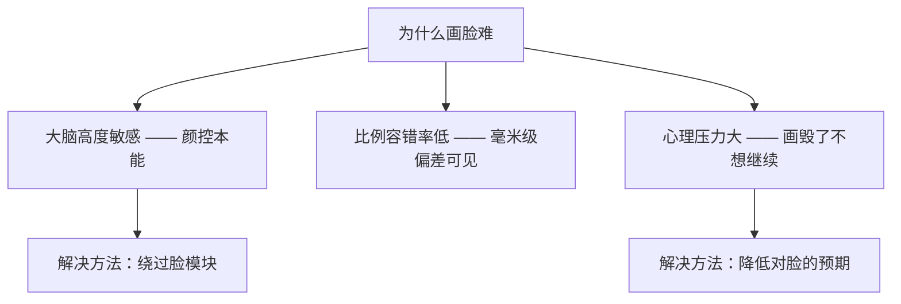
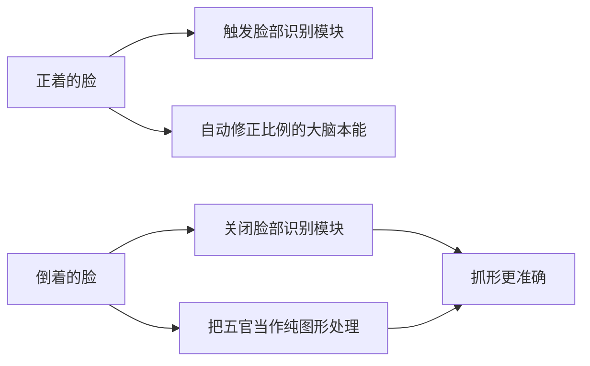
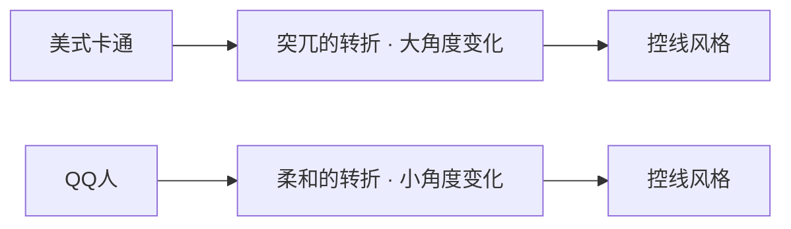
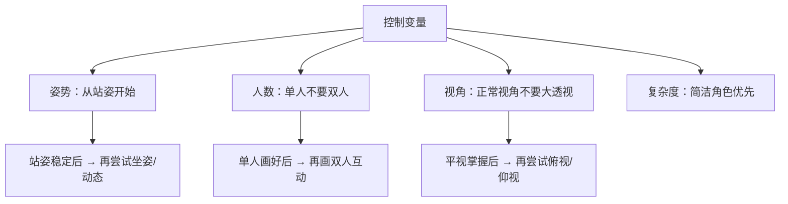

# 第09课：QQ人的比例与画法

## Learning Objectives

- 理解画脸的三条核心技巧并能在实践中运用
- 掌握QQ人 1:1:1 的身体比例与五官分布
- 理解控线变量从"大开大合"到"微妙转折"的转变
- 掌握控制变量原则，建立科学的练习框架
- 能够整合九宫格、图形法和所有抓形技巧完成QQ人创作

---

## Core Idea

QQ人（Q版人物）是所有风格中最"宽容"的比例系统——**头大身小**的结构天然掩盖了很多人体结构上的瑕疵。但正因为QQ人看起来简单，反而藏着几个反直觉的难点。

### 脸的难度：颜控陷阱

你可能不相信——**画人脸是这个课程中最难的事情之一**。

为什么？因为人类对脸的敏感度极高。我们的大脑内置了面部识别模块，稍微一点比例偏差都会触发"这张脸不对劲"的警报。即使是资深的画师，画脸也常常是最后一关。



好消息是，有三个技巧可以绕过这个陷阱。

---

### 画脸三大技巧

#### 技巧一：倒过来画

把参考图**倒转180度**来画。这样做的作用是：让你的大脑不再把对象识别为"脸"，而是识别为"一堆形状"。



具体操作：
1. 把参考图上下颠倒
2. 把五官涂黑/简化，只保留它们的形状边界
3. 当作普通的几何形状去抓准它的位置和比例
4. 画完后把画倒回来检查

#### 技巧二：局部开始（不画脸）

从**非脸部的位置**开始画——比如从肩膀、衣领、手部开始，最后再处理脸部。

好处是：当你把身体画得差不多了，心理负担已经小了很多，手感也热起来了，再回过头画脸就不会那么紧张。

#### 技巧三：放大画

把脸部区域**单独放大**到画纸/画布的一个角落，专门花时间反复调整。等画满意了再放回整体画面。

放大画的作用：
- 脸部的细节在放大后才能看清楚
- 有足够的空间去调整五官位置
- 避免"画到脸的时候发现位置不够了"

> [!TIP] Key Insight
> 这三条技巧的共同本质是同一个原则：**不要让大脑的"脸部识别模块"接管控制权。** 倒过来画是欺骗模块、局部开始是绕开模块、放大画是孤立模块。选一条你觉得最顺手的，反复练习。

---

### QQ人的比例系统

QQ人最经典的比例是 **1:1:1**——头、身体、腿各占三分之一。


以QQ人的身高为参考：
- 头部占总身高的 1/3
- 身体（脖子到盆骨）占 1/3
- 腿（盆骨到脚底）占 1/3

#### 五官比例：1:1:1

脸部的五官分布也是三层式：

```
从左眼外眼角到右眼外眼角 —— 三等分：
左眼宽度 : 眼间距 : 右眼宽度 = 1 : 1 : 1
```

- 眼睛在头部的**中线以下**（Q版特征，让脸显得可爱）
- 嘴巴位置在眼睛和下巴的中间偏下
- 鼻子可以极简化或省略

#### 手臂长度

QQ人的手臂长度：**到盆骨（胯部）位置即可**。

> [!WARNING] 刘备手
> 很多初学者画QQ人的时候，手会不自觉地画得很长——因为内心还在用真实人体比例。注意控制：**QQ人的手臂不要超过盆骨底部**。超过了就是"刘备手"（双手过膝），显得很诡异。

---

### 控线变量的转变

如果你之前画的都是轮廓鲜明的几何图形练习，进入QQ人后需要注意一个变化：**从大开大合到微妙转折**。



美式卡通的线条转折是"咔嚓"一下——90度就是90度。但QQ人（更接近日系风格）的转折是"润"的——用圆角过渡、用曲线代替直线。

这并不是说要完全抛弃之前的图形思维，而是：**先画五边形作为骨架，再把五边形的尖角磨圆。**

---

### 控制变量原则

学画画很容易陷入一个陷阱——每次练习都想画"越来越好"，结果每次练习的变量太多，根本不知道问题出在哪里。

**控制变量原则**：每次只改变一个变量，其他条件保持不变。



具体建议：
1. **从站姿开始**——站姿的对称性和稳定性最强，最容易建立比例感
2. **单人不要双人**——两个人的相对位置关系是另一个难度维度
3. **正常视角不要大透视**——俯视/仰视会扭曲比例，先掌握平视

---

### 使用所有抓形卡牌

到这一课为止，你已经积累了一整套"抓形卡牌"：

| 卡牌 | 用途 | 本课中如何使用 |
|------|------|--------------|
| [[0001-jiu-gong-ge-zhua-xing|九宫格]] | 定位参考线 | 用1:1:1比例划分九宫格 |
| [[0005-tu-xing-zhua-xing-fa|图形法 ｜ 五边形概括法]] | 形状切割 | 把QQ人的头/身/腿分成三个五边形 |
| [[0006-tu-xing-zu-he-yu-qie-xiao|正负形]] | 检查边缘 | 检查手臂和身体的负空间形状 |
| [[0007-wan-zheng-liu-cheng|动态线]] | 动作趋势 | 先画动态线再画身体 |
| 翻转检查 | 对称性 | 翻转画布检查眼睛是否对齐 |
| 倒过来画 | 形状准确性 | 把画面倒过来检查比例 |

> [!NOTE] 不是技巧，是组合技
> 每一个技巧都不是孤立使用的。画一个QQ人时，你应该轮流使用这些"卡牌"——先用九宫格定位，再用图形法切割，画到一半用翻转检查，遇到脸部用倒过来画法。**真正的进步来自卡牌的组合使用。**

---

## Worked Example

**任务**：画一个1:1:1比例的QQ人站姿（正面）

**步骤**：

1. **九宫格定位**：画一个3x3的九宫格，从上到下三个区域对应头、身、腿

2. **图形切割**（五边形概括法）：
   - 头部区域：一个大圆形 + 下巴的五边形
   - 身体区域：上窄下宽的梯形（五边形）
   - 腿部区域：两个平行的四边形

3. **五官定位**：
   - 眼睛在中线以下
   - 双眼间距 = 单眼宽度（1:1:1）
   - 嘴巴在眼睛到下巴的中间

4. **手臂添加**：
   - 从肩膀开始
   - 长度控制到盆骨位置
   - 用两个四边形概括上臂和小臂

5. **细节与检查**：
   - 翻转画布检查对称性
   - 用正负形检查手臂和身体的边界
   - 用倒过来画检查五官位置

---

## Practice

> [!QUESTION] Self-check
> **练习1**：找一张QQ人参考图，用尺子量一下它的头:身:腿比例。它真的是1:1:1吗？如果不是，偏差在哪里？
>
> **练习2**：画一个QQ人的正面站姿，严格按照1:1:1比例。画完后检查——手臂有没有超过盆骨？
>
> **练习3**（进阶）：画同一个QQ人两次——第一次用"倒过来画"的技巧画脸，第二次正常画脸。对比两张脸的效果。

<details>
<summary>Reveal answer</summary>

**练习1参考**：
- 很多商业QQ人（如Line表情包）的头身比其实是1:0.8:0.8——头更大，身腿更短
- 1:1:1是经典比例但不是唯一标准，关键是**比例要一致**
- 用尺子量一下可以破除很多"感觉上的错觉"

**练习2检查点**：
- 手臂末端应在盆骨横向高度的位置
- 如果手垂到了大腿中间 → 就是"刘备手"
- 修正方法：把上臂和小臂各缩短15-20%

**练习3对比**：
- 倒过来画的脸通常更准确——因为避开了大脑的自动修正
- 如果正常画的脸不如倒过来画的好 → 说明你的"颜控本能"在干扰你
- 建议以后画脸都先用倒过来法打底

**进阶思考**：
当你对1:1:1比例有感觉之后，可以开始尝试——不同比例传递什么感觉？比如头更大 = 更可爱/更萌；头稍微缩小 = 更成熟。这就是下节课 [[0010-er-ci-yuan-feng-ge|风格变形]] 的基础。
</details>

## Next Step

你已经掌握了QQ人的比例系统，但QQ人只是"风格变形"的一种可能性。[[0010-er-ci-yuan-feng-ge|下一课：二次元风格与风格变形]] 将带你看到——不同风格的本质只是改变五边形的比例和转折锐度。你学会了QQ人的1:1:1，就等于学会了所有风格变形的钥匙。