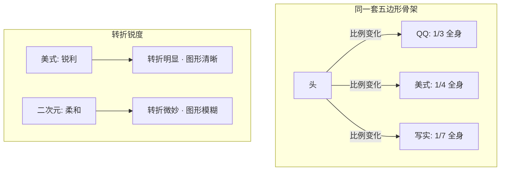
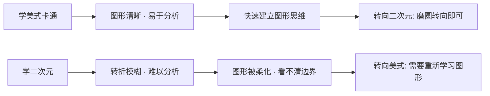
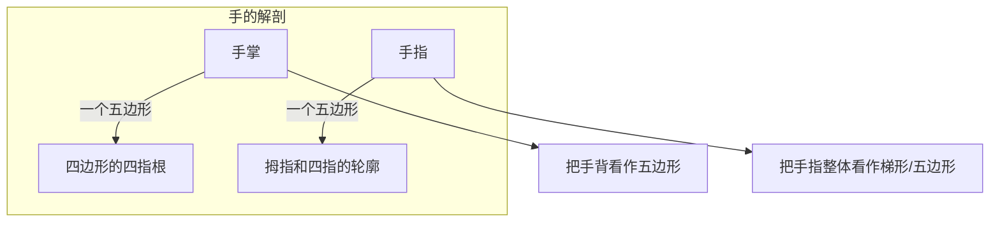
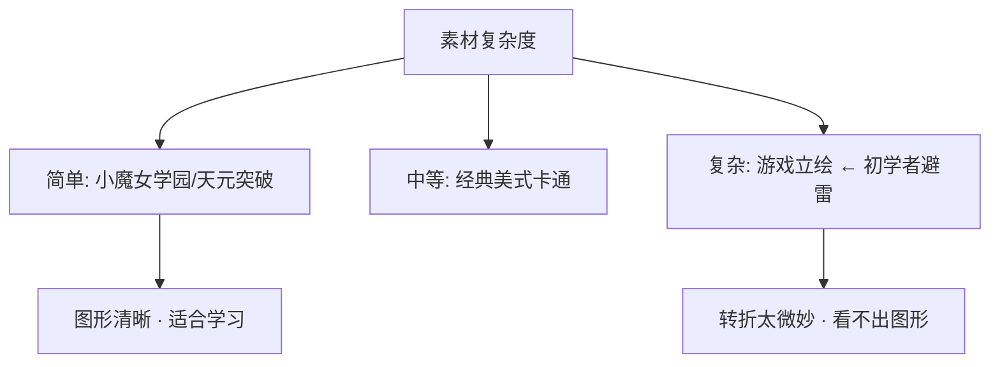

# 第10课：二次元风格与风格变形

## Learning Objectives

- 理解"图形是万用的"——所有风格都建立在五边形堆叠之上
- 掌握风格变形的本质：改变五边形的比例 + 改变转折锐度
- 学会用"两个五边形"的方法画手
- 学会用"大、中、小三个形状"的套路概括褶皱
- 了解从"抓准"到"变形"的创作进阶路径

---

## Core Idea

如果你听别人说"二次元画风和美式卡通不一样"，你要记住这句话：**图形是万用的，风格只是参数不同。**

### 所有风格的本质都一样

从底层视角看，任何风格的角色画法都可以概括为同一套操作：


- 美式卡通 = 五边形比例偏夸张 + 转折锐度高（硬边明显）
- QQ人 = 五边形比例偏头大身小 + 转折锐度中等
- 二次元 = 五边形比例偏写实调整 + 转折锐度低（柔和过渡）
- 写实 = 五边形比例贴近真实 + 转折最微妙

**改变五边形的比例 = 改变风格。**



---

### 风格变形的两个旋钮

把风格想象成一个调音台，你有两个旋钮：

**旋钮一：比例**

- QQ腿变长 → 接近美式风格
- 头变小 → 接近写实风格
- 身体变长 → 接近时尚插画风格

**旋钮二：转折锐度**

- 转角90°硬边 → 齿轮感（美式）
- 转角R角过渡 → 柔和感（日系）
- 介于两者之间 → 半写实半卡通

> [!TIP] Key Insight
> 最好的练习路径是：**从美式开始学**。因为美式的敢于夸张让图形更好观察。一旦你掌握了美式的图形堆叠，想转二次元只需要做一件事——把转折磨圆，把比例调一下。反之，从二次元开始学美式会更难，因为二次元的图形边界不清晰，你看不出"图形在哪里分界"。

### 为什么从美式开始学更容易



美式和二次元之间不是"不同的绘画体系"，而是"同一个体系的不同参数设置"。先搞清楚参数盘（美式），再调参数值（二次元），比直接从模糊的二次元摸索要高效得多。

---

### 手的画法：两个五边形

手是很多初学者的噩梦。但用图形法来看，手出奇地简单：

**手 = 手掌（一个五边形）+ 手指（一个五边形）**



画手的步骤：
1. 先画手掌的四边形/五边形（包含手腕部分）
2. 在手掌上方叠加手指的梯形/五边形（四指作为一个整体图形）
3. 在手指图形内部用短线切分出食指、中指、无名指、小指
4. 最后添加拇指——拇指是另一个方向的小五边形

> [!WARNING] 手不要先画手指
> 最常见的错误是：从大拇指开始一根一根地画手指。这样画出来手指之间没有整体关系，位置会乱。**先画掌形再切手指**——这是职业画师的套路。

### 手的参考选择

画手时，参考图的选择决定了你的成功率：

| 适合的选择（DO） | 不适合的选择（DON'T） |
|----------------|---------------------|
| 外轮廓明显的手势 | 弯曲/遮挡的手势 |
| 四到五指全部露出 | 握拳/握物 |
| 手掌正对或侧对镜头 | 手指互动的复杂手势 |
| 静态手势 | 动态模糊的手势 |

> [!WARNING] 选错参考 = 浪费时间
> 初学者花大量时间画一张"握拳的手"的参考图——因为看不清手指边界，画了2小时还是不准。**换个参考图，5分钟就画好了。** 不是你的水平不行，是参考图选错了。

---

### 褶皱的骗术：三个形状就够了

衣服褶皱是另一个常见陷阱。初学者试图画出每一条衣纹，结果是越画越乱。

**褶皱的骗术**：只用三个形状——大、中、小。

```
大形 —— 衣服最主体的褶皱走向（1-2条主线）
中型 —— 支撑大形的次要褶皱（2-3条辅助线）
小型 —— 收尾的碎褶（1-2个点缀）
```

> [!NOTE] 骗术的含义
> "骗术"不是贬义词，而是指"用有限的形状欺骗观众的眼睛"。观众不需要看到每一条衣纹，只需要看到"有褶皱的感觉"。三个形状产生的"褶皱感"已经足够。

画褶皱的核心原则：
- 先确定大形的方向：这个褶皱是在拉长还是压缩？
- 大形走向对了，中型自动就有了位置
- 小形可有可无——有是锦上添花，没有也不影响

---

### 从抓准到变形

到这一课为止，你一直在练习"抓准"——把看到的东西尽量准确地画下来。现在，是时候开始"变形"了。


**从抓准到变形的桥梁**：加小元素。

- 在原图的基础上加一个**爱心**在衣服上
- 加一个**花纹**在裙摆
- 加一个**发带**或**配饰**

这些微小的创作会给你带来巨大的心理转变——"我不是在抄，我是在创作"。这种"创作感"是持续画下去的动力。

> [!TIP] Key Insight
> 不要一上来就挑战"原创一个角色"。**在已有的角色上加小元素**，是积累"创作手感"的最好方式。每加一个小元素，你都在积累"我也可以创造"的信心。

---

### 推荐参考素材

**适合学习的动画造型：**

- **《小魔女学园》（Little Witch Academia）**——图形清晰，转折明显，介于卡通和二次元之间
- **《天元突破》（Gurren Lagann）**——同样是图形清晰，夸张度适中，是"半卡通半二次元"的绝佳素材

**避免学习的素材：**

- **游戏立绘**（原神、崩坏等现代手游立绘）——太复杂了。转折太小，一个角色的零件数量可能是卡通角色的3-4倍，初学者根本看不透它的图形结构



---

## Worked Example

**任务**：将之前画的QQ人变形为"半美式半二次元"风格

**步骤**：

1. **回顾原图**：从[[0009-qq-ren-bi-li|上一课]]的1:1:1 QQ人出发

2. **调整比例**（旋钮一）：
   - 把腿从1份拉长到1.2份
   - 把身体从1份缩短到0.8份
   - 头保持不变

3. **调整转折**（旋钮二）：
   - 把美式的那种硬转折点（如肩膀转角）磨圆
   - 把下巴从尖角改为圆角过渡
   - 手指从几何块改为圆润的小块

4. **添加小元素**（积累创作经验）：
   - 在衣服上加一个星形图案
   - 加一根发带
   - 加一颗纽扣

5. **检查**：
   - 整体是否还是"五边形堆叠"？
   - 比例变了之后，视觉重心有没有歪？

---

## Practice

> [!QUESTION] Self-check
> **练习1**：找一张二次元角色和一张美式卡通角色，分别用五边形概括法分析。对比两套五边形——比例差在哪里？转折差在哪里？
>
> **练习2**：画一只手。按照"手掌五边形 + 手指五边形"的步骤画，不要从手指一根一根画。
>
> **练习3**（进阶）：选一张你之前画过的角色图，给它加 3 个小元素（花纹/配饰/图案），让它看起来像是"你的版本"。

<details>
<summary>Reveal answer</summary>

**练习1分析**：
- 二次元角色的五边形内部更多"R角"转折，图形边缘柔和
- 美式卡通角色的五边形边缘更"硬"，转角更突然
- 二次元的头身比更接近1:6或1:7，美式更接近1:3或1:4
- 关键发现：二次元不是不用图形法，而是**用更复杂的图形切割方式**

**练习2检查点**：
- 手掌的五边形是否正确包含手腕到指根的区域？
- 手指的五边形是否覆盖了整个手指组的轮廓？
- 最后切分手指时，位置是否对齐了指关节？

**练习3提示**：
- 加小元素时注意：元素的方向要贴合身体曲面
- 如果花纹在衣服上，不要画成平面的→让它随衣纹弯曲
- 加元素的目的不是"让画面更丰富"，而是让你体会到"我在创作"
</details>

## Next Step

你已经掌握了图形法在所有风格中的通用性——无论是美式、QQ人还是二次元，底层都是五边形堆叠。[[0011-tian-yu-di|下一课：天与地——脱离九宫格]] 将挑战你走出辅助工具的舒适区。当你不再依赖九宫格，只靠"天与地"两个定位点和一个参照图形，就能画出准确的角色——这才是真正的自由。