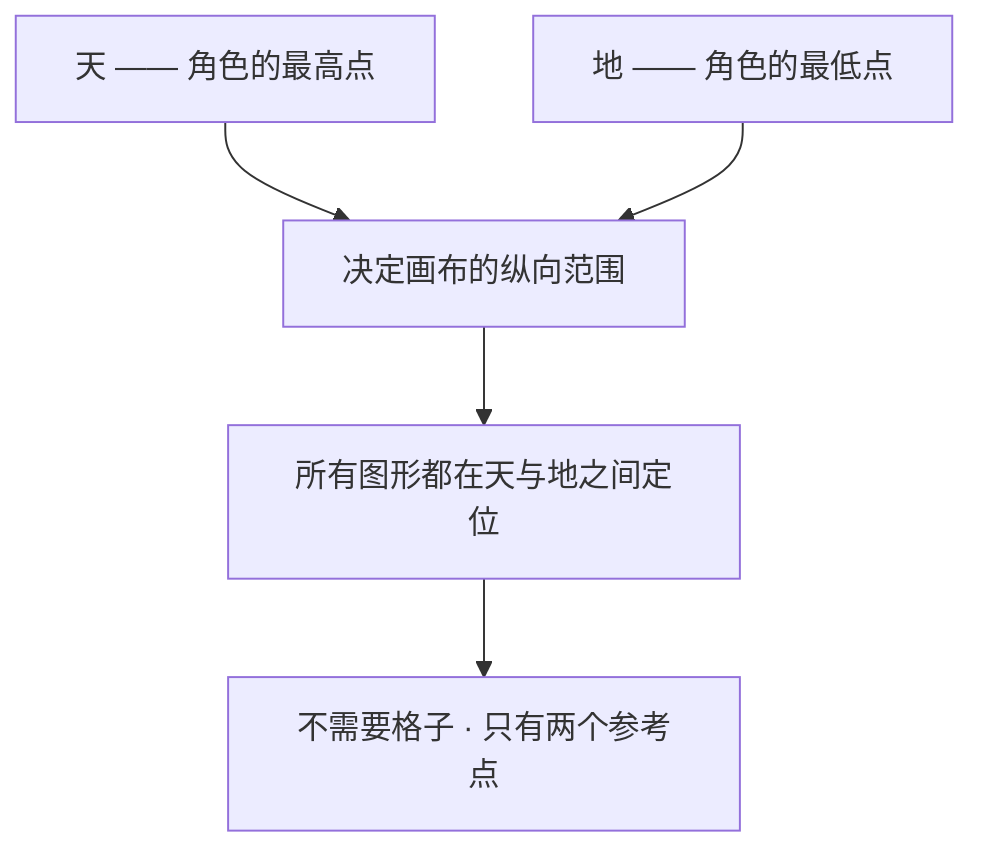
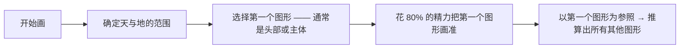
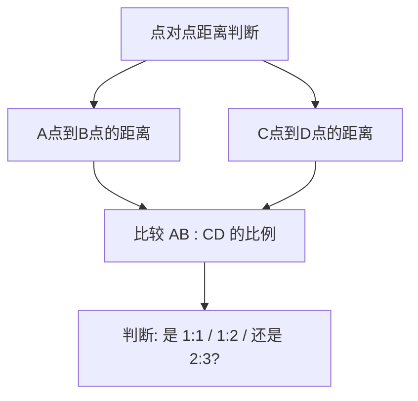
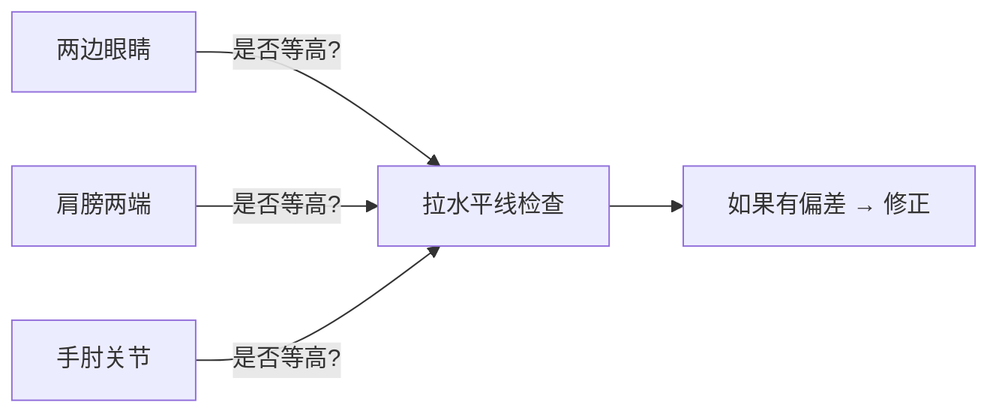
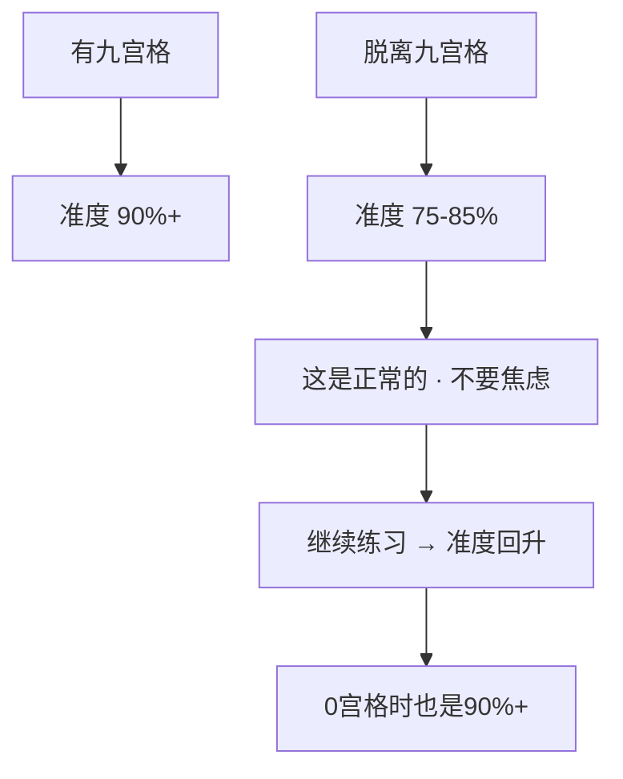
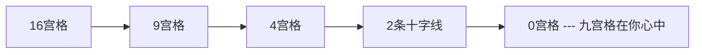
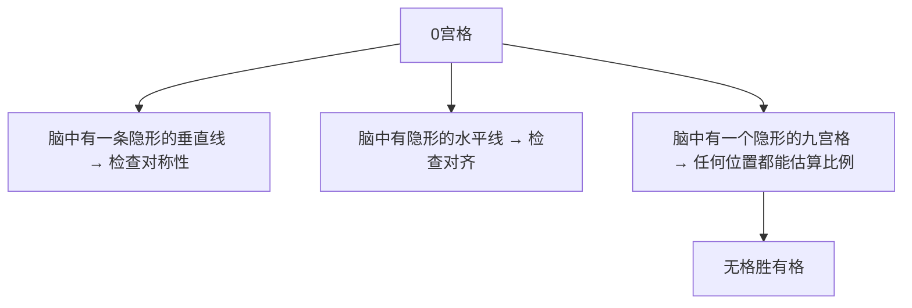

# 第11课：天与地——脱离九宫格

## Learning Objectives

- 理解"天与地"作为定位系统的核心原理
- 掌握"第一个图形作为参照"的抓形策略
- 学会使用点对点距离判断和水平线比对技术
- 理解脱离九宫格的心理建设——准度下降是正常的
- 完成从16宫格→9宫格→4宫格→0宫格的逐步脱离路径

---

## Core Idea

从第一课开始，九宫格就是你的"拐杖"。它帮你定位、帮你分形、帮你在空白画布上找到起点。但现在，是时候走出舒适区了。

**脱离九宫格，不等于失去定位能力。** 你会掌握一套更灵活的定位系统——"天与地"。

### 天与地——新的定位系统

"天与地"是最简单的定位系统：**定出画面的最高点（天）和最低点（地），作为一切比例的绝对标准。**



操作方式：
1. 在画纸上轻轻标记"天"的位置（如：头顶的最高处）
2. 标记"地"的位置（如：脚底的最低处）
3. 天和地之间的空间就是你的"有效画布"
4. 在这之间自由安排所有图形

**为什么天与地就够了？**
- 因为有了范围，你自然知道"多大多小是合理的"
- 因为你已经练了[[0001-jiu-gong-ge-zhua-xing|九宫格]]，你的眼睛已经习惯了比例判断
- 因为没有格子约束，你的观察灵活性反而提高

---

### 第一个图形作为参照

脱离格子后，最关键的一个技巧是：**花全部精力问题把第一个几何图形抓准。**



第一个图形选择的原则：
- 选**画面中最大**的图形（通常是头部或躯干）
- 选**位置最居中**的图形
- 选你**最有信心画准**的图形

一旦第一个图形画准了，它就成了一个"活的比例尺"：

```
第一个图形的高度 = 1个单位
→ 身体的宽度 = 第一个图形的 1.5 倍
→ 腿的长度 = 第一个图形的 2 倍
→ 手的大小 = 第一个图形的 0.3 倍
```

> [!TIP] Key Insight
> 九宫格提供了"外部参考线"，而第一个图形提供了"内部参考标尺"。两者目的一致——让你有参照物去判断其他图形的大小和位置。区别是：**外部参考线是死的，内部参考标尺是活的。** 你可以根据画面自由调整。

### 点对点距离判断

脱离九宫格后，你需要一种新的判断方式——**点对点距离判断**。

方法很简单：观察两个点之间的距离，判断这个距离和另一个距离之间的关系。

```
眼睛到下巴的距离 ≈ 眼睛到头顶的距离？
左肩到右手肘的距离 ≈ 右手肘到右手腕的距离？
头顶到腰线 ≈ 腰线到脚底？
```

这不是测量，而是**比较**——比较不同线段之间的相对长度。



练习方法：在参考图上用眼睛估算两个点的距离，然后用尺子验证。每天做 10 次，一周后你的眼力会有质的飞跃。

---

### 水平线比对

没有格子帮助判断"高低是否对齐"时，有一个简单的替代方案：**拉水平线**。

具体做法：
1. 在脑海中画一条水平线
2. 问自己：这条线上有哪些点？
3. 检查这些点是否真的在同一水平线上



这是一个非常古老的绘画技巧——从文艺复兴时期的画家就开始用了。它不需要任何工具，只需要在脑海里想象一条横线。

> [!WARNING] 水平线≠完全水平
> 透视存在时，同一水平线上的点在画面上可能并不在同一高度。比如俯视时，远处的肩膀会比近处的肩膀高。但作为初学阶段的检查方法，"先做到水平的等高"再考虑透视关系——是正确的心智阶梯。

---

### 脱离九宫格的心理建设

这是比较难的一课——不是因为技术变难了，而是因为你会发现：**没有九宫格后，准度下降了。**

这不是你的问题，这是必然现象。



**三条心理建设要点：**

1. **控制检查次数在 2-3 次即可**
   - 不要画一笔检查一次——那等于没脱离格子
   - 画完一个图形，抬头看参考，低头对比
   - 一次检查最多花 5 秒

2. **准度从 90% 降到 75-85% 是正常的**
   - 这是"去掉拐杖走路"的必然阶段
   - 75% 的准度在观感上已经"很接近了"
   - 继续练习，准度会自动回升

3. **能用图形法 → 说明你已经进入概括领域**
   - 能不用格子画出五边形 → 说明你的思维已经是图形思维
   - 这是质的进步，不是退步
   - 不要用"画得像不像"来评判进步——要看"思维方式有没有改变"

> [!NOTE] 思维进步的标志
> 在开始这个课程之前，你看一张图可能看到的是"头发、眼睛、衣服、鞋子"。
> 现在你看到的应该是"一个五边形、两个四边形、三个圆形"。
> 后者就是"概括能力"——这才是真正的进步。

---

### 逐步脱离：从16宫格到0宫格

脱离九宫格不是一夜之间扔掉所有辅助线。它是一个**逐步减少依赖**的过程：



**逐步脱离的路径：**

1. **16宫格**（辅助线最多）
   - 早期的学习阶段，需要大量的定位参考
   - 打开眼力，建立"比例感"

2. **9宫格**（本课程的起点）
   - 经典的定位系统
   - 培养"图形分割"的思维方式

3. **4宫格**（过渡阶段）
   - 只画两条竖线一条横线（十字 + 两侧分割）
   - 强迫自己用更少的参考线判断更多信息

4. **2条十字线**（接近脱离）
   - 只在画布中心画一条垂直线和一条水平线
   - 用来检查对称性和水平对齐
   - 其他位置全靠眼睛判断

5. **0宫格**（完全脱离）
   - 没有任何辅助线
   - 只靠"天与地" + "第一个图形" + 点对点距离判断
   - 这是你的目标

**检查次数控制：** 每个图形控制在 3-4 次检查以内。

```
图形 1（头部）：画 → 检查 → 修正 → 检查 → 完成（2次检查）
图形 2（身体）：画 → 检查 → 修正 → 完成（1次检查）
图形 3（腿）：画 → 检查 → 完成（1次检查）
...
总检查次数：7-10次（不再是以前那样检查几十次）
```

### 零宫格的境界：无格胜有格

当你可以完全不依赖任何辅助线画出准确的角色时，你达到了"零宫格"境界。

但零宫格不等于"没有格子"——它是**格子在你心中**。



这就是为什么九宫格是一个**训练工具，而非依赖工具**。它存在的意义就是让你最终可以不需要它。

> [!TIP] Key Insight
> 九宫格就像自行车的辅助轮。辅助轮的目不是让你永远骑着它，而是让你学会平衡后拆掉它。当你能不自觉地"脑补"出九宫格的位置时，你已经不需要真的画它了。

---

## Worked Example

**任务**：脱离九宫格，画一个简单的站立角色

**步骤（0宫格模式）**：

1. **定天与地**：在画纸上标记头顶最高点（天）和脚底最低点（地）

2. **定第一个图形**：选择头部作为第一个图形
   - 花时间把它画准——用五边形/圆形概括
   - 不断与参考图对比头部大小

3. **用第一个图形推算**：
   - 头顶到下巴 = 头的纵向大小
   - 身体高度 ≈ 1.2 个头的纵向大小
   - 腿的高度 ≈ 1.5 个头的纵向大小
   - 肩膀宽度 ≈ 1.3 个头的横向大小

4. **逐个添加图形**：
   - 每个图形画完后做 1 次水平线检查
   - 用第一个图形作为比例尺反复比对
   - 不对的地方用点对点距离判断修正

5. **2-3次整体检查**：
   - 画完后做 2-3 次整体对比（不是每个图形都检查）
   - 主要检查：整体比例有没有偏、动态线是否一致

---

## Practice

> [!QUESTION] Self-check
> **练习1**：今天画一张图，只用一个格子（十字线作为参考），其他全靠眼睛判断。画完对比之前用九宫格画的效果——准度差多少？
>
> **练习2**：找一张图，先不看九宫格，凭眼睛预估每个图形在画面中的位置。然后用九宫格验证——你的预估偏差有多大？
>
> **练习3**（进阶）：尝试"0宫格"画法——不画任何辅助线，只凭"天与地"和"第一个图形"画一个角色。画完后用九宫格叠加上去分析偏差。

<details>
<summary>Reveal answer</summary>

**练习1参考**：
- 准度下降 10-15% 是非常正常的
- 重点观察：哪个部位最容易偏？
  - 大多数人的偏差出现在左右对称的位置（左眼比右眼高/低）
  - 其次是纵向比例（身体画长了/短了）
- 知道你的"薄弱点"在哪里，下次就有针对性地检查

**练习2分析**：
- 预估时用上的能力就是"图形法+比例感"的训练成果
- 偏差大小反映了你的"内心九宫格"的精确度
- 偏差大的区域 → 应该在画的时候多加注意

**练习3检查**：
- 如果没有叠九宫格，你觉得画得怎么样？
- 叠了九宫格后发现：大形准还是不准？
  - 大形准了但细节偏了 → 很好，你已经掌握了核心
  - 大形也偏了 → 回到"第一个图形"——它是你的锚点，应该花更多时间
- 即使只画了65%的准度，只要是用图形法画出 → 就是思维方式上的进步

**每日练习建议**：
每天花5分钟做"点对点距离判断"训练——找一张图，用眼睛估算距离比例，再用尺子验证。这个练习独立于绘画，专门训练眼力。
</details>

## Next Step

恭喜你完成了**阶段三（Module 3）** 的全部课程！

在这一阶段，你学会的不仅是美式卡通、QQ人和二次元风格的画法，更关键的是：

- 五边形概括法——任何图形的核心工具
- 风格变形的本质——比例 + 转折
- 从抓准到创作——加小元素积累创作经验
- 天与地定位系统——脱离依赖，获得自由

在进入下一阶段之前，回顾一下你用过的所有"抓形卡牌"：[[0001-jiu-gong-ge-zhua-xing|九宫格]]、[[0005-tu-xing-zhua-xing-fa|图形法]]、[[0006-tu-xing-zu-he-yu-qie-xiao|正负形]]、[[0007-wan-zheng-liu-cheng|动态线]]、[[0008-mei-shi-ka-tong|五边形概括法]]、[[0009-qq-ren-bi-li|比例系统]]。

**下一步**：阶段四将带你进入更深层次的结构理解——透视与空间。那时你会发现：原来平面的五边形概括，只是三维世界的一个投影面。