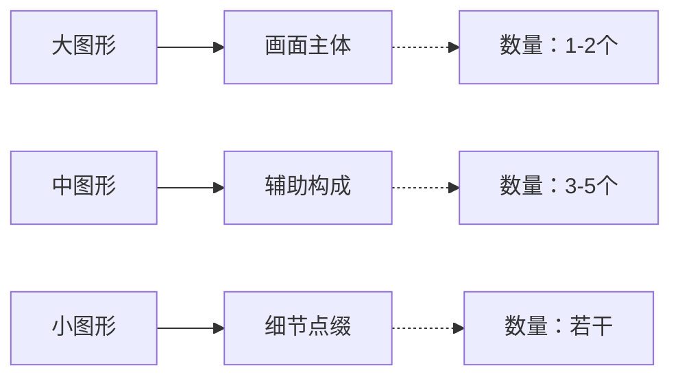
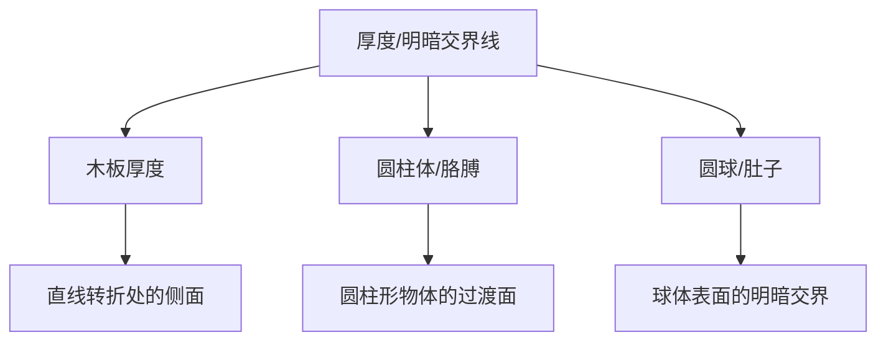
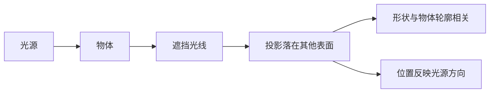
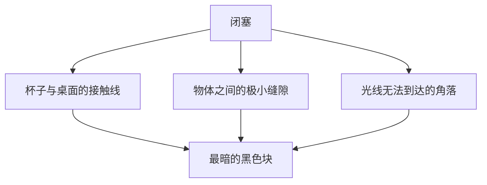

# 第12课：光影三要素

## Learning Objectives

- 理解画面美感的底层密码：图形的大中小排布
- 掌握光影的三大核心要素：厚度、投影、闭塞
- 能够准确区分三要素在画面中的位置关系
- 初步具备判断光影正确性的直觉

## 为什么画面好看？大中小的秘密

你有没有过这样的体验：明明临摹得很像，但画面就是"不好看"？

问题的关键很可能不在"像不像"，而在**图形的排布**。

### 三种图形的排布法则

画面中任何可见元素，都可以简化成三种大小的图形：



**法则：** 大的少、中等几个、小的多一些。

> [!NOTE] 为什么三个一样不好看？
> 想象三个同样大小的圆形排成一排——单调、乏味、像工厂流水线。但如果是一个大圆、两个中圆、若干小圆组合在一起，立刻有了节奏感和层次感。**大中小搭配 = 有趣的视觉节奏。**

这一点在光影中同样适用。暗部不是随机涂黑的，暗部本身也是一组"图形"，需要遵循大中小法则。

## 光影的作用

光影有两件事要做：

1. **丰富画面** —— 没有光影的画面是平的，像填色游戏
2. **增加立体感** —— 让物体有体积、有空间、有重量

而光影的构建，只靠三个要素。

## 三大光影类型

### 1. 厚度（明暗交界线）

厚度是物体**自身结构**产生的暗部。



**特征：** 厚度长在物体自己身上。

不同的几何体有不同的厚度表现：
- **平面转折**（如木板）：厚度是一条带状的侧面，边缘清晰
- **圆柱体**（如胳膊、手指）：厚度是一条渐变的灰面，过渡柔和
- **球体**（如肚子、头部）：厚度是一个月牙形的暗面，从明暗交界线向暗部过渡

> [!TIP] 厚度的本质
> 厚度 = "光找不到我"的那一面。它不是"影子"，而是物体本身的暗部。

### 2. 投影

投影是一个物体遮挡光线后，**落在另一个表面上的影子**。



**特征：** 投影在"别人"身上（或别处）。

**两个关键规则：**
- 投影**保持与物体相同的形状轮廓**（或者说，投影是物体的"延伸"）
- 从投影可以**反推光源方向** —— 投影在左边，光从右边来；投影在右边，光从左边来

> [!WARNING] 常见误区
> 很多人画投影时，随手涂一坨黑色。记住：投影是物体的"影子"，它的形状应该和物体外形呼应，而不是随意的墨点。

### 3. 闭塞

闭塞是光**完全进不去**的小缝隙。



**特征：**
- 出现在**缝隙中**
- 是**最暗**的黑色块
- 面积通常最小

**典型例子：** 杯子和桌面的接触线。光进不去，形成一个细长的黑色条。注意，**涂黑**这个动作在绘画中通常指的就是闭塞区域。

## 三要素速记口诀

> 厚度在自己身上，投影在别人身上，闭塞在缝隙里。

```mermaid
flowchart LR
    subgraph A[三要素对比]
        direction TB
        B[”厚度(self)”] --> B1[”物体自身暗部”]
        C[”投影(other)”] --> C1[”落在别处的影子”]
        D[”闭塞(gap)”] --> D1[”缝隙中的黑色”]
    end
```

## 练习题：光影判断题

看下面六个方块 A - F，判断哪些的光影画对了，哪些画错了。

> [!QUESTION] 自测题
>
> 每个方块都包含光源方向和暗部。假设光从右上方打来：
>
> **A.** 厚度在右侧，投影在左侧，闭塞在底部
> **B.** 厚度在左侧，投影在右侧，闭塞在顶部
> **C.** 厚度在左侧，投影在左侧，闭塞在底部
> **D.** 厚度在右侧，投影在右侧，闭塞在底部
> **E.** 厚度在左侧，投影在右侧，闭塞在缝隙中
> **F.** 厚度在两侧都有，投影在右侧，闭塞在底部

<details>
<summary>参考答案</summary>

**正确答案：D 和 E。**

- **D：** 光从右上方来 → 厚度在右侧（自身暗部），投影在右侧（落在桌面），光线照不到的底部接触面是闭塞。合理。
- **E：** 厚度在左侧（说明光从左边来），投影在右侧（说明光从左边来），两侧矛盾 —— 不对。等等，修正：E中厚度在左，投影在右，闭塞在缝隙中。这意味着光源在左上方，但投影却跑到了右边？不对，如果光源在左上方，投影应该在右下方。光源在左 → 厚度在左（自身暗部在左侧），投影在右（落在右边）—— 这其实是合理的！光源从左边来，物体左侧是暗部，投影落在右边。E是对的。

正确答案是：**D 和 E**。

注意，A的问题：厚度在右侧 + 投影在左侧 → 厚度告诉光从右来，投影告诉光从左来，矛盾。B和C同理存在矛盾。F中厚度在两侧 → 意味着光从两边来，不可能。

</details>

## 回顾与下节课预告

光影三要素是画好光影的"零件"。但零件摆对了不等于画面好看——下一节课，我们将学习老师的小巧思：**如何把光影三要素组合成既正确又好看的暗部图形**。

继续进入 [[0013-da-zhong-xiao|第13课：大中小与光影巧思]]。

## Next Step

Continue with the next lesson or complete the review task above before moving on.