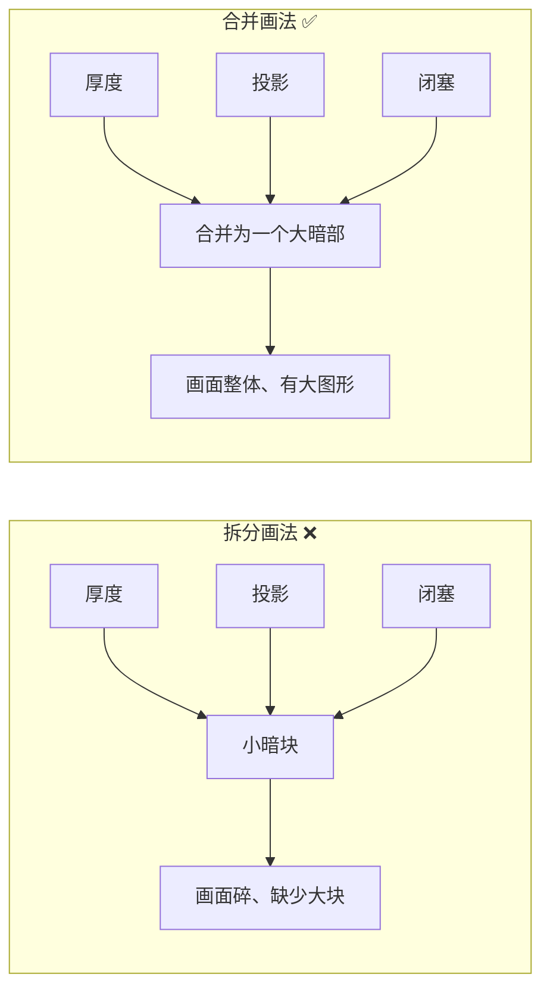
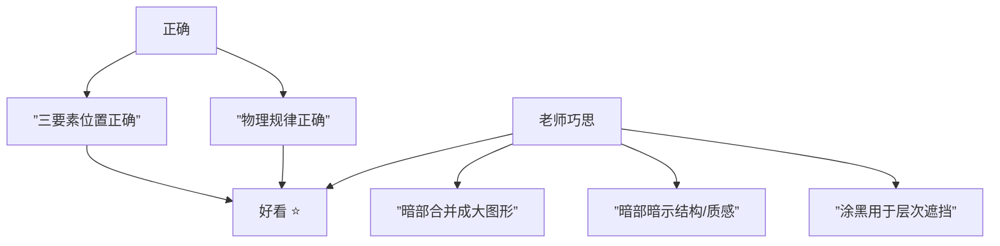

# 第13课：大中小与光影巧思

## Learning Objectives

- 理解"老师的巧思"：合理前提下合并暗部形成大图形
- 掌握涂黑的两种作用：闭塞与层次/遮挡
- 学会用暗部暗示结构（头发、布料、质感）
- 理解"从正确到好看"的跃迁逻辑

## 光荣与梦想：老师的劳力士

上节课我们学了光影三要素：厚度、投影、闭塞。用这三个要素画出来的光影是"正确的"，但这还不够。

> [!QUOTE] 蘑菇老师说
> 理解了老师的小巧思，就像看到了老师的劳力士。

这句话的意思是：**从"正确"到"好看"，中间有一个关键的飞跃。**

这个飞跃就是——**老师的巧思**。

## 巧思：在合理的前提下，合并暗部形成大图形

回顾第12课的排布法则：**大的少、中等几个、小的多一些**。

但现实中，光影三要素天然是"碎的"：
- 厚度是一小块
- 投影是一小块
- 闭塞是一条缝

如果老老实实全都分开画，画面就全是零星小暗部，缺少**大图形**。

### 蘑菇老师的巧思

> 在符合光影规律的前提下，把原本分拆的厚度 + 投影 + 闭塞 **合并成一个大的暗部图形**。



**例子：** 一个圆球在桌面上，左侧来光：
- 理论上：球体左侧有厚度（月牙形），右侧有投影（椭圆形），底部有闭塞（一条弧线）
- 老师的画法：把左侧厚度和底部闭塞**连接成一个连续的暗部区域**，只在形体和逻辑上保留区分

> [!TIP] 合并不是乱合并
> 合并的前提是"合理"。你不能把厚度和投影硬拼在一起——它们必须在空间上是相邻的，并且在视觉逻辑上是通顺的。合并的是**视觉上连续的暗部区域**，而不是胡乱拼贴。

## 涂黑的两种作用

在绘画中，"涂黑"不只代表闭塞。蘑菇老师给出了一个重要的澄清：

| 涂黑的作用 | 含义 | 例子 |
|-----------|------|------|
| **闭塞** | 光进不去 | 帽檐下、头发下方、物体接触面 |
| **层次/遮挡** | 表现前后关系 | A在B前面，A的暗部涂黑以衬托B |

> [!NOTE] 层次/遮挡
> 即使光照得到，也可以涂黑——目的是为了**区分前后层次**，而不是表现"没有光"。

这意味着暗部的功能不止于光影——它还是**建立空间层次**的工具。

## 暗部暗示结构

蘑菇老师提出了一个高阶思维：用暗部来"说话"——暗部本身就是一种**图形语言**，可以暗示物体的材质和结构。

### 1. 头发的暗部暗示厚度和转折

头发虽然是细碎的，但作为整体它是一个**有体积的块**。暗部可以告诉观众：
- 头发是**隆起的**（头顶有厚度）
- 头发有**转折**（从侧面转向后面）
- 头发的**分组**（不同方向的发束有不同的暗部形状）

### 2. 衣服的三角形暗部暗示布料褶皱

衣服穿在人身上，会有褶皱。蘑菇老师的画法：

```
暗部形状：三角形 ▼
位置：袖口、腋下、腰部
暗示：布料被拉扯、堆积
效果：柔软感
```

**三角形的暗部 = 布料褶皱的视觉语言。** 它传递的感觉是："这块布是柔软的，不是硬邦邦的。"

### 3. 女生素发无暗部的含义

有没有注意到，有些女生角色的头发几乎没有暗部，只是几根线条？

> 这本身就是一种"说话"：**柔顺、轻薄、贴合的直发。**

暗部的"不存在"也是一种表达。如果画了厚厚的暗部，反而会让头发看起来厚重、蓬松。

## 从正确到好看

正确的光影：
- 厚度、投影、闭塞位置准确
- 符合物理规律

好看的画面：
- 以上全部 + 暗部组合成大图形 + 暗部暗示结构 + 整体有大中小层次



> [!TIP] 光荣与梦想
> 当你看到一张好看的光影图，不要只感叹"画得真像"，要思考：**老师的劳力士在哪里？** 哪些暗部是合并的？哪些暗部是在"说话"？

## 关于"创造"的理解

对初学者来说，蘑菇老师强调了非常重要的一点：

> 你不需要自己创造——你只需要**学习老师画好的图形，搬运劳力士**。

是的。不要想着"我要自己设计一个很厉害的光影"——先学会 **"看"** 。看到老师是怎么合并暗部的，看到老师把厚度和投影连在了一起，看到老师的三角形暗部暗示的褶皱——然后，**搬过来用**。

> [!QUESTION] 自测题
>
> **Q1.** 下面哪种暗部合并方式是"合理的"？
>
> A. 球体的左侧厚度 + 右侧投影 + 底部闭塞 → 全部连成一片
> B. 球体的左侧厚度 + 底部闭塞 → 连接成一个连续的暗部区域
> C. 球体的厚度 + 球体旁边另一个物体的投影 → 连起来
>
> **Q2.** 一个女生的长发想要表现"蓬松、卷曲、有体积感"，应该怎么做？
>
> A. 不画暗部，保持线条感
> B. 画多个暗部块面，暗示头发的起伏和转折
> C. 整体涂黑

<details>
<summary>参考答案</summary>

**Q1 — B。** A的问题：左侧厚度和右侧投影被球体隔开了，它们之间不连续，硬连在一起在空间上不合理。C的问题：不同物体的暗部不能随意合并。

**Q2 — B。** 蓬松卷曲的头发需要暗部来暗示体积变化。A适合柔顺直发，C会让头发变成一坨黑色。

</details>

## 下节课预告

理解了"老师的巧思"之后，下一节课我们将**实际操作**：用数字绘画工具画出符合大中小法则的光影。学过的知识，最终要用手验证。

继续进入 [[0014-guang-yin-hui-zhi|第14课：光影绘制实操]]。

## Next Step

Continue with the next lesson or complete the review task above before moving on.