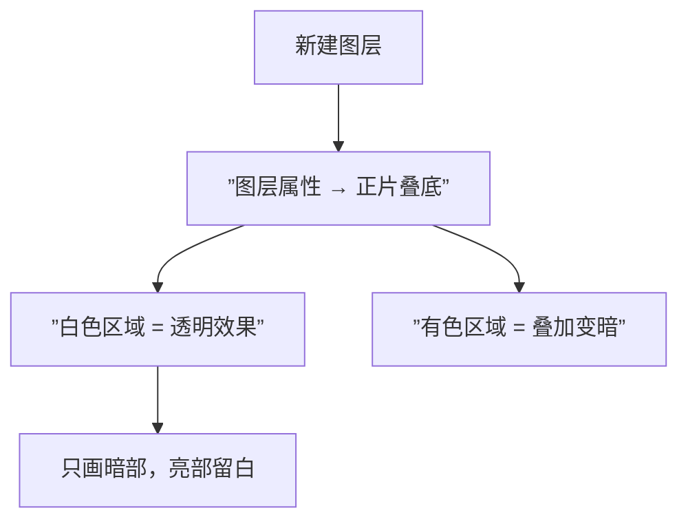
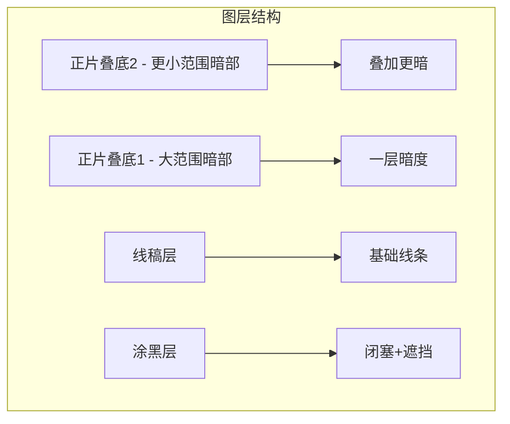
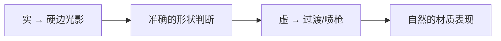

# 第14课：光影绘制实操

## Learning Objectives

- 掌握数字绘画中光影绘制的完整操作流程
- 学会使用正片叠底图层和66度灰绘制暗部
- 理解"两层暗部"画法的分层逻辑
- 掌握实心笔刷涂光影 + 橡皮擦修正的工作流

## 语前准备

> [!WARNING] 实操前必读
> 本课为**实操课**，建议打开你的绘画软件（Procreate / Photoshop / CSP / SAI 等）跟着做。光看不练，等于白学。

蘑菇老师使用的环境是Procreate，但**所有数字绘画软件的原理是相通的**。本课会同时说明"操作"和"原理"，便于你迁移到任何软件。

## 光影绘制的完整流程

> [!NOTE] 流程说明
> 这不是唯一流程，而是蘑菇老师推荐的**标准入门流程**。初学者先按这个流程走，走熟了再探索其他方法。

## 第一步：线稿

这是你的线稿。画笔软件中的线稿层是**最底层的基础**，全部光影操作都在它之上进行。

线稿阶段的要求：
- 线条清晰，封闭
- 结构明确
- （来自 [[0012-guang-yin-san-yao-su|第12课]] 的厚度/投影/闭塞，此时你需要在心里预判它们的位置）

## 第二步：涂黑（闭塞）

> 涂黑 = 闭塞 + 层次/遮挡

新建一个普通图层（不是正片叠底），用**纯黑色**涂在以下位置：

| 位置 | 说明 |
|------|------|
| 帽檐下 | 光进不去的区域 |
| 头发下方 | 头发与头部之间的缝隙 |
| 物体接触面 | 杯底与桌面、手臂与身体 |
| 前后遮挡处 | 前层物体在后层物体上形成的遮挡 |
| 细小缝隙 | 任何光线无法到达的角落 |

**工具：** 实心笔刷（硬的、没有透明度变化的笔刷），纯黑色（#000000）。

> [!TIP] 涂黑与闭塞的区别
> 如果你记得 [[0013-da-zhong-xiao|第13课]] 讲的——涂黑有两种功能。闭塞是"光进不去"，层次/遮挡是"要区分前后"。两个都是黑色，但思考逻辑不同。

## 第三步：第一层暗部（正片叠底）

这是关键步骤。

### 图层属性：正片叠底

在图层菜单中，新建一个图层，将图层属性改为 **正片叠底 (Multiply)**。

**正片叠底的原理：**
- 图层上画**白色的地方** → 不产生任何效果（透明）
- 图层上画**灰/黑色的地方** → 叠加在下面的颜色上，让画面变暗
- 多次叠加 → 越来越暗

所以正片叠底图层天然适合画暗部——你只需要在需要暗的地方涂色，其他地方留白即可。

### 66度灰

蘑菇老师推荐的颜色：**色相饱和度0（灰色），明度66**。

在RGB中接近：`#A8A8A8`。在HSL中：`H=0, S=0, L=66`。

> [!NOTE] 为什么是66度灰？
> 因为66度灰叠在正常线稿上，产生的暗部层次非常自然。太淡（如90度灰）叠了看不出效果；太深（如30度灰）一下就变黑，没有过渡空间。
>
> 66度灰 ≈ "中等偏亮" 的灰色，叠出来是一个柔和但明确的暗部。

### 操作步骤

1. 选中正片叠底图层
2. 取色：H=0, S=0, L=66
3. 选择**实心笔刷**（硬的、无透明度变化的笔刷）
4. 在需要暗的地方涂色

> 涂的是"暗部图形"，不是"阴影"——记住第12、13课的核心：**暗部是一组图形**，有大有小，需要大中小排布。

### 涂多了怎么办？橡皮擦

涂光影时涂错边界是家常便饭。

**方法：不用撤回，用橡皮擦。**

实心笔刷画出去的部分，用实心橡皮擦（同样硬的、无透明度变化）擦掉即可。

> 撤回是效率杀手。橡皮擦 + 微调比撤回更快。

### 第一层暗部的目标

涂完第一层后，画面应该看起来：**该暗的地方都暗了，但暗度是均匀的（都是66度灰一个层次）**。

## 第四步：第二层暗部（更深）

第一层画完后，画面中有些地方需要**更暗**（比如明暗交界线附近、投影中心）。

### 操作

1. **再新建一个正片叠底图层**
2. 同样用66度灰
3. 在需要更暗的区域涂色

**为什么还是66度灰？**

因为正片叠底的特性：66度灰 + 66度灰（叠加两次）= 更深的灰色。你不需要换颜色，正片叠底图层叠得越多就越暗。

| 图层 | 内容 | 效果 |
|------|------|------|
| 正片叠底2 | 更深暗部（明暗交界线、投影中心） | 暗上+暗 → 最暗 |
| 正片叠底1 | 一层暗部（厚度、投影主体） | 中等暗 |
| 涂黑层 | 闭塞、遮挡 | 纯黑 |
| 线稿层 | 轮廓线条 | 基础 |

## 第五步：底色（可选）

有些风格需要上底色（固有色），有些不需要。流程因人而异。

常见顺序有两种：

| 流程 | 适用场景 |
|------|---------|
| 线稿 → 涂黑 → 正片叠底暗部 → 底色 | 线稿清晰、从明到暗 |
| 底色 → 线稿 → 正片叠底暗部 → 涂黑 | 先色块后细化 |

初学者建议先用**第一种**，因为线稿提供了明确的边界指引。

## 两个核心原则

### 原则一：从实到虚

先学**硬边光影**，再学**过渡（喷枪/模糊）**。

初学阶段：全部用实心笔刷，暗部边界清晰。
进阶阶段：用喷枪或模糊工具做明暗过渡。

> 为什么从实开始？因为硬边让你**看清形状**。虚边的"糊"会掩盖造型的错误。

### 原则二：用色块方法判断形状

用实心色块画暗部的另一个好处：它逼你思考**暗部的形状长什么样**。

如果要用喷枪，先用实心笔刷把形状画准，再模糊边缘。**先形状，后质感。**

## 快速参考卡

| 项目 | 设置 |
|------|------|
| 图层属性 | 正片叠底 (Multiply) |
| 颜色 | 66度灰 (H=0, S=0, L=66) |
| 笔刷 | 实心笔刷（无透明度变化） |
| 橡皮擦 | 实心橡皮擦（与笔刷硬度一致） |
| 不需要打卡 | 但建议尝试 |

> [!WARNING] 不要求打卡
> 蘑菇老师特别说明：本课**不要求交打卡作业**。这只是技术实操的训练，尝试练习即可。重点是理解流程。

## 实操练习题

> [!QUESTION] 自测题
>
> 下面的操作中，哪些是正确的？
>
> 1. 用正片叠底图层画暗部时，应该选用纯黑色 (#000000)
> 2. 用正片叠底图层画暗部时，应该选用66度灰
> 3. 第二层暗部需要换一个更深的颜色
> 4. 第二层暗部可以用同样的66度灰，通过叠加正片叠底实现更暗效果
> 5. 涂光影应该用喷枪笔刷
> 6. 涂光影应该用实心笔刷，后期再加过渡

参考答案

**正确答案：2, 4, 6。**

1. 错误 —— 纯黑在正片叠底中会直接涂死，没有层次。
3. 错误 —— 不需要换色，利用正片叠底叠加特性即可变暗。
5. 错误 —— 初学阶段应从实心笔刷的硬边光影开始。

## 下节课预告

掌握了光影绘制的实操技术之后，我们停下来问一个更根本的问题：**如何高效练习？**

蘑菇老师将给你四大练习要素，让你的每一分钟练习都物有所值。

继续进入 [[0015-gao-xiao-lian-xi|第15课：高效练习四大要素]]。

## Next Step

Continue with the next lesson or complete the review task above before moving on.