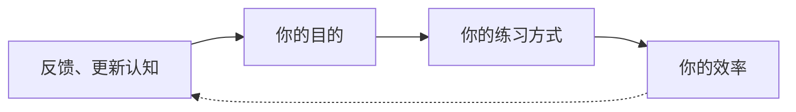
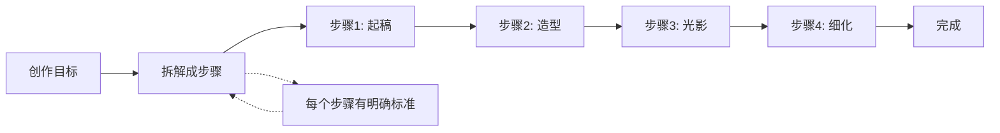
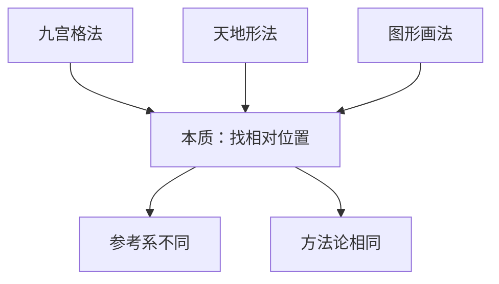
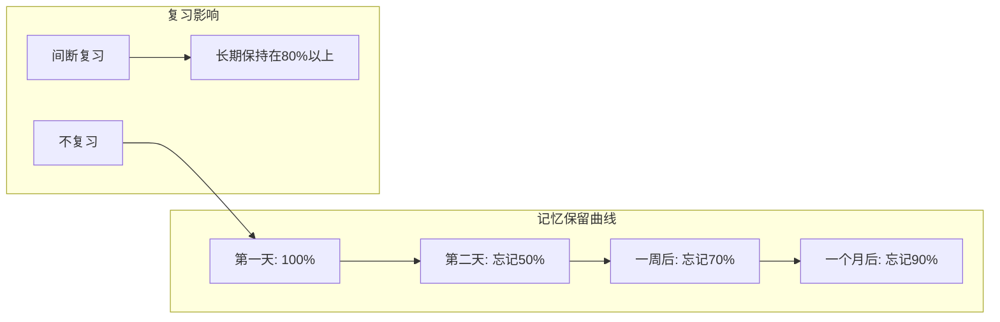
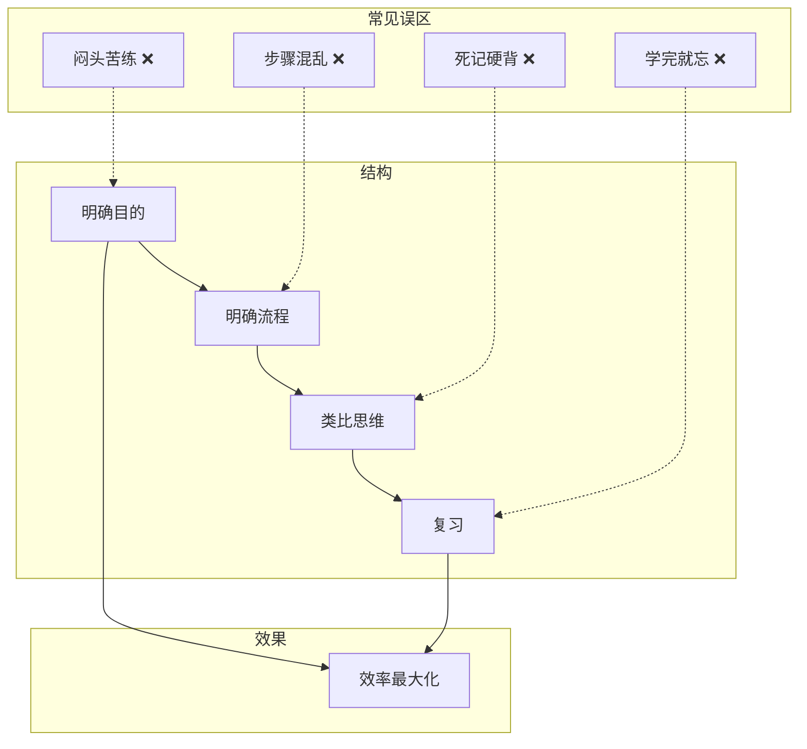

# 第15课：高效练习四大要素

## Learning Objectives

- 理解"认知决定目的，目的决定效率"的底层逻辑
- 掌握流程化练习方法，将创作拆解为可执行的步骤
- 运用类比思维实现举一反三
- 建立科学的复习策略，对抗遗忘曲线

## 引子：画的快的人做对了什么？

你有没有见过这样的同学：一起开始画，你还在起稿，他已经画完了？不是因为天赋——而是因为**他会练习**。

蘑菇老师说：绝大多数人不是画得慢，而是**改得慢**。反复撤回、反复修改、反复用橡皮擦擦掉重来——这些才是时间杀手。

本课将从四个维度重新定义"练习"这件事。

## 要素一：明确目的

### 认知决定目的，目的决定效率

**小镇做题家 vs 高效学习者：**

| 类型 | 行为 | 结果 |
|------|------|------|
| 小镇做题家 | 闷头苦练，不管方向 | 花了时间没进步 |
| 高效学习者 | 先想"练什么"，再想"怎么练" | 练一次顶十次 |

> [!QUOTE] 蘑菇老师语录
> 如果你不知道自己在练什么，那你就是在浪费时间。

练习前问自己三个问题：
1. **我这次练什么？**（练线条？练造型？练光影？）
2. **什么算"练好了"？**（标准是什么）
3. **练到什么程度可以停？**（不是完美，而是达标）

## 要素二：明确流程

### 步骤化降低思考负担

每一次创作其实都可以拆成步骤。蘑菇老师的例子：

> 蘑菇老师8小时商稿 → 拆成步骤后 → 仅需2小时

不是她变快了，而是她**不再在创作中纠结"下一步做什么"**。每个步骤的目标是清晰的，大脑不需要做决策，只需要执行。

### 练习流程 = 创作流程

这里有一个非常关键的认知：

> **练习流程应该等于创作流程。**

这意味着：你不要用一套方法练习，用另一套方法创作。如果你的练习流程是"打形→细化→完成"，创作流程也应该一样。只有流程统一，练习才服务于创作。

如果练习时用九宫格画得飞快，创作时却不用——那你练习的是"画九宫格"，不是"画造型"。

## 要素三：类比思维（举一反三）

这是一个高阶思维工具，但这个工具非常、非常有用。

### 把陌生事物转化为熟悉事物

当你遇到没画过的东西时，不要慌。问自己一个问题：

> 这个东西像什么？

任何复杂的物体都可以简化为你熟悉的图形：

- 一辆车 → 一个长方形 + 两个圆形
- 一个人体 → 几个圆柱体组合
- 一棵树 → 三角形 + 圆柱
- 一朵云 → 几个椭圆形的组合

### 九宫格 / 天地形 / 图形法 本质相通

回顾之前学过的几种方法：

| 方法 | 参考系 | 一句话 |
|------|--------|--------|
| 九宫格 | 横向 + 纵向网格 | 格子里找点 |
| 天地形 | 上下边界 | 高点、低点、边缘点 |
| 图形法 | 几何形状 | 简化成三角形/方形 |

**核心都是"找相对位置"。**

> [!TIP] 管你什么，变成图形
> 蘑菇老师的话："管你什么复杂的画，到我手里就是三角形、方块、圆形的组合。"
>
> 类比思维的力量就在于：你把世界上所有东西都变成了你已经会画的东西。

## 要素四：复习

### 对抗遗忘曲线

学习科学中有一个经典定律：

**不复习 = 白学。** 你花1小时学的知识，第二天只剩30分钟的量。

**间断复习 = 牢固掌握。** 每次复习后，记忆曲线反弹到更高起点。

### 九宫格 → 天地形 → 图形法：同一个东西

这就是一个很好的复习案例：

你学了三节课，分别学了三个看起来不同的方法。但本质都是"找相对位置"。

> **无格胜有格：九宫格一直在你心中。**

一旦真正理解了本质，你就不再需要九宫格这个工具了——你的眼睛就是九宫格。

> [!WARNING] 不要"用进废退"
> 很多初学者学了新方法就忘了旧方法。但所有方法本质相通，互相强化。停下复习，就是在退步。

## 四大要素的关系

## 总结：高效练习的日常循环

1. **练之前：** 明确目的（练什么？标准是什么？）
2. **练之中：** 按流程走（一个步骤一个步骤来，不跳步）
3. **练之后：** 类比归纳（这个跟之前学的什么相通？）
4. **每周：** 回顾复习（把旧课笔记翻出来看看）

> [!QUESTION] 自测题
>
> **Q1.** 蘑菇老师8小时商稿变2小时的核心原因是什么？
>
> A. 她画画速度变快了
> B. 她把创作流程化，减少了决策时间
> C. 她用了更好的笔刷
>
> **Q2.** 下列哪个说法最准确地描述了九宫格、天地形、图形法三者的关系？
>
> A. 它们是三种完全不同的画法
> B. 它们本质都是"找相对位置"，只是参考系不同
> C. 图形法比九宫格高级
>
> **Q3.** 小明学了第1课的大中小规则后，没有再复习过。到第15课时，他大概还记得多少？
>
> A. 90%
> B. 50%
> C. 30% 或更少

参考答案

**Q1 — B。** 核心是流程化减少了大脑的决策负担。

**Q2 — B。** 三种方法的底层逻辑完全相同，都是寻找相对位置。

**Q3 — C。** 按遗忘曲线，不复习的知识在一周后就会丢失70%以上，一个月后只剩约10%。所以复习不是可选项，是必选项。

## 下节课预告

有了高效练习的四大要素，最后一步问题来了：**练完了，然后呢？** 如何从"临摹练习"进化到"独立创作"？

下一课就是本阶段的收官之课：从练习到创作。

继续进入 [[0016-lian-xi-dao-chuang-zuo|第16课：从练习到创作]]。

## Next Step

Continue with the next lesson or complete the review task above before moving on.