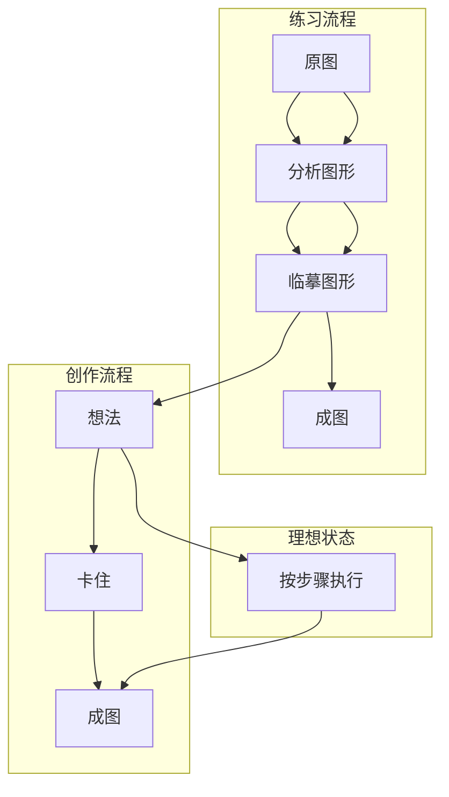
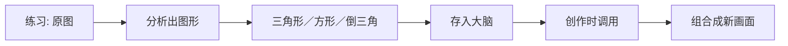
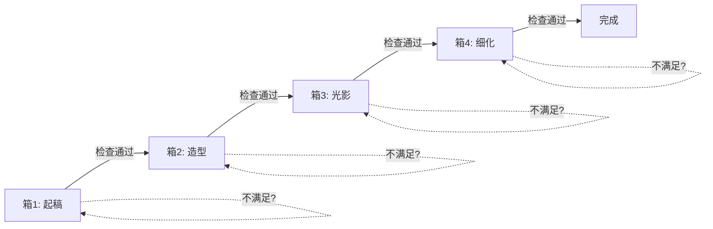
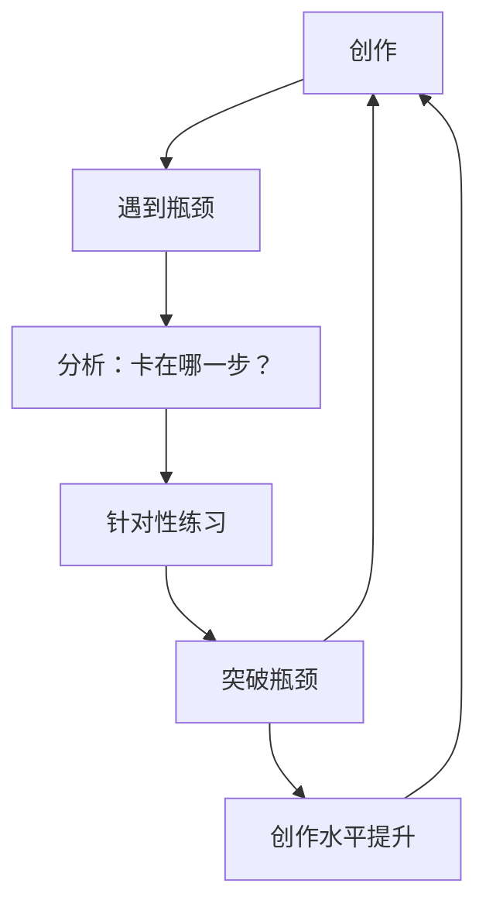
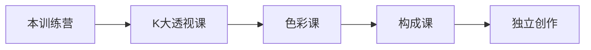
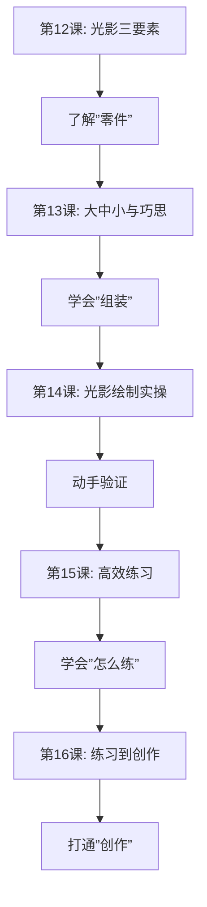

# 第16课：从练习到创作

## Learning Objectives

- 理解"练习流程 = 创作流程"的核心理念
- 掌握图形记忆法，将练习积累转化为创作素材
- 理解"练习-创作循环"的运行机制
- 了解训练营后的推荐学习路径

## 一个经典困境

很多同学走到这一步，会陷入同一个困境：

> 我临摹了很多很多，但让我自己画一个东西——脑子一片空白。

这种现象非常正常。因为**临摹和创作之间有一条隐形的鸿沟**。

本课的核心任务就是：**架起一座桥**。

## 练习流程 vs 创作流程

先看对比：

**练习流程：** 原图 → 分析图形 → 临摹图形 → 成图

**创作流程：** 想法 → （卡住）→ 成图

问题出在哪里？**创作流程中缺少了"分析图形"这一步。**

因为创作时没有"原图"，大脑找不到可以直接搬运的"图形"，于是就卡住了。

## 图形记忆法：创作素材的积累

### 三角形好记

蘑菇老师说：你每次练习，其实是在**往脑子里存图形**。

举个例子：
- 你临摹了一张人物图，分析出脸型是**倒三角形**
- 你临摹了一张动物图，分析出身体是**方形**
- 你临摹了一张场景图，分析出构图是**大三角形**

**所有这些三角形、方形、圆形，都会成为你的创作素材。**

> [!NOTE]
> 所有训练营的素材，本质上都是**不同图形的组合**：三角形、倒三角、方形、圆形。你以为你在学画不同的东西，其实你一直在学"图形的排列组合"。

### 五边形例子

蘑菇老师给了一个具体的例子：

当你积累了足够多的图形——五边形的画法、五边形的变形、五边形的各种应用——之后，当你想画一个新东西时：

> 你不是从零开始画，而是从你的"图形库"中**调用**合适的图形进行组合。

这就是创作者和初学者的本质区别：
- **初学者：** 从零开始，每一笔都在"想"
- **创作者：** 从素材库调用，每一笔都在"做"

## 快快快的秘诀

很多同学觉得自己画得慢。蘑菇老师的诊断：

> 你画得慢，不是因为**画得慢**，而是因为你在**反复修改、反复撤回**。

### 箱式流程

蘑菇老师提出了一个概念：**箱式流程**。

想象你的创作是一个个**箱子**排好队：
- 箱子1：起稿
- 箱子2：造型
- 箱子3：光影
- 箱子4：细化

**每一步只处理一个箱子，不回头。**

**规则：**
1. 每个箱子完成到"达标"就进入下一个
2. 不在本箱子里处理下一个箱子的内容
3. 不回头反复改

举个例子：你在起稿阶段 → 只关心位置和比例，不要画细节。一旦位置满意了 → 进入造型阶段 → 只关心形状准不准，不要想光影。

> 如果你发现自己在起稿阶段就琢磨"这个颜色怎么上"——你的流程乱了。

### 卡在哪步就重点练哪步

通过箱式流程，你可以清晰地定位自己的瓶颈：

| 瓶颈 | 表现 | 针对性练习 |
|------|------|-----------|
| 起稿卡住 | 位置摆不对，构图不舒服 | 专练构图和布局 |
| 造型卡住 | 型不准，比例不对 | 专练九宫格/图形法 |
| 光影卡住 | 暗部画不对，画面平 | 专练光影三要素 |
| 细化卡住 | 画不下去，不知道加什么 | 专练细节分析 |

> [!TIP] 精准练习
> 不要所有问题一把抓。**找到你最卡的那一步，集中火力练那一项。** 一步突破，整个流程就快了。

## 练习-创作循环

前面的所有内容可以归纳为一个循环：

**创作遇到瓶颈 → 针对性练习 → 突破瓶颈 → 再创作**

这不是一次性的，而是**持续螺旋上升**的过程。

> [!WARNING] 常见的错误循环
> 错误版本：创作遇到瓶颈 → 放弃 → 去练别的东西 → 回来发现瓶颈还在
>
> 正确版本：创作遇到瓶颈 → 精准定位 → 单点突破 → 回来继续创作

## 训练营结束后的学习路径

第0期训练营即将结束，但你的绘画之路才刚刚开始。

蘑菇老师推荐的学习路径（如果你还想继续深入）：

### 推荐：K大的系统课

1. **K大透视课** —— 解决空间感和结构问题。透视是所有绘画的基础，学好透视后画任何东西都更有"空间感"。
2. **色彩课** —— 解决颜色搭配和氛围。本训练营教的是黑白光影，色彩课带你进入彩色世界。
3. **构成课** —— 解决画面布局和设计感。这是绘画的"高阶视野"。

> [!NOTE] 不必着急
> 蘑菇老师说：不必急着一口气全学完。**一个阶段消化好了，再进入下一阶段。** 绘画是马拉松，不是百米冲刺。

## 最后的寄语

从第1课到第16课，我们走过了从**线条**到**造型**到**光影**再到**创作思维**的完整旅程。

**回顾这个旅程：**

| 阶段 | 核心 |
|------|------|
| 阶段一 | 线条：控笔与线稿 |
| 阶段二 | 造型：九宫格→天地形→动态线 |
| 阶段三 | 图形：正负形→重叠→大中小 |
| 阶段四（当前） | 光影 + 创作思维 |

一路走来，你已经在不知不觉中建立了一套完整的绘画认知系统。

最后，蘑菇老师想说的是：

> 老师教了你方法，但真正画出一幅好画的，是你自己。

> [!QUESTION] 自测题
>
> **Q1.** 练习流程和创作流程的关系是什么？
>
> A. 两个流程完全不同
> B. 练习流程应该统一创作流程
> C. 创作流程是练习流程的高级版
>
> **Q2.** 画得慢的核心原因是什么？
>
> A. 手速不够快
> B. 反复修改/撤回/决策时间过长
> C. 笔刷不够好
>
> **Q3.** 当你在创作中卡住时，应该怎么做？
>
> A. 换一张新的画
> B. 定位瓶颈在哪一步，针对性练习那一项
> C. 画得更慢更细

参考答案

**Q1 — B。** 练习流程应该统一创作流程。如果你用一套方法练习，另一套方法创作，练习就白费了。

**Q2 — B。** 绝大多数人画得慢不是因为手速，而是因为反复修改和犹豫不决。

**Q3 — B。** 卡住是好事——它帮你定位了自己的薄弱环节。找到它，专练它，突破它。

## 总结：模块四的核心脉络

恭喜你完成了模块四的全部课程！现在，去画一张属于自己的画吧。

回到 [[0012-guang-yin-san-yao-su|第12课：光影三要素]] 复习，或回到首页查看整体课程体系。

## Next Step

Continue with the next lesson or complete the review task above before moving on.