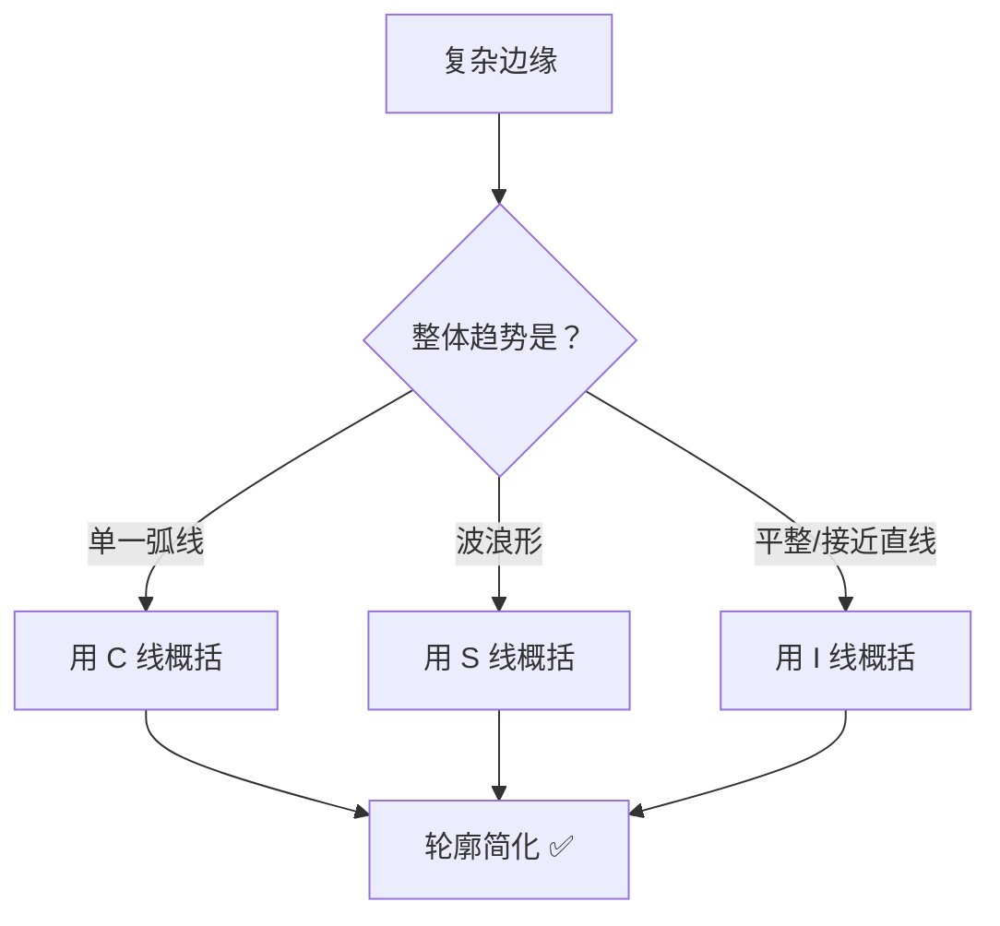

# 补充课01：CSI概括法

## Learning Objectives

- 理解 CSI 概括法的本质——用有限种类线条表达复杂轮廓
- 学会在 L1/L2/L3 层级中分别应用 CSI 概括
- 掌握 C 线、S 线、I 线的选择逻辑
- 了解 CSI 在创作中的应用场景

## 什么是 CSI 概括法？

CSI 是 **C 线（Curve）、S 线（S-curve）、I 线（I-line/Straight）** 三种基本线条类型的合称。

**核心思想**：无论一个物体的边缘多么复杂，都可以用三种基本线条来概括和表达。

```
C 线    →   一段弧线   →    ⌒
S 线    →   两段反向弧线 →   S
I 线    →   一条直线   →    —
```

> 这不是一个"规则"，而是一种**思维工具**——当你被复杂的轮廓搞得眼花缭乱时，问自己：这里能用一条 C 线代替吗？还是 S 线？还是 I 线？

## 为什么要学 CSI？

### 1. 简化复杂轮廓

很多真实物体的边缘非常琐碎——羽毛的绒毛、树叶的锯齿、头发的碎发。如果你试图逐根逐片去画，画面会变得"碎"且"乱"。

CSI 帮你做的决策是：

- **概括**：把这些琐碎的边缘看作一个大趋势
- **归类**：这个趋势是 C 形、S 形还是 I 形？
- **执行**：用对应类型的线条一笔画出来



**示例：一片羽毛**

羽毛的边缘有很多细小的绒毛裂缝。如果你逐条去画，可能需要 20~30 条线。但你后退一步看整体：

- 左侧轮廓：一条平缓的 C 线（从羽根到羽尖）
- 右侧轮廓：一条反向的 C 线（对称结构）
- 羽尖：一条短的 I 线（平收）

**3 条线 = 抓住羽毛的整体形状**，那些小裂缝留到 L3 阶段再去处理。

> [!TIP] CSI 的"视角切换"
> 使用 CSI 前，试着**眯起眼睛**看素材。眯眼会模糊掉细节，只留下最粗的明暗和形状轮廓——这时看到的"大趋势"就是用 CSI 概括的目标。

### 2. 减少废笔

"废笔"指的是那些**重复的、多余的、让画面变得混乱的线条**。

CSI 帮你减少废笔的方式非常直接：

- 不用多条短碎线去凑一条长轮廓 → 直接用一条 **C/S/I 线**一笔画到位
- 不用来回反复蹭线 → 明确当前轮廓属于哪种线型 → 目标清晰地画一条

回头看 [[0003-kong-xian-neng-li|第03课：控线能力]]，你会发现 CSI 和控线练习是天然配套的——三节课的直线/曲线练习，就是为 CSI 概括做肌肉记忆准备。

## 三级型 CSI 概括

### 一级型 CSI 概括（L1）

针对外轮廓/剪影层级的概括。这是 CSI 最重要的应用场景，因为**外轮廓决定了整体形状的准确度**。

**方法**：

1. 用九宫格定位外轮廓上的关键拐点（回顾 [[0002-guan-jian-zhuan-zhe-dian|第02课：关键转折点与123级型]]）
2. 相邻两个拐点之间的线段，判断其线型
3. 用对应的 C/S/I 线连接

```
示例：一个梨子的外轮廓
  顶部（果柄处）→ 底部 → 这段是 C 线（左弧）
  底部 → 右侧最凸点 → 这段是 C 线（右弧）
  右侧最凸点 → 顶部 → 这段是 I 线（接近直线）
  果柄本身 → I 线（细长直线）
```

### 二级型 CSI 概括（L2）

针对内部主要结构的轮廓。方法与 L1 完全相同，只是处理的形状更小。

- 眼睛的轮廓：可以用 C 线（上眼睑弧线）+ I 线（下眼睑平线）概括
- 嘴巴的轮廓：可以用 S 线（上唇线）+ C 线（下唇线）概括
- 鼻子的侧面：可以用 I 线（鼻梁直线）+ C 线（鼻头弧线）概括

### 三级型 CSI 概括（L3）

L3 阶段的 CSI 更灵活，主要处理细节、纹理和修饰性线条。

在这个层级：

- CSI 不是必须的——有些细节就是需要多条小线段来画
- CSI 是一个**自觉的思考过程**——这条线有更简洁的表达方式吗？
- 对于花纹、图案等重复元素，可以用 CSI 提炼出"一个单元"再复制

> [!WARNING] 不要过度概括
> CSI 的目的是简化，不是消灭细节。如果某个细节对物体的识别度很重要（比如熊猫的黑眼圈），即使它很琐碎也要保留。**概括的是表达方式，不是形状特征**。

## CSI 在创作中的应用

CSI 概括法不仅在"照着画"（写生/临摹）中好用，在创作中同样重要：

### 风格化提炼

当你看到一张真实照片并想把它画成自己的风格时，CSI 是连接"真实"和"风格"的桥梁：

- 把真实照片中杂乱的边缘用 CSI 重新解释
- 选择性地保留某些细节、舍弃另一些
- 形成属于自己的一套"线型字典"

### 线条节奏感

在一张画中交替使用 C 线、S 线和 I 线，可以让画面产生**节奏感和韵律感**：

- 连续的 C 线 → 柔和、可爱、圆润的感觉
- 连续的 I 线 → 坚硬、理性、利落的感觉
- C 线与 I 线的对比 → 刚柔并济的视觉效果
- S 线的流畅感 → 动态、优美的感觉

> 许多成熟的画师在创作中的"风格"，本质上就是他们的"CSI 使用偏好"——有人偏爱弧线（C 线多），有人偏爱硬朗的切边（I 线多）。找到你自己的偏好也是形成画风的一步。

## 进阶思考：CS 描述法

如果你觉得三门类不够精确，还可以使用 **CS 描述法**——只用 C 线和 S 线（不使用 I 线），将所有边缘视为由不同曲率和方向的弧线拼接而成。

- 这种方法的优势是**更连贯**（没有直线和弧线的切换突兀感）
- 劣势是**对感觉要求更高**（需要判断弧线的曲率大小）
- 适用于需要非常柔和手感的画风

## 自我检测

> [!QUESTION] Self-check
> 1. CSI 中的 C、S、I 分别代表什么线型？
> 2. CSI 的两个核心作用是什么？
> 3. 看到一个复杂物体时，你应该先做哪一步再做 CSI 概括？
> 4. 在 L3 层级使用 CSI 时需要注意什么？
> 5. CSI 和画师个人风格有什么关系？

<details>
<summary>参考答案</summary>

1. C = 单一弧线（Curve）、S = 两段反向弧线（S-curve）、I = 直线（Straight/I-line）。
2. ① 简化复杂轮廓（用几种基本线型代替琐碎边缘）；② 减少废笔（避免用多条短碎线凑轮廓）。
3. 先**眯起眼睛**看大趋势，找到整体轮廓的走向，再决定用 C/S/I 哪种线型来表达该段轮廓。
4. 不要过度概括——如果某细节对物体识别度很重要（特征细节），即使琐碎也要保留。概括的是表达方式，不是形状特征。
5. 每个画师的"风格"本质上就是 TA 的"CSI 使用偏好"——偏爱弧线还是直线、喜欢柔和过渡还是干脆利落。找到自己的偏好是形成画风的重要一步。
</details>

## Next Step

本节课是补充/进阶内容。如果你在练习中遇到"边缘太复杂、无从下手"的情况，建议反复练习 CSI 概括法。回到 [[0001-jiu-gong-ge-zhua-xing|第01课：九宫格抓形法基础]] 或 [[0002-guan-jian-zhuan-zhe-dian|第02课：关键转折点与123级型]] 复习基本功，然后用 CSI 思维重新审视你的素材。