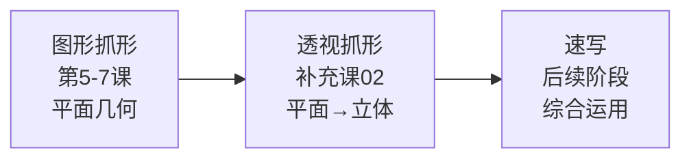
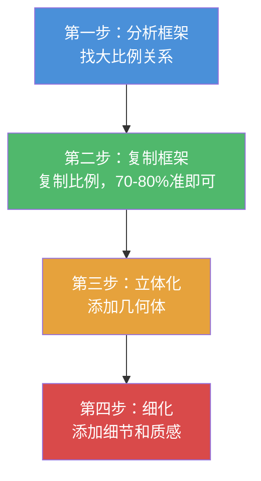
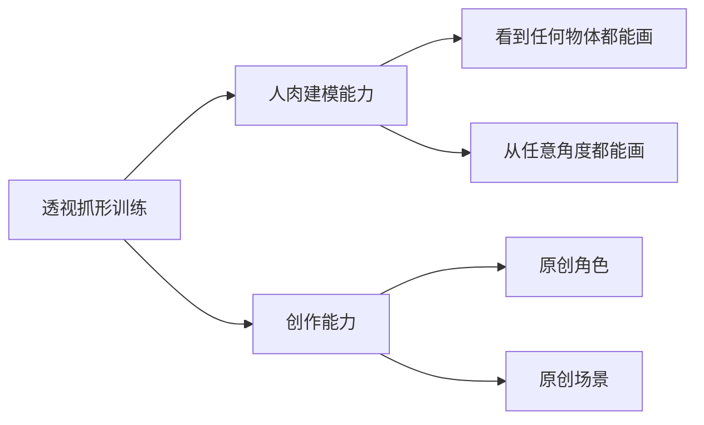

# 补充课02：透视抓形法入门

## Learning Objectives

- 理解透视抓形法在课程体系中的定位——介于图形抓形与速写之间
- 掌握透视压缩的基本概念，理解正方形在透视中如何变形
- 建立3D转2D的平面图形理解框架
- 掌握透视抓形的四步流程（分析→复制→立体化→细化）
- 完成基本几何体（椭圆、圆柱、透视方块）的临摹入门

## Core Idea

### 透视抓形法的定位

在课程体系中，透视抓形法处于这样的位置：



图形抓形法教你在**平面**上观察形状，透视抓形法教你进一步——在**透视空间**中观察形状。它是通往速写的桥梁。

> [!WARNING] 越级打怪警告
> 千万不要跳过[[0005-tu-xing-zhua-xing-fa|第05课 图形抓形法]]直接学透视抓形！如果你还不能熟练地用简单图形概括平面物体，在透视空间里只会更加混乱。
>
> 透视抓形 = 图形抓形 + 透视知识。
> 如果你还没有掌握前者，现在就拥有了"越级打怪"的资格——只是你会被怪打得很惨。

### 透视压缩的概念

在透视空间中，物体发生了两个重要的视觉变化：

**透视压缩（Foreshortening）**：
- 一个正方形在透视空间中不再是正方形——它变成了**梯形**或更复杂的四边形
- 一个圆形在透视空间中变成了**椭圆形**
- 物体离你越远的部分看起来越小

```
俯视图（真实形状）：       透视图（你看到的）：
┌──────┐                    ┌─────────┐
│      │                    │         │
│ 正   │                    │  梯 形   │
│ 方   │                    │         │
│ 形   │                    │         │
└──────┘                    └─────────┘
                            ↑ 远端更窄
```

### 3D转2D的理解方式

透视抓形法的核心思维转变：

> **不要去想"这个物体在3D空间里是什么形状"，而是去想"它在我眼睛里投射成的2D图形是什么"**

这就是"3D转2D"——你把3D的物体理解为一个**平面的几何图形**，然后画出这个图形。

**手先于脑的训练方式**：
- 不要试图先理解透视理论再动手
- 而是：**先让你的手画出透视中的形状**，让肌肉记忆先于理论理解
- 当你画了50个椭圆、50个透视方块后，透视理论自然就内化了

> [!TIP] Hand-first 原则
> 透视抓形法不需要你先学完完整的透视几何理论。它的训练方式是：
> 1. 观察：这个透视形状在2D平面上看起来像什么图形？
> 2. 动手：不管为什么，先把它画下来
> 3. 对比：检查你的图形和参考图的差异
> 4. 调整：修正偏差，再画一次
>
> 反复循环，你的手会先"学会"透视。

### 透视抓形四步流程



#### 第一步：分析框架

和图形抓形法一样，先找到最大的比例关系。不同的是，你现在需要考虑**透视压缩后的比例**：

- 物体的总宽度 : 总高度 = ?
- 近端 : 远端 ≈ ?
- 主要透视方向是朝哪个方向？

#### 第二步：复制框架

用图形抓形法确定的简单图形，复制到纸上。

> [!TIP] 70-80%准确度即可
> 和图形抓形法追求100%准度不同，透视抓形法的框架阶段只需要**70-80%的准确度**即可。因为后续的"立体化"步骤会帮你修正透视偏差。不要在这一步消耗太多时间。

#### 第三步：立体化

这是透视抓形法最关键的一步——把平面图形"转"成立体几何体：

| 平面图形 | 立体几何体 | 常见物体 |
|----------|-----------|----------|
| 椭圆 | 圆柱 | 手臂、腿、瓶子 |
| 四边形 | 透视方块 | 盒子、建筑、头部 |
| 三角形 | 锥体 | 屋顶、漏斗、手部 |
| D字形 | 柱体 | 躯干、动物身体 |

**几何体临摹基础**：

- **圆→椭圆→圆柱**：先画一个椭圆（透视中的圆形），在椭圆两端各画一条平行线，连接底部形成一个椭圆——你就得到了一个圆柱
- **方→透视方块**：先画一个四边形作为正面，然后从四个角画出会聚的边，连接到灭点方向

```
圆柱画法：                 透视方块画法：
   ╭────╮                    ┌──────┐
  ╱      ╲                   │      │
 │  椭圆  │                ┌─┤      ├─┐
  ╲      ╱                │ │      │ │
   ╰────╯                  └─┤      ├─┘
   │    │                    └──────┘
   │    │                    ↑会聚方向
   ╰────╯
```

#### 第四步：细化

在立体框架的基础上添加细节：
- 表面的纹理（木纹、布料褶皱）
- 光影暗示（用线条疏密表现明暗）
- 结构线（辅助显示立体感的线）

### 用途：人肉建模与创作铺垫

透视抓形法的最终目的有两个：

1. **人肉建模** —— 不需要3D软件，你的大脑就是建模软件。看到任何物体，都能在脑海中构建它的立体框架，然后画出来。
2. **创作铺垫**——当你想画一个原创角色或场景时，透视抓形法让你可以从几何体开始构建，而不是从零开始乱画。



### 后续推荐：K大透视课

透视抓形法只是透视的入门。如果你想系统深入学习透视理论（一点透视、两点透视、三点透视、多点透视、鱼眼透视等），推荐学习**K大的透视课**。本课的目标是让你"能画"，K大透视课的目标是让你"懂为什么能画"。

## Worked Example

**例：透视抓形法画一个水杯**

1. **分析框架**：水杯的高度大约是宽度的2倍。杯口是椭圆形（透视压缩），杯底也是椭圆形，杯身连接两个椭圆。由于视线角度，杯口椭圆比杯底椭圆更"圆"（更接近正圆）。

2. **复制框架**：画出水杯的大致矩形框架（高:宽 ≈ 2:1），标记杯口和杯底的位置。

3. **立体化**：
   - 杯口：画一个椭圆（横向）
   - 杯底：在下方画一个小一些的椭圆（横向，弧度比杯口小）
   - 连接：用两条直线连接杯口和杯底的左右两端 → 一个圆柱就完成了
   - 检查：杯口椭圆的左右两端是否和连接线平滑相接？

4. **细化**：
   - 杯口的厚度（双层椭圆）
   - 杯把：一个C形 + 一个小椭圆
   - 杯身的反光（留白）
   - 杯底的阴影（加深）

## Practice

> [!QUESTION] Self-check
> **Q1**: 透视抓形法在课程体系中处于什么位置？它连接了哪两种能力？
>
> **Q2**: 什么是"透视压缩"？请举一个例子。
>
> **Q3**: "Hand-first"原则在透视抓形法中是什么意思？
>
> **Q4**: 透视抓形法的四步流程是什么？第二步的准确度要求是多少？
>
> **Q5**: 实操题——找一个圆柱形的物体（水杯、瓶子、卷纸），用透视抓形法的四步流程画出来。特别注意椭圆的方向和弧度是否准确。

<details>
<summary>Reveal answer</summary>

**A1**: 透视抓形法介于[[0005-tu-xing-zhua-xing-fa|图形抓形]]（平面几何）和速写（综合运用）之间。它是从平面观察到空间观察的桥梁，为速写奠定基础。

**A2**: 透视压缩是物体在透视空间中发生的视觉变形——远处的部分看起来变小了。例：一个正圆在透视中变成椭圆，正方形的桌面在透视中变成梯形。

**A3**: Hand-first原则是指：先让手画出透视中的正确形状（通过反复临摹），肌肉记忆先于理论理解。不需要先学完透视几何理论再动手，而是在画的过程中自然内化。

**A4**: ① 分析框架（找大比例）→ ② 复制框架（70-80%准度即可）→ ③ 立体化（添加几何体）→ ④ 细化（细节质感）。第二步只要70-80%准，因为立体化步骤会修正透视偏差。

**A5**: 检查你的画：
- 椭圆的两个端点是否在水平方向上对称？
- 上下两个椭圆的比例是否合理（近大远小）？
- 连接线是否平滑地连接两个椭圆？
- 整体看起来是否有立体感？
- 如果以上都OK，你的第一个透视物体就完成了！

</details>

## Next Step

After completing Phase 2 (图形抓形法 + 透视抓形入门), you are ready to move on to Phase 3. Continue with the main course sequence — you can review [[0005-tu-xing-zhua-xing-fa|第05课]] if any concepts are still unclear.