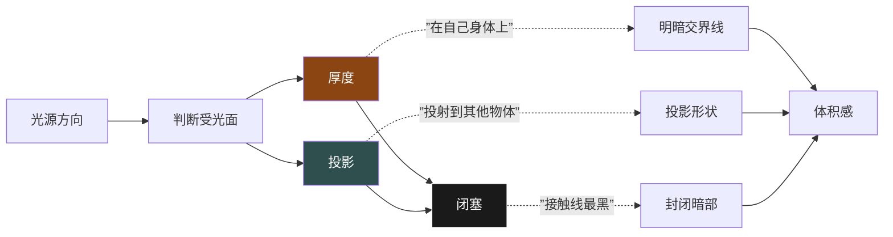

# 光影术语速查表

> [!INFO] 光影三要素
> 画光影 = 画 **厚度 + 投影 + 闭塞**。三个层次叠加，才有体积感和空间感。

---

## 一、核心术语速查

| 术语 | 英文 | 定义 | 关键特点 | 举例 |
|------|------|------|---------|------|
| **厚度** | Thickness / Core Shadow | 物体自身的暗面 | 在自己身上；依附形体转折 | 胳膊圆柱的暗面、肚子的暗面 |
| **投影** | Cast Shadow | 物体遮挡光线产生的影子 | 在别人身上；保持物体形状 | 帽子在脸上的影子、人在墙上的影子 |
| **闭塞** | Occlusion / AO | 光线进不去的小缝隙 | 接触线处的**最黑块**；边界清晰 | 水杯在桌面的接触线、嘴角、鼻翼两侧 |
| **亮面** | Light / Highlight | 直接受光的面 | 越靠近光源越亮 | 球体朝向光源的最亮处 |
| **灰面** | Midtone / Halftone | 介于亮暗之间的过渡面 | 过渡柔和，层次丰富 | 球体侧面的渐变 |
| **暗面** | Shadow / Core Shadow | 背光的面 | 与亮面形成对比 | 物体的背光侧 |
| **明暗交界线** | Terminator Line | 亮面与暗面的分界线 | 形态跟随形体转折 | 圆柱上的转折线 |
| **反光** | Reflected Light | 环境光反弹到暗面的光 | 比暗面亮、比灰面暗 | 暗面靠近桌面的边缘提亮 |
| **高光** | Highlight | 最亮的光斑 | 材质越光滑越亮越锐 | 陶瓷的亮斑 vs 皮肤的柔和 |
| **大中小** | Big-Medium-Small | 图形面积的对比关系 | 大的少 + 中等几个 + 小的多个 | 暗部的面积分配（大暗面+小亮面） |
| **正片叠底** | Multiply | 图层混合模式 | 白色不变，暗色叠加变暗 | 画光影的标准图层模式 |

---

## 二、三者的关系（厚度 + 投影 + 闭塞）



**叠加原则（从浅到深画）：**

```
画光影顺序：
  第1步：画厚度（大面积，浅灰色）
  第2步：画投影（中灰色，注意形状）
  第3步：画闭塞（最深色，仅在接触线处）
```

> [!TIP] 一个简单判断
> - 厚度在物体**自己**身上 → 暗面
> - 投影在物体**别人**身上 → 影子
> - 闭塞在两个物体**接触**的地方 → 最深的缝

---

## 三、暗弧检测训练（6格阴影测试）

> [!WARNING] 暗弧检测
> 画光影最大的坑是**只涂黑了事，不看不规则形状**。真正的阴影不是均匀的灰块，而是有形状、有虚实的。

下面是一个自我检测练习：

```
┌─────────────────┬─────────────────┬─────────────────┐
│  测试1           │  测试2           │  测试3           │
│                  │                  │                  │
│  ●光源←          │  ●光源←          │  ●光源←          │
│  ┌───┐           │    ┌───┐         │  ┌─────┐         │
│  │   │           │    │   │         │  │     │         │
│  └───┘           │    └───┘         │  └─────┘         │
│  球体阴影?       │  圆柱阴影?       │  圆锥阴影?        │
│                  │                  │                  │
├─────────────────┼─────────────────┼─────────────────┤
│  测试4           │  测试5           │  测试6           │
│                  │                  │                  │
│  ●光源←          │      ●光源↑      │  ●光源↗          │
│  ┌───┐           │    ┌───┐         │  ┌───┐           │
│  │   │           │    │   │         │  │   │           │
│  └───┘           │    └───┘         │  └───┘           │
│  球+台面?        │  杯子投影?       │  多物体?         │
│                  │                  │                  │
└─────────────────┴─────────────────┴─────────────────┘
```

**答案对照：**

| 测试 | 厚度位置 | 投影位置 | 闭塞位置 |
|------|---------|---------|---------|
| 1 球体阴影 | 球体右侧偏下（月牙形） | 地面右侧（椭圆） | 球与地面接触点 |
| 2 圆柱阴影 | 圆柱右侧（竖条带） | 地面右侧（矩形） | 圆柱底边接触线 |
| 3 圆锥阴影 | 圆锥右侧（三角暗面） | 地面右侧（放射形） | 锥尖投影方向延长 |
| 4 球+台面 | 球体暗面（弧形） | 台面上（球缺形） | 球与台面缝隙 |
| 5 杯子投影 | 杯子背光侧（竖条） | 桌面右侧（梯形） | 杯底与桌面接触线 |
| 6 多物体 | 各物体自身暗面 | 相互遮挡产生复合投影 | 所有接触线 |

---

## 四、大中小原则（面积分配）

> [!TIP] 大中小的黄金比例
> **大暗面（大）**：1个主要暗部面积（约60%的暗部总面积）
> **中等暗面（中）**：2-3个次要暗面（约30%）
> **小暗面（小）**：闭塞/小投影（约10%）

**应用示例——画一个头像的光影：**
- **大**：整个侧脸的大暗面（厚度）
- **中**：眉弓下的投影、下巴的投影、颈部的投影
- **小**：鼻翼两侧的闭塞、眼角内侧、耳后缝隙

---

## 五、正片叠底（Multiply）使用技巧

| 操作 | 说明 |
|------|------|
| 图层模式 | 新建图层 → 设为 **正片叠底** |
| 颜色选择 | 用**灰色**（不一定要黑色！偏灰的暗色更自然） |
| 透明度 | 图层不透明度控制在 **30-60%** |
| 叠加次数 | 多次叠加可加深，比一次画黑更可控 |
| 白色擦除 | 正片叠底层用白色画 = 橡皮擦的效果 |

> [!INFO] 为什么画面会"花"？
> 最常见原因：**该用投影的地方画了厚度，该用闭塞的地方画了投影**。
> 自检方法：把画面缩到很小，看暗部有没有**清晰的黑白灰层次**，还是一团糊。

---

## 六、常见误区

| 误区 | 表现 | 纠正方法 |
|------|------|---------|
| 厚薄不分 | 所有暗部都是同样深浅 | 区分厚度（浅灰）→ 投影（中灰）→ 闭塞（深黑） |
| 忘记闭塞 | 物体像飘在空中 | 在所有接触线处加最深的黑 |
| 投影形状不对 | 投影不贴合地面/物体 | 画投影前先画"光线路径"辅助线 |
| 过度反光 | 暗面被提得太亮 | 反光不要超过灰面的亮度 |
| 忽略大中小 | 暗部碎成一片 | 先归纳成1个大暗面，再添加小层次 |