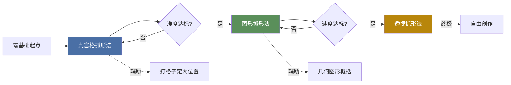

# 抓形方法对比表

> [!INFO] 抓形三阶段
> 三种抓形方法对应不同学习阶段，**九宫格 → 图形 → 透视** 是进阶路径，不是互相替代关系。高阶画师会混合使用。

---

## 一、核心对比

| 维度 | 九宫格抓形法 | 图形抓形法 | 透视抓形法 |
|------|-------------|-----------|-----------|
| **核心工具** | 九宫格网格 + 坐标定位 | 几何图形（五边形 / D字 / 三角形） | 立体几何体（方块 / 圆柱 / 球体） |
| **适用阶段** | 入门期（0-3个月） | 进阶期（3-6个月） | 高级期（6个月+） |
| **核心优势** | 降低观察难度，定位精确（95%+） | 快速起稿，好记忆，培养图形思维 | 理解立体结构，可自由旋转视角 |
| **主要局限** | 步骤繁琐；脱离网格后难以抓准 | 准度略降（75-85%），复杂形体需拆分 | 需透视知识基础，前期学习曲线陡 |
| **用脑方式** | 找坐标 → **机械式** | 分析图形 → **理解式** | 理解结构 → **知识驱动** |
| **学习顺序** | 第一阶段（必学） | 第二阶段（必学） | 补充了解（选学） |
| **典型用时** | 10-20分钟/张 | 3-8分钟/张 | 5-15分钟/张 |

---

## 二、学习路径图

---

## 三、各方法详解

### 1. 九宫格抓形法

**核心步骤：**
1. 在参考图上画九宫格（横竖各2条线，分成9格）
2. 观察每个格子中线条经过的位置（占格子宽/高的比例）
3. 在画纸上画出同样比例的九宫格
4. 逐格对照，把线条"翻译"到画纸上

> [!TIP] 入门技巧
> - 先定**四个角**和**中心点**，再画中间线
> - 关键转折点用坐标法：**横向看占格子宽度几分之几，竖向看占格子高度几分之几**
> - 每画完一格，退远看整体，避免"格与格之间接不上"

**适合场景：**
- 第一次画复杂形体（人物、动物、建筑）
- 对比例没信心的时候
- 需要极高精度的临摹

---

### 2. 图形抓形法

**核心步骤：**
1. 忽略细节，把物体概括成**简单几何图形**（五边形、D字形、三角形、梯形）
2. 先定大形，再在大形内切分小形
3. 用"正负形"检查——看物体之外的空白形状

> [!TIP] 图形思维训练
> - 侧脸 → D字形
> - 正脸（含头发） → 五边形 / 蛋形
> - 眼睛 → 杏仁形
> - 嘴巴区域 → 梯形
> - 手 → 手套形
> - 剪影法：只看外轮廓，忽略内部细节

**适合场景：**
- 日常练习、速写
- 写生（没有网格可打）
- 创作起稿阶段

> [!WARNING] 常见问题
> - 图形化过度，失去细节特征 → 每画完大形，加一个关键特征点确认
> - 正负形使用不足 → 翻转画面/镜像检查

---

### 3. 透视抓形法

**核心步骤：**
1. 把物体理解成**立体几何体**的组合（方块、圆柱、圆锥、球体）
2. 确定**视平线**和**消失点**
3. 用透视原理画辅助线，确定各立体块的空间位置

> [!TIP] 透视入门
> - **方块**练好就能画一切——人体、建筑、场景都基于方块
> - 先从**一点透视**练起，再进阶到两点透视、三点透视
> - 圆柱 = 方块 + 椭圆底面，椭圆的开合程度决定俯仰视角

**适合场景：**
- 画带有纵深感的场景
- 多角度转面创作
- 需要理解物体"为什么长这样"而不是"看起来怎样"

---

## 四、什么时候用哪种？

| 情况 | 推荐方法 | 原因 |
|------|---------|------|
| 刚入门，临摹照片 | 九宫格 | 降低挫败感，建立信心 |
| 画速写、日常练习 | 图形法 | 快速，培养感觉 |
| 创作、设计角色 | 透视法 + 图形法 | 需要理解结构+快速迭代 |
| 画复杂场景 | 图形法（大形）+ 透视法（空间） | 混合使用效率最高 |
| 检查画面是否歪了 | 九宫格（脑补） | 用"虚拟网格"检查水平/垂直 |

> [!INFO] 大师的秘诀
> 成熟的画师会**三种并用**：
> - 用**透视法**理解空间关系
> - 用**图形法**快速起稿
> - 用**九宫格思维**检查关键比例
>
> 三种方法不是选择题，而是工具箱里的不同工具。

---

## 五、练习建议

| 阶段 | 练习内容 | 频次 | 目标 |
|------|---------|------|------|
| 第1周 | 每天1张九宫格临摹 | 30分钟/天 | 准度达90% |
| 第2-3周 | 九宫格→逐步减少格子（9→4→1格） | 20分钟/天 | 脱离网格 |
| 第4周 | 图形法起稿 + 九宫格验证 | 20分钟/天 | 建立图形思维 |
| 第5-6周 | 纯图形法练习 | 15分钟/天 | 速度提升 |
| 第7周+ | 按需学习透视法 | 按需 | 理解立体结构 |

> [!WARNING] 不要过早放弃九宫格
> 很多学员觉得九宫格"太死板"而跳过，结果几个月后回来重新练。**九宫格训练的是"眼睛的测量能力"**，这个基础打好了，后面两种方法才能发挥效果。