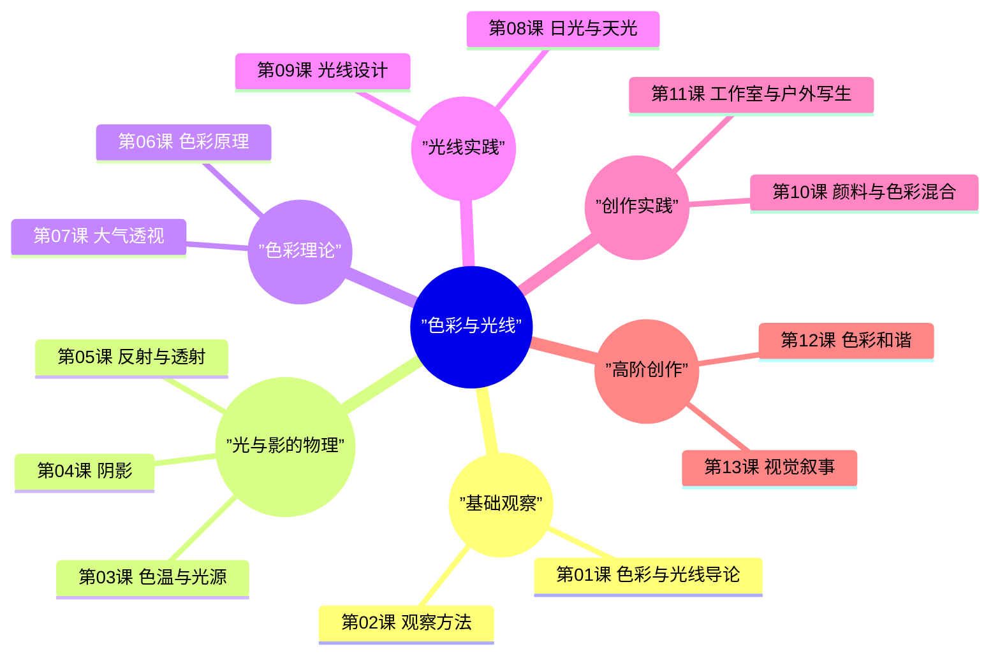
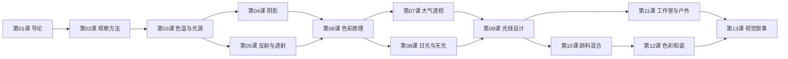

# 课程地图：色彩与光线

## 知识结构

## 学习路径

## 依赖关系

| 课程 | 前置依赖 | 核心主题 |
|---|---|---|
| 第01课 导论 | 无 | 课程概览与核心观念 |
| 第02课 观察方法 | 第01课 | 用眼睛观察而非依赖照片 |
| 第03课 色温与光源 | 第01课 | 光的物理与色温概念 |
| 第04课 阴影 | 第03课 | 阴影的分类与表现 |
| 第05课 反射与透射 | 第03课 | 光线与材质交互 |
| 第06课 色彩原理 | 第04课, 第05课 | 色彩系统与感知 |
| 第07课 大气透视 | 第06课 | 空间与色彩的关系 |
| 第08课 日光与天光 | 第06课 | 自然光环境 |
| 第09课 光线设计 | 第07课, 第08课 | 主动设计光线 |
| 第10课 颜料混合 | 第06课 | 颜料操作 |
| 第11课 工作室与户外 | 第09课 | 实践场景 |
| 第12课 色彩和谐 | 第10课 | 配色原理 |
| 第13课 视觉叙事 | 第11课, 第12课 | 综合创作 |

## 参考资源

- [[reference/glossary|术语表]]
- [[reference/color-mixing-guide|调色指南]]
- [[reference/further-reading|延伸阅读]]