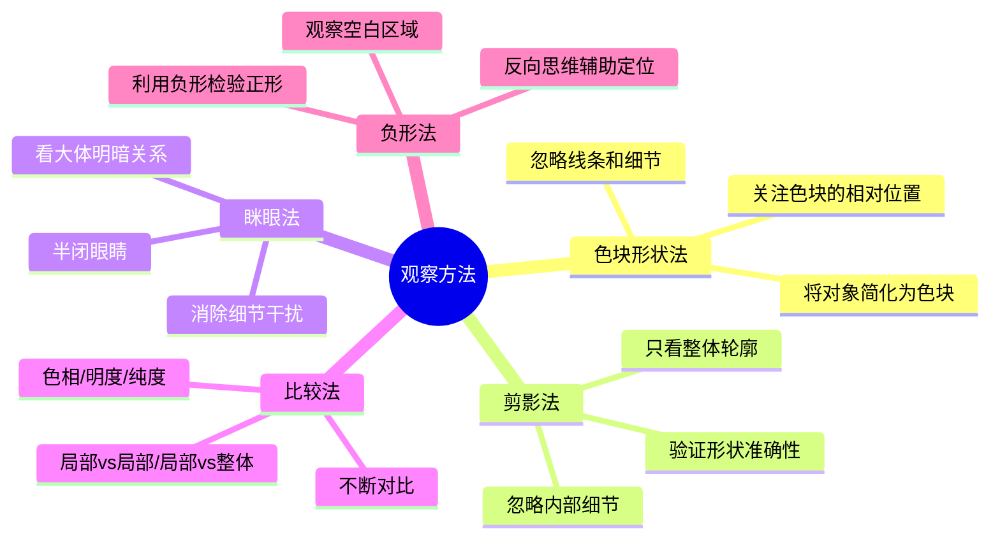
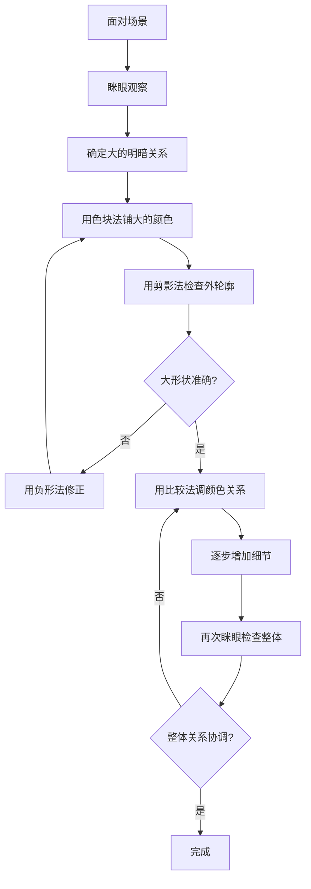

# 第02课：观察方法

## 学习目标

完成本课后，你应该能够：

- 掌握五种观察方法的核心要领
- 理解它们如何协同工作
- 在日常练习中有意识运用这些方法
- 知道哪些常见错误会破坏观察的准确性

---

## 五种观察方法

James Gurney 将画家观察世界的方式归纳为五种系统的技巧。它们不是互斥的，而是从不同角度解决同一个问题——准确地感知和再现你看到的东西。

---

## 色块形状观察法

**核心思想**：将眼前的场景简化成若干个大的色块，忽略细节、线条和纹理，只关注每个色块的颜色和形状。

这听起来简单，但却是区分有经验画家和初学者最明显的标志。初学者倾向于先画轮廓线，再在里面填色——这是一个错误顺序。正确的做法是：**先看到色块，再看到边界**。

> [!TIP] 如何练习色块观察
> 眯起眼睛看场景——当你眯眼时，细节消失，剩下的就是几块大的颜色区域。这些色块的边界就是你需要画的"轮廓"。换句话说，轮廓不是先画的，而是色块相遇时自然产生的。

**练习方法**：
1. 选一张简单图片或真实场景
2. 眯眼看，识别出3-5个主要色块
3. 用笔在纸上标记每个色块的边界
4. 给每个色块涂上它的大致颜色（不必精确调色）
5. 检查色块之间的比例关系是否正确

> [!WARNING] 色块观察的陷阱
> - 不要陷入局部细节。比如画一棵树，你的第一笔应该是"树冠的绿色块"，而不是"每片叶子的形状"
> - 色块不宜太多。初学者控制在5个以内，然后逐步增加
> - 不要急于调整颜色。先用色块把构图确定下来

---

## 剪影观察法

**核心思想**：将对象视为一个完全黑色的剪影，忽略所有内部细节，只关注外轮廓的准确性。

剪影法是一种极端的简化——比色块法走得更远，它完全放弃色彩和内部信息，只保留形状的外边界。为什么会有效？因为**人的视觉系统对轮廓极度敏感**。如果一个剪影的形状画准了，即使内部什么都不画，观者脑补也能认出对象（想想路标标志）。

> [!WARNING] 常见问题
> 很多初学者一旦开始画内部细节（眼睛、花纹、纹理），就会忘记检查外轮廓是否准确。结果就是：内部细节画得很漂亮，但整体形状是歪的——越看越不对劲。
> 
> 解决方案：画到一半时，暂停内，眯眼看剪影形状，确认外轮廓没问题再继续。

**练习方法**：

1. 找一张高对比度的人物或物体照片
2. 在脑海里（或实际在纸上）只画出它的外轮廓——想象你正在画它的影子
3. 不要管内部细节，直到外轮廓完全准确
4. 对比原图，检查形状比例是否准确

---

## 眯眼观察法

**核心思想**：半闭眼睛（眯眼），减少进入眼睛的光线量，让瞳孔稍微散焦，从而自动过滤掉细节，只保留大的明暗关系。

这是最实用、最快速的观察技巧。你不需要任何工具，随时随地都能用。眯眼之后，你会看到：

- 哪些区域最亮，哪些最暗
- 大色块之间的关系
- 整体的色调倾向（暖还是冷）
- 对比度的高低（硬光还是柔光）

> [!TIP] 眯眼的关键
> 不要完全闭上眼睛——那样什么都看不到。也不要正常睁眼——那样细节太多。找到"刚好能看到大的明暗关系，但看不清纹理"的那个程度，就是眯眼的最佳状态。
> 
> 练习时可以在眯眼和正常视之间来回切换：眯眼确定大的关系，正常视检查细节。反复切换，每次眯眼都问自己："我现在看到的明暗关系对吗？"

---

## 比较观察法

**核心思想**：人类的感知是有欺骗性的——一个灰色放在白色背景上看起来深，放在黑色背景上看起浅。单看一个颜色无法判断它是否正确，必须通过比较来确定。

比较有三个维度：

| 比较维度 | 比较什么 | 典型问题 |
|---------|----------|----------|
| 色相比较 | 这个色块偏红还是偏蓝 | 误判两个色块相同，实际一暖一冷 |
| 明度比较 | 哪个更亮，哪个更暗 | 局部看都亮，一比较才知道有层次 |
| 纯度比较 | 色彩饱和度高低 | 灰暗的物体被画得过于鲜艳 |

**比较的秘决**：不是看"它是什么颜色"，而是看**"它和旁边的颜色有什么不同"**。

> [!EXAMPLE] 比较法实战
> 假设你画一个红苹果放在蓝色桌布上：
> 
> 1. 比较苹果的红和桌布的蓝——它们在色相上是互补的
> 2. 比较苹果亮部的红和暗部的红——亮部的红偏橙黄（受光源影响），暗部的红偏紫（受环境光影响）
> 3. 比较苹果和桌布的明度——苹果亮部可能比桌布亮，但暗部可能比桌布暗
> 
> 这些比较关系决定了画面的真实感，而不是你调的红色有多"漂亮"。

---

## 负形观察法

**核心思想**：不直接画你要画的物体，而是画物体周围的"空"区域——也就是负形。

每一幅画都由正形（物体）和负形（背景/空隙）组成。观察负形有一个意想不到的好处：**当我们试图画正形时，大脑会自动"修正"形状——比如画人脸时会无意识画得对称。但负形不会触发这种修正机制，所以负形比正形更准确。**

> [!WARNING] 负形观察的进阶
> 初级使用：画物体的外轮廓时，同时注意轮廓外的空白形状。
> 高级使用：画物体内部的空隙（例如手臂和身体之间的三角空隙）也是一种负形——画出这些空隙的形状，物体的形状自然就对了。
> 
> 这和"画黑"还是"画白"无关，和你看哪里有关。有时候看着"空白"画，反而能画准。

**练习方法**：

1. 画一把椅子——不画椅子本身，而画椅子腿之间的空隙形状
2. 画一个人物剪影——不画人物，而画人物周围的背景形状
3. 检查你画的负形是否和实物周围的空间形状一致——如果一致，正形一定是准的

---

## 观察方法的综合运用

五种方法在实际创作中是交替使用的，不是依次执行的步骤。下面是一个典型的观察-绘画流程：

**关键原则**：始终从大到小、从整体到局部。大关系没确定之前，绝不进入细节。这就是**从简单形状入手逐步细化**的方法——先画三到五个大的色块，再在每个色块内找变化，最后才添加细节。

---

## 实践练习

以下练习建议每次15-20分钟，每天选一个方法练习，然后第五天综合运用所有方法。

| 天数 | 练习方法 | 具体操作 |
|------|----------|----------|
| 第1天 | 色块法 | 选一个桌面静物，眯眼看，只用3-5种颜色画出大的色块 |
| 第2天 | 剪影法 | 画一个椅子或盆栽的剪影，不画任何内部细节 |
| 第3天 | 眯眼法 | 观察窗外的风景，反复眯眼和挣眼，记录明暗关系的变化 |
| 第4天 | 比较法 | 画两个相近颜色的物体（如红苹果和红柿子），专注比较它们的色差 |
| 第5天 | 负形法 | 画你坐的椅子和桌子之间的空隙形状 |
| 第6天 | 综合 | 选一个新场景，有意识交替使用五种方法完成一幅完整的画 |

> [!TIP] 练习记录建议
> 每次练习后花2分钟写下：用了什么方法、遇到什么困难、什么时刻方法发挥了作用。一周后再读这些记录，你会明显看到自己的进步。

---

## 自测

> [!QUESTION] 自测题
> 色块观察法和剪影观察法有什么本质区别？它们分别在什么情况下最有效？

点击查看答案

**本质区别**：
- **色块法**关注**颜色区域**——它将场景分解为不同颜色的块，强调色块之间的色彩关系和相对位置。它保留的内部的色彩变化信息，但忽略细节。
- **剪影法**关注**外轮廓形状**——它完全放弃内部信息，只保留边界。它不关心颜色、纹理、明度变化，只看形状是否准确。

**最有效的使用场景**：
- **色块法**最适用于**铺色的初期阶段**，帮助你快速确定大的色彩构图和明暗分布。
- **剪影法**最适用于**验证形状的准确性**，当你不确定物体的比例和位置是否正时，用剪影法检查最有效。

**综合使用**的最佳实践是：先用色块法铺出大体颜色，然后用剪影法检查每个色块的轮廓，发现不准就修正——两种方法形成"上色 -> 检查形状 -> 修正 -> 再上色"的循环。

---

## 继续学习

掌握了五种观察方法之后，你需要理解光本身的性质。下一课将介绍色的温度——色温（Kelvin）的概念，以及不同光源（自然光、人工光）如何影响我们看到的色彩。

[[0003-se-wen-yu-guang-yuan|第03课：色温与光源]]