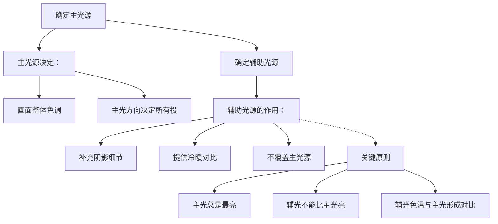
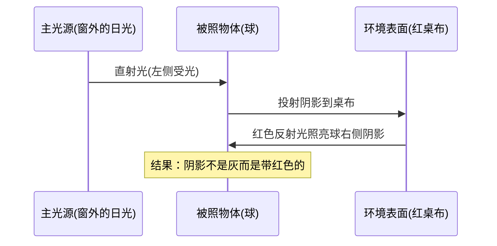

# 第03课：色温与光源

## 学习目标

完成本课后，你应该能够：

- 理解光作为电磁波的本质和可见光谱的范围
- 掌握色温（Kelvin）的概念，并能将不同光源与对应的色温值关联
- 区分自然光与人工光的色彩特性
- 理解主光源如何决定画面的整体氛围
- 认识到反射光作为二次光源的重要性

---

## 光的物理本质

光是一种电磁波，人眼能感知的只是电磁波谱中极窄的一段——380纳米到780纳米之间，我们称之为**可见光谱**。

| 波长范围 | 感知色彩 | 典型光源 |
|-----------|----------|----------|
| 380-450 nm | 紫蓝色 | 晴朗天空的散射光 |
| 450-495 nm | 蓝色 | 蓝天、深水 |
| 495-570 nm | 绿色 | 植物绿叶反射光 |
| 570-590 nm | 黄绿色 | 日光中央部分 |
| 590-620 nm | 橙色 | 日落时分 |
| 620-780 nm | 红色 | 日出日落、烛光 |

不同波长的光以不同的角度折射，在物体表面被选择性吸收和反射，于是我们看到了色彩。一个红色的苹果之所以是红色，不是因为它"本身是红色"，而是因为它吸收了除红色以外的大部分波长的光，只把红色波长的光反射到我们的眼睛。

> [!TIP] 关键理解
> **色彩不是物体的固有属性，而是光与物体表面相互作用的产物。**
> 
> 这意味着：同一个苹果，在暖色烛光下看起来偏橙红，在冷色日光灯下看起来偏冷红。物体的"固有色"在现实中并不存在——我们看到的始终是"光源色 + 物体反射特性"的叠加结果。
> 
> 理解了这一点，你就不会再困惑为什么同一个对象的颜色在不同光线下看起来不一样——它不是颜色变了，而是光变了。

---

## 色温的概念

色温用开尔文（Kelvin，符号K）来度量。**色温的数值规则反直觉**：

- **低色温**（约1000K-3000K）——看起来偏**暖**（橙红、黄色）
- **高色温**（约5000K-10000K）——看起来偏**冷**（蓝色、蓝白色）

这听起来反直觉——明明"高"温听起来应该更暖。这是因为色温的概念源于物理学中对理想黑体的加热实验：加热一个黑色物体，随着温度升高，它先发出暗红色（较低温），然后逐渐变黄变白，最终变蓝（极高溫）。所以蓝色的色温值反而更高。

> [!TIP] 记忆技巧
> 记一个参考点即可：**烛火的色温低约为1500K（橙黄色），正午日光的色温约为5500K（白色），阴天的色温约为8000K（蓝白色）**。
> 
> 以这三个为锚点，其他光位的色温就可以相对理解了。

以下表格展示了常见光源的色温范围：

| 光源 | 色温 | 色彩倾向 | 典型场景 |
|------|------|----------|----------|
| 烛光 | 1500-200 K | 深橙红色 | 烛光晚餐、老式照明 |
| 日出/日落 | 2000-3000 K | 暖橙色 | 黄金时刻摄影|
| 家用白炽灯 | 2700-3000 K | 温暖黄色 | 客厅照明 |
| 卤素灯 | 3200-350 K | 中性偏暖 | 演播室灯光 |
| 晨光/暮光 | 4000-4500 K | 清爽中性白 | 日出后1小时|
| **正午日光**| **5500 K** | **中性白色** | **标准摄影参考**|
| 阴天光 | 6000-7500 K | 偏冷白 | 多云天气 |
| 晴朗阴影 | 7000-8000 K | 明显的蓝白色 | 建筑物阴影下 |
| 阴雨天 | 7500-8500 K | 冷蓝色 | 雨天拍摄 |
| 晴朗天空 | 9000-12000 K | 深蓝色 | 高山上的天空 |

> [!WARNING] 色温的常见误解
> 很多人以为"暖色"就是"温暖的感觉"、"冷色"就是"寒冷的感觉"——这是对的，但不要搞混：色温的物理数值和我们的感官体验是相反的。
> 
> 另一个常见误解是：认为色温是绝对的判断标准。实际上，人眼有很强的**色适应能力**——在烛光下待久了，白色的纸在你的眼中仍然是"白色"，尽管它的实际色温是2000K。相机的自动白平衡就是试图模拟这种适应能力。
> 
> 作为画家，你需要的不是纠正这种"色适应"，而是**意识到它的存在**，并有意选择是否表现出来。

---

## 各种光源的特性

### 自然光

自然光是变化最丰富的光源，它的色温、强度和方向每时每刻都在变化。

| 时间/天气 | 色温范围 | 特点 | 绘画要诀 |
|-----------|----------|------|----------|
| 日出前 | 8000-10000K | 冷蓝紫色调，光线微弱、漫射 | 阴影面积大、边缘柔和 |
| 日出后1小时 | 3000-4000K | 温暖的金光，长投影 | **黄金时刻**，暖光与蓝影的强烈对比 |
| 正午 | 5000-5500K | 中性色温，头顶直射 | 阴影最短、最深；宜在阴影下作画 |
| 黄昏 | 2000-3000K | 极暖，低角度 | 色彩饱和度高，对比强烈 |
| 阴天 | 6500-8000K | 均匀的漫射光 | 几乎无投影，色彩柔和 |
| 晴朗阴影 | 7000-10000K | 从蓝色天空获得的冷光 | 阴影区域呈蓝紫色 |

### 人工光

| 类型 | 色温 | 色彩特征 | 绘画注意事项 |
|------|------|----------|-------------|
| 白炽灯/钨丝灯 | 2700-3000K | 暖黄至橙黄 | 肤色在暖光下显得健康红润 |
| 荧光灯（暖白） | 3000-4000K | 偏暖白 | 色彩还原一般 |
| 荧光灯（冷白） | 4000-5000K | 偏冷白带绿 | 物体色彩发灰；皮肤看起来不健康 |
| LED灯（可调色） | 2000-6500K | 种类多样 | 现代绘画的常见光源，注意显色性 |
| 街灯（钠灯） | 约2200K | 浓重的橙黄色 | 单色性强，几乎无法分辨色彩|

> [!WARNING] 混合光源配
> 现实生活中很少只有一个光源。窗边的书桌是一个典型例子：一边是窗外的蓝色天光（高色温），另一边是台灯的暖光（低色温）。
> 
> 这就是 **混合色温** 情况——物体的不同方向被不同色温的光照亮。处理这种场景的秘诀是：明确哪个是主光源（通常是最亮的那一个），让它的色温决定画面总体色调，辅助光源的色温则影响阴影和边缘。
> 
> 常见错误：试图"平衡"两个光源的色温，结果画面失去了冷暖对比的魅力。

---

## 主光源与辅助光源的关系

在任何场景中，**一个光源必居主导地位**——这是绘画中最重要的原则之一。

### 反射光——隐身的辅助光源

很多人忽视的一个关键因素：**物体表面的反射光本身就是一种辅助光源**。

举一个典型例子：将一个白色的球放在红色桌布上，一束光从左侧照射。球的右侧阴影区域不会是完全的灰色，而是微弱的红色——因为红色桌布反射的光线照亮了球的阴影侧。

> [!EXAMPLE] 反射光实例
> 观察一个放在草地上的白球：
> - 受到光照的上半部：呈现日光色（中性白）
> - 阴影的下半部：呈现草地的绿色
> - 球的正下方草地：暗色，几乎不受反射光影响
> 
> 这种**环境色对阴影的影响**是画面真实的秘密。很多初学者画阴影使用纯黑或纯灰色——现实中几乎不存在这样的阴影。

### 光强度衰减——平方反比定律

虽然不需要记住精确的公式，但理解这个直觉很有用：**光源到物体的距离增加一倍，照度降到原来的四分之一**。

这意味着：

- 离窗口越远，光线越弱——室内深处的物体比窗边的物体暗得多
- 烛光这样的弱光源，衰减非常快——距离蜡烛10厘米和20厘米，亮度差4倍
- 太阳光由于距离极远，在地球表面几乎不考虑衰减——但云层遮挡是另一种情况

---

## 实践练习

### 练习1：色温一日记录

选择一天中5个时间点，记录你所在位置的光源色温（用眼睛判断，不需要仪器）。

| 时间 | 光源描述 | 你判断的色温范围（低压/中/高） | 看到的色彩倾向 |
|-----|---------|-------------------------------|---------------|
| 日出时分 | 例：东窗透入的晨光 | 低位（2000-3000K） | 暖橙色 |
| 上午10点 | | | |
| 正午 | | | |
| 下午4点 | | | |
| 黄昏 | | | |
| 晚上（人工光） | | | |

### 练习2：寻找混合色温场景

找一个有两种不同光源的区域（例如：台灯下的书桌 + 窗外的月光/路灯），放置一个白色物体（一张白纸或一个白碗）。

- 从不同方向观察物体的颜色变化
- 特别关注物体被不同光线照射的面之间的过渡区域
- 用文字描述你所看到的颜色

> [!TIP] 值得注意的细节
> 在白纸的受暖光面，纸看起来是奶油黄；在受冷光面，纸看起来是淡蓝色；而在两个光的交汇处——看仔细了——那里接近白色。这就是色温在物体表面过渡的真实表现。

---

## 自测

> [!QUESTION] 自测题
> 为什么阴影中的物体往往不是纯黑色或纯灰色？请结合色温和反射光的概念解释。

点击查看答案

阴影区域从来不是纯黑或纯灰色，原因主要有两个：

1. **环境反射光**：阴影区域仍然受到周围物体反射光的照射。例如，晴天树荫下的地面虽然不受太阳直射，但仍然接收来自天空的蓝色漫射光以及周围建筑物的反射光。因此阴影区域总是有颜色的——不是"缺光"，而是"接受的是间接光"。

2. **色温的互补效应**：当主光源是暖色时，阴影区域往往呈现冷色倾向（尤其是来自天空的蓝紫色光）。这就是著名的**"暖光冷影"原则**。反过来，如果主光源是冷色（如阴天的冷白光），阴影则会相对偏暖。

**所以阴影不是"缺少光线"——阴影只是来自不同方向的光**。它有自己的色温、自己的明度、自己的纯度，是画面中完整的一部分，不是画完主体后剩下的"空白区域"。

---

## 继续学习

理解了色温和光源之后，下一课将深入探讨光是怎样产生阴影的——包括投影与自身阴影的区别、阴影边缘的硬软变化、阴影中丰富的色彩，以及一个极为重要但容易被忽视的概念：闭塞阴影。

[[0004-yin-ying|第04课：阴影]]