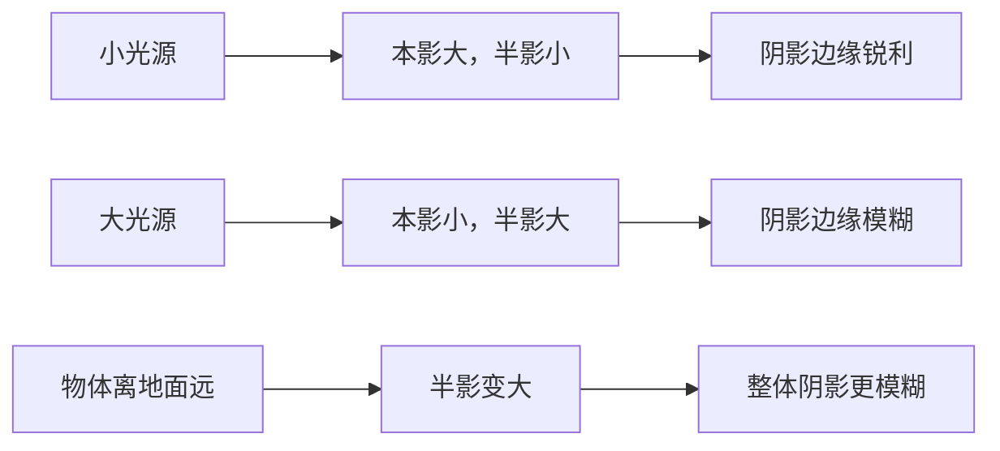

# 第04课：阴影

## 学习目标

完成本课后，你应该能够：

- 清晰区分投影与自身阴影两种类型
- 理解阴影边缘的硬软与光源大小的关系
- 掌握"暖光冷影"的色彩原则及其背后的物理原理
- 识别和表现闭塞阴影
- 在不同环境下（晴天、阴天、室内）正确处理阴影

---

## 阴影的两大类型

所有阴影都可以归为两大类：**投影**和**自身阴影**。它们的形成机制不同，在绘画中的处理方法也不同。

```mermaid
flowchart TD
    subgraph 阴影类别
        A[阴影] --> B[自身阴影]
        A --> C[投影]
    end

    subgraph 自身阴影
        B --> D[物体自己挡自己]
        B --> E[从亮部到暗部的过渡]
        B --> F[显示物体的立体感]
    end

    subgraph 投影
        C --> G[物体遮挡光   线落在其他表面]
        C --> H[显示物体和地面的关系]
        C --> I[暗示光源位置]
    end

    subgraph 关键区别
        D -.->|逐渐过渡| F
        G -.->|通常边界更清晰| I

```

### 自身阴影

自身阴影是物体**没有被光直接照射到的部分**——或者说，是物体自己遮挡了自己。当我们说"一个物体有立体感"，很大程度上是因为我们能看到它的自身阴影。

- 自身阴影的明度取决于物体本身的材貭（光滑表面自身阴影较深，粗糙表面自身阴影较浅）
- 自身阴影的边缘**总是**柔和的——因为光是波浪状的，在物体曲面上的消失是渐进的
- 自身阴影应该表现为物体固有色的深色版本，而不是混入黑色

### 投影

投影是物体挡住了光线，在地面或墙壁上形成的暗色区域。投影提供关键的**空间信息**：

- 告诉你物体和地面之间有没有空隙
- 告诉你光源在哪个方向、多高
- 暗示地面的起伏和平坦程度

> [!TIP] 影形与物体形状的关系
> 很多人以为"投影就是物体的轮廓放大了贴在墙上"——这是极大的误解。
> 
> 投影的形狀不仅取决于物体的形状，还取决于**被投射表面的形状**。一个圆形在平坦地面上的投影是椭圆形，但当同一个圆形物体靠近弯曲的墙角时，它的投影会"折叠"到两面墙上，形成V形的投影——看起来和物体完全不象。
> 
> 观察投影时，**不要想着物体的形状，而要观察投影本身的形状**。

---

## 阴影的边缘处理

阴影的边缘硬度和**光源的大小**直接相关：

| 光源类型 | 光源大小 | 阴影边缘 | 典型场景 |
|----------|---------|---------|---------|
| 点光源（太阳） | 相对小（从地球看太阳视角约0.5度） | 清晰锐利 | 晴天正午 |
| 大面光源（阴天） | 非常大（整个天空都是光源） | 非常柔和、几乎不可分辨 | 多云天|
| 中等面光源（窗光） | 窗户大小 | 虚实结合：近墙处实，远墙处虚 | 窗边的静物 |
| 人工聚光灯 | 很小 | 极锐利 | 舞台灯光 |
| 烛光（近距离） | 相对光源而言较大 | 柔和的淡影 | 烛光环境 |

> [!WARNING] 阴影边缘的渐变性
> 同一道投影，**离物体越近的部分边缘越锐利，离物体越远的部分边缘越模糊**。这是因为光线随着距离的增加，被遮挡和未被遮挡的区域之间的过渡带（半影区）会变大。
> 
> 很多缺乏经验的画将整个投影画成一样的边缘硬度——这会让画面看起来很"硬"、不自然。记住：投影的边缘**从近到远经过从"硬"到"软"的渐变**。

### 本影与半影

- **本影**：完全被遮挡的区域，投影中最暗的部分
- **半影**：部分被遮挡的区域，本影外围模糊的过渡带

本影和半影的比例由光源大小和物体距投影面的距离决定：



---

## 阴影的色彩

这是本节最重要的内容。绝大多数初学者都把阴影画成了"更暗的固有色"——这是一个根本性的错误。

### 暖光冷影原则

当主光源是**暖色**时，阴影往往呈现**冷色**倾向（蓝紫、蓝灰）。反之亦然。

为什么会这样？因为户外阴影并不是"没有被照亮"——它被来自天空的漫射光照亮。天空是蓝色的，所以阴影区域呈现蓝紫色。

> [!EXAMPLE] 晴天户外场景
> 一个白色石膏球放在户外的木桌上，时间是下午3点（阳光偏暖黄）：
>
> - 受光部：暖黄色（阳光色 + 石膏自身的白）
> - 自身阴影：浅蓝紫色（天光的冷色 + 石膏的白）
> - 投影在地面：深蓝紫色（天光的冷色 + 木桌的深色）
> - 投影靠近物体的地方：最深，接近木桌固有色加蓝色
> - 投影远离物体的地方：较浅，更多天光蓝色渗入
>
> 摄影师称下午3-5点为"黄金时刻"，正是因为这种暖光冷影的对比最明显最美丽。

### 阴阴影的色彩混入

除了天光的蓝色，阴影还受到环境反射色的影响：

| 环境 | 阴影中混入的颜色 |
|------|-----------------|
| 草地 | 蓝绿色至深绿 |
| 沙滩 | 暖棕色带蓝灰色 |
| 红砖墙面下 | 紫灰色 |
| 雪地 | 蓝紫色（记忆中雪是白色的，但阴影中的雪是蓝色的） |
| 室内（白墙） | 冷灰 |
| 室内（有色墙面） | 墙色彩的低饱和度版本 |

> [!WARNING] 阴影不是黑色
> 很多初学者用黑色（或黑色加其他颜色）制造阴影——这是最常见的错误之一。
> 
> 自然界中几乎不存在纯黑阴影。在户外，阴影是蓝色的；在室内，阴影是暖色的（室内墙壁的反射光）；在混合光源下，阴影甚至有多个色调。
> 
> 如果你实在不知道画什么颜色，记住一个简单规则：**光源色相 + 环境色相 + 少量补色 = 阴影的基础色**。绝不要直接从管子里挤出黑色涂上去。

---

## 闭塞阴影

**闭塞阴影**（Oclusion Shadow / 接触阴影）是阴影中的特殊类型——指的是两个物体紧密接触或物体与地面接触处的极窄的**最暗区域**。

特点：

- 位置：物体与物体接触处、物体与地面接触处、物体自身褶皱的最深处
- 亮度：画面中**最暗**的部分——甚至比投影还要暗
- 范围：极其狭窄——通常只有一条细线或一个很小的三角形
- 边缘：锐利（因为没有环境光能进入这个缝隙）

> [!TIP] 闭塞阴影的魔力
> 画闭塞阴影是让画面从"平"变"立体"的最有效技巧。只要在两个物体接触处加上一小条闭塞阴影，物体之间的空间关系立刻清晰起来。
> 
> 观察你的书桌：书放在桌上，书和桌面接触的那条线——仔细看——比书旁边的投影还要暗。那就是闭塞阴影。
> 
> 画静物时，只要你找到并画出这些最暗的闭塞区域，整个画面的空间感就会大幅提升。

闭塞阴影出现在这些典型位置：

1. **物体与地面的接触线**：花瓶放在桌面的底部边缘
2. **物体之间的接触**：手臂和躯干的夹缝
3. **折叠和褶皱的深处**：布料褶皱最深的那条线
4. **多物体重叠处**：一堆水果中，两个水果紧挨的缝隙

---

## 不同环境下的阴影特点

| 环境 | 边缘特点 | 色彩特点 | 数量 | 明度 |
|------|---------|---------|------|------|
| 晴日正午 | 锐利 | 深蓝紫色 | ​每物一道清晰的投影 | 最深 |
| 晴日晨昏 | 中度（低角度光使边线稍化） | 紫蓝色，略暖 | 拉长的投影 | 比正午阴历浅|
| 阴天 | 非常模糊，很多情况下几乎看不到 | 偏灰蓝 | 不存在清晰投影 | 最浅 |
| 室内单光源 | 锐利（离光源近时） | 偏向室内墙壁色 | 每物体一道影 | 中等 |
| 室内多光源 | 多个影，边 | 多个色温叠加 | 每个光源一道影 | 多个层次 |
| 雾/霾 | 几乎消失 | 灰色调 | 无 | 极浅 |

---

## 实践练习

### 单一光源静物写生

**准备**：一个台灯和一两个形状简单的物体（苹果、杯子、鸡蛋）。

**步骤**：

1. 在暗室中，唯一打开台灯，从侧上方照向物体
2. 观察并回答以下问题：
   - 自身阴影在哪个方向？它和光的来源方向是什么关系？
   - 投影落在哪里？投形状是否和物体的轮廓一样？如果不一样，有什么差异？
   - 投影靠近物体处和远离物体处的边缘硬度是否一样？
   - 暗部是否纯黑色？里面有没有其他颜色（光照到墙壁反弹回来的颜色）？
   - 找到闭塞阴影——物体与桌面的接触线。
3. 用单色（铅笔或炭笔）画出一幅明暗研究：
   - 标注出 最亮、 亮调、中间调、暗调、投影、闭塞阴影 几个区域
4. 然后尝试用颜色画一幅同样场景，注意阴影中不要用黑色——用蓝色或紫灰色。

> [!TIP] 灯光的距离实验
> 在完成上述练习后，尝试将台灯从距离物体30cm处移到1m远。
> - 阴影的棱利度怎么变化？
> - 阴影的明度怎么变化？
> 观察后再移到更近的距离，摸里阴影、边缘和清楚度的变化规律。

---

## 自测

> [!QUESTON] 自测题
> 什么是闭塞阴影？它和普通投影有哪些区别？在绘画中为什么很重要？

<details>
<summary>点击查看答案</summary>

**闭塞阴影（Oclusion Shadow）** 是两个物体紧带触处或物体与地面紧带触处的极窄最强暗区域——这是环境光完全无法进入的缝隙。

**与普通投影的区别**：

| 特征 | 闭塞阴影 | 普通投影 |
|------|---------|---------|
| 位置 | 物体接触处 | 物体挡住光线后落在其亮度面上的区域 |
| 暗度 | 画面中最暗 | 不如闭塞阴暗（因为受到环境反射光照射 |
| 范围 | 极窄，一细线 | 可以很大一片 |
| 边缘 | 锐利 | 从锐利到模糊可变 |
| 存在条件 | 必须有实际接触 | 只要有光和遮挡物|

**为什么重要**：

1. **强化空间感**——闭塞阴影的锐暖对比瞬间展示出"这两样东西是碰在一起的"
2. **增加真实度**——缺乏闭塞阴影的画会觉得"浮在纸面上"，加上闭塞阴影就有了"重"
3. **引导视线**——极暗的闭塞区域制造视觉对比，引导观者关注物体的外轮廓和接触关系
4. **说明材质**——软材质（布料）的闭塞阴影边缘较模糊，硬材质（金属、陶瓷）的闭塞阴影边缘较锐利

**一句话总结**：没有闭塞阴影的画面看起来像悬浮的剪纸；有闭塞阴影的画面才有"重力感"和"触感"。
</details>

---

## 继续学习

这一课我们深入探讨了阴影的分类、边缘、色彩和闭塞阴影。在理解光如何被遮挡（阴影）之后，下一课将探讨光的另一种行为——反射和透射，以及它们如何进一步丰富我们对色彩和光的理解。

[[0005-fan-she-yu-tou-she|第05课：反射与透射]]