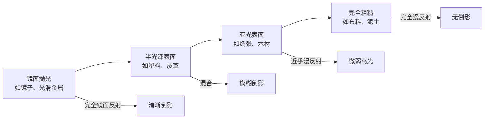

# 第05课：反射与透射

光线照射到物体表面后，会以何种方式被反射或透射，取决于材质本身的微观结构和光学特性。理解这些规律，是准确表现不同材质质感的关键。

## 学习目标

- 区分镜面反射与漫反射，并理解其物理成因
- 理解表面质感如何决定反射类型
- 掌握透射、折射与次表面散射的概念
- 了解金属与水面等特殊材质的光学特点
- 认识高光与光源颜色之间的关系

## 反射的两种基本类型

当光线遇到物体表面时，反射方式分为两种截然不同的类型。决定因素是表面的微观光滑程度，而非宏观形状。

| 特性 | 镜面反射 (Specular) | 漫反射 (Diffuse) |
|------|---------------------|------------------|
| 表面条件 | 微观光滑 | 微观粗糙 |
| 反射方向 | 单一方向，入射角=反射角 | 向所有方向均匀散射 |
| 视觉效果 | 清晰倒影，高光集中 | 无倒影，表面均匀明亮 |
| 典型材质 | 镜子、光滑金属、玻璃、水面 | 纸张、布料、泥土、墙面 |
| 色彩表现 | 反射光源色（高光呈白色） | 呈现物体固有色 |

> [!TIP] 一个关键观察
> 大多数真实物体同时包含两种反射。例如一个上了釉的陶瓷杯子：釉面产生镜面高光（反射光源色），而釉下的瓷体提供漫反射（呈现杯子的固有色）。两种反射叠加构成了我们看到的真实质感。

### 反射定律

对于光滑表面，反射遵循一个简单而精确的定律：

> **入射角等于反射角**，且入射光线、反射光线与法线在同一平面内。

$$
\theta_i = \theta_r
$$

这意味着，当你改变观察角度时，镜面反射的亮度会急剧变化——只有在精确的反射角度上才能看到明亮的高光。这也是为什么水面上的倒影会随视角变化而显现或消失。

## 表面质感与反射的关系

表面质感是决定反射类型的根本因素。关键在于表面不规则物的大小与光波长的关系：

- **光滑表面**：表面不规则物远小于光波长，光线被整齐反射，形成镜面效果
- **粗糙表面**：表面不规则物大于或等于光波长，光线向各个方向散射，形成漫反射

从微观到宏观，反射类型的变化是渐进的：

## 透射与半透明

### 透明材质

透明材质（如玻璃、清水）允许光线直接穿透。光线在穿越两种介质边界时会发生**折射**（Refraction）——光线改变传播方向。

> [!EXAMPLE] 折射与色散
> 当白光穿过玻璃棱镜时，不同波长的光折射角度不同：紫光折射最大，红光折射最小。这就是**色散**（Dispersion），它将白光分解为彩虹光谱。在绘画中，你可以在玻璃器皿的边缘或钻石的棱角处观察到这种色散效果。
>
> 折射的强度由**折射率**（Index of Refraction）决定：
> - 空气：1.00
> - 水：1.33
> - 玻璃：1.50
> - 钻石：2.42
>
> 折射率越高，光线弯曲越明显，这也是钻石如此闪耀的原因。

### 半透明材质与次表面散射

半透明材质（Translucent）介于透明与不透明之间。光线进入材质后，在内部发生多次散射，部分光线从进入点附近射出。这种现象称为**次表面散射**（Subsurface Scattering）。

> [!ABSTRACT] 次表面散射的经典案例
> 将手电筒贴近手掌照射，你会看到手指边缘发出红光。这是因为光线穿过皮肤，在内部组织中散射后从边缘透出。这是次表面散射最直观的演示。
>
> **常见半透明材质**：
>
> | 材质 | 散射特征 | 视觉表现 |
> |------|----------|----------|
> | 皮肤（尤其是耳垂、手指） | 暖色光线在边缘透出 | 边缘呈红色调 |
> | 蜡 | 光线均匀散射 | 柔和的光晕效果 |
> | 树叶 | 叶绿素吸收红光，透射绿光 | 逆光时叶片呈鲜绿色 |
> | 牛奶/玉石 | 高散射，低吸收 | 柔和、温润的质感 |
> | 大理石薄片 | 光线可穿透数毫米 | 边缘有光泽感 |

在绘画中表现半透明材质时，注意在**物体的边缘和薄处**增加透光的亮度，并让颜色偏向材质内部的色相。

## 金属与水面等特殊材质

不同材质与光的交互方式各有独特之处：

| 材质 | 反射特性 | 色彩特征 | 绘画要点 |
|------|----------|----------|----------|
| 抛光金属（银、铝） | 近乎完美的镜面反射 | 反射周围环境色，自身色弱 | 强调环境倒影，高光极亮 |
| 有色金属（金、铜） | 高反射率 + 选择性吸收 | 金色反射偏暖，银色偏冷 | 在反射中加入金属本色 |
| 锈蚀金属 | 漫反射为主 | 呈现氧化物的颜色（如铁锈的红褐色） | 用粗糙纹理表现质感 |
| 平静水面 | 接近镜面反射 | 倒影饱和度低于实物 | 垂直倒影，边缘模糊 |
| 波动水面 | 反射方向不断变化 | 倒影破碎，呈闪烁光斑 | 水平方向的拉长笔触 |
| 湿润表面 | 表面覆盖水膜，增加镜面反射 | 固有色变深，高光增强 | 在原有颜色上加高光 |

> [!TIP] 金属色彩的本质
> 金属的颜色来自其**电子对特定波长光的吸收与反射**：
> - 黄金强烈吸收蓝光，反射红、黄、绿光，因此呈现暖金色调
> - 白银对所有可见光的反射率都很高且均匀，因此呈现中性银白色
> - 铜对蓝绿光吸收较强，呈现红橙色
>
> 在画金属时，不要只用灰色加高光。金质物体即使在阴影中也带有暖色调，银质物体即使在亮部也带有冷色调。

### 水面反射的特殊性

水面反射受**观察角度**的显著影响：

- **视角低（接近水面）**：反射强烈，水面几乎像镜子
- **视角高（俯视）**：反射减弱，水底可见（在清水情况下）
- **菲涅耳效应**（Fresnel Effect）：视线与表面夹角越小，反射越强

在画水面时，倒影的亮度通常**低于**实物，且边缘更加模糊。可以用垂直方向的柔和笔触来表现倒影。

## 高光的含义

高光（Highlight）是光源在光滑表面上的直接反射。理解高光的性质，对表现材质至关重要：

> [!WARNING] 常见误区
> 很多初学者认为高光就是"白色"，因此一律用纯白点高光。实际上，高光的颜色取决于**光源的颜色**，而不是物体本身的颜色。
>
> - 在暖色灯光下，高光偏暖黄
> - 在阴天的天光下，高光偏冷白
> - 在夕阳下，高光呈现橙红色
>
> "高光是光源颜色的忠实反映"——这是理解高光的关键。

**高光的其他重要特征**：

1. **位置**——位于反射角方向上，即光源在物体表面的镜像位置
2. **形状**——反映光源的形状。条形光源产生条形高光，方形窗口产生方形高光
3. **边缘硬度**——表面越光滑，高光边缘越锐利；表面越粗糙，高光边缘越模糊
4. **亮度**——表面反射率越高，高光越亮。金属高光远亮于塑料高光

## 实践练习

### 练习一：观察生活中的反射

选取一个金属物体（如不锈钢杯或银器）和一个陶瓷物体，放在窗边：

1. 观察并记录两种材质上高光的位置、形状和边缘硬度
2. 注意倒影的清晰度差异
3. 用手遮挡窗户，观察高光的变化——确认高光确实反映光源形状

### 练习二：次表面散射观察

1. 用手电筒从不同角度照射自己的手掌，观察边缘透光的颜色变化
2. 找一片新鲜的树叶，对着光源观察其半透明效果
3. 用素描或速写记录观察结果

### 练习三（绘画练习）：画一个反光物体

选择一个玻璃杯或金属茶壶，放在单一光源（台灯）旁：

- 先用单色画出明暗关系
- 注意高光的位置和形状要精确
- 在玻璃杯的背光侧边缘添加透射光
- 如果画金属，注意环境倒影的形状扭曲

## 自测

> [!QUESTION] 自测题
> 1. 镜面反射与漫反射的根本区别是什么？是什么因素决定了反射类型？
> 2. 为什么金器看起来是金色的，而银器看起来是银色的？
> 3. 高光的颜色应该是什么颜色？它反映的是什么信息？
> 4. 什么是次表面散射？举出三个日常生活中的例子。
> 5. 想象你要画一杯水在木桌上，水面上的倒影与实物相比，亮度和清晰度有什么不同？

查看答案

1. **根本区别**：镜面反射沿单一方向反射（入射角=反射角），漫反射向所有方向均匀散射。决定因素是表面微观光滑程度：光滑表面产生镜面反射，粗糙表面产生漫反射。

2. **金属的颜色**来自对不同波长光的选择性反射。黄金强烈吸收蓝光，只反射红、黄、绿光，因此呈金色。白银对所有可见光的反射率均匀，因此呈中性银白色。

3. **高光的颜色**取决于**光源的颜色**，而不是物体的固有色。高光反映的是光源的色温和形状。在夕阳下画一个红色苹果，其高光应该是暖橙色而非红色。

4. **次表面散射**是光线进入半透明材质后在内部散射，从进入点附近射出的现象。三个例子：手电筒照手掌时边缘透出的红光、逆光树叶的鲜绿色、蜡烛的柔和光晕。

5. 水面倒影的亮度**低于**实物，边缘更**模糊**，饱和度也有所降低。倒影是垂直镜像，且受水面波动影响会变形。

## 继续学习

继续学习 [[0006-se-cai-yuan-li|第06课：色彩原理]]，学习色彩系统的三个基本维度以及它们之间的相互关系。