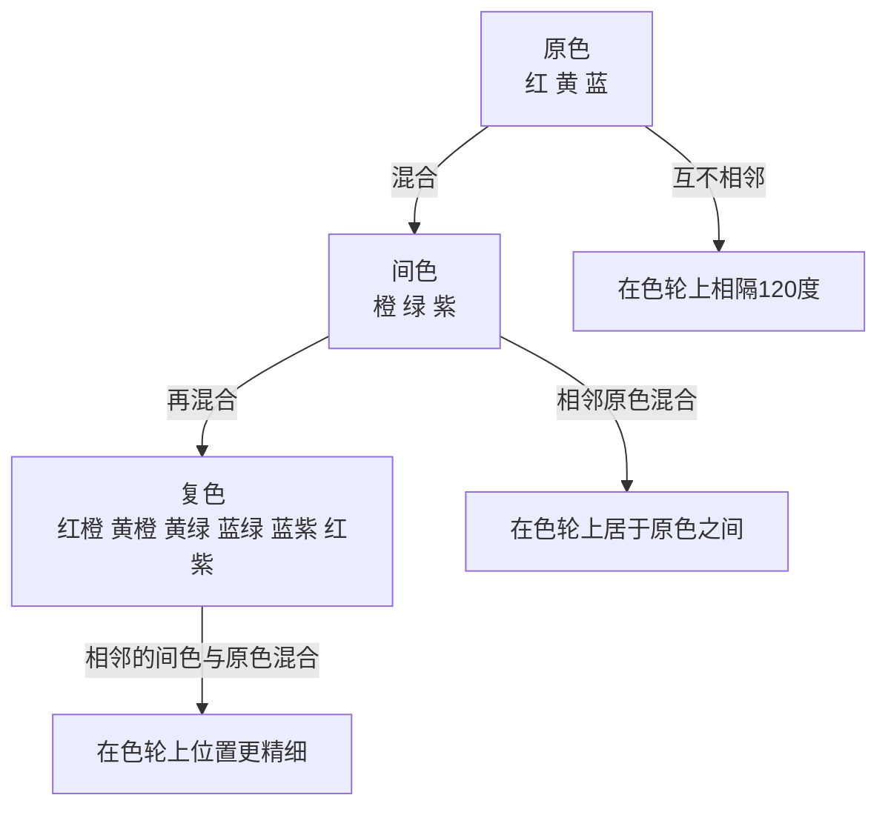

# 第06课：色彩原理

色彩是绘画中最具表现力的元素，也是最容易被误解的元素。理解色彩的内在逻辑，是每位画者的必修课。

## 学习目标

- 掌握色彩的三要素：色相、饱和度、明度
- 理解色轮结构与色彩关系
- 识别并运用互补色
- 区分冷暖色调及其空间效果
- 理解光源色与环境色对物体固有色的影响
- 认识同时对比与连续对比的视觉现象
- 明确明度在绘画中的优先地位

## 色彩的三要素

任何一种色彩都可以从三个独立的维度来描述。这三个维度构成了色彩的全部属性：

| 维度 | 英文 | 含义 | 类比 |
|------|------|------|------|
| **色相** | Hue | 色彩的名称，如红、蓝、黄 | 音乐的"音调" |
| **饱和度** | Saturation | 色彩的纯度或鲜艳程度 | 音乐的"音量" |
| **明度** | Value | 色彩的明暗程度，从白到黑的渐变 | 音乐的"响度" |

> [!TIP] 明度优先——最重要的原则
> 在所有色彩要素中，**明度是最重要的**。为什么？
>
> 1. **视觉系统优先处理明度**：人眼的视杆细胞（负责明暗感知）数量远超视锥细胞（负责色彩感知）
> 2. **结构由明度决定**：即使去掉所有色彩，黑白照片仍然可以清晰辨认物体的形状与空间关系
> 3. **色彩可以错，明度不能错**：只要明度关系正确，即使色相有偏差，画面仍然是"可读的"。反之，明度关系混乱，再漂亮的颜色也无法拯救画面
>
> **训练方法**：在正式开始色彩绘画前，先将参考图像转为黑白来观察明度关系。养成"先看明度，后看色彩"的习惯。

## 色轮与色彩关系

### 色轮结构

色轮（Color Wheel）将可见光谱中的色相首尾相连，形成一个环形结构。最常见的12色色轮包含三个层次的颜色：

### 主要色彩关系

| 关系类型 | 定义 | 示例 |
|----------|------|------|
| **同类色** | 色轮上相邻（30度内） | 红、红橙、橙 |
| **类似色** | 色轮上相邻（60度内） | 黄、黄绿、绿 |
| **对比色** | 色轮上间隔120度 | 红与蓝、黄与紫 |
| **互补色** | 色轮上正对（180度） | 红与绿、蓝与橙、黄与紫 |

## 互补色原理

互补色（Complementary Colors）是色轮上彼此正对的颜色。它们之间有一种独特的"相生相克"关系：

> [!EXAMPLE] 互补色的实际应用
> **1. 互补色互相增强**
> 将红色放在绿色旁边，红色会更红，绿色会更绿。这是因为互补色同时刺激了视网膜上不同的感受区，彼此"推高"了对方的饱和度。
>
> **2. 互补色降低饱和度**
> 将一种颜色与其互补色混合，可以得到中性灰或棕褐色。例如：
> - 红色 + 绿色 = 暖灰/棕
> - 蓝色 + 橙色 = 冷灰
> - 黄色 + 紫色 = 中性灰
>
> 这是调和色彩、降低饱和度的最自然方法——比单纯加白色或黑色更富有色彩感。
>
> **3. 画面构成**
> - 用一个颜色作为主色调，其互补色作为点缀
> - 阴影中往往含有主色调的补色成分
> - 夕阳场景：橙色天空中的蓝色阴影

**常见互补色对**：

| 互补对 | 暖/冷 | 常见应用 |
|--------|-------|----------|
| 红 <-> 绿 | 暖-冷 | 节日主题、花卉中的绿叶 |
| 橙 <-> 蓝 | 暖-冷 | 夕阳与天空、橙子与蓝布 |
| 黄 <-> 紫 | 暖-冷 | 阳光与阴影、向日葵与紫背景 |
| 黄绿 <-> 红紫 | 中-冷 | 自然风景中的微妙对比 |

## 色彩的冷暖

色彩的冷暖感不是物理属性，而是人类视觉的心理感受：

| 暖色 | 冷色 |
|------|------|
| 红、橙、黄 | 蓝、蓝绿、蓝紫 |
| 有前进感、扩张感 | 有后退感、收缩感 |
| 在画面中"跳出来" | 在画面中"退下去" |
| 常用于前景 | 常用于背景 |
| 象征温暖、能量、热情 | 象征冷静、距离、安宁 |

> [!WARNING] 冷与暖是相对的
> 一个颜色是"暖"还是"冷"，永远取决于它**相对于什么**来比较。
>
> - 柠檬黄相对于中黄是"冷黄"，但相对于蓝色仍然是暖色
> - 蓝紫色相对于天蓝色是"暖蓝"，但相对于橙色仍然是冷色
> - 任何颜色都可以偏暖或偏冷，这种微妙差异被称为"色温倾向"
>
> 在调色时，有意识地调整颜色的冷暖倾向（而不改变色相），是塑造体积感和空间感的强大技巧。譬如，在画一个红色苹果时，向光面用偏橙的暖红，背光面用偏紫的冷红——仅通过冷暖变化就已经表现出立体感。

### 冷暖的空间效应

暖色前进、冷色后退的原理在风景画中尤为重要：

- 远处山脉呈现蓝紫色（冷）
- 中景树木呈现绿色（中性偏冷）
- 近处花草呈现暖绿色或黄绿色（暖）

这种冷暖的递进关系，配合明度变化，共同塑造了画面的空间深度。

## 光源色与环境色

物体表面的颜色并非其"固有"的颜色，而是光源色、环境色与物体固有色的综合结果。

| 影响因素 | 定义 | 绘画表现 |
|----------|------|----------|
| **固有色** | 物体在白光下的颜色 | 作为基础色 |
| **光源色** | 照射光源的颜色 | 影响亮部的色相偏移 |
| **环境色** | 周围环境反射的光线 | 影响暗部和边缘的色相 |

> [!ABSTRACT] 三者的相互作用
> 在白天的户外场景中：
> - 一个**红色**的球体
> - 被**暖黄**的日光照射
> - 地面是**绿色**的草地
>
> 结果：
> - **亮部** = 红色（固有色）+ 暖黄（光源色）= 偏橙的红色
> - **暗部** = 红色（固有色）+ 蓝色（天光环境色）+ 绿色（草地反射）= 偏紫偏暗的红色
> - **靠近地面的边缘** = 红色 + 绿色（草地反射）= 偏棕的红色
>
> 可以看到，物体的颜色在不同区域发生了变化，但观察者并不会觉得球是五颜六色的——视觉系统会自动整合这些信息。画家的工作就是捕捉并强化这些微妙变化。

## 同时对比与连续对比

### 同时对比（Simultaneous Contrast）

当两种颜色相邻时，它们会互相影响对方的感知，这种效应叫同时对比：

> [!WARNING] 同时对比的"错觉"
> 将同一块灰色分别放在红色背景和蓝色背景上：
> - 红色背景上的灰色看起来偏绿（红色的补色倾向）
> - 蓝色背景上的灰色看起来偏橙（蓝色的补色倾向）
>
> 灰色本身没有变化，是你的视觉系统在自动调节！
>
> **对绘画的意义**：
> - 一个颜色的外观，一半取决于它本身，一半取决于它周围是什么
> - 如果你觉得某个颜色"不对劲"，先检查它的背景色，而不是着急调整这个颜色
> - 可以利用同时对比让有限的色彩产生更丰富的视觉效果

### 连续对比（Successive Contrast）

盯着一个颜色看一段时间（约30秒），然后迅速将视线移向白色表面，你会看到该颜色的**补色残像**。例如：

- 盯红色方块30秒，转向白纸 → 看到青色（红补色）残像
- 盯蓝色方块30秒，转向白纸 → 看到黄色（蓝补色）残像

连续对比证明视觉系统有"色彩平衡"的内置机制——当长期受到某颜色的刺激后，神经系统会产生补偿信号。

## 实践练习

### 练习一：制作自己的色轮

用三原色（红、黄、蓝）颜料或彩色铅笔，制作一个12色色轮：

1. 先画三个原色，间隔120度
2. 混合同色并填入相应位置
3. 再混合6个复色
4. 标注每一对的互补关系

### 练习二：同时对比实验

1. 在一张纸上画两个并列的方块，分别涂上红色和蓝色
2. 在两种颜色的背景上各画一个灰色小方块
3. 观察两个灰色方块的视觉差异
4. 换其他颜色组合重复实验

### 练习三：明度优先练习

1. 找一张彩色照片
2. 用手机或软件将其转为黑白
3. 分析图片的明度分布：最亮的部分在哪里？最暗的部分在哪里？有几个明度层次？
4. 只用黑白灰（不用彩色），先画一张明度素描
5. 再在这张明度素描的基础上，薄薄地叠加上色彩

## 自测

> [!QUESTION] 自测题
> 1. 色彩的三要素是哪三个？其中哪个在绘画中最为关键？为什么？
> 2. 什么是互补色？互补色相邻时会产生什么效果？混合时又会产生什么效果？
> 3. 解释"暖色前进，冷色后退"的原理。这一原则如何在风景画中应用？
> 4. 一个红色苹果放在蓝色桌布上，受暖色台灯照射。它的亮部、暗部和靠近桌布的底部分别会呈现什么颜色倾向？
> 5. 什么是同时对比？它为什么会给画家带来困扰？

查看答案

1. **色相**（颜色的名称）、**饱和度**（鲜艳程度）、**明度**（明暗程度）。**明度最关键**，因为人眼优先处理明暗信息，明度关系决定了画面的结构可读性。即使色彩出错，只要明度关系正确，画面仍然有效。

2. **互补色**是色轮上正对（180度）的颜色。相邻时互相增强，让对方看起来更鲜艳。混合时降低饱和度，产生中性灰或棕褐色。互补色混合是调出自然灰色的最佳方法。

3. 暖色（红、橙、黄）给人的心理感觉是前进的、靠近的，因此在画面中会"跳出来"；冷色（蓝、紫）给人的感觉是后退的、远离的。在风景画中，前景用暖色，中景用中性色，远景用冷色，可以自然地营造空间深度。

4. **亮部**：红色固有色 + 暖色光源 = 偏橙的亮红色。**暗部**：红色固有色 + 环境蓝色 = 偏紫的暗红色。**底部**：红色固有色 + 蓝色桌布反射的冷色 = 偏冷紫的红色。

5. **同时对比**是相邻颜色互相影响对方感知的现象——同一灰色在红色背景上显绿（补色倾向），在蓝色背景上显橙。它的困扰在于：你看到的颜色并不客观，而是被周围颜色"欺骗"了。如果某个颜色看起来不对劲，应先检查背景色而非直接调整该颜色。

## 继续学习

继续学习 [[0007-da-qi-tou-shi|第07课：大气透视]]，了解空气和大气如何改变远处物体的色彩与清晰度。