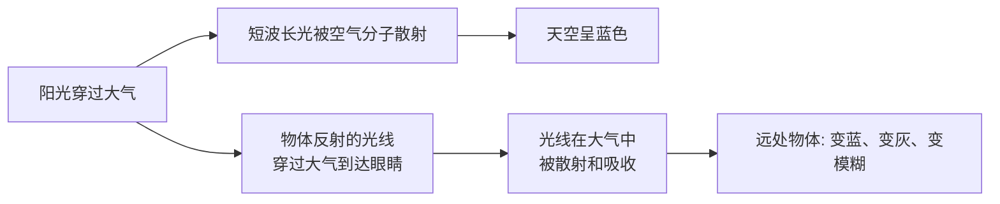
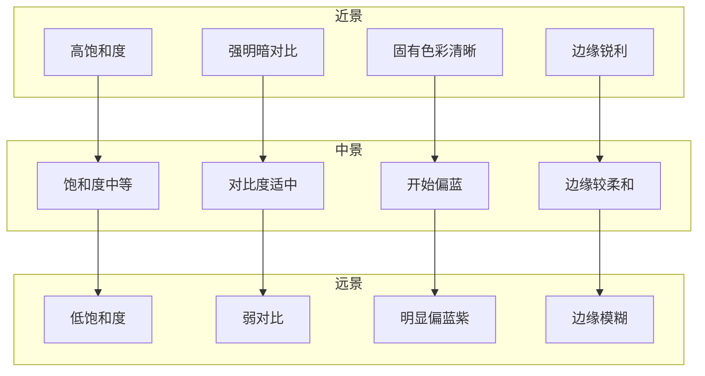

# 第07课：大气透视

当我们望向远方，景物不仅仅是"变小了"。远处的山峦颜色变淡，边缘模糊，细节消失，整体偏向蓝紫色。这不是景色本身的改变，而是我们与景物之间的那层"空气"在起作用。

## 学习目标

- 理解大气透视的物理成因
- 掌握大气透视对物体的五种作用
- 了解不同天气条件下大气透视的变化
- 学会在绘画中有意识地运用大气透视营造空间深度

## 什么是大气透视

大气透视（Atmospheric Perspective），又称空气透视或色彩透视，是指**空气本身对光线的作用导致远处物体视觉特征发生变化**的现象。

### 物理成因

大气透视的两个核心物理过程：

1. **瑞利散射**（Rayleigh Scattering）：空气中的微小粒子（主要是氮气和氧气分子）对短波长光（蓝、紫）的散射远强于长波长光（红、橙）。这既是天空呈现蓝色的原因，也是远处物体偏向蓝紫色的原因。

2. **气溶胶散射**：空气中的尘埃、水汽等较大颗粒对所有波长的光均匀散射，导致远处物体整体变灰、饱和度降低。

> [!TIP] 不是所有的"模糊"都是大气透视
> 大气透视是通过**空气与光线的作用**产生的色彩和明度变化。它与焦点模糊（景深）不同——大气透视影响整个远景区，而景深模糊只影响不在焦点平面上的物体。在户外写生时，近处和远处的树同时清晰，但远处的树颜色更灰、更蓝，这就是大气透视的作用。

## 大气透视的五个变化

对比同一景物从近到远的变化，大气透视在五个维度上产生系统性变化：

| 维度 | 近处物体 | 远处物体 | 原因 |
|------|----------|----------|------|
| **饱和度** | 色彩饱和鲜明 | 饱和度降低，变灰 | 空气中的微粒散射冲淡了色彩 |
| **明度** | 明暗对比强烈 | 暗部变亮，整体趋于中间明度 | 空气层本身散射的光叠加在暗部上 |
| **色相** | 保持固有色彩 | 偏向蓝紫色 | 瑞利散射使蓝光更多地进入视线 |
| **边缘** | 边缘清晰锐利 | 边缘模糊柔和 | 散射导致光线发散，消除了锐利边界 |
| **明暗对比** | 亮部与暗部差异大 | 对比度降低，趋于扁平 | 空气散射光补充了暗部 |

## 不同天气下的表现

空气中的水汽和颗粒物含量不同，大气透视的强度差异巨大：

| 天气条件 | 空气透明度 | 大气透视强度 | 典型观察距离 | 绘画表现 |
|----------|-----------|-------------|-------------|----------|
| **晴朗干燥** | 极高 | 弱 | 几十公里外才明显 | 远处物体偏蓝紫，饱和度轻度降低 |
| **晴朗湿润** | 中等 | 中 | 几公里外套明显 | 蓝紫色调增强，对比度明显降低 |
| **薄雾/轻雾** | 低 | 强 | 几百米外即有明显变化 | 强烈偏蓝白，细节几乎消失 |
| **大雾** | 极低 | 极强 | 几十米内即不可见 | 色彩几乎消失，只剩明度递变 |
| **雨后** | 极高 | 弱 | 最远可见距离大增 | 远处色彩清晰，是画远景的好时机 |
| **污染/霾** | 低（散射） | 强 | 几公里 | 偏灰褐色而非蓝色（颗粒较大） |

> [!WARNING] 霾与雾的颜色不同
> 在工业污染或沙尘天气中，大气中的颗粒较大，对光线的散射是**波长无关**的。因此远处的景物不是偏蓝紫，而是偏灰褐。在绘制城市远景时，如果城市有空气污染，远景的"大气层"颜色应是灰色或黄褐色，而非风景画中常见的蓝紫色。
>
> 在绘画中：检查你所要表现的环境，听凭"蓝紫远景"的惯性——干净的乡村空气产生蓝紫远景，污染的都市空气产生灰褐远景。

## 如何在绘画中运用

### 分层法

将画面分为**前景、中景、远景**三个层次，每个层次都按照大气透视的规律处理：

> [!EXAMPLE] 三层景的处理示范
> **前景**（最近）
> - 使用最饱和的色彩
> - 明暗对比最强
> - 细节丰富（树叶纹理、岩石裂纹）
> - 边缘清晰锐利
> - 使用暖色调（暖绿、黄褐）
>
> **中景**（中间距离）
> - 饱和度降低约30-40%
> - 明暗对比减弱
> - 细节减少（只保留大的形状）
> - 边缘稍微柔和
> - 色相开始偏冷（蓝绿）
>
> **远景**（最远）
> - 饱和度很低，接近灰色
> - 明暗对比很弱
> - 细节几乎消失（只有剪影形状）
> - 边缘模糊
> - 明显偏蓝紫色
>
> 这样的三层处理，即使画面内容简单，也能产生强烈的纵深感。

### 进阶技巧

| 技巧 | 操作方法 | 效果 |
|------|----------|------|
| **递减法** | 从前景到远景逐层降低颜料纯度 | 产生平滑的空间过渡 |
| **加蓝法** | 在远景颜色中加入蓝紫色 | 模拟大气散射效果 |
| **加白法** | 远景颜色中加入白色提高明度 | 模拟空气层覆盖效果 |
| **干扫法** | 用干笔扫过远景的边缘 | 产生模糊的边缘效果 |
| **叠加法** | 在已干的远景上薄涂一层蓝灰半透明色 | 增强空气感 |
| **前置暖色** | 在前景物体上强化暖色调 | 增强暖进冷退的空间感 |

> [!TIP] 使用大气透视的时机
> 大气透视并非在所有绘画中都需要同样强调：
> - **风景画**：核心技法，必须掌握
> - **城市街景**：中等重要，注意空气污染的颜色
> - **肖像画**：在背景与人物之间微弱的空气感可以增加真实度
> - **静物画**：通常不需要强的大气透视，但前景与背景间轻微的色温差有助于空间感
> - **室内场景**：几乎不需要大气透视，但远处墙角的轻微模糊可以增加空间感

## 实践练习

### 练习一：观察与记录

找一个有开阔视野的地点（山顶、高层窗口、开阔田野）：

1. 观察从近到远至少三个层次的景物
2. 用文字记录每一层的色彩、明度、边缘清晰度
3. 用手指或画笔比划，比较远处物体与近处同色物体的色差
4. 如果有相机，拍一张照片然后转为黑白——观察明度层次的变化

### 练习二：三层风景速写

准备三种蓝色（群青、钴蓝、天蓝）、白色和一种暖色（赭石或土黄）：

1. 在画纸上划分三个水平区域（上=远景、中=中景、下=前景）
2. 远景：大量白色+少量群青，薄涂
3. 中景：天蓝+少量白+少量暖色，中厚度
4. 前景：赭石+土黄+少量暖绿，厚涂，细节丰富
5. 在前景添加一个深色轮廓的物体（树或石头），与远景形成明度对比

### 练习三：从照片中学习

找三张不同天气条件下的风景照片：

1. 晴朗天气
2. 有薄雾的天气
3. 雨后空气清新的天气

用文字分析每张照片中大气透视的表现强度，比较三者之间的差异。

## 自测

> [!QUESTION] 自测题
> 1. 大气透视是怎么产生的？瑞利散射在其中的作用是什么？
> 2. 远处物体的五个维度的变化分别是什么？
> 3. 为什么阴天或雾天的远处物体不一定偏蓝紫？
> 4. 如果一幅风景画没有空间感，最有可能的原因是缺少什么？
> 5. 想象你在画一幅山景：近处有绿色的树，中间有蓝色的湖，远方有紫色的山。分别描述三个层次应该如何用色和用笔？

查看答案

1. **大气透视**由光线穿过空气时被散射和吸收导致。瑞利散射使短波长光（蓝、紫）被优先散射，因此从远处物体反射来的光线中蓝紫成分增加，同时空气本身散射的蓝光叠加在暗部上，使暗部变亮。

2. 五个维度变化：**饱和度**降低（变灰）、**暗部明度**提升（变亮）、**色相**偏蓝紫、**边缘**变模糊、**明暗对比**减弱。

3. 雾天/阴天空气中水汽含量高，水分子比空气分子大得多，对所有波长的光均匀散射（米氏散射主导），因此远处物体整体偏白/灰而非蓝紫。污染天气中的大颗粒也使散射呈中性色。

4. **最可能的原因是缺少明度层次**——三个层次（前、中、远景）的明度没有拉开。远景暗部不够亮，前、中、远景的对比度没有递减。第二个可能的原因是缺少冷暖对比——前景不够暖，远景不够冷。

5. **近处绿树**：使用高饱和度的暖绿色，强明暗对比，树干纹理清晰，边缘锐利。**中间湖水**：饱和度中等，蓝色中带有少量绿（湖水本身的颜色），与天空的倒影区分，明度较亮。**远景紫山**：大量白色混合少量群青和深红，饱和度很低，边缘模糊，整体比中景亮，细节消失只剩下轮廓。

## 继续学习

继续学习 [[0008-ri-guang-yu-tian-guang|第08课：日光与天光]]，了解自然光在不同时间、不同天气下的色彩变化规律。