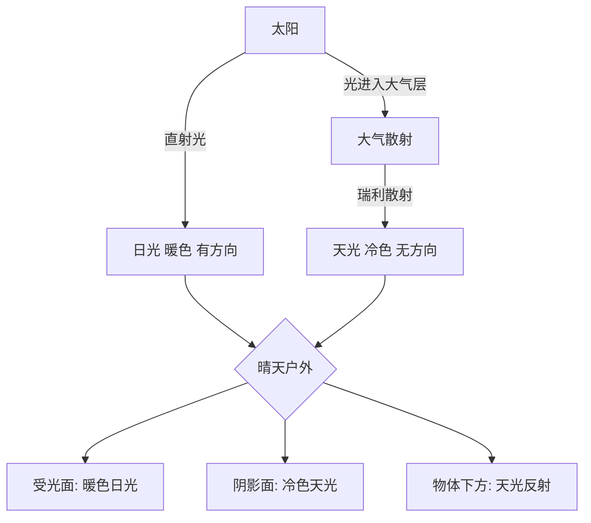
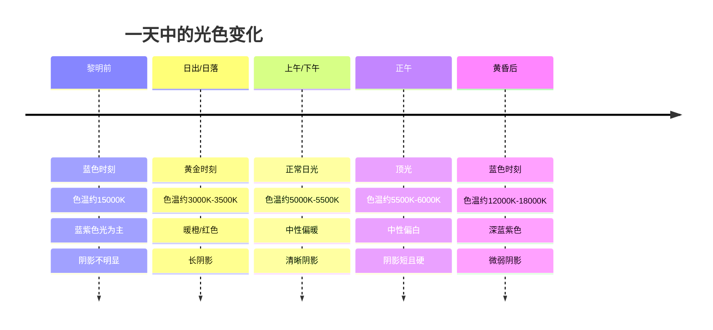

# 第08课：日光与天光

户外光线并非来自单一光源。它是由太阳的直射光（日光）和整个天空穹顶的散射光（天光）共同组成的复杂系统。理解这对"双光源"的特性，是掌握户外色彩与阴影的关键。

## 学习目标

- 区分日光与天光的本质差异
- 掌握一天中光色变化的时间规律
- 理解并运用"暖光冷影"原则
- 认识黄金时刻、蓝色时刻和月光的特点
- 了解不同天气条件下的光线特征
- 学会在不同光照条件下进行写生

## 日光与天光的本质区别

户外的"光源"实际上由两个性质完全不同的光源叠加而成：

| 特性 | 日光 (Sunlight) | 天光 (Skylight) |
|------|-----------------|-----------------|
| **来源** | 太阳直射 | 大气散射的太阳光 |
| **色温** | 暖色（约5500K正午，更低在早晚） | 冷色（约10000K-20000K） |
| **方向性** | 有明确方向，产生清晰阴影 | 来自整个天空穹顶，无明显方向 |
| **强度** | 强（占据户外总照度的约85%） | 弱（约15%），但阴天时成为主光源 |
| **阴影效果** | 产生硬阴影，边缘清晰 | 填充阴影，使其柔和 |
| **颜色** | 偏黄/橙/红（取决于时间） | 偏蓝/蓝紫 |

## 一天中光色的变化轨迹

太阳在地平线上的位置决定了光线穿越大气的路径长度，从而影响光色。这是一天中光色的典型变化轨迹：

> [!TIP] 色温与色彩对应关系
> 色温（Kelvin, K）在这里用于描述光的颜色倾向，而非实际温度：
> - **3000K**: 暖橙色（日出/日落）——类似白炽灯
> - **4000K**: 暖白（清晨/傍晚）——类似暖色荧光灯
> - **5500K**: 中性白（正午日光）——标准日光
> - **7000K**: 冷白（阴天阴影）——类似阴天色温
> - **10000K+**: 蓝紫（天光/蓝色时刻）——极冷
>
> 色温数值越低越暖，数值越高越冷——这与日常直觉相反，请注意。

### 各时段详解

**黎明前/黄昏后**
- 太阳在地平线以下，无直射日光
- 唯一的光源是天空的散射光（天光）
- 色彩偏蓝紫色，饱和度低
- 明暗对比弱，阴影几乎是不可见的
- 适合表现宁静、神秘、清冷的氛围

**日出/日落（黄金时刻）**
- 太阳位于地平线附近，光线穿过最厚的空气层
- 短波长光被大量散射，只有长波长光（红、橙）到达地面
- 色温约3000K-3500K
- 阴影极长，反差相对较低（因为天光也参与照明）
- 适合表现温暖、浪漫、戏剧性的氛围

**上午/下午**
- 太阳在天空15-60度的位置
- 光线偏暖但接近中性（约5000K-5500K）
- 阴影清晰，明暗对比适中
- 色彩还原最自然，是户外写生的标准光照条件

**正午**
- 太阳在头顶附近
- 光线很白（约5500K-6000K），短阴影缩在物体下方
- 明暗对比极强，阴影很深
- 因为阴影较短且角度指向地面，容易产生"平"的画面效果
- 通常被认为是最不讨喜的写生时间

## "暖光冷影"原则

"暖光冷影"是户外光线下最核心的规律——当太阳直射光偏暖时，其阴影必定偏冷，因为阴影区主要由冷色的天光照明。

> [!EXAMPLE] "暖光冷影"在不同时间的具体表现
> **黄昏（暖光最强）**
> - 日光：深橙红色
> - 阴影：深蓝紫色
> - 对比最极端，色彩最丰富
>
> **下午**
> - 日光：暖黄色
> - 阴影：蓝紫色
> - 对比明显，但不如黄昏极端
>
> **正午**
> - 日光：中性偏白
> - 阴影：偏蓝，但不明显
> - 对比最弱，"暖光冷影"效果最不明显
>
> **阴天（只有天光）**
> - 日光：无
> - 阴影：几乎不存在（天光来自全向）
>
> 可以看到，"暖光冷影"的强度与太阳高度角的余弦相关——太阳越低，效果越强烈。

> [!WARNING] "暖光冷影"不是绝对真理
> "暖光冷影"是一个有用的经验法则，但并非在所有情况下成立：
> 1. **阴天**：只有散射的天光，没有直射日光，阴影很弱且偏冷
> 2. **室内人工光源**：室内光源通常是暖色的白炽灯或冷色的荧光灯，阴影是光源的补色（暖光灯产生冷影，冷光灯产生暖影）
> 3. **环境反射强烈**：如果一个红色砖墙建筑附近有阴影，阴影中会混入红墙反射的暖色
>
> 正确的思路是：评估**所有**进入阴影区的光线来源，而不是机械地套用"阴影就是冷色"。

## 特殊时刻：黄金时刻与蓝色时刻

### 黄金时刻

黄金时刻指日出后和日落前约1小时的时间段，是摄影师和画家最钟爱的创作时间：

| 特点 | 具体表现 |
|------|----------|
| **光色** | 暖橙到红色，色温3000K-3500K |
| **阴影** | 极长且偏蓝紫色，反差柔和 |
| **饱和度** | 整体色彩饱和度升高 |
| **大气透视** | 远处的景物呈现粉紫色层次 |
| **纹理** | 低角度光线强化物体表面纹理 |
| **持续时间** | 约30-60分钟 |

### 蓝色时刻

蓝色时刻指日出前约20-40分钟和日落后的同样时间段：

| 特点 | 具体表现 |
|------|----------|
| **光色** | 深蓝到蓝紫色，色温12000K-18000K |
| **阴影** | 微弱至几乎不可见 |
| **饱和度** | 整体色调统一但较暗 |
| **对比度** | 很低，画面柔和 |
| **氛围** | 宁静、冷清、神秘 |
| **持续时间** | 约20-30分钟 |

> [!TIP] 黄金时刻与蓝色时刻的衔接
> 日落过程，光线会经历从暖到冷的完整循环：
>
> 暖金色 -> 橙红 -> 深红 -> 紫色 -> 深蓝（蓝色时刻）-> 渐暗
>
> 在这一过程中，每几分钟甚至几十秒光色都在变化。如果写生时犹豫不决，很可能画到一半光源已经完全变了。应对策略：
>
> **快速起稿法**：
> 1. 用几分钟快速铺出大的明暗关系
> 2. 只调准3-4个核心颜色（天空、亮部、阴影、中间调）
> 3. 不要过早陷入细节
> 4. 用照片辅助，但以目击感受为主

## 不同天气的光线

| 天气 | 光源特征 | 阴影 | 色彩表现 | 绘画建议 |
|------|----------|------|----------|----------|
| **晴朗无云** | 暖日光+冷天光，双光源显著 | 锐利、硬边、蓝色 | 饱和度高，冷暖对比强烈 | 强调阴影的蓝紫色 |
| **薄云/部分多云** | 日光被云层柔化，天光增强 | 柔和、半硬边 | 饱和度略降，对比度适中 | 阴影边缘模糊化处理 |
| **阴天（厚云）** | 只有天光散射，无方向性 | 极弱或无阴影 | 饱和度低，偏冷灰 | 注重明度层次而非色彩对比 |
| **轻雾/薄雾** | 光线均匀散射，方向感弱 | 几乎不可见 | 饱和度很低，整体偏冷白 | 用近实远虚表现空间 |
| **雨后** | 空气通透，光线清澈 | 清晰但柔和 | 饱和度恢复，色彩鲜艳 | 利用空气中短暂的通透感 |

## 月光的特点

月光本质上就是反射的太阳光，但由于亮度仅为日光的约40万分之一，色彩感知与日光完全不同：

| 特点 | 说明 |
|------|------|
| **亮度** | 极低，人眼转为视杆细胞主导（暗视觉） |
| **色彩感知** | 色彩视觉（视锥细胞）几乎失效，看到的是单色调的蓝灰世界 |
| **色温** | 约4100K（月光本身），但人眼感知为冷色 |
| **明暗对比** | 极高——暗部极暗，几乎看不见细节 |
| **阴影** | 明显但比日光阴影更模糊 |
| **天光** | 月光下的"天光"来自星空和大气辉光，极其微弱 |

> [!WARNING] 月光场景的常见错误
> 许多初学者画月夜场景时犯两个错误：
>
> 1. **画得太亮**——月夜的照度很低，如果你能在画中清楚地看见草叶纹理、人物表情或远处的细节，那说明画的是"像夜晚的白天"而非真正的夜晚
> 2. **色彩过于丰富**——在月光下，人的色觉能力大打折扣。真实的月夜看起来几乎是单色调的蓝灰，而不是五颜六色的
>
> **真实有效的月夜绘画策略**：
> - 使用非常有限的色彩（群青+白+少量黑）
> - 保留大面积的深暗区域
> - 高光（月光照亮的部分）亮度远远高于其他部分
> - 细节只在高光区保留，暗部全部虚化

## 实践练习

### 练习一：同一景物的三次写生

选择一个视野开阔的固定场景（如窗外景色、阳台或花园）：

在**三个不同时间**各画一幅30分钟的快速色彩速写：

1. **上午9-10点**——正常日光条件
2. **日落前30分钟**（黄金时刻）——暖光条件
3. **日落后20分钟**（蓝色时刻）——冷光条件

要求：
- 每幅画使用相同的构图（固定位置）
- 记录每幅画的开始和结束时间
- 注意阴影方向、颜色和边缘在三个时间的区别
- 注意整体色调的冷暖差异

### 练习二：阴影颜色分析

在晴朗天气的下午：

1. 找一片白色或浅灰色的地面（水泥地、浅色木板等）
2. 在直射阳光下放置一个白色纸板
3. 在纸板上观察阴影的颜色——它并不是灰色的
4. 调色尝试匹配阴影的颜色
5. 用手遮挡直射阳光，只让天光照射——观察阴影区域的颜色变化

### 练习三：月光调色实验

1. 只用群青（或酞菁蓝）、白色和少量的黑色
2. 尝试调出月光场景的几种基本色调：
   - 月光直接照亮的区域
   - 未照亮但受天光影响的区域
   - 完全黑暗的区域
3. 加入第二颜色（如赭石或深红），观察加入多少就会破坏月夜的冷色调

## 自测

> [!QUESTION] 自测题
> 1. 日光与天光在色温、方向和功能上有什么本质区别？
> 2. 为什么"暖光冷影"在大多数晴朗天气下成立？请从物理角度解释。
> 3. 黄金时刻（日出/日落）的光线有什么独特特征？为什么它被认为是绘画的最好时间？
> 4. 正午的光线为什么往往被认为不够"好看"？
> 5. 月光场景的绘画与日光场景最大的不同是什么？

查看答案

1. **日光**：来自太阳直射，色温偏暖（正午约5500K，早晚更低），有明确方向性，产生硬阴影，强度大。**天光**：来自大气对太阳光的散射，色温极冷（10000K+），来自整个天空穹顶没有固定方向，强度小，填充和柔化阴影。

2. 当太阳光穿过大气层时，短波长光（蓝、紫）被大量散射，到达地面的主要是长波长光（暖色）。这些被散射的蓝光弥散在整个天空，形成天光。物体的阴影区域不受直射日光照射，只能被天光照明，因此呈现蓝色调。简单说：日光=直射暖色，阴影=散射冷色。

3. **黄金时刻特征**：极暖的光色（3000K-3500K）、极长的阴影、柔和的反差、暖光与冷阴影的强烈对比使色彩特别丰富。低角度的光线还强化了物体的表面纹理。它是绘画的好时间因为：色彩饱和度高、冷暖对比丰富、阴影长且形状优美、整体氛围感强。

4. **正午光线不理想的原因**：太阳在头顶，光线垂直向下，阴影很短且缩在物体下方，难以表现立体感。强烈的顶光会产生"熊猫眼"效果（鼻子下方有太深的阴影，眼眶深陷）。同时明暗对比极强，暗部细节完全丢失。色彩相对中性偏白，缺乏早晨和傍晚的丰富色彩。

5. **最大的不同**：月光下亮度极低，人眼转入暗视觉（视杆细胞主导），色彩感知能力严重下降。因此月夜场景看起来几乎是单色的蓝灰。而日光下明暗足够，色彩非常丰富。在绘画中，月夜需要：极有限的色调范围（偏蓝灰）、大面积深暗区域、极强的高光对比、暗部细节全部虚化。

## 继续学习

继续学习 [[0009-guang-xian-she-ji|第09课：光线设计]]，学习如何从被动观察转向主动设计，在画面中创造理想的光线效果。