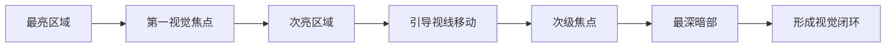

# 第09课：光线设计

## 学习目标

- 理解单光源与多光源的选择依据
- 掌握不同光照方向对形体与情绪的影响
- 学会区分主光与辅光的作用
- 能够利用光线引导观者视线和塑造三维体积
- 掌握高光与边缘光的表现方法

## 光源的数量与选择

在绘画创作中，光源的数量是一个关键的设计决策。单光源与多光源各有其独特的视觉效果和适用场景。

| 特性 | 单光源 | 多光源 |
|------|--------|--------|
| 体积感 | 强烈，明暗过渡清晰 | 较柔和，形体边缘软化 |
| 阴影 | 投影清晰锐利 | 多组阴影可能互相抵消或混杂 |
| 戏剧性 | 高——强烈的明暗对比 | 低——画面更加均匀明亮 |
| 氛围感 | 集中、有张力 | 分散、更自然 |
| 色彩复杂度 | 简单，光源色统一 | 复杂，不同光源色可能互相影响 |
| 适用场景 | 夜景、烛光、窗口光、戏剧性肖像 | 阴天、室内多窗、柔光环境 |

> [!TIP] 实用建议
> 初学者应从单光源练习开始。单一光源让明暗关系清晰可辨，更容易理解体积与光影的对应关系。熟练掌握单光源后再引入第二光源，感受色彩与阴影的变化。

## 光照方向与效果

光源的方向决定了物体的受光面和背光面的位置，直接影响形体的呈现方式和情绪基调。

| 光照方向 | 体积感 | 纹理表现 | 情绪效果 | 典型应用 |
|----------|--------|----------|----------|----------|
| 正面光 | 弱——缺少明暗过渡 | 弱——纹理被光淹没 | 平坦、直白 | 证件照、资料插图 |
| 侧光 | 强——明暗分界清晰 | 最强——纹理被阴影放大 | 戏剧、有力 | 肖像画、静物写生 |
| 逆光 | 剪影效果 | 消失——细节在暗部 | 氛围、神秘 | 日落、窗边、黄昏场景 |
| 顶光 | 中——上下明暗渐变 | 中——水平面受光 | 自然、真实 | 正午户外、舞台 |
| 底光 | 反自然——上暗下亮 | 弱 | 恐怖、诡异 | 恐怖片、戏剧效果 |

### 侧光

侧光是表现体积和纹理最有效的方向。当光线从侧面照射物体时，受光面、明暗交界线、背光面和投影依次排列，形成完整的明暗序列。这种序列直接传达了物体的三维信息。

对于表现粗糙纹理（如树皮、石头、织物），侧光几乎不可或缺。纹理的每一个凸起都会产生自己的小投影，这些微小阴影叠加在一起，构成了纹理的视觉质感。

### 背光/逆光（Backlight）

**背光**（即**逆光**）将物体转化为**剪影**，细节被吞没在暗部之中，而物体的轮廓被边缘光照亮。这种效果适合**营造氛围**、简化画面、强调形状而非细节。背光是最有力的氛围创造工具之一。

逆光的两个关键观察要点：

1. 物体边缘的透光感——树叶、花瓣、头发等半透明材质在逆光下会透出光芒
2. 空气中的光晕——逆光穿过空气中的微粒（灰尘、雾气）形成的光柱效果

### 顶光与底光的情绪对比

顶光是最自然的照明方向——太阳、天空、室内灯光都来自上方。观者对顶光有天生的适应感，因此顶光场景显得正常、自然、可信。

底光则完全反直觉：光源位于物体下方。这种照明方式扭曲了我们对光影的固有认知，因此自然产生不安感。底光会使眼窝和鼻翼下方被照亮，而额头和颧骨陷入阴影——恰好与正常光照相反。

> [!WARNING] 光源一致性的陷阱
> 画面中出现多个光源时，要确保每个物体的阴影方向和长度保持一致。常见错误是不同物体的阴影方向互相矛盾，暴露出画家对光源位置的不确定。如果有两个光源，每个物体应当有两组投影，且方向各自一致。

## 光线的主次关系

### 主光

主光是画面中最主要的光源，决定了整体的明暗格局和情绪基调。主光的位置、强度、色温是照明设计的起点。

主光的选择策略：

- **高主光**（从上方45度左右照射）：模拟自然光，最安全、最通用
- **侧主光**（从侧面90度照射）：突出纹理和体积，适合表现质感
- **前侧主光**（从侧面45度照射）：在体积感和可见度之间取得平衡，伦勃朗光的典型位置

### 辅光

辅光用于补充主光无法照亮的暗部区域，揭示暗部细节，同时保持暗部的透明感。辅光的强度应当明显弱于主光。

辅光的关键原则：

- 辅光强度通常为主光的1/4到1/8
- 辅光的色温通常与主光相反：如果主光是暖光，辅光偏冷，反之亦然
- 辅光不应当制造独立的阴影系统，它的作用是减弱而非消除阴影

> [!TIP] 辅光的色温选择
> 自然环境中，主光（太阳）是暖色时，辅光（天空的漫反射光）是冷色。这种"暖光冷影"的搭配在写实绘画中几乎总是安全有效的。

## 用光线引导视线和塑造体积

### 视觉引导

光线是最强有力的视觉引导工具。人眼天生被光亮区域吸引——画面中最亮的部分会首先被注意到。

用光线引导视线的技巧：

1. **亮度层次**：保持焦点区域最亮，其他区域依次减暗
2. **明暗对比**：焦点区域的明暗对比最强，非焦点区域的对比减弱
3. **光晕效果**：在焦点周围使用柔和的渐变光晕，形成视觉聚拢
4. **光线路径**：让光线以明确的路径穿过画面，引导视线沿路径移动

### 塑造三维体积

光线是塑造体积的核心工具。理解光如何描述三维形体，是写实绘画的基础。

一个被光照亮的球体从亮到暗依次包含：

1. **高光**——直接反射光源的亮点
2. **亮面**——直接受光的区域
3. **半亮面**——逐渐转向背光的过渡区
4. **明暗交界线**——光线与形体的切线区域，通常是最暗的固有阴影
5. **暗面**——背光区域
6. **反光**——来自周围环境的反射光，使暗部产生微弱亮度
7. **投影**——物体遮挡光线后投射到其他表面的阴影

> [!TIP] 明暗交界线的关键作用
> 明暗交界线是体积感的核心。它在球体上是一条渐变的带而非一条线。明暗交界线的位置告诉观者光源方向，它的软硬程度反映了物体表面的光滑度——越光滑，交界线越锐利；越粗糙，交界线越柔和。

## 高光与边缘光

### 高光

高光是光源在物体表面直接反射的镜像。高光的特征告诉我们大量关于表面材质的信息。

| 表面类型 | 高光形状 | 高光边缘 | 高光亮度 | 示例 |
|----------|----------|----------|----------|------|
| 光滑（如玻璃、釉面） | 清晰、规则 | 硬边 | 极高 | 陶瓷杯、车窗 |
| 半光滑（如苹果、皮肤） | 较模糊 | 柔边 | 高 | 水果、面部 |
| 粗糙（如布料、纸张） | 分散、无明确形状 | 极柔 | 低至无 | 棉布、墙面 |
| 金属 | 拉长、变形 | 取决于表面处理 | 极高 | 银器、不锈钢 |
| 液体（水面） | 不规则、受波动影响 | 变化 | 高 | 水面的反光 |

高光的位置也包含了重要信息：

- 高光的位置指示了光源的相对位置
- 凸面物体的高光位于朝向光源的最凸点
- 凹面物体的高光可能产生在边缘而非中心
- 多个高光（如从左到右的高光序列）意味着多个光源或光滑曲面上的连续反射

### 边缘光

边缘光（Rim Light）是当光线从物体背后或侧面后方照射时，在物体轮廓边缘形成的亮带。它是最有效的分离前景与背景的手段之一。

边缘光的作用：

1. **分离主体与背景**——在主体与背景色调接近时，边缘光清晰地界定轮廓
2. **增强立体感**——边缘光强调了物体的轮廓起伏
3. **丰富色彩**——在暗部边缘添加了光源色的点缀
4. **营造氛围**——逆光场景的氛围感很大程度上依赖边缘光

边缘光表现的要点：

- 边缘光的宽度与光源大小和物体曲率有关
- 光滑边缘（如金属球）的边缘光窄而亮
- 粗糙边缘（如毛绒玩具）的边缘光扩散而柔和
- 边缘光在物体轮廓最接近光源的位置最亮

> [!EXAMPLE] 边缘光的经典应用
> 想象一个人站在日落时分的窗户前：整个人身体是暗色的剪影，但头发和肩膀的边缘被落日的暖光照亮，形成一圈金黄色的轮廓。这一圈光让人物从暗色的室内背景中清晰地分离出来——这就是边缘光的力量。

## 实践练习

### 练习：单光源静物写生

设置一组简单的静物（如一个苹果、一个杯子和一块布），使用一盏台灯从单一方向照明。

**步骤：**

1. **摆放物体**：选择2-3个不同材质和形状的物体，避免透明物体
2. **设置光源**：仅使用一盏台灯，从左侧或右侧45度上方照射
3. **观察并绘制**：
   - 确定主光的照射方向和角度
   - 标记出高光的位置和形状
   - 找出明暗交界线的位置
   - 观察投影的形状和边缘软硬
   - 注意暗部的反光区域
4. **改变光源方向**：保持静物不动，将光源分别移到正面、侧面、正上方、背面，各画一幅速写
5. **对比差异**：比较五张速写，体会不同光照方向对体积感和情绪的影响

**进阶挑战**：在保持主光不变的情况下，增加一张白纸作为反光板（辅光），观察暗部细节的变化。

## 自测

> [!QUESTION] 自测题
> 1. 为什么侧光最适合表现物体表面的纹理？
> 2. 逆光条件下，边缘光在什么位置最亮？
> 3. 为什么底光会产生恐怖或不安的情绪？
> 4. 主光和辅光的强度比例通常是多少？辅光的色温应如何选择？
> 5. 一个光滑金属球的高光和一个苹果的高光有什么不同？

查看答案

1. 侧光下，纹理的每一个微小凸起都会产生自己的投影，这些微投影叠加形成了纹理的视觉质感。正面光会冲淡这些投影，逆光则把它们隐藏的暗部中。

2. 边缘光在物体轮廓最接近光源的位置最亮。如果光源在物体左后方，那么物体的左侧轮廓边缘最亮。

3. 底光违背了人类对自然光照的固有认知（光从上方来）。它使眼窝和鼻翼下方被照亮而额头陷入阴影，这与我们日常见到的面部光照完全相反，因此产生不安感。

4. 辅光的强度通常为主光的1/4到1/8。辅光的色温通常与主光相反——主光为暖色时辅光偏冷，这符合自然环境中太阳（暖）与天空光（冷）的关系。

5. 光滑金属球的高光形状清晰、边缘锐利、亮度极高，可能因为周围环境而在高光中出现变形反射。苹果的高光边缘柔和、形状较模糊、亮度较低，这是因为苹果表面的蜡质层是半光滑而非完全光滑的。

## 继续学习

完成本课练习后，进入 [[0010-yan-liao-yu-se-cai-hun-he|第10课：颜料与色彩混合]]，学习如何在调色板上实现你设计好的光线方案。