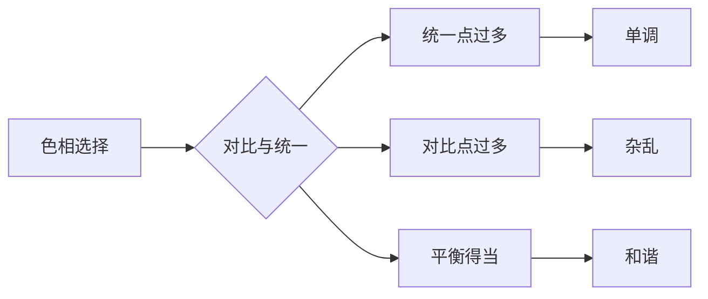
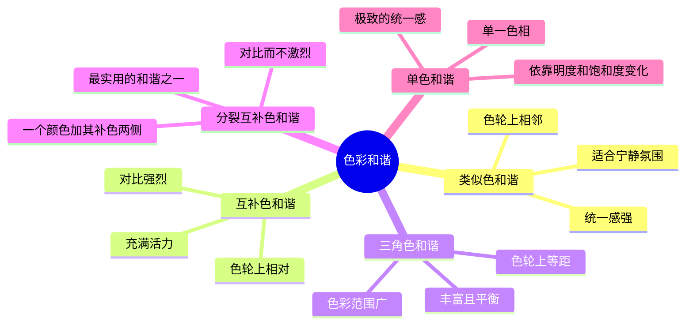

# 第12课：色彩和谐

## 学习目标

- 理解色彩和谐的概念及其在绘画中的作用
- 掌握五种色彩和谐模式
- 学会运用色彩比例和平衡原则
- 理解统一色调如何整合画面
- 认识到和谐是为表达服务的，避免教条化

## 什么是色彩和谐

色彩和谐是指画面中的颜色组合给人以愉悦、协调的视觉感受。和谐不等于单调——和谐的画面可以在统一中有变化，在变化中有关联。

色彩和谐的核心是对比与统一的平衡：

- **统一太多**：画面单调、乏味
- **对比太多**：画面杂乱、冲突
- **平衡得当**：画面丰富且协调

理解色彩和谐不是学习公式化的配色方案，而是建立对色彩关系的敏感度。同一组颜色在不同面积、不同明度、不同饱和度下，和谐与否的感受截然不同。

## 五种和谐模式

| 和谐模式 | 选色方式 | 对比度 | 统一感 | 情绪效果 | 适用题材 |
|----------|----------|--------|--------|----------|----------|
| 类似色 | 色轮上相邻3-4色 | 低 | 高 | 平静、和谐 | 风景、海景、黄昏 |
| 互补色 | 色轮上相对的两色 | 高 | 中 | 活力、鲜明 | 肖像、广告、花卉 |
| 三角色 | 色轮上间隔120度的三色 | 中高 | 中 | 丰富、平衡 | 插画、装饰画 |
| 分裂互补色 | 一色 + 其补色两侧的颜色 | 中 | 中高 | 对比柔和、层次丰富 | 风景、室内场景 |
| 单色 | 单一色相 + 黑白 | 最低 | 最高 | 纯粹、克制 | 情绪画、抽象画 |

### 类似色和谐

类似色和谐（Analogous Harmony）使用色轮上相邻的颜色，如蓝-蓝绿-绿、或红-橙-黄。

类似色和谐的优势在于其天然的统一感——所有颜色共享相近的色相基础，因此画面很容易获得协调的效果。

但是类似色和谐也面临挑战：由于色相对比不足，画面可能显得缺乏活力。解决方法包括：

- 在明度上制造强烈对比（在类似色范围内使用深色和亮色）
- 在饱和度上做文章（部分区域用高饱和，部分区域用低饱和）
- 在画面中少量引入补色点缀（例如蓝绿色调的风景中加入一点点橙色花朵）

### 互补色和谐

互补色和谐（Complementary Harmony）使用色轮上相对位置的颜色。互补色是最强的色彩对比关系。

经典的互补色对：

- 红 — 绿
- 蓝 — 橙
- 黄 — 紫

互补色和谐的核心技巧是控制比例和饱和度的平衡。不当使用容易产生刺眼的效果。

> [!TIP] 互补色的安全使用法则
> 避免将互补色以相等的面积和相等的饱和度并置。这样会产生刺眼的震动感。更安全的方法：让一种颜色占主导地位（大面积、低饱和），另一种作为点缀（小面积、高饱和）。例如：大面积低饱和的绿色背景上放一小块高饱和的红色花朵。

### 三角色和谐

三角色和谐（Triadic Harmony）使用色轮上等距（间隔120度）的三种颜色。

经典的三角色组合：

- 红、黄、蓝（原色三角）—— 强烈、鲜明
- 橙、绿、紫（间色三角）—— 柔和、丰富

三角色和谐的优势是色彩范围宽广，可以覆盖较大的色域。挑战是三种颜色在画面上容易互相争夺注意力。解决方案是让其中一种颜色成为主导，另外两种居于从属地位。

### 分裂互补色和谐

分裂互补色和谐（Split-Complementary Harmony）是互补色和谐的变体。它不是直接使用补色，而是使用目标颜色的补色两侧相邻的两个颜色。

例如，蓝色的分裂互补色是黄橙和红橙（而非直接的橙色）。

分裂互补色和谐的优势在于：

- 保留了互补色对比的活力
- 同时提供了更丰富的色彩变化
- 比直接互补色更加柔和、更容易控制
- 这是许多画家实际使用最多的和谐模式

### 单色和谐

单色和谐（Monochromatic Harmony）只使用一种色相，通过改变明度和饱和度来创造变化。

单色和谐的强大之处：

- 极致的统一感——画面从颜色到情绪高度集中
- 明度关系成为唯一的表现手段
- 训练对明度和饱和度的敏感度
- 适合表现特定的情绪氛围（蓝色调的忧郁、橙色调的温暖）

单色和谐不代表单调——将同一种颜色从极浅到极深排列，其丰富性远超想象。一个"蓝色调"的画面可以包含从接近白色的淡蓝到接近黑色的深蓝之间的无限层次。

## 色彩的比例与平衡

### 60-30-10 法则

这是一个来自室内设计的色彩比例公式，同样适用于绘画：

- **60% 主色**：画面中占主导地位的颜色，奠定整体基调
- **30% 副色**：与主色形成对比或互补，增加丰富度
- **10% 点缀色**：小面积高饱和的颜色，形成视觉焦点

这个比例提供了"统一中有变化"的框架。在实际绘画中不一定要精确到60:30:10，但基本的"主导—从属—点缀"的层次关系应当清晰。

### 色彩重量的平衡

不同颜色在视觉上具有不同的"重量"：

- 高饱和颜色比低饱和颜色重
- 暖色比冷色重（同样面积的红比蓝更吸引注意）
- 暗色比亮色重
- 高对比区域比低对比区域重

在画面构图中，需要平衡这些色彩重量。如果画面右下角有一小块高饱和红色，左上角可能需要一些视觉元素来平衡，否则画面会"偏重"。

> [!QUESTION] 自测题
> 以下哪一组颜色最能形成互补色和谐？
> A. 蓝色 + 紫色
> B. 红色 + 绿色
> C. 橙色 + 黄色

答案

B. 红色 + 绿色 —— 它们在色轮上相对，是互补色。

## 统一色调

统一色调（Color Key）是在整个画面中覆盖一种统一的色彩倾向，就像给画面蒙上一层有色滤镜。

统一色调的实现方法：

1. **物理方法**：在整幅画完成前，在底稿上预先涂一层透明色（通常用土黄或熟赭做暖色调，用群青做冷色调）
2. **混合方法**：在调色时，将环境的主色调融入每一个混合色中（例如画黄昏场景时，在所有颜色中都加入一点点橙色）
3. **罩染方法**：画面基本完成后，在整体上罩染一层透明色（参考第10课的罩染技法）

统一色调的作用：

- 增强画面的整体感和统一性
- 强化情绪氛围（暖色调的温暖感、冷色调的疏离感）
- 简化色彩决策——所有颜色的选择都围绕统一色调展开
- 帮助建立个人风格

> [!QUESTION] 自测题
> 统一色调和单色和谐的区别是什么？

答案

单色和谐是整个画面只使用一种色相，通过明度和饱和度的变化创造画面。统一色调是画面中仍然有丰富的颜色变化，但所有颜色都被某种色调所"统一"——例如一幅黄昏的风景中仍然有绿色植物和蓝色天空，但都被笼罩在暖橙色的统一色调中。

## 和谐不是目的

> [!WARNING] 避免公式化思维
> 色彩和谐是手段，不是目的。一幅在色彩上完全"和谐"的画面如果缺乏情感和内容，依然是无趣的。许多伟大的画作在色彩上刻意打破和谐规则——为了表达冲突、不安、紧张等情绪。
>
> 和谐规则的真正价值在于：知道规则是什么，才能有意识地选择何时遵守、何时打破。
>
> 戈雅的黑色绘画、蒙克的《呐喊》、毕加索的格尔尼卡——这些作品在传统色彩和谐的标准下可能是"不和谐"的，但正是这种不和谐传达了作品的情感和力量。
>
> 始终记住：**色彩为表达服务，而非表达为色彩服务。**

### 如何判断何时需要和谐、何时需要突破

- 如果你的画面目标是宁静、舒适、优美的感受——使用和谐模式
- 如果你的画面目标是冲突、不安、紧张、震撼——有意识地打破和谐
- 大多数情况下，在画面的主体区域使用和谐模式，在需要强调的焦点区域使用对比

## 实践练习

### 练习：三种和谐方案的研究

**材料**：画纸或画板（三块小画板或一张大纸分三部分）、丙烯或油画颜料、画笔

**步骤：**

1. **选择主题**：选择一个简单的主题（一个水果静物、一个风景照片、一个简单的场景），画三遍
2. **方案一：类似色和谐**：
   - 选择一组类似色（如蓝-蓝绿-绿）
   - 用这组颜色完成整幅画
   - 注意在明度上制造足够的变化
3. **方案二：互补色和谐**：
   - 选择一对互补色（如蓝-橙）
   - 让一个颜色占主导（70%），补色作为点缀（30%以下）
   - 尝试在高饱和和低饱和之间切换
4. **方案三：单色和谐**：
   - 只使用一种色相（如群青）
   - 仅通过加白和加黑来改变明度和饱和度
   - 关注明度关系的精确性

**分析**：三幅画完成后，对比它们的视觉效果。哪一幅最统一？哪一幅最活泼？哪一幅最安静？记录你的感受。

## 自测

> [!QUESTION] 自测题
> 1. 类似色和谐最大的优势是什么？最大的风险是什么？
> 2. 互补色和谐中，为什么要避免等面积等饱和度的使用？
> 3. 三角色和谐的经典组合有哪些？
> 4. 分裂互补色和谐与互补色和谐相比有什么优势？
> 5. 什么是60-30-10法则？
> 6. 为什么说"和谐不是目的"？

查看答案

1. 最大优势是天然的统一感——所有颜色共享相近的色相基础，画面容易协调。最大风险是画面可能因缺少色相对比而显得单调乏味。

2. 等面积等饱和度的互补色并置会产生刺眼的"色彩震动"效果（如红绿相邻时的闪烁感），让观者眼睛不适。更好的做法是让一种颜色占主导，另一种作为点缀。

3. 经典三角色组合包括：红-黄-蓝（原色三角）和橙-绿-紫（间色三角）。前者强烈鲜明，后者柔和丰富。

4. 分裂互补色和谐保留了互补色的对比活力，同时提供更丰富的色彩变化，比直接互补色更加柔和、更容易控制，是许多画家实际使用最多的和谐模式。

5. 60-30-10法则是指画面色彩的比例分配：60%主色（奠定基调），30%副色（增加丰富度），10%点缀色（形成视觉焦点）。

6. 因为色彩和谐是表达的手段而非目的。如果一幅和谐的画面缺乏情感和内容，它依然是无趣的。伟大的画作有时候故意打破和谐规则来传达特定的情感——和谐应当服务于画面的表达意图。

## 继续学习

掌握色彩和谐后，进入 [[0013-shi-jue-xu-shi|第13课：视觉叙事]]，学习如何用光与色讲述故事，综合运用本课程所有知识。