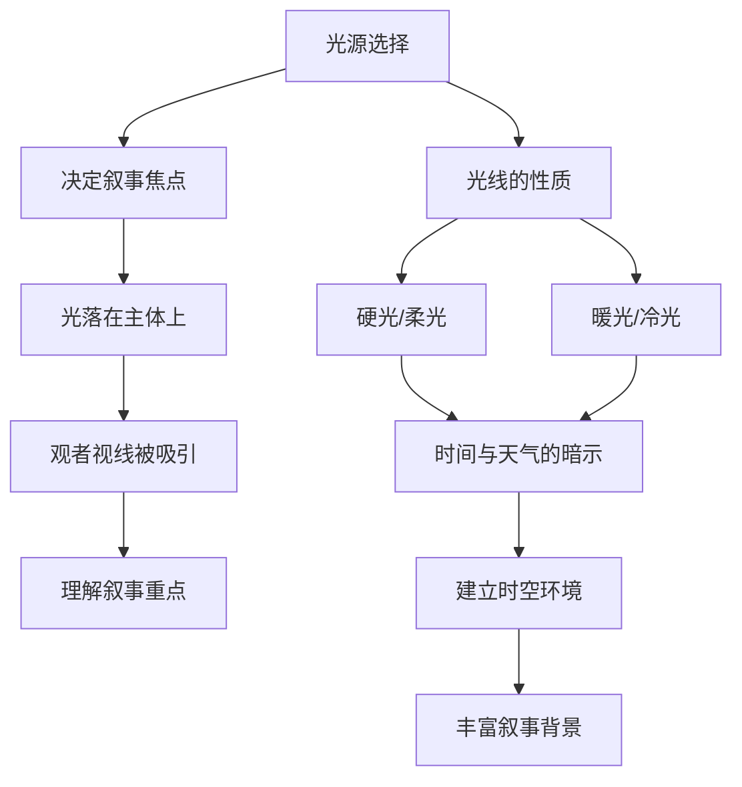

# 第13课：视觉叙事

## 学习目标

- 理解光线作为叙事工具的核心作用
- 掌握色彩与情绪之间的关联
- 学会运用戏剧性光线增强情感强度
- 能够用光色营造特定的时空环境
- 综合运用本课程所有知识完成一幅叙事性创作

## 光线即叙事

在一幅绘画中，光线不仅是照亮物体的物理现象，更是引导叙事的第一工具。观者的视线自然地跟随光——光落在哪里，故事就发生在哪里。

### 光线的叙事功能

1. **确立视觉焦点**：画面中最亮的区域通常是叙事中心。光线的明度层次告诉观者什么最重要。
2. **暗示时间**：光线的色温、方向、阴影长度直接指示了一天中的时刻——金色暖光=黄昏，冷白顶光=正午，柔和蓝光=清晨。
3. **暗示天气和环境**：锐利的投影=晴天，柔和的漫射光=阴天，斑驳的光影=树下或林间。
4. **塑造角色**：光落在人物脸上的方式传达了他的情绪状态和性格——光明中的角色显得坦诚，半明半暗暗示矛盾，完全在阴影中暗示神秘或危险。
5. **创建深度**：前景、中景、背景在光线上的差异（从暗到亮或从亮到暗）制造了空间层次。

> [!EXAMPLE] 光叙事的经典场景
> 想象一幅画：一个孩子坐在窗边的地板上，阳光从窗户斜射进来，形成一道金色的光柱。光柱中灰尘飞舞。孩子手中拿着一封信，信纸正好落在光柱中——这是视觉焦点。孩子的脸部一半在光中、一半在阴影中。窗外是温暖的黄昏色彩。
>
> 这个场景中，光线完成了多项叙事任务：光柱强调了信（故事的核心元素），黄昏暗示了一天的结束（可能是告别的时刻），孩子脸上光影各半暗示了复杂的内心冲突。所有这些叙事信息都通过光线传达，没有使用任何一个文字。

## 色彩即情绪

色彩是人类情绪最直接的艺术触发器。不通过理性分析，色彩直接作用于观者的感知系统，引发本能的情感反应。

| 色彩 | 常见情绪关联 | 适用场景 | 注意事项 |
|------|--------------|----------|----------|
| 红色 | 激情、愤怒、危险、爱情 | 戏剧性场景、冲突、紧急情境 | 大面积红色会让观者感到焦虑 |
| 橙色 | 温暖、活力、友好、丰饶 | 黄昏、秋日、家庭场景 | 容易与商业/廉价关联 |
| 黄色 | 快乐、希望、警告、疾病 | 阳光场景、童年记忆、病态氛围 | 高饱和黄色用于病态需要搭配绿色 |
| 绿色 | 安宁、自然、嫉妒、病态 | 风景、和谐场景、静养空间 | 偏黄的绿=自然，偏蓝的绿=冷静 |
| 蓝色 | 忧郁、冷静、遥远、神圣 | 夜景、距离感、冥想、孤独 | 深蓝=庄重，浅蓝=轻盈 |
| 紫色 | 神秘、高贵、梦幻、悲伤 | 宗教画、奇幻主题、黄昏 | 偏红的紫=温暖，偏蓝的紫=疏离 |
| 棕色 | 踏实、朴素、沉闷、古老 | 土壤、旧物、乡村生活 | 棕色容易让画面变得"脏" |
| 灰色 | 中立、冷漠、抑郁、优雅 | 阴天、城市、老年主题 | 暖灰与冷灰的差异巨大 |
| 黑色 | 死亡、权威、神秘、沉默 | 夜景、悲剧、高端基调 | 避免纯黑——调色黑往往比纯黑更好 |
| 白色 | 纯洁、空无、冷静、神圣 | 冬景、医疗、极简主题 | 白色中混入微量的其他色相更有感染力 |

### 色彩情绪的文化差异性

需要注意，色彩的情绪关联并非放之四海而皆准的。例如：

- 白色在西方文化中代表纯洁（婚纱），在中国和印度传统文化中代表哀悼（丧服）
- 红色在中国代表吉祥和喜庆，在西方也代表危险和警告
- 紫色在西方传统中代表皇室和尊贵（因为紫色染料曾经极其昂贵），在泰国文化中代表哀悼

因此在创作跨文化主题的作品时，需要谨慎考虑色彩象征的文化语境。

## 戏剧性光线

戏剧性光线（Chiaroscuro，明暗对照法）是文艺复兴时期发展出的绘画技法，通过强烈的明暗对比来制造戏剧性的视觉效果和情感强度。

### 戏剧性光线的核心特征

1. **极端明度对比**：画面中最亮和最暗的区域几乎没有中间过渡
2. **大面积阴影**：画面的大部分区域处于暗部中，只有关键区域被照亮
3. **光线从暗部中"浮现"**：光仿佛从黑暗中诞生，而非照亮整个场景
4. **情感强度高**：强烈的对比传达紧张、神秘、庄严等情绪

### 戏剧性光线的代表人物

- **卡拉瓦乔**：明暗对比法的开创者，他的作品如《圣马太的召唤》中，光线从画面一侧斜射进来，只照亮人物的脸部和手部，其余部分沉浸在黑暗之中
- **伦勃朗**：将明暗对照法发展到极至，他的肖像画中光线聚交在面部和手部，其他区域融在褐色的暗影中
- **约瑟夫·赖特**：将戏剧性光线用于工业场景，烛光下科学家和工匠的面部被照亮，背景昏暗

### 戏剧性光线的应用方法

1. **选择单一光源**：单光源尤其侧光和逆光是戏剧性光线的理想选择
2. **控制亮部面积**：亮部通常不超过画面的30%，甚至更少
3. **边缘处理**：亮部与暗部的边缘从锐利（金属边缘）到柔和（皮肤边缘）有意识地变化
4. **色彩温度的对比**：高光区域偏暖，暗部区域偏冷（或反之），增加色彩上的对比层次

> [!WARNING] 戏剧性光线的过度使用
> 戏剧性光线效果强烈，不宜在所有作品中使用。如果每一幅画都采用强烈的明暗对比，观者会感到审美疲劳。戏剧性光线的力量在于它的"特殊时刻"感——它应该在叙事需要情感升级时使用，而非作为默认风格。

## 营造特定时空

光线是确定画面时间与地点的最有效工具。

### 不同时间的光线特征

| 时间 | 光源方向 | 色温 | 阴影特征 | 氛围 |
|------|----------|------|----------|------|
| 黎明 | 低角度 | 冷蓝到暖橙过渡 | 极长的阴影 | 宁静、期待 |
| 早晨 | 斜侧 | 暖白 | 中等长度 | 清新、活力 |
| 正午 | 顶光 | 冷白 | 最短阴影、在物体正下方 | 强烈、真实 |
| 午后 | 斜侧 | 暖白 | 渐长 | 温暖、慵懒 |
| 黄昏 | 低角度 | 暖橙到紫红 | 极长 | 浪漫、怀旧 |
| 蓝色时刻 | 地面反射余晖 | 蓝紫 | 几乎消失 | 静谧、神秘 |
| 夜晚 | 人工光源 | 暖（烛光/灯光）或冷（月光） | 锐利或柔 | 安静、内省、神秘 |

### 不同环境的光线特征

- **户外晴朗**：主光源=太阳（暖色、硬光），辅光源=天空（冷色、柔光），阴影充满天空的蓝色反射
- **户外阴天**：单一漫射光源（冷色、柔光），几乎无投影，色彩饱和度降低
- **室内日光**：窗户光源（方向性强），室内深处逐渐转暗，环境色来自室内墙壁
- **室内人工光**：暖色（白炽灯）或冷色（荧关灯），近距离时平方反射比定律效果明显
- **烛光/火光**：极暖的色温（约1800K），光的衰减极快，形成局部的暖色光晕

## 色彩的象征意义

### 东西方色彩象征对比

| 色彩 | 西方象征 | 东方（中国）象征 |
|------|----------|------------------|
| 红 | 爱情、危险、革命 | 吉祥、喜庆、好运 |
| 白 | 纯洁、医疗、婚礼 | 哀悼、丧事 |
| 黑 | 死亡、正式、优雅 | 水、冬天、北方的 |
| 黄 | 警告、懦弱、快乐 | 皇权、中心、尊贵 |
| 蓝 | 忧郁、信任、冷情 | 永恒、青花、艺术 |
| 绿 | 自然、嫉妒、环保 | 生、春、健康 |

在创作中运用色彩象征时，需要根据作品的目标观众来决定采用哪种象征体系。

## 综合运用

本课程学到所有知识，在视觉叙事中汇聚为统一的创作力。

### 从观察到表达的创作流程

1. **观察**（第02课）——用形状、剪影、眯眼等方法观察真实世界
2. **理解光线**（第03-05课，第08课）——理解色温、阴影、反射、自然光的规律
3. **设记光线**（第09课）——为主、辅光的位罝和方向做出设计决策
4. **选择色彩**（第06课，第12课）——选择和谐模式、确定统一色调
5. **调色混合**（第10课）——在调色板上实现设计好的色彩方案
6. **实践生**（第11课）——在工作室或户外完成作品
7. **心层叙事**（第13课，本课）——确保所有光线和色彩决策服务于想讲述的故事

### 案例：创作一幅叙事性作品

假设你想画一幅"告别"主题的作品：

1. **叙事核**心：一个即将离开故乡的人站在门槛上，最后看一眼老房子
2. **光线设计**：使用黄昏的逆光——人物站在门口，外面是温暖的橙金色斜阳，室内是昏暗的冷色——人物轮廓被边缘光照亮，面部表情在阴影中部分可见
3. **色彩选择**：室外的暖橙与室内的冷蓝形成互补色和谐（蓝-橙），人物的中间性置同时接触两个世界。统一色调偏向暖色，暗示这是关于记忆和温度的故事
4. **视觉焦点**：人物面部的边缘光和门槛处的光暗交界线——观者视线被吸此到从室内到室外的过渡区域
5. **细节**：室内暗部中可见老家具的模糊轮廓（暗示记忆），室外的夕阳光柱中漂浮的灰尘（暗示时间的流逝）

## 实践练习

### 练习：创作一幅叙事性场景

**目标**：综合运用本课程的所有知识，创作一幅有叙事意图的作品。

**步骤：**

1. **确定故事**：选择一个简单的情节——"一个人在等另一个人"、"一个发现的时刻"、"告别"、"相遇"任选其一
2. **撰光设暗计案**：用文字描述你的光线方案——光源数量、方向、色温、主辅光关系
3. **色选色彩方择案**：选择一种和谐模式，确定统一色调，写下你的色彩选择及理由
4. **缩略图稿**：画3-4张缩略图，探索不同的构图和光线角度
5. **正式创作**：选择最佳缩略图，进行正式的绘画创作
6. **创作说明**：完成后写下200字的创作说明，解释你的光线和色彩决策如何服务于叙故事事

## 自测——全课程综合回顾

> [!QUESTION] 综合自测
> 以下问题覆盖了第09课到第13课的核心内容。
>
> 1. 侧光为什么是最适合表现体积和纹理的光照方向？
> 2. 减色混合和加色混合的本质区别是什么？
> 3. 北窗光为什么是工作室的理想光源？
> 4. 类似色和谐和互补色和谐各有何优缺点？
> 5. 什么是戏剧性光线？它适合用于什么样的叙事主题？
> 6. 如果你要画一幅表现"孤独"情绪的画面，你会如何选择光线方向、色温和色彩和谐模式？

参考答案

1. 侧光让物体的受光面、明暗交界线、背光面依次排列，形成完整的明度序列传达三维信息。同时，纹理的微小凸起产生大量微投影，叠加出丰富的纹理质感。

2. 减色混合（颜料混合）通过吸收特定波长的光来工作，越混越暗；加色混合（光混合）通过叠加不同波长的光来工作，越混越亮。前者三原色为青品黄，后者为红绿蓝。

3. 北窗光全天无直射太阳，光强度稳定不变；色温接近标准日光（约5500K）；柔和的漫射光产生边缘柔和的阴影，适合长时间作画。

4. 类似色和谐优势在于天然的统一感和协调感，缺点是不够活泼、可能单调。互补色和谐优势在于强烈的对比和活力，缺点是控制不好可能刺眼或杂乱。

5. 戏剧性光线（Chiaroscuro）是强烈的明暗对比技法，画面大部分在阴影中只有关键区域被照亮。适合用于情感强烈、紧张、神秘、庄严的叙事主题。

6. 参考回答：选择侧光或顶光（避免正面光的直白感），色温偏冷（蓝色调），使用单色和谐或类似色和谐（蓝-蓝紫-紫），色彩饱和偏低。大面积冷色配少量暖色点缀（如窗户透入的一丝暖光），让光线集中在人物面部，其他区域沉浸在低饱和的冷色暗影中。

## 回顾与下一步

恭喜你完成了《色彩与光线》课程的核心部分。以下是你可以继续探索的资源：

- 复习 [[../reference/glossary|术语表]]，巩固本课程中涉及的专业名词
- 参考 [[../reference/color-mixing-guide|调色指南]]，获取更多调色配方和技巧

### 课程复盘清单

- [ ] 我理解了光线的方向如何影响体积感和情绪
- [ ] 我掌握了高光和边缘光的表现方法
- [ ] 我理解了减色混合的原理和颜料特性
- [ ] 我练习了有限调色板的运用
- [ ] 我尝试了户外写生和速写
- [ ] 我掌握了不同肖像布光模式
- [ ] 我理解了五种色彩和谐模式的区别
- [ ] 我能够运用统一色调来整合画面
- [ ] 我知道色彩和谐为表达服务，而非相反
- [ ] 我能够用光线和色色彩综合叙述故事

> [!SUCCESS] 学习完成
> 从观察到表达，从理论到实践，你已经完成了这个色彩与光线的学习旅程。记住最重要的两点：第一，持续观察真实世界的光色——没有比现实更好的老师；第二，保持练习——每幅画都是一次新的学习。期待看到你用色彩和光线创造出的精彩世界！

## 继续学习

完成所有课程后，请回顾 [[../reference/glossary|术语表]] 和 [[../reference/color-mixing-guide|调色指南]]，巩固和扩展你的知识。