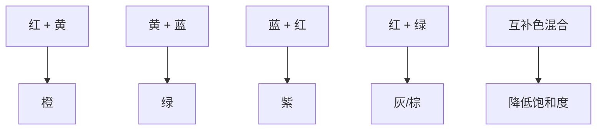

# 调色指南与色彩配方

## 减色混合的基本规律

> [!TIP] 混合原则
> 混合的颜色种类越多，饱和度越低。如果需要鲜艳的颜色，尽量从管装颜料中直接选取，或只混合两种颜色。

## 经典有限调色板

### 佐恩调色板（Zorn Palette）

瑞典画家 Anders Zorn 使用的极简调色板，以有限颜色创造丰富效果：

| 颜色 | 用途 |
|---|---|
| 钛白（Titanium White） | 提亮、不透明 |
| 镉红（Cadmium Red） | 暖色、肤色基础 |
| 土黄（Yellow Ochre） | 中间调、环境色 |
| 象牙黑（Ivory Black） | 暗部、也可与白混合调灰 |

> 用这四种颜色可以调出从肤色到风景的几乎所有自然色调。

### 三原色调色板

| 颜色 | 色相 |
|---|---|
| 镉黄（Cadmium Yellow） | 暖黄 |
| 品红（Quinacridone Magenta） | 冷红 |
| 酞青蓝（Phthalo Blue） | 冷蓝 |

> 三原色可以混合出几乎所有中间色。添加钛白和一种土色（如土黄）会更实用。

## 中性色调配指南

| 需要的中性色 | 调配方法 |
|---|---|
| 暖灰 | 白 + 象牙黑 + 少许镉红或土黄 |
| 冷灰 | 白 + 象牙黑 + 少许酞青蓝 |
| 暖棕 | 橙（红+黄）+ 少许蓝 |
| 冷棕 | 棕 + 少许蓝或绿 |
| 皮肤中间调 | 白 + 镉红 + 土黄 + 少量蓝 |
| 树叶暗部 | 绿 + 少许红 |

## 常见色彩配方

### 肤色

| 描述 | 配方 |
|---|---|
| 浅肤色亮部 | 白 + 镉红 + 土黄 + 少量绿（降低饱和度） |
| 浅肤色中间调 | 土黄 + 镉红 + 白 |
| 浅肤色暗部 | 土黄 + 镉红 + 群青（或普蓝） |
| 深肤色亮部 | 土黄 + 镉红 + 少量白 |
| 深肤色中间调 | 土黄 + 镉红 + 群青 |
| 深肤色暗部 | 群青 + 赭石（或熟赭） |
| 脸颊红润 | 在基础肤色上加少许纯镉红 |
| 嘴唇 | 镉红 + 群青（降低饱和度） + 白 |

### 天空

| 描述 | 配方 |
|---|---|
| 晴天蓝天 | 酞青蓝 + 钛白（+ 少量品红降低饱和度） |
| 黄昏天空（暖） | 白 + 橙（镉黄+镉红） + 少量蓝 |
| 黄昏天空（冷） | 群青 + 品红 + 白 |
| 阴天天空 | 白 + 群青 + 少量橙 |
| 云朵亮部 | 钛白 + 少量暖色（土黄或橙） |

### 树木与植被

| 描述 | 配方 |
|---|---|
| 亮部绿叶 | 镉黄 + 酞青蓝 + 白 |
| 暗部绿叶 | 酞青蓝 + 土黄 + 少量红 |
| 远树（受大气透视影响） | 绿 + 群青 + 白 + 少量红（降低饱和度） |
| 秋天叶子 | 镉黄 + 镉橙（或镉红） |
| 树干 | 熟赭 + 群青 |

## 混色注意事项

> [!WARNING] 避免"调泥"
> 混合三种以上颜色且不控制比例时，很容易得到"泥巴色"。解决方案：
> 1. 使用有限调色板
> 2. 每次混合不超过两种颜色（+ 白不算在内）
> 3. 需要复杂颜色时，先调出目标颜色的"亲戚色"，再微调

> [!TIP] 光学混合 vs 调色板混合
> 调色板混合：颜色在调色板上完全混合后再上画布——均匀、可控。
> 光学混合：将纯色小笔触并置在画布上，观者眼中完成混合——更鲜艳、生动（点彩派技法）。

> [!TIP] 调暗颜色的方法
> 1. 加互补色（最推荐，色彩丰富）
> 2. 加暗色（如普蓝、深褐）
> 3. 加黑色（慎用，容易让颜色"死掉"）

## 推荐初始调色板

对于初学者，建议从这套调色板开始：

### 油画/丙烯

- 钛白（Titanium White）
- 镉黄（Cadmium Yellow）
- 土黄（Yellow Ochre）
- 镉红（Cadmium Red）
- 品红（Quinacridone Magenta/Alizarin Crimson）
- 群青（Ultramarine Blue）
- 酞青蓝（Phthalo Blue）
- 熟赭（Burnt Sienna）
- 象牙黑（Ivory Black）

### 水彩

- 柠檬黄（Lemon Yellow）
- 土黄（Yellow Ochre）
- 镉红（Cadmium Red）
- 深红（Alizarin Crimson）
- 群青（Ultramarine）
- 酞青蓝（Phthalo Blue）
- 熟赭（Burnt Sienna）
- 熟褐（Burnt Umber）