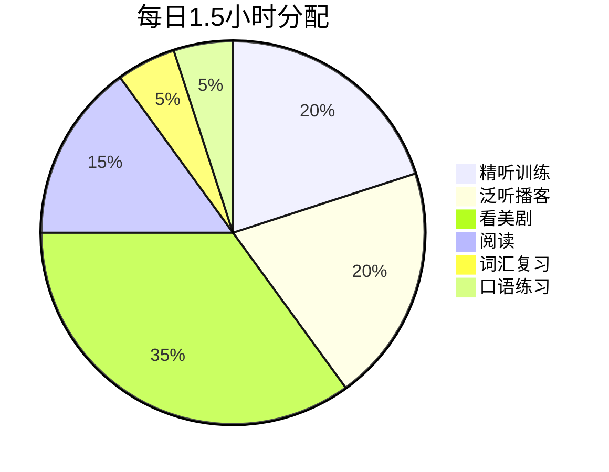
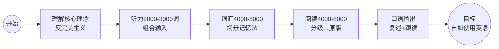

# 课程地图

## 推荐学习路径

## 学习阶段

### 第一阶段：认知建立（第1课）
- 理解"可理解性输入"核心理念
- 诊断现有学习材料
- 建立反完美主义心态

### 第二阶段：听力突破（第2-4课）🟢

**同时推进三条线：**

| 主线 | 课程 | 每日时间 |
|------|------|---------|
| 精听训练 | 第2课 + 第4课工具 | 20min |
| 泛听输入 | 第2课组合策略 | 30min |
| 美剧沉浸 | 第3课分级选剧 | 30-40min |

### 第三阶段：词汇+阅读（第5-6课）🟡

| 主线 | 课程 | 每日时间 |
|------|------|---------|
| 词汇积累 | 第5课场景记忆法 | 10min |
| 分级阅读 | 第6课阅读进阶 | 20min |
| ⚠️ 听力持续 | 保持第二阶段听力习惯 | 60min+ |

### 第四阶段：口语输出（第7课）🟠
- 复述训练 / 影子跟读
- 自言自语法
- 保持前三阶段所有输入习惯

## 时间投入参考

## 难度阶梯

## 学习进度追踪

完成一课后，在对应的方框中打勾 ✅

- [ ] [[0001-底层认知|第01课：底层认知]]
- [ ] [[0002-听力突破方法论|第02课：听力突破方法论]]
- [ ] [[0003-美剧分级学习法|第03课：美剧分级学习法]]
- [ ] [[0004-听力工具与精听实操|第04课：听力工具与精听实操]]
- [ ] [[0005-词汇积累与场景记忆法|第05课：词汇积累与场景记忆法]]
- [ ] [[0006-阅读进阶与分级材料|第06课：阅读进阶与分级材料]]
- [ ] [[0007-口语输出训练|第07课：口语输出训练]]

---

> 📖 参考资源
> - [[学习路线总览]] — 一页速查
> - [[核心术语表]] — 术语定义
> - [[完整资源目录]] — 全部资源