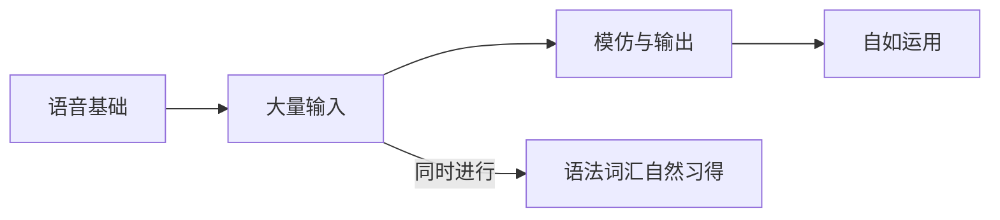

# 第01课：英语自学的核心观点

## 学校的英语教学出了什么问题？

作者开篇指出一个现实：绝大多数中国学生学了十年英语，仍然无法流畅阅读、听不懂英语新闻、开不了口。这不是学生的问题，而是**整个英语教学体系的方法论有问题**。

| 学校英语的特点 | 问题所在 |
|---|---|
| 以考试为导向 | 分数 ≠ 能力，考试技巧代替了语言习得 |
| 精读为主，逐句分析 | 接触量太小，无法建立语感 |
| 单词表 + 语法规则 | 脱离语境的知识碎片难以转化为技能 |
| 教师主导 | 学生缺乏自主学习的能力和意识 |
| 追求"正确" | 对错误的恐惧阻碍了大胆尝试 |

> [!NOTE] 核心观点
> 语言不是一门知识学科，而是一种**技能**。知识可以通过听课获得，但技能只能通过**练习**习得。这是理解整本书的出发点。

## 自学的三条基本原则

### 原则一：输入决定输出

语言能力遵循"先输入、后输出"的自然顺序。婴儿在开口说话之前，已经听了大约一年的母语。自学英语同样需要大量的**可理解性输入**——听和读你能理解大部分内容（约80-95%）的材料。

- 听力和阅读是**能力的基础**，不是"辅助练习"
- 口语和写作是**能力的自然结果**，不是"刻意训练的目标"
- 没有足够的输入就强行输出，只会制造大量的僵化错误

### 原则二：兴趣维持动力

自学者最大的敌人不是难度，而是**半途而废**。作者强调，选择的学习材料必须符合个人兴趣：

- 你喜欢什么话题？找对应的英文内容
- 你不需要"从教材开始"——从你能理解的、感兴趣的真实内容开始
- 如果材料让你痛苦，换一个，而不是硬撑

> [!TIP] 可持续性优于强度
> 每天坚持30分钟，比每周突击5小时更有效。习惯的力量远大于意志力。

### 原则三：主动加工胜过被动接触

仅仅是"听"英语广播或"看"美剧，效果有限。真正有效的学习需要**主动加工**：

- 听的时候试图理解意思（不只是背景音）
- 读的时候注意不认识的词和句式
- 跟读、复述、总结——让自己产出语言

> [!WARNING] 被动输入陷阱
> 不要把"挂着耳机听英语"等同于"练听力"。没有注意力的输入是无效的。

## 英语自学的四个阶段

1. **语音基础**（1-3个月）：建立准确的发音和辨音能力
2. **大量输入**（6-12个月）：以听力和阅读为主，积累语感
3. **模仿与输出**（持续进行）：跟读、复述、写作
4. **自如运用**（长期目标）：用英语获取信息、表达思想

> [!ABSTRACT] 总结
> 英语自学不是"更努力地学英语"，而是用**正确的方法**学英语。核心公式是：**可理解的输入 × 主动加工 × 时间 = 语言能力**。

## 下一步

继续学习 [[0002-da-liang-shu-ru|第02课：大量输入——听力和阅读]]，深入了解输入方法的具体操作。