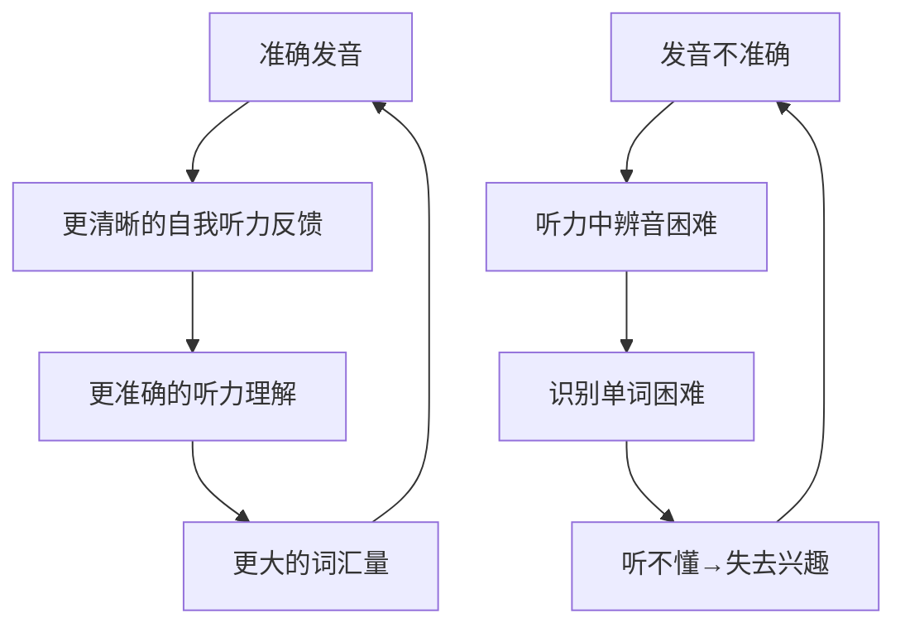

# 第03课：语音：英语学习的基石

## 为什么语音如此重要？

作者在书中将语音置于英语自学的**起点位置**。很多学习者低估了语音的重要性，认为"发音标准不标准不重要，能交流就行"。作者提出了一个反直觉的观点：

> [!NOTE] 核心观点
> **语音能力决定了你的听力天花板。** 如果你发不准某个音，你大概率也听不出这个音——不是耳朵的问题，是大脑的"音位分类"没有建立。

## 语音的双向作用

## 语音训练的三个层次

### 1. 音素（Phonemes）

英语有约44个音素，其中有多个音素在中文中不存在对应音，是学习的难点：

| 中文母语者常见难点 | 示例词 | 关键区别 |
|---|---|---|
| /θ/ /ð/（咬舌音） | think / this | 舌尖轻触上齿，气流从缝隙流出 |
| /æ/ | cat / bad | 嘴型张得比中文"啊"更大更扁 |
| /ɪ/ /iː/ | ship / sheep | 短音放松，长音拉长 |
| /r/ | red / right | 舌尖卷起但不接触上颚 |
| 尾辅音 | cat / bed | 中文音节很少以辅音结尾 |

### 2. 连读与弱读（Connected Speech）

日常英语中有大量的连读、弱读、省略现象，这是"听不懂"的主要原因：

- **连读**：辅音 + 元音 → "an apple" 听起来像 "a-napple"
- **弱读**：功能词弱化 → "I can do it" 中的 "can" 弱读为 /kən/
- **省音**：相邻辅音省略 → "next day" 读作 /neks deɪ/

> [!TIP] 训练方法
> 找一个1-2分钟的英语音频（推荐 ESL 级别的慢速材料），逐句跟读并录音，对比原声和自己的录音，标记差异。

### 3. 语调与节奏（Intonation & Rhythm）

英语是**重音计时（stress-timed）语言**，而中文是**音节计时（syllable-timed）语言**。这个根本差异导致中国人说英语容易"一字一顿"。

- 关注句子的重音位置：重读音节拉长，非重读音节压缩
- 语调升降传递态度和信息：陈述句用降调，一般疑问句用升调
- 意群停顿：在语义单位的边界处停顿，而不是每词一停

> [!WARNING] 不要过早追求"地道"
> 先做好**可懂度（intelligibility）**，再追求**地道（native-like）**。目标不是变成英国人/美国人，而是让听者毫不费力地听懂你。

## 语音训练的具体方法

作者推荐的训练流程：

1. **音素纠音**（1-2周）：逐个攻克中文母语者易错的音素（/θ/ /ð/ /æ/ /ɪ/ 等）
2. **单词发音**（2-4周）：练习包含难点音素的单词
3. **句子跟读**（4-8周）：跟读慢速材料，注意连读和弱读
4. **影子跟读**（8周+）：与音频同步朗读，不暂停

## 练习资源

- 音素对照视频：BBC Learning English - Pronunciation
- 跟读材料：EnglishPod、ESL Pod 的慢速对话
- 录音工具：手机自带录音机即可，或用 Audacity 对比波形

> [!ABSTRACT] 总结
> 语音训练是回报率最高的初期投资。花1-3个月打好语音基础，之后听力和口语的进步速度会显著加快。

## 下一步

打好语音基础后，进入 [[0002-da-liang-shu-ru|第02课：大量输入]] 的环节。更好的发音会让你在听力和阅读中收获更多。