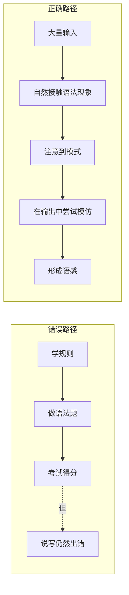

# 第04课：单词与语法：从理解到使用

## 背单词为什么记不住？

作者质疑了主流英语教育中根深蒂固的做法：**背单词表**。他提出了几个关键问题：

- 为什么一个词背了20遍，遇到时还是想不起意思？
- 为什么明明知道每个单词的意思，放在一起却读不懂句子？
- 为什么背了5000词，开口时只能用出最简单的500词？

> [!NOTE] 核心观点
> 单词不是**背**会的，而是**用**会的。在真实语境中反复遇见一个词，比在单词表上背20次有效得多。

## 词汇习得的正确方法

### 从输入中自然习得

通过阅读和听力积累词汇，遵循"遇见 → 猜测 → 确认 → 复用"的循环：

1. **遇见**：在上下文中第一次遇到生词
2. **猜测**：根据语境推测大概意思
3. **确认**：查字典验证（只查妨碍理解的词）
4. **复用**：在后续的输入中再次遇到，加深印象

> [!TIP] 高频词优先
> 英语日常使用中，最常出现的2000词覆盖了约80%的日常文本。优先掌握高频词，回报率最高。不要一开始就背GRE词汇。

### 主动词汇 vs. 被动词汇

| 类型 | 定义 | 数量比 |
|---|---|---|
| 被动词汇 | 看到/听到能认出的词 | 通常是被动词汇的2-3倍 |
| 主动词汇 | 说/写时能主动用出的词 | 较少，需要通过输出训练转化 |

自学初期不必强求主动词汇——**先大量扩充被动词汇**，主动词汇会在输出练习中自然增长。

## 语法到底怎么学？

作者对语法的观点同样与主流教学不同：

### 语法不是公式

学校教语法的方式——给出公式（主谓宾、定语从句、虚拟语气...），然后用填空题练习——实际上是在教**语法分析**，而不是**语法使用**。

### 语法是模式，不是规则

真正的语法能力来自于大量的输入使得大脑自动提取语言模式（pattern recognition）：

- 读多了，"a apple" 自然会感觉不对劲（应该是 "an apple"）
- 听多了，"I go to school yesterday" 自然会觉得缺了什么
- 这种直觉就是**语感**，它比任何语法规则都更快、更可靠

### 语法书的正确使用方式

语法书不是用来"学"的，而是用来**查**的：

- 不要在学英语之前先学一遍语法书
- 而是在阅读/听力中遇到不理解的结构时，去语法书中查找解释
- 语法书是**参考书**，不是**教材**

> [!WARNING] 语法分析的陷阱
> 能分析一个句子的语法结构 ≠ 能理解和生成这个句子。很多学习者花大量时间分析句子成分，结果是"分析了一百个句子，一个都说不出来"。

## 工具推荐

| 工具 | 用途 | 使用建议 |
|---|---|---|
| **词典**（英英优先） | 查词 | 从英汉词典起步，逐步过渡到 Collins COBUILD / Longman 英英词典 |
| **SRS**（间隔重复系统） | 巩固生词 | Anki / Quizlet，但不要用单词表，而是用**句子卡片** |
| **语料库**（COCA / BNC） | 查看真实使用 | 查一个词的常见搭配和语境 |
| **Google / ChatGPT** | 确认用法 | 搜索短语加引号，看出现频率 |

> [!TIP] Anki 句子卡片胜于单词卡片
> 不要在 Anki 上只写"abandon = 放弃"。用你读过的句子做卡片："He abandoned his attempt to climb the mountain."——上下文才是记忆的钩子。

> [!ABSTRACT] 总结
> 词汇和语法不应作为独立的知识体系来学习，而应在大量的听读输入中自然吸收。工具（词典、SRS）可以辅助这个过程，但不能替代输入本身。

## 下一步

积累了足够的输入和基础语法语感后，可以开始尝试输出。见 [[0005-kou-yu-yu-xie-zuo|第05课：口语与写作——输出驱动进步]]。