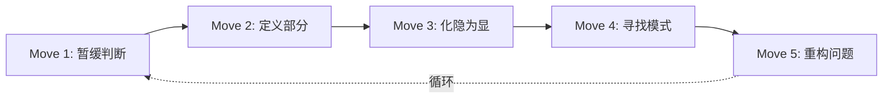

# 第01课：什么是分析？分析写作的五个基本动作

## 学习目标

- 理解分析（analysis）的三个核心特征
- 区分分析与总结、表达性写作、论证
- 建立"分析不是拆碎，而是寻求意义"的心智框架

## 分析的真正含义

大多数人认为分析就是"把东西拆开来看"。但这只说对了一半。

> [!ABSTRACT] 定义
> **分析**是将一个主题拆分为其组成部分，**研究各部分之间的关系**，并**得出有意义的解读**的过程。

关键区别在此：**拆碎**是破坏性的——把玩具拆成零件就完了；**分析**是建设性的——拆开是为了理解玩具是如何运作的，以及各部分为什么要以这种方式组合在一起。

### 为什么大学教师如此看重分析？

教师在各个学科都要求学生做分析——从文学到生物学到商科——因为他们想要的不仅仅是"复述发生了什么"（总结），而是"这件事为什么会这样"、"这意味着什么"以及"我们该如何理解它"。

> "[Analysis] is a search for meaning."
> — *Writing Analytically*, Ch.1

分析的发动机是**好奇心**——一种渴望理解"为什么"的内在驱动力。

## 分析 vs. 其他写作方式

这是第一个你需要建立的分析性区分：

| 写作方式 | 核心问题 | 示例 |
|---------|---------|------|
| **总结** | "说了什么？" | "这篇文章主要讨论了三个问题……" |
| **分析** | "这说明了什么？为什么？" | "作者在这里使用'疾病'隐喻，说明他认为……" |
| **表达性写作** | "我感觉如何？" | "这段话让我想起了自己的经历……" |
| **论证** | "我的立场是什么？" | "我同意作者的观点，因为……" |

### 分析与总结
总结是分析的**原材料**，不是分析的替代品。你需要先总结来获取信息，但分析是在此之上追问"那又怎么样？"

### 分析与表达性写作
你的个人反应是有价值的信息——它能告诉你什么引起了你的注意。但分析需要你追问：**"为什么是这件事引起了我的注意？它揭示了什么？"**

### 分析与论证
论证想要说服读者接受某个立场。分析则优先于论证——它先试图理解一个主题，然后再形成立场。实际上，好的论证经常是建立在好的分析之上的。

> [!TIP] 一条实用原则
> 如果你发现自己写的东西"任何一个读了原文的人也都知道"，那你很可能在做总结而不是分析。
> 分析的目的是**揭示**——让读者看到一些他们原本看不到的东西。

## 毒害分析的三个心智习惯

分析不是"自然而然"的。作者指出了三种常见的反分析习惯，你需要有意识地对抗：

| 习惯 | 表现 | 解药 |
|------|------|------|
| **判断反射**（Judgment Reflex） | 一接触就立刻评判好坏 | **暂缓判断**，先观察再做评价 |
| **过度个人化**（Overpersonalizing） | 把自己的假设当成理所当然 | **问自己**："作者为什么这样说？"而非"他哪里说的不对？" |
| **过度概括**（Generalizing） | 过早下结论 | **回到具体细节**，概括必须有证据支持 |

> [!WARNING] 最重要的习惯
> 全书中最重要的一个训诫可能是：**Get Comfortable with Uncertainty（学会与不确定性共处）**。
>
> 分析不追求"正确答案"——很多分析性问题是开放性的，最好的回答不是"唯一的答案"，而是"最有说服力的解读"。

## 五大分析动作预览

本书的核心是五个分析动作（The Five Analytical Moves）。你可以把它们想象成一个工具箱：

| 动作 | 一句话 | 工具 |
|:----:|--------|------|
| **1. 暂缓判断** | 先观察，再评价 | Notice & Focus |
| **2. 定义部分** | 找出组成部分及其关系 | Ranking（排序） |
| **3. 化隐为显** | 追问"这说明了什么？" | 问 "So What?" |
| **4. 寻找模式** | 找重复、对比、异常 | THE METHOD |
| **5. 重构问题** | 不断换角度重新提问 | Reformulation |

这五个动作为整本书奠定了方法论基础。接下来的课程会逐一深入讲解每个动作的具体操作。

## 自我检查

> [!QUESTION] 回顾
> 请在不翻回上文的情况下回答：分析的三个关键词是什么？（提示：拆、关系、意义）

查看答案

**拆分组成部分、研究各部分之间的关系、得出有意义的解读。**

分析不是单纯的"拆碎"——拆碎只是第一步，关键在于理解各部分如何相互作用，以及整体意味着什么。

> [!QUESTION] 应用
> 假设你看到一段广告：画面上一个人坐在空荡荡的办公室里加班，背景音乐很忧伤。请尝试**先做总结，再做分析**，感受两者的区别：
> 1. 总结：画面发生了什么？
> 2. 分析：这个画面可能想传达什么？它是如何做到的？

参考答案

**总结**：广告展现了一个人深夜在空旷的办公室加班，背景音乐忧伤。

**分析方向**：空旷的办公室与孤单的人物形成对比，暗示"努力工作意味着牺牲社交"；忧伤音乐让加班显得悲壮而非悲惨，暗示这种牺牲是值得尊敬的。广告实际上在**将加班浪漫化**——通过视觉上的孤独与听觉上的崇高感制造矛盾情感。

注意：分析没有"标准答案"，关键是你能否用具体的观察支撑你的解读。

## 核心概念回顾

| 概念 | 含义 | 为什么重要 |
|------|------|-----------|
| 分析 = 搜索意义 | 不是为了拆碎，而是为了理解 | 改变了你对待任何话题的态度 |
| 总结 ≠ 分析 | 总结说"是什么"，分析说"为什么" | 避免把复述当成思考 |
| 判断反射 | 先评判后观察的冲动 | 需要意识地暂缓判断 |
| 与不确定性共处 | 分析不追求唯一答案 | 减少焦虑，增加探索的耐心 |

## 下一步

继续学习 [[0002-suspend-judgment|第02课：暂缓判断——克服毒害分析的心智习惯]]，深入了解第一个分析动作——如何用 Notice & Focus 把你从"判断模式"切换到"观察模式"。

或者在 [[../reference/glossary|术语表 Glossary]] 中查看本课涉及的关键术语。