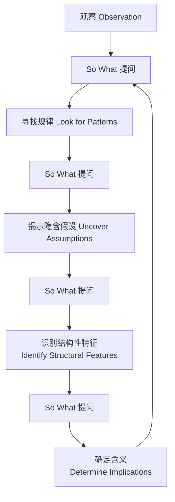

# 第04课：So What？——将观察推向含义

## Learning Objectives

完成本课后，你将能够：

- 解释 **So What？** 问句在分析写作中的核心作用
- 运用 **So What 链条**（chain）从表层观察逐层推导出深层含义
- 将 So What 问句与 **Five Analytical Moves** 中的其他策略联系起来
- 在日常场景中自主发现值得分析的"意义缺口"

## 为什么 So What 至关重要

分析写作最常见的问题不是"观察太少"，而是"观察之后不知下一步"。**So What？** 就是那个"下一步"。

> [!ABSTRACT] 核心观点
> So What 是连接 **观察（Observation）** 与 **含义（Implication）** 之间的桥梁。没有它，分析只是一份清单；有了它，分析才成为论证。

| 没有 So What | 有 So What |
|---|---|
| 描述现象，就此打住 | 追问现象为何重要 |
| 罗列事实，读者自悟 | 揭示意义，引导读者 |
| 分析停止在表面 | 分析深入至结构 |

## 如何构建 So What 链条

技巧很简单：**反复问"那又怎样？"**，用上一个答案催生下一个问题。

```
观察 → So What？→ 含义 → So What？→ 更深的含义 → So What？→ 结构性意义
```

这个过程称为 **So What 链条**（So What chain）。关键在于坚持追问——往往是第三或第四次追问后才触及真正有趣的洞察。

> [!TIP] 实用技巧
> 当你发现自己回答不上"那又怎样"时，这正是分析的最好起点。它标记了你思维中的**意义缺口**（meaning gap）——你知道某件事，但还不确定它意味着什么。

## Worked Example：星巴克纸杯

让我们用一个日常物品演示 So What 链条的完整运转。

**初始观察**：星巴克的外带纸杯上印着绿色双尾美人鱼标志，杯身套着棕色隔热纸套。

**第一次追问 So What？**
> 这意味着星巴克不仅仅在卖咖啡，他们还在**创造一套完整的视觉仪式**。纸杯不是容器，而是品牌宣言。

**第二次追问 So What？**
> 这意味着消费者每喝一口咖啡都在无意识地接收品牌信息。星巴克把广告成本变成了**用户主动携带的行走广告牌**——而且用户还得为此付钱。

**第三次追问 So What？**
> 这意味着星巴克商业模式的深层逻辑：**产品本身就是媒介**。一个纸杯同时承载了饮料、广告、仪式感和社交货币四种功能。这种"多重嵌套"设计让它能以低于竞品的原料成本获得更高的溢价。

> [!NOTE] 链条的终点
> 停止追问的时机不是"没有答案了"，而是当你发现自己触及了**结构性特征**（structural feature）或**运作机制**（operating logic）——那些解释了整个系统如何运转的东西。

## So What 与 Five Analytical Moves

So What 问句不是孤立的技巧。它是贯穿全部 **Five Analytical Moves** 的动力引擎：



每一个分析步骤都可以被 So What 问句进一步推进。关于 Five Analytical Moves 的完整介绍，请参考 [[0005-the-method|第05课：THE METHOD]]。

## 实践练习

### 练习一：手机通知

> [!QUESTION] Try This
> 拿起你的手机，看一眼锁屏上最近的一条通知。回答以下问题：
> 1. 你第一眼看到的是什么？（观察）
> 2. 这条通知是如何呈现的——图标、颜色、文案？（观察）
> 3. 问一次 So What？这告诉你关于 app 设计意图的什么？
> 4. 再问一次 So What？这反映了更广泛的注意力经济模式吗？

<details>
<summary>参考答案思路</summary>

以"你有一条微信消息"为例：
- **观察**：红色角标显示数字、发信人头像、消息预览片段
- **首次 So What**：红色代表紧急/重要，数字暗示未完成社交义务——app 用焦虑感驱动你点开
- **二次 So What**：这反映了注意力经济的基本模式——平台通过设计情绪触发器争夺用户时间，你每次解锁都在参与一场设计好的注意力拍卖
</details>

### 练习二：超市价签

> [!QUESTION] Try This
> 下次去便利店或超市时，观察同一件商品的标准价与会员价。先用一两句话描述你的观察，然后至少追问三次 So What，记录你的推理链条。

<details>
<summary>参考答案思路</summary>

**观察**：一瓶矿泉水标价 3 元，会员价 2.5 元；旁边没有会员价的同款水标价 4 元。
- **首次 So What**：会员价制造"专属感"，让人更愿意注册会员
- **二次 So What**：非会员的高标价是刻意设计的——它存在的目的不是被购买，而是让会员价看起来更划算
- **三次 So What**：定价策略的深层逻辑是**锚定效应**（anchoring）——商家控制着哪些价格出现在你眼前，就可以控制你对"划算"的判断标准
</details>

## 自我检测

> [!QUESTION] 自测题
> 以下哪种情况说明你的 So What 链条已经走到了足够深的位置？
>
> A. 你已经回答了三次 So What，感觉有点累了
> B. 你触及了某个结构性特征或运作逻辑，解释了现象为什么以这种方式存在
> C. 你的回答得到了别人的认同
> D. 你无法再想到任何一个新的 So What 问题

<details>
<summary>点击查看答案</summary>

**正确答案：B**

So What 链条的终点不是"问不动了"，而是当你发现了**结构性特征**（structural feature）或**运作逻辑**（operating logic）——那个解释了"为什么是这种方式而不是其他方式"的根本原因。选项 A 和 D 只是反映了疲劳或思维停滞，而非分析成熟。选项 C 是外部反馈，不等于分析深度。
</details>

## Next Step

完成本课后，请继续学习 [[0005-the-method|第05课：THE METHOD]]，了解 Five Analytical Moves 的整体框架——So What 链条正是这个框架的核心驱动力。