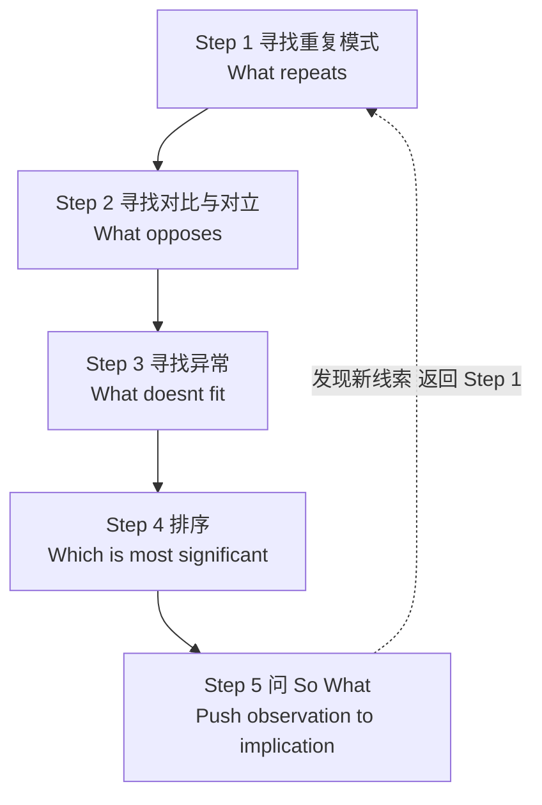

# 第05课：THE METHOD —— 系统的观察方法

## 学习目标

- 掌握 THE METHOD 的五步流程并能独立操作
- 能够区分重复、对比和异常三种观察类型
- 学会对观察结果排序并追问 So What
- 理解 THE METHOD 与 [[../lessons/0003-notice-and-focus|Notice & Focus]]、[[../lessons/0004-so-what|So What]] 的内在关系

## 什么是 THE METHOD？

你有没有过这种体验：面对一段文本或一个话题，你*觉得*有些东西值得分析，但不知道从何入手？

要么是"什么也没发现"（大脑一片空白），要么是"发现太多"（一团乱麻）。THE METHOD 就是来解决这个问题的。

> THE METHOD 是本书最核心的分析工具。它不是玄学，而是一套**可操作的观察流程**——你跟着步骤走，自然会有分析发现。
>
> — *Writing Analytically*, Ch.1

## 五步流程

注意最后一个箭头：THE METHOD **不是**一条直路。第五步的 So What 很可能会让你发现新的观察点，从而回到第一步重新开始。这是一个**迭代循环**。

> [!WARNING] 常见误区
> 初学者常把 THE METHOD 当作"填空"来用——走完五步就觉得结束了。实际上，**分析很少一次完成**。第五步得出的推论往往会暴露出新的观察缺口，推动你回到第一步。这才是分析的常态。

## 五步详解

### Step 1：寻找重复模式（Patterns of Repetition）

**问：什么东西反复出现？**

重复不是巧合——它可能是作者有意或无意的强调。注意：

- 反复出现的**词语**或短语
- 重复出现的**形象、隐喻、比喻**
- 持续的**语气或情绪**（焦虑、平静、讽刺）
- 重复的**句式结构**或**节奏**
- 反复出现的**动作**或**场景**

> [!TIP] 操作提示
> 从 [[../lessons/0003-notice-and-focus|Notice & Focus]] 的列表中寻找重复项。如果你还没有做过 Notice，先做一遍——THE METHOD 需要原始材料。

### Step 2：寻找对比与对立（Patterns of Contrast / Binary Oppositions）

**问：什么东西形成对立？**

分析的本质很大程度是**发现差异**。当两个事物被放在一起对比时，每个事物的特质反而更清晰。

| 类型 | 特点 | 例子 |
|------|------|------|
| 明显对立 | 直接呈现的反差 | 光明/黑暗、安静/喧闹、富裕/贫穷 |
| 隐含对立 | 需要通过上下文推断 | 说话/沉默、行动/等待、在场/缺席 |
| 结构对立 | 由文本布局产生的对比 | 开头/结尾、内部/外部、前面/后面 |

> [!NOTE] 关键区分
> 对比（contrast）是程度上的不同——"更冷 vs 更热"。对立（opposition）是性质上的相反——"冷 vs 热"。两者都有分析价值，但对立通常更富揭示性。

### Step 3：寻找异常（Anomaly）

**问：什么东西不符合模式？**

**这是最有分析潜力的一步。** 一个"异常"之所以让你觉得奇怪，恰恰是因为它违反了某种规则或预期——而揭示这个规则本身，就是分析的核心。

- 什么被**省略**了？（该出现但没有出现的东西）
- 什么让**你停顿**了一下？
- 什么**不匹配**你的预期？

> [!TIP] 技巧
> 如果第一步找到了重复，第三步就去看看——这个重复在什么地方**中断**了？中断点就是异常。

### Step 4：排序（Rank — Which Is Most Significant?）

**问：以上发现中，哪个最重要？**

你从前三步获得了大量观察。现在需要**排序**：

| 排序标准 | 具体问题 |
|---------|---------|
| 最奇怪（Strangest） | "哪个发现最让我惊讶或困惑？" |
| 最集中（Most Central） | "哪个发现能解释其他发现？" |
| 最被强调（Most Emphasized） | "哪个发现反复出现？" |
| 最矛盾（Most Contradictory） | "哪个发现和我的假设最冲突？" |

选出一个作为你的分析入口。剩下的作为辅助证据。

### Step 5：问 So What（Push Observation to Implication）

**问：这说明什么？为什么别人应该在意？**

这一步直接对接 [[../lessons/0004-so-what|So What]] 方法。把你的观察转化为一个有意义的结论：

- "我发现 X 反复出现" → **"这说明……"**
- "我发现 Y 和 Z 形成对立" → **"这揭示了……"**
- "我发现 A 不符合模式" → **"这暗示……"**

如果 So What 答不上来，**回到 Step 1**——你的观察还不够具体，或者选错了排序的对象。

## 实战：完整示范

### 材料：一段关于地铁车厢的描述

> 地铁车厢里几乎空无一人。车厢一端，一个穿西装的男士坐着读报，报纸翻到了体育版。另一端，一个戴耳机的少年盯着地板。车厢中部空荡荡的。日光灯微微闪烁。男士每隔几秒翻一页报纸，少年一动不动。列车到站，没有人上车。车门咝地关上。男士看了一眼手表。少年没有。

### Step 1：寻找重复

| 重复项 | 具体表现 |
|--------|---------|
| 空/无 | "几乎空无一人"、"空荡荡"、"没有人上车" |
| 静止/不动 | "一动不动"、"盯着"、"没有"（三次"没有"结构） |
| 分离 | "一端"、"另一端"、"中部"——空间被切分成孤立的区块 |
| 单方面动作 | 男士翻页、看表；少年不动——但**没有交互动作** |

### Step 2：寻找对比

| 对比项 | 分析 |
|--------|------|
| 西装 vs 耳机 | 两种"城市身份"的对立：职场秩序 vs 青少年亚文化 |
| 翻页/看表 vs 一动不动 | 动作 vs 静止——但两者的共同点是不与外界交互 |
| 明亮的车厢 vs 空无一人的月台 | 内部空间 vs 外部空间的隔绝 |

### Step 3：寻找异常

- **没有人上车**：地铁到站通常有人上下车。这里无人上车，强化了空间的孤立感。
- **少年没有看表**：男士看表暗示他有时间焦虑，但少年完全不受时间约束。两者对"时间"的感知截然不同，却共享同一空间且互不干扰。
- **没有眼神或语言交流**：这是一个公共空间，但没有任何两人之间的交互迹象。

### Step 4：排序

最有分析潜力的发现：**"没有人上车"**——这个细节打破了对地铁的常规预期，同时浓缩了整个场景的孤立氛围。

### Step 5：So What

这条地铁车厢构建了一个**"集体的孤独"**场景——人们以高度个体化的方式共存于同一空间，不存在任何实质性互动。"无人上车"不仅加深了物理上的空旷感，更象征性地呈现了城市生活的一种状态：**并存却不连接**。男士和少年虽然处于同一车厢，但他们的时间感知（焦虑 vs 静止）和空间行为（占据两端）都在强化这种疏离。地铁——本应是"连接"的交通工具——反而成了孤立的容器。

## 与 Notice & Focus 和 So What 的关系

THE METHOD 不是孤立存在的——它与前两课的工具形成**递进关系**：

| 工具 | 作用 | 在 THE METHOD 中的位置 |
|------|------|----------------------|
| [Notice & Focus](../lessons/0003-notice-and-focus.md) | 提供原始观察材料 | Step 1-3 的观察源头 |
| [So What](../lessons/0004-so-what.md) | 将观察推向含义 | Step 5 的核心引擎 |
| THE METHOD | 系统化观察流程 | 串联以上工具的框架 |

> [!NOTE] 一句话总结
> Notice & Focus 帮你**发现有什么**，THE METHOD 帮你**看到模式**，So What 帮你**解释意义**。

## Troubleshooting

| 卡壳位置 | 症状 | 解决方法 |
|---------|------|---------|
| Step 1 | 找不到重复 | 放慢速度，逐句标记实词（名词、动词、形容词）。换一个材料再试。 |
| Step 2 | 找不到对比 | 把每个元素翻转到反面——热/冷、快/慢、多/少、出现/缺席。 |
| Step 3 | 找不到异常 | 问自己"什么让我觉得奇怪？"哪怕是一闪而过的感觉。相信直觉。 |
| Step 4 | 发现太多选不出来 | 用"最奇怪的"作为排序标准——奇怪通常比有趣更有分析潜力。 |
| Step 5 | 答不出 So What | 回到 Step 1 收集更具体的观察。结论单薄往往是因为证据不够丰富。 |

## 练习

### 练习 1：分析一个日常物品

选一件你身边的物品（手机、水杯、书、钥匙串）。观察它 3 分钟，然后：

1. 找出它的**重复特征**（颜色、形状、材料上的重复）
2. 找出**对比**（设计上的冲突、功能上的矛盾）
3. 找出**异常**（磨损、划痕、不协调的配件）
4. **排序**：哪个细节最有揭示性？
5. **So What**：这个细节告诉你关于这个物品的主人什么？

写 100-150 字的分析段落。

> [!QUESTION] 参考材料
> 假设你观察的是一部手机：手机壳是深蓝色的，正面有一个明显的裂纹。四角都有磨损，但裂纹从右上角延伸到底部。壳背面有指印，分布在握持的位置。

展开参考思路

**重复**：深蓝色（沉稳、中性色）、磨损痕迹（经常使用） 
**对比**：深蓝色的沉稳外壳 vs 裂纹代表的脆弱 
**异常**：裂纹从右上角到底部——如果只是掉落，裂纹通常集中在角落。长裂纹暗示持续的、侧向的受力（可能来自放在裤子后袋时的坐压）。 
**排序**：裂纹的走向 > 四角磨损 > 指印分布 
**So What**：这个手机壳反映了"维持外表（沉稳的蓝色） vs 内部损坏（裂纹）"的张力——它暗示主人可能重视外观上的专业感，但使用习惯并不小心，或正在承受某种持续的压力。

### 练习 2：并列句分析

用 THE METHOD 分析下面这句简短描述：

> 会议室很大，但只有三把椅子。白板上写满了字，但没有人擦。投影仪开着，画面停在登录界面。

写 80-120 字的分析，涵盖至少四个步骤。

展开参考思路

**重复**："但"字结构出现三次——每个句子都是"肯定 + 但 + 否定或未尽"的模式。 
**对比**：大空间 vs 少座椅；写满白板 vs 无人清理；开机 vs 未登录。 
**异常**：投影仪停在登录界面——这是最"未完成"的细节，暗示会议戛然而止。 
**排序**：重复的"但"结构是最重要的发现，因为它揭示了整体模式：**准备就绪却未被使用**。 
**So What**：这个空间充满了"将要发生但尚未完成"的状态——它象征一种组织上的停滞或中断，以及某种没有明说的放弃。

## 自测

> [!QUESTION] THE METHOD 理解检查
>
> 1. THE METHOD 五个步骤的正确顺序是什么？
> 2. 为什么"异常"通常比"重复"更有分析潜力？
> 3. 如果你在 Step 5 卡住了（答不出 So What），你应该怎么做？
> 4. THE METHOD 和 Notice & Focus 有什么区别？

查看答案

1. **重复 → 对比/对立 → 异常 → 排序 → So What**。注意这是一个迭代循环，不是一次性流程——做完 Step 5 可能回到 Step 1。
2. 因为"异常"打破了你对模式的预期——而这个"被打破的预期"本身就是一种隐含的规则。揭示规则（为什么这里会出现异常？）比描述模式（什么在重复？）更深一层。
3. **回到 Step 1** 收集更具体的观察。卡在 So What 通常意味着前面的观察不够具体，或者排序选错了对象。这不是失败——这是迭代的正常信号。
4. Notice & Focus 是"不加筛选地记录 + 排序选一个"——它是**开放式的数据收集**。THE METHOD 是"带着三类观察框架（重复/对比/异常）系统地筛选"——它是**结构化的分析流程**。你可以把 Notice & Focus 的产出作为 THE METHOD 的输入。

## 下一步

你已经掌握了本书最核心的分析工具。下一课将把这些工具应用到文本阅读中：

[[0006-reading-analytically|第06课：Analytical Reading —— 分析性阅读]]

需要快速回顾？查看 [[../reference/the-method-quickref|THE METHOD 速查卡片]]。