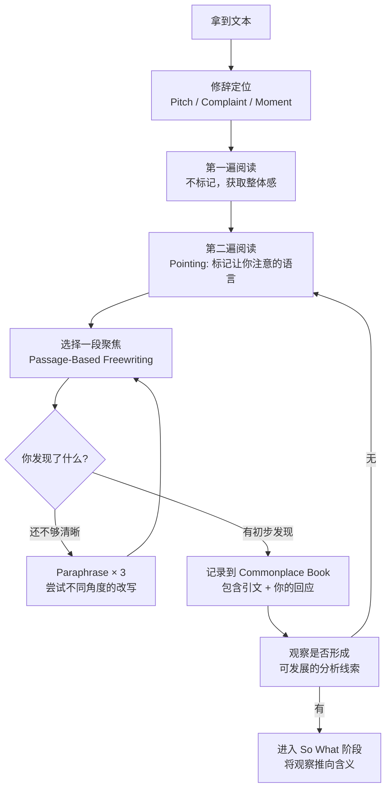

# 第06课：分析性阅读——理解文本如何运作

## 学习目标

- 区分"提取大意式阅读"与"分析性阅读"两种姿态
- 理解"银行存储模式"与"透明语言观"的局限性
- 掌握 POINTING（定点引用）的基本操作
- 能够运用"Pitch / Complaint / Moment"框架定位文本
- 将阅读视为**对话（conversation）**而非接收

## 阅读的两种姿态

大多数人从小到大接受的阅读训练是一种**提取大意（reading for the gist）**的模式：快速扫读，抓住"中心思想"，然后合上书，告诉自己"读完了"。

但分析性写作要求一种完全不同的阅读姿态：

> "The goal of analytical reading is not to extract what a text says but to understand how it works."
> — *Writing Analytically*, Ch.2

这段话值得反复咀嚼。核心区别：

| 提取大意式阅读 | 分析性阅读 |
|---------------|-----------|
| 读完就能"复述内容" | 读完能解释"为什么这样写" |
| 关注结论 | 关注证据和推理过程 |
| 把文本当信息容器 | 把文本当有意图的构造物 |
| 被动的接收 | 主动的对话 |
| 问"作者说了什么？" | 问"作者为什么要这样说？" |

> [!TIP] 关键隐喻的转换
> 不要把自己当成"读者（reader）"，试着把自己当成文本的**对话者（conversant）**——你不是在接收信息，你是在与文本交谈，追问它、质疑它、观察它的选择。
>
> 学会用英语描述这种姿态：**"learning to be conversant with the text."**

## 两个需要破除的"迷思"

### 迷思一：银行存储模式（The Banking Model of Education）

巴西教育学家保罗·弗莱雷（Paulo Freire）提出了一个著名的批判：传统教育把学生当成"银行账户"，教师（或文本）是"存款人"，学习就是不断存入信息的过程。

> [!WARNING] 这种模式对分析的危害
> 如果你认为自己是在"接收"文本中的信息，你就不会去质疑文本的选择——为什么用这个词而非那个词？为什么从这个角度切入而非另一个？你会把文本当成"自然"的、理所当然的东西。

分析性阅读的起点：**文本不是一个透明的信息窗口，而是一个经过无数选择的构造物。**

### 迷思二：透明语言观（The Transparent Theory of Language）

这是本章最关键的理论点之一。

许多人默认地认为：**语言是透明的（transparent）**——它像一块干净的玻璃，思想在玻璃后面，语言只是"传递"思想的工具。

但本书主张相反的观点：

> **Language is not transparent. Language shapes meaning.**

同样的"事实"，用不同的语言表达，会产生完全不同的含义。语言不只是"说什么"，它本身就是"怎么说"——而"怎么说"决定了读者感受到什么。

**例子：**

想想这句话的不同说法：
- "抗议者在广场上聚集。"
- "暴民在广场上集结。"
- "市民在广场上集会。"

三个句子描述的可能是同一群人、同一个场景，但因为语言选择不同，读者对这群人的印象截然不同。

> [!NOTE] 这对你意味着什么
> 当你做分析性阅读时，你需要**关注语言本身**——不仅仅是"作者说了什么"，而是作者**选择了哪些词、什么句式、什么比喻、什么语气**。这些选择就是分析的对象。

## 分析性阅读的核心工具

### 1. POINTING（定点引用）

Pointing 是最简单的分析工具——你直接引用原文中让你注意到的词或短语，然后说明为什么你注意到它。

**操作方式：**

> "The author uses the word **[X]** , which makes me notice **[Y]** ."

就这么简单。关键是把**具体的语言**和**你的观察**连起来。

**示例：**

> 原文："教育改革不应该用**一刀切（one-size-fits-all）**的方式推进。"
>
> Pointing："我注意到作者用了'一刀切'这个比喻。这个比喻把一个复杂的社会政策问题简化成了服装裁剪的意象——暗示统一的方案天然是不合适的。这个比喻本身就在做修辞工作（rhetorical work），而不只是传递信息。"

### 2. Paraphrase × 3（三重释义）

这个工具非常重要，将在[[0007-paraphrase-focus|第07课]]中详细展开。这里先给出一个简单的预览：

同一段话，用三种不同的方式改写：

1. **字面版**：最接近原文的改写
2. **聚焦版**：从特定角度（如修辞策略）改写
3. **批判版**：以质疑的姿态改写（"作者真正想说的是……"）

三重释义的目的是：**同一个段落可以有不止一种理解方式。**你的任务不是找到"正确"的释义，而是拓展你对文本可能性的理解。

### 3. Passage-Based Focused Freewriting（段落聚焦自由写作）

选一段让你"卡住"或"觉得奇怪"的段落，设定10分钟，不间断地写，只围绕这一段展开。

> [!TIP] 操作提示
> 不要试图分析整篇文章。只选**一个段落**——越短越好（甚至一句话都可以）。把它抄在纸上，然后开始自由写作。
>
> 关键问题：
> - "这让我想到什么？"
> - "为什么这个段落放在这里？"
> - "如果这一段被删掉，文章会有什么不同？"
> - "这一段在全文中的作用是什么？"

### 4. 摘句簿（Commonplace Book）——让你的笔记本成为你的智库

**Commonplace Book** 是一种古老的知识管理传统——不是记笔记（note-taking），而是积累你在阅读中遇到的有价值的段落和你的回应。

> **A commonplace book is not a summary journal. It is a collection of passages that strike you, along with your own commentary on them.**

**如何操作：**

- 读到让你停下来思考的段落——**抄下来**（整段或关键句）
- 在下面写下你自己的回应：为什么这段引起你的注意？它和你其他阅读有什么关联？
- 标注日期和来源
- **不要摘抄"中心思想"——而是摘抄"让你感到困惑、兴奋、不同意、或觉得特别精彩的段落"**

> [!NOTE] Commonplace Book vs. 传统笔记
> 传统笔记是你的"外部记忆"——帮你记住什么。
>
> Commonplace Book 是你的"思维训练场"——帮你**与文本对话**。它的价值不在"存储"，而在"积累过程中的思维痕迹"。

## 定位文本：修辞阅读（Rhetorical Reading）

分析性阅读不仅仅是读文本本身，还要把文本**放回它的语境中（situate the text）**。

**每次阅读前，问自己这四个问题：**

1. **Who wrote this?**（谁写的？——作者的身份、立场、信誉）
2. **For whom?**（写给谁？——目标读者是谁？他们已有的信念是什么？）
3. **Why?**（为什么写？——作者的目的是什么？他/她想要读者相信什么、做什么？）
4. **In what context?**（在什么背景下？——这篇文章是在什么历史、社会、学术语境下产生的？）

### Pitch / Complaint / Moment 框架

本书提供了一个更具体的定位工具——从三个维度锁定一个文本：

| 维度 | 问题 | 翻译 |
|------|------|------|
| **Pitch** | What is this text *selling*?（它在"推销"什么观点/价值？） | 它的主张 |
| **Complaint** | What is it *arguing against*?（它在反驳什么？） | 它的对立面 |
| **Moment** | What is the *occasion* for this text?（它的写作契机是什么？） | 它的时机 |

> [!TIP] 这个框架为什么有用？
> 大多数文本不是凭空产生的——它们是在回应某个已有的讨论、问题或争议。如果你能找到文本的 Compliant（它在反对什么），你就找到了它的**动力来源**。

## 分析性阅读的完整流程

下面这个 Mermaid 流程图概括了你从拿到一篇文本到完成分析性阅读的全过程：

> [!NOTE] 这不是线性流程
> 上图不是一个严格的步骤清单，而是一个**来回往返（recursive）**的过程。你可能会在自由写作后回到"定位"阶段，也可能会在 Commonplace Book 的记录中发现新的 Pointing 机会。分析的魅力正在于这种来回往返。

## 练习

> [!QUESTION] 练习：分析性阅读实战
> 找一篇你最近读过的短文章（或教材中的任意一段，200字左右）。
>
> 完成以下三步：
>
> **Step 1 —— 修辞定位：**
> - Pitch：它在"推销"什么观点？
> - Complaint：它反对什么？
> - Moment：它为什么现在出现？
>
> **Step 2 —— POINTING：**
> 找出文中一个让你注意的词或短语，引用它，并写下你为什么注意到它。
>
> **Step 3 —— 反思：**
> 在完成 Step 1-2 后，你对这篇文本的理解发生了什么变化？

示例参考（以一段科普文章为例）

**假设文本：**"社交媒体算法不仅改变了我们消费信息的方式，更在潜移默化中重塑了我们的思维方式。"

**Step 1 —— 修辞定位：**
- Pitch：算法不仅影响"我们看到什么"，还影响"我们怎么思考"
- Complaint：反对"算法只是信息分发工具"的中性论调
- Moment：社交媒体对人类认知的影响成为公共议题的当下

**Step 2 —— POINTING：**
我注意到"潜移默化"这个词。这个词暗示变化是在不知不觉中发生的，读者完全没有抵抗能力。如果作者直接说"算法在改变我们的思维"，这个说法是可以被质疑的（"我思维没变啊"）。但加上"潜移默化"后，任何反对都被预设为"你只是没意识到"——这个词本身在瓦解可能的反驳。

**Step 3 —— 反思：**
原来我以为这段话只是在陈述事实。经过修辞定位和 Pointing 后，我发现这段话本身就是一个修辞构造——它在用语言策略（"潜移默化"）来使自己的主张不可反驳。

## 自测

> [!QUESTION] 自测题
> 以下哪个行为**最不符合**分析性阅读的姿态？
>
> A. 抄下一段让你困惑的话到 Commonplace Book 中
> B. 读完文章后，判断"这个作者很正确"
> C. 追问"作者为什么要选这个例子而非另一个？"
> D. 发现文章在反对一个你认为理所当然的观点

查看答案

**正确答案：B**

判断"这个作者很正确"是典型的提取大意式阅读——你关注的是"结论是否与你一致"，而不是"文本是如何运作的"。

分析性阅读的读者可能会认为某个作者很正确、很有洞察力，但在做出这个判断之前，他们已经仔细考察了作者的语言选择、修辞策略和论证结构。**"正确"是你分析之后可能的结论，而不是阅读的出发点。**

有趣的是，A（抄下困惑的段落）反而是最符合分析性阅读的姿态——你不是在寻找与你一致的、让你舒适的内容，你是在追踪那些让你**卡住**的东西。这正是分析的入口。

## 下一步

你已经掌握了分析性阅读的核心理念和框架。接下来进入最具体的两个精读工具——[[0007-paraphrase-focus|第07课：三重释义与段落聚焦自由写作]]，学习如何用 Paraphrase × 3 和 Passage-Based Focused Freewriting 深入文本内部。