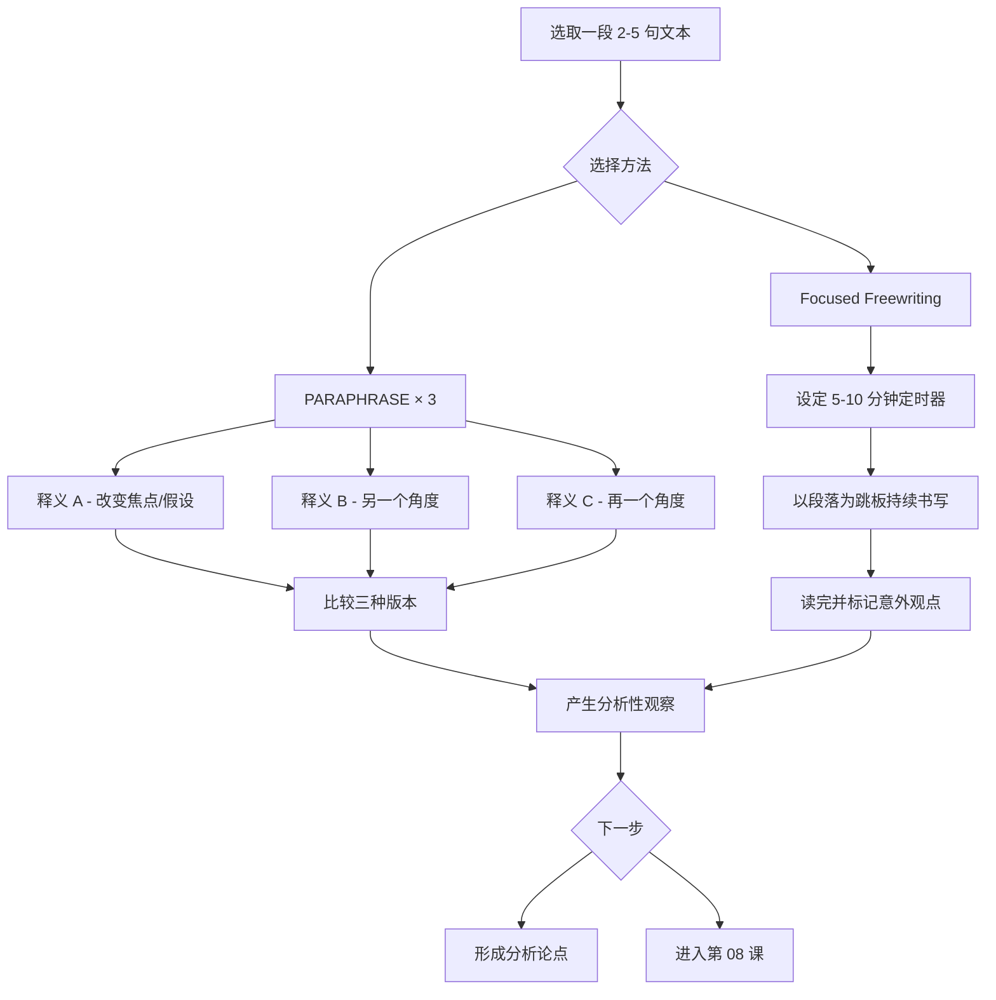

# 第07课：三重释义与段落聚焦自由写作

## 学习目标

- 理解 **paraphrase（释义）** 不是总结，而是一种分析工具
- 掌握 **PARAPHRASE × 3** 方法——用三种不同的语言重述同一段话，挖掘不同层次的含意
- 学会使用 **Passage-Based Focused Freewriting** 以段落为跳板进行探索性写作

## 什么是分析性释义？

很多学生认为 paraphrase 就是 "换一种说法"——把原文的词语替换成同义词，保持原意不变。这在中学也许够用，但在分析写作中，这远远不够。

> [!ABSTRACT] 核心区分
> **总结（summary）** 问："这段话说了什么？"
> **释义（paraphrase）** 问："这段话还可以怎么理解？"

分析性释义的要点不是保持意思**不变**，而是**改变**意思的侧重点、假设或语气，从而揭示原文中隐含的不同可能性。

> [!TIP] Key Insight
> 一个文本通常含有不止一种逻辑。你换一种方式重述它，你就会注意到之前被忽略的措辞、预设或矛盾——这些恰恰是分析的起点。

## PARAPHRASE × 3

**PARAPHRASE × 3** 的做法很简单：选取一段 2-5 句长的文本，写出三种不同的释义版本。关键要求是——三种释义必须在**焦点**、**隐含假设**或**逻辑倾向**上形成差异。

三种版本的常见差异类型：

| 维度 | 释义 A | 释义 B | 释义 C |
|------|--------|--------|--------|
| 因果归因 | 强调外部原因 | 强调内部原因 | 强调系统原因 |
| 行动者 | 主语是个人 | 主语是群体 | 主语是结构 / 环境 |
| 评价基调 | 中性陈述 | 批判性重述 | 同情性重述 |
| 隐含假设 | 现状合理 | 现状有问题 | 现状可改变 |
| 时间取向 | 着眼于过去 | 着眼于当下 | 着眼于未来 |

### 示例

假设源文本是：

> "The company is restructuring its operations to improve efficiency."

**释义 A（管理视角——效率至上）：**
> "这家公司正在重新调整运营架构，目标是消除冗余流程、提高资源利用率。"

- **焦点**：技术的、管理层面的改进
- **隐含假设**：效率低是内部流程问题，可以通过结构优化解决
- **忽略了什么**：员工感受、市场环境、客户影响

**释义 B（员工视角——隐含批判）：**
> "公司正在以'提升效率'为名进行重组，真正的结果可能是一轮裁员和预算削减。"

- **焦点**：重组的实际代价
- **隐含假设**："提升效率"是管理层的修辞，重组往往等同于裁员
- **揭示了什么**：行动与言辞之间的潜在张力

**释义 C（系统视角——生存逻辑）：**
> "面对市场压力，这家公司被迫通过重组来维持竞争力，否则就有被淘汰的风险。"

- **焦点**：外部驱动力
- **隐含假设**：重组是防御性的，不是主动优化的选择
- **揭示了什么**：公司的被动处境，效率改善是生存手段而非目标

把三版释义放在一起看，你得到的不是"哪个是对的"，而是**一个更完整的图景**：同一个事件可以从管理修辞、员工体验和市场生存三个角度来理解。这正是分析的起点。

## Passage-Based Focused Freewriting

### 什么是段落聚焦自由写作？

**Focused Freewriting** 不同于完全自由写作——它不是"天马行空"，而是以**一段具体文本**为跳板，在限定时间内（通常 5-10 分钟）持续书写，不删改、不评判、不打断。

做法流程：

1. **选一段话**——最好是原文中让你感到困惑、不舒服或特别有意思的段落
2. **设定定时器**（5-10 分钟）
3. **以这段话为起点开始写**——可以从"这段话让我想到……"开始，也可以直接追问"为什么作者要这么写？"
4. **不停止、不回头**——即使写"我不知道写什么"也不要停
5. **读完**——圈出你话里出现的意外观点或关键短语

### 对比：PARAPHRASE × 3 vs. Focused Freewriting

| 维度 | PARAPHRASE × 3 | Focused Freewriting |
|------|----------------|---------------------|
| 产出形式 | 三个精炼的释义句子 | 一段持续的散文 |
| 思维模式 | 结构化、对比性 | 流动的、探索性 |
| 目标 | 找出文本的不同逻辑可能性 | 挖掘自己对文本的隐性反应 |
| 用时 | 5-10 分钟 | 5-10 分钟 |
| 最佳时机 | 逐句精读时 | 读完一个段落或章节后 |

## 流程总览

## 何时使用

- **PARAPHRASE × 3** 适合当你感觉原文"意思很明确"但又觉得可能有更多东西时——它强迫你看到不止一种理解方式。
- **Focused Freewriting** 适合当你读完后头脑中有一团模糊的感受，但说不清楚是什么时——它帮你把模糊的感受变成看得见的文字。

## 练习

> [!QUESTION] 练习 1：PARAPHRASE × 3
> 对以下这段话进行三重释义。要求三版释义在隐含假设或评价基调上有明显差异。
>
> 原文：
> > "Social media platforms have revolutionized the way people communicate, making it easier than ever to stay connected across long distances."

参考答案

**释义 A（技术乐观派）：**
> "社交媒体彻底改变了人类沟通方式，让跨地域的联系变得前所未有的便捷。"
> - **假设**：更多的连接是好的，技术进步自然提升了沟通质量。

**释义 B（批判派）：**
> "社交媒体号称'革命了沟通'，但更便捷的联网未必带来了更深的理解——联系的广度是以深度为代价的。"
> - **假设**：便利性不等于质量，社交媒体可能牺牲了真正的人际深度。

**释义 C（历史语境派）：**
> "社交媒体只是长距离通信工具演进中的最新一环——从书信到电话到电邮再到社交平台，每一次都被称为'革命'。"
> - **假设**："革命"这个说法带有历史循环的意味，社交媒体未必是最特殊的一次。

> [!QUESTION] 练习 2：Focused Freewriting
> 找一篇你正在读的文章，选一段让你感到迷惑或有强烈反应的 3-5 句话，设定 7 分钟定时器，以该段落为跳板进行一次 Focused Freewriting。写完后用 2 分钟标记你话里出现的意外观点。

## 本课小结

- **Paraphrase** 不是同义词替换——它是改变焦点和假设来揭示文本的不同层面
- **PARAPHRASE × 3** 要求三种释义在分析维度上有系统性差异
- **Passage-Based Focused Freewriting** 用段落作为跳板，在限定时间内探索自己的隐性反应
- 两者是互补的精读工具，前者结构化，后者流动性

## 下一步 → [[0008-binaries-lens|第 08 课：追踪二元对立与用阅读作为透镜]]

在第 08 课中，你将学习另外两种更高级的分析阅读策略：**Tracking Binaries（追踪二元对立）** 和 **Applying a Reading as a Lens（将某个阅读作为透镜）**，它们将帮你从文本中提取更系统的分析框架。