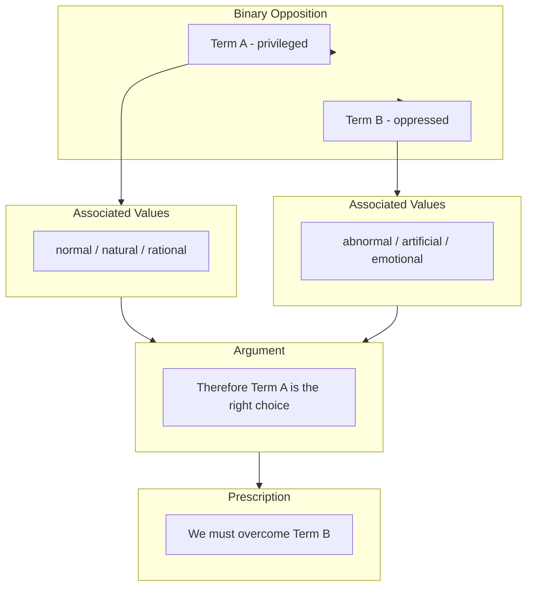

# 第08课：追踪二元对立与用阅读作为透镜

## Learning Objectives

- 理解什么是 **binary opposition（二元对立）**，以及它在分析性阅读中的核心地位
- 学会在文本中 **track binaries（追踪二元对立）** -- 识别出成对的概念并判断哪一方被赋予特权
- 学会 **reformulate binaries（重构二元对立）** -- 打破"非此即彼"的僵化对立，揭示二者之间的动态关系
- 掌握 **applying a reading as a lens（用阅读作为透镜）** 的方法 -- 把一个文本的分析框架应用到另一个文本或现象上

## What Are Binaries and Why They Matter

**Binary opposition** 是指文本中成对出现的、相互对立的概念组合。结构主义批评家指出，人类思维倾向于通过二元对立的模式来组织经验。常见例子包括：

| 对立对 | 被赋特权的一方 | 被贬抑的一方 |
|---|---|---|
| nature / culture | culture | nature |
| mind / body | mind | body |
| reason / emotion | reason | emotion |
| civilized / primitive | civilized | primitive |
| public / private | public | private |
| self / other | self | other |
| male / female | male | female|

关键观察：**二元对立从来不是中性的**。文本总是有意无意地将其中一方置于优越地位。追踪二元对立的目的不是"发现对错"，而是看清文本借用了哪些对立框架来构建其论证。

## How to Track Binaries

追踪二元对立可以按照以下步骤操作：

1. **找出成对概念** -- 在文本中寻找明显或隐含的对立词。例如，一篇文章反复谈论"理性决策"和"情绪冲动"，就构成一对 reason / emotion。
2. **标记被赋特权的一方** -- 看作者用哪种语调、哪些修饰词来描述每一方。被特权的一方通常被描述为"自然的""正常的""理性的"；对立面则被描述为"有问题的""需要被克服的"。
3. **寻找被掩盖的中间地带** -- 二元对立的问题在于它排除了光谱上的中间状态。问自己：是否真的只有这两极？

> [!TIP] Key Insight
> 追踪二元对立的最终目的不是列出一个表格就结束，而是**看到文本借用了什么框架来组织世界**。一旦你看到了这个框架，你就有机会质疑它、重构它。

## Reformulating Binaries

追踪到二元对立之后，真正的分析工作才刚刚开始 -- **reformulation（重构）**。重构不是简单地颠倒特权顺序（那只是制造了一个新的二元对立），而是要展现出这对概念实际上如何相互依赖、互相渗透。

**重构策略**：

- **Show interdependence** -- 指出双方其实互相定义。没有"自然"，"文化"就没有参照物；没有"身体"，"心灵"就无处栖身。
- **Find the middle ground** -- 在两个极端之间定位一个具体的、混合的例子，证明二元对立过于简化。
- **Historicize the binary** -- 追问这个二元对立是何时、因何而产生的？它服务于谁的利益？

**示例**：一篇推崇"理性决策"的文章隐含了 reason / emotion 的对立。重构时你可以论证：最优秀的决策恰恰需要情绪参与（如 Damasio 的 somatic marker hypothesis），理性与情感并非对立，而是协作。

## Mermaid: How Binaries Structure Meaning

下面的流程图展示了一个二元对立如何在文本中**建构意义** -- 从一组对立概念出发，通过赋予一方特权，最终推导出一个论证结论。

> 注意：这个结构本身不是"错误"的 -- 很多有效的论证都依赖二元框架。分析的任务是**意识到框架的存在**，并在必要时挑战它。

## Worked Example: Applying a Reading as a Lens

**Applying a reading as a lens** 是指你用一篇文本中提炼出的分析框架（包括它的核心概念、二元对立、论证逻辑）来审视另一篇文本或一个社会现象。

**示例**：假设你读了一篇关于"消费社会中自然/文化二元对立"的文章（文本 A）。这篇文章论证：商家通过将产品包装为"自然的"来掩盖其高度工业化的生产过程。

现在你用这个框架作为 **lens（透镜）** 来分析一则护肤品的广告文案（文本 B）。广告宣称："我们的精华液采用**天然**植物萃取，让你的肌肤回归**本真**状态。"

用文本 A 的透镜来看：
- "天然"在这里不是对产品成分的描述，而是一个**文化符号**，用来激活 nature/culture 的二元对立。
- 广告隐含地贬低"化工产品"（culture 一方），将其与"不自然""有害"联系起来。
- 但实际上，这瓶精华液同样经过了复杂的实验室提纯、乳化、防腐处理 -- 它本身就是 culture 的产物。
- **重构**：真正有意义的区分不是"天然 vs. 合成"，而是"透明度高 vs. 透明度低的制造过程"。

这个例子展示了：**用一个文本的分析框架去读另一个文本，能让你看到后者自己看不到的前提假设**。

## Practice

选择一篇你正在阅读的学术文章或新闻报道，完成以下练习：

1. **Track**：找出文本使用的一对核心二元对立。用表格列出双方及其对应的修饰词。
2. **Privilege**：判断哪一方被赋予特权，并引用文本中至少一处证据。
3. **Reformulate**：写一段 3-5 句话的分析，展示这对概念实际上如何相互依赖或存在中间地带。
4. **Lens**（进阶）：从本课的例子中借用 nature/culture 对立作为透镜，分析你日常遇到的另一个文本（例如一个食品包装、一条招聘广告、一张电影海报）。

> [!QUESTION] Self-check
> 请判断以下说法是否正确： 
> "二元对立分析的目的就是找出文本中隐含的'好 vs. 坏'的分类，然后批评作者立场有偏见。"
>
> 如果你认为是正确的，请在 Reveal answer 之前自己试着想一想：这种做法的分析性在哪里？还缺少什么步骤？

Reveal answer

**这个说法不完全正确，或者说只做了一半。**

找出"好 vs. 坏"的分类只是 **tracking（追踪）** 步骤，它确实能让你看到文本的价值前提。但如果到此为止，你就只是在做"立场检举"（position-spotting），而不是分析。

分析发生在 **reformulation（重构）** 阶段：当你追问这对对立是否站得住脚、双方如何相互依赖、有没有被排除在框架之外的中间状态时，你才开始生产自己的 insight。

好分析 = tracking + reformulation + (理想情况下) 把分析框架作为 lens 应用到新的材料上。

## Next Step

当你能够熟练追踪和重构二元对立，并用一个文本的框架作为透镜去读另一个文本时，你就拥有了分析性阅读中最强大的工具之一。在 [[0009-interpretation|第09课：Interpretation -- 从观察到论证]] 中，我们将把这些阅读策略转化为正式的 interpretive arguments。