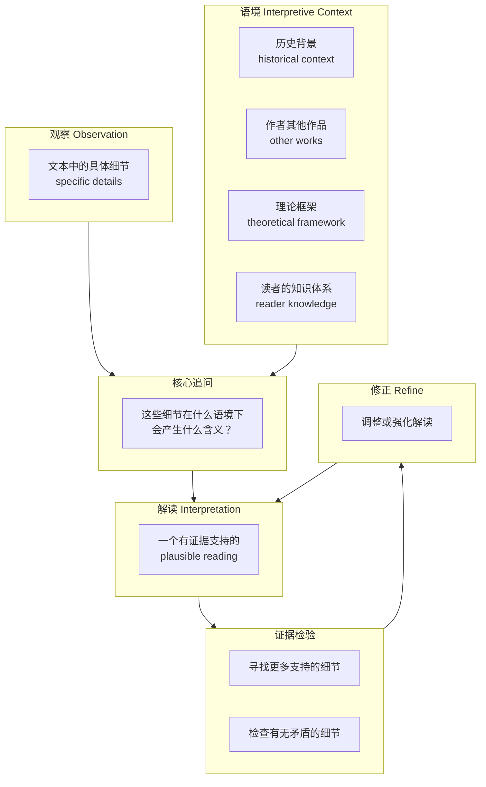

# 第09课：解读 —— 从观察到含义

## Learning Objectives

- 理解 **interpretation（解读）** 的本质：从 observation（观察）到 implication（含义）的推理过程
- 区分"有依据的含义推断"与"猜测隐藏信息"之间的根本差异
- 避开两种极端：**Fortune Cookie School**（幸运签语饼式解读）与 **Anything Goes School**（怎么都行式解读）
- 掌握 **interpretive context（解读语境）** 如何塑造你看到的东西
- 理解 **intention（作者意图）** 作为解读语境的效力与局限
- 初步接触 **figurative logic（比喻逻辑）** 与 **Seems to Be About X, But Is Really About Y** 公式

## What Interpretation Is (and Is Not)

**Interpretation** 是从 observation（你在文本中看到的具体细节）通向 implication（这些细节意味着什么）的推理过程。它不是"猜谜"，而是一种 **evidence-based reasoning（基于证据的推理）**。

| 解读*不是* | 解读*是* |
|---|---|
| 寻找文本的"隐藏信息"或"密码" | 为一个特定的阅读方式构建 plausible case（可信的论证） |
| 猜作者心里在想什么 | 用文本中的证据 + 语境线索推导含义 |
| 宣布一个绝对正确的答案 | 提出一个有说服力的、可被质疑的解读 |

> [!TIP] Key Insight
> 把你的解读想象成一个 **legal argument（法庭论证）** ：你不需要证明"这就是唯一的真相"，你只需要证明"这个解读比其他的解读更合理、更有证据支持"。文本没有唯一的"正确答案"，但有**更好的和更差的解读**。

## Two Extremes to Avoid

教材提出了两种需要警惕的极端立场：

### 1. Fortune Cookie School（幸运签语饼式解读）

这种立场认为每一个文本都有一个简单的、预先包装好的"寓意"，就像幸运签语饼里的纸条一样。持这种态度的人会在读完一首诗或一篇文章后说："这篇文章告诉我们，友谊很重要。"

**问题**：它把文本简化为一句陈词滥调，抹杀了所有复杂性、矛盾和值得分析的细节。

> [!WARNING]
> 如果你发现自己写出的解读可以用一句话概括为"人人都知道的道理"，你很可能落入了 Fortune Cookie School 的陷阱。**好的解读应该让人感到意外，但又合情合理。**

### 2. Anything Goes School（怎么都行式解读）

这种立场认为任何解读都一样有效，因为"意义是主观的"。

**问题**：如果任何解读都成立，那么分析就失去了意义——你无法区分有洞察力的解读和荒谬的解读。

**正确的中间立场**：解读的质量取决于它能否：
- 被文本中的具体证据支持
- 解释那些"奇怪"或"不和谐"的细节（而不仅仅是忽略它们）
- 在一个合理的 **interpretive context（解读语境）** 中具有说服力

## The Role of Interpretive Context

你看到什么，取决于你用什么框架去看。这就是 **interpretive context** 的作用。

> [!NOTE]
> 同一个细节在不同的 **interpretive context** 中会产生不同的含义。例如，一个角色在故事开头望向窗外——如果你用"精神分析"的语境去读，它可能象征无意识的渴望；如果你用"现实主义"的语境去读，它只是角色在等公交车。关键不是哪个"对"，而是你的语境选择是否合理、是否一贯。

## Intention as Context: Use with Caution

一个常见的解读策略是追问："作者想表达什么？" —— 即 **authorial intention（作者意图）**。

**它的价值**：了解作者的背景、言论、其他作品确实可以提供有用的语境线索。

**它的局限**：

- **Intentional fallacy（意图谬误）** —— 文本的含义不等于作者写的时候"心里想"的东西。作者可能并不完全清楚自己在表达什么。
- 文本一旦被写出来，就独立于作者的意图存在。
- 过度依赖意图会关闭分析：如果你认为"作者说了算"，那你就没有空间去发现文本中作者可能没有意识到的东西。

> [!WARNING] A Better Approach
> 与其问"What did the author mean?"，不如问："**What does the text say, and what plausible meanings can be supported by evidence?**" 作者意图可以作为语境之一，但不应成为解读的最终仲裁者。

## Implications vs. Hidden Meanings

教材强调了一个关键区分：

| Implications（含义） | Hidden Meanings（隐藏含义） |
|---|---|
| 通过文本中的证据推导出来 | 声称文本中藏着"密码" |
| 可以被质疑和讨论 | 声称自己是"唯一真相" |
| 依赖语境和推理 | 依赖直觉和猜测 |
| 示例："这则广告把产品放在大自然中，暗示该产品是'天然的'——但这个暗示需要被检验" | 示例："这则广告里藏了一个撒旦符号" |

> [!TIP]
> 在写分析时，使用"暗示"语言而不是"隐藏"语言会更有说服力：
> - 好的：**"The text implies that..."** / **"This detail suggests..."**
> - 不好的：**"The hidden meaning here is..."** / **"The author secretly wants us to know..."**

## Figurative Logic: A First Look

**Figurative logic（比喻逻辑）** 关注的是：当一个文本把 X 比作 Y 时，这个比喻**邀请你做什么样的推理**？

例如，如果一篇文章把"教育改革"比作"战争"：
- 战争有敌人 → 教育改革也有需要被打败的对象
- 战争需要牺牲 → 教育改革也需要牺牲
- 战争有胜负 → 教育改革也最终会有赢家和输家

比喻不仅仅是修辞装饰——它在悄悄塑造你的思维框架。

> 在 [[0010-figurative-logic|第10课：比喻逻辑]] 中，我们会深入探讨这个分析工具。

## The Formula: "Seems to Be About X, But Is Really About Y"

这是教材提供的一个非常实用的解读公式：

> **This text / passage / image seems to be about X, but it is also (or is really) about Y.**

这个公式的价值：

- 它迫使你超越文本的表面主题（X）
- 它要求你用一个更深层或更意外的主题（Y）来 re-frame（重新框定）文本
- 好的 Y 应该让人感到"意料之外，情理之中"

**示例**：一篇看似关于"如何提高工作效率"（X）的文章，实际上可能是在维护一种特定的中产阶级工作伦理（Y）——它隐含地贬低了"休息"和"闲暇"，把它们等同于"懒惰浪费"。

> [!QUESTION] Try This
> 找一篇你最近读过的新闻或专栏文章。先在一句话里概括它的表面主题（X），然后尝试追问：**这篇文章是否可能在讨论一个更深层的问题（Y）？** 注意：Y 不需要推翻 X —— 它只是说，这篇文本除了 X 之外，还在做另一件事。

## Common Logical Fallacies to Watch For

在做解读时，避免以下常见的 **logical fallacies（逻辑谬误）**：

| 谬误 | 含义 | 在解读中的表现 |
|---|---|---|
| **Intentional Fallacy** | 把文本含义等同于作者意图 | "作者在文章开头写了这句话，所以整篇文章都是这个意思" |
| **Affective Fallacy** | 把读者的情感反应等同于文本含义 | "我读完觉得悲伤，所以这篇文章是关于悲伤的" |
| **Hasty Generalization** | 从太少证据推出太广泛的结论 | "文本里出现了一次火车，所以整本书是关于工业化的" |
| **Circular Reasoning** | 用结论来证明前提 | "文本是悲观的，因为它的语调是悲观的"（你怎么知道语调是悲观的？因为文本是悲观的……） |
| **Either/Or Fallacy** | 把复杂问题简化为两个极端 | "你要么认为这是女性主义文本，要么认为它是反女性主义的" |

## Worked Example: One Image, Two Levels

让我们用一幅**虚构的杂志封面**来展示从观察到解读的过程。

**场景**：一本旅游杂志的封面，标题是 "Escape the City"，背景是一张空无一人的白色沙滩照片，左下角有一棵棕榈树，画面上没有一个人。

| 步骤 | 内容 |
|---|---|
| **Observation 1** | 画面上没有人，只有自然景观 |
| **Observation 2** | 标题用词是 "Escape"（逃离），而不是 "Visit"（探访）或 "Explore"（探索） |
| **Observation 3** | 色彩以白色和蓝色为主，色调清凉、安静 |
| **Step 1: Build a surface reading (X)** | 这个封面是关于"去一个美丽的海滩度假"——它在推广一个旅游目的地。 |
| **Step 2: Ask what else might be going on (Y)** | 为什么强调"逃离"？为什么没有任何人？为什么色彩如此冷淡？ |
| **Interpretation (Y)** | 这个封面看似在推广一个海滩（X），但**它真正在推销的是一种"缺席"的体验——它不是让你去某个地方，而是让你逃离某件事（城市生活、他人、喧嚣）**。空无一人的画面不是在展示目的地，而是在承诺"你将是那里唯一的人"。 |
| **Evidence** | "Escape"暗示了"从某处逃离"（城市）；无人画面强化了这个 promise —— 你不会被打扰。 |

> [!NOTE]
> 注意：这个解读并没有说"这则广告隐藏了一个邪恶的信息"。它只是在说：**如果你只看"这是在推荐海滩"，你就错过了封面真正的 persuasive strategy（说服策略）**——它不是在卖目的地，而是在卖孤独、卖安静、卖"逃避的自由"。

## Practice

> [!QUESTION] Try This: Interpret a Simple Object
> 以下是一杯普通瓶装水的广告文案："源自3000米雪山，每一滴都经过30年天然过滤。"
>
> 1. 列出至少 3 条 observation（文本中的具体细节）
> 2. 写出一个 "Seems to Be About X, But Is Really About Y" 的解读
> 3. 找到至少 2 条证据来支持你的 Y
> 4. 问自己：如果换一个 interpretive context（例如用环保主义的视角重新读），你的解读会如何变化？
>
> 完成后，对比参考答案。

Reveal answer

**可能的 Observations**：
1. 强调"3000米"——距离很远、难以到达
2. 强调"30年"——漫长的时间，人类无法等待那么久
3. 强调"天然"——没有人为干预、纯净

**Seems to Be About X, But Is Really About Y**：
- X: 这瓶水来自一个纯净的源头，因此它更安全、更健康
- Y: 这条文案真正在表达的，不是水的质量，而是**人类对"不可企及之物"的崇拜**——"远"和"久"本身变成了价值。它暗示：**难以到达的地方 = 更纯净；漫长的自然过程 = 更高的品质**。这是一种对"人工可控制性"的隐性批评，同时又用工业化手段包装出来的"自然"来赢得消费者。

**证据**：
- "3000米"——如果泉水就在城市旁边，它会显得不那么"珍贵"
- "30年天然过滤"——如果过滤只需要3个月，文案就不会这么写。时间长度本身成为了卖点

**换一个语境**：
如果从环保主义视角重新读，这段话就变得讽刺了：真正的雪山泉水被装进塑料瓶、运输到城市，每生产一升瓶装水需要消耗三升淡水。所谓"天然"的产品，其生产方式极不天然。

## Next Step

完成了这一课，你已经理解了 **interpretation** 的核心逻辑：从观察出发，通过语境和证据构建一个 plausible 的含义。在下一课 [[0010-figurative-logic|第10课：比喻逻辑]] 中，我们将聚焦于一种最强大的解读工具——**figurative logic（比喻逻辑）**，学习如何分析文本中的比喻如何塑造论证。