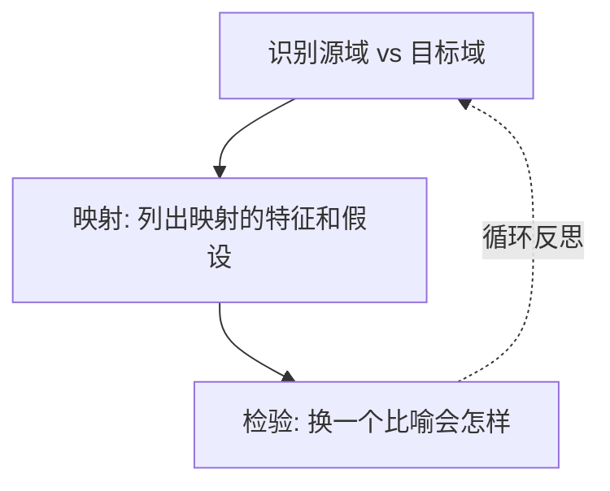

# 第10课：比喻逻辑——"看似有关X，实则关于Y"

## 学习目标

- 理解比喻逻辑（figurative logic）——隐喻和类比如何暗含论证
- 掌握分析比喻语言的三步法：识别、映射、检验
- 运用公式 "Seems to Be About X, But Could Also Be (Or Is Really) About Y" 进行更深层次的解读

## 什么是比喻逻辑？

比喻（figurative language）——隐喻、明喻、类比——不仅仅是"修辞装饰"。每个比喻都携带一个**隐含的论证**，因为它用一个事物（源域）来理解另一个事物（目标域），而这个映射过程本身就**锁定了某种看待方式**，同时**遮蔽了其他可能性**。

> [!ABSTRACT] 定义
> **比喻逻辑（Figurative Logic）** 是指通过识别比喻性语言中隐含的比较关系，揭示其背后假设和论证的分析方法。分析者的任务不是欣赏比喻有多"生动"，而是追问：**这个比喻为什么要这么打？它默认了什么？**

### 为什么比喻是分析对象？

| 理由 | 说明 |
|------|------|
| 比喻选择性 | 每个比喻强调某些方面，忽略另一些方面 |
| 比喻有立场 | 选择什么比喻本身就表达了态度（如"移民是潮水"vs"移民是新鲜血液"） |
| 比喻框定问题 | 一旦接受了某个比喻，你就接受了它预设的"问题是什么" |

> [!TIP] 关键洞见
> 比喻不是中性的。当你接受了一个比喻，你就顺带接受了它背后的一整套世界观。分析者的工作就是**把那个隐藏的世界观拉到台面上来**。

## 分析比喻语言的三步法

### Step 1: 识别比较（Identify the Comparison）

找出比喻中出现了哪两个事物：**源域**（source domain，用来打比方的那个）和**目标域**（target domain，被打比方的那个）。

### Step 2: 映射隐含逻辑（Map the Implied Logic）

问自己：源域中哪些属性被映射到了目标域上？哪些属性被忽略了？

### Step 3: 检验（Test It）

这个映射合理吗？如果换一个比喻，会不会导出完全不同的结论？

## "Seems to Be About X, But Could Also Be (Or Is Really) About Y"

这是本书最核心的分析工具之一。**注意：这不是在寻找"隐藏含义"，而是在转变解读的层次。**

### 公式的运作方式

| 要素 | 含义 | 常见陷阱 |
|------|------|---------|
| X（表层议题） | 文本或话语明确在谈论什么 | 停留在X层面做总结 |
| Y（深层议题） | 这件事真正在讨论的更大或更根本的问题 | 过度解读，把Y当成"唯一真相" |
| 关键 | 从X到Y的跳跃必须有**具体证据**支撑 | 跳跃必须有文本依据 |

> [!WARNING] 常见误用
> 这个公式**不是**让你去宣称"广告表面在卖咖啡，实际上在PUA你"——那是阴谋论版本。
>
> 正确用法是：**文本确实在谈X，但X本身指向一个更大的问题Y。** Y不是否定了X，而是X的深层意义。

### 详细示例

> **场景**：一篇社论批评某大学削减人文学科经费，将其描述为"把大学当成企业来经营"（running the university like a business）。

**Step 1 — 识别比喻**
- 源域：企业（business）
- 目标域：大学（university）

**Step 2 — 应用公式**

- X（表层）在谈：大学的预算决策
- 但比喻暗示了一个更深层的 Y：**"教育的根本目的是什么——培养公民还是生产劳动力？"**

这个比喻之所以有力量，是因为它不只是说"钱不够了"，而是悄悄地把"大学应该像企业那样运作"变成了一个似乎不需要论证的前提。一旦接受了这个比喻，衡量大学好坏的标准就变成了**效率、产出、回报率**——而不是批判性思维、公民素养或学术自由。

**Step 3 — 检验**

如果换一个比喻会怎样？比如"大学是一个生态系统"——那讨论的重点就会变成多样性、共生关系和长期可持续性。两种比喻谈的是同一个X（大学），但指向了完全不同的Y。

> [!QUESTION] 思考
> 你能否找出这个例子中，从"企业"到"大学"的映射中**被忽略**的属性？
>
> 

> 
参考答案

>
> 企业的目标是为股东创造利润；大学的目标是创造和传播知识。企业"关闭不盈利部门"是理性决策；大学"关闭人文学科"则可能是对教育根本目的的侵蚀。企业强调效率；大学需要为"低效"的探索和试错留出空间。这些属性在"企业"比喻中都被屏蔽了。
> 

## 比喻如何塑造思维

最经典的例子是 Lakoff & Johnson 在 *Metaphors We Live By* 中提出的对比：

| 比喻 | 隐含的假设 | 后果 |
|------|-----------|------|
| "争论是战争"（Argument is war） | 争论有输赢，需要攻击和防守 | 对话变成对抗，妥协被视为失败 |
| "争论是舞蹈"（Argument is dance） | 争论有节奏、合作、协调 | 对话变成协作，目标是共同创造 |

同样是人之间的意见分歧，不同的比喻会让你采取完全不同的行为方式。这就是为什么分析比喻逻辑如此重要——**比喻不仅仅是语言，它是思维的操作系统**。

> [!ABSTRACT] 关键理解
> 当你接受一个比喻，你不只是在"换一种说法"——你是在**换一种思考方式**。分析者的任务是意识到这一点，并有意识地选择——或挑战——所使用的比喻。

## 练习：分析日常语言中的比喻逻辑

找出以下语句中的比喻，并分析其隐含逻辑：

| 语句 | 源域 | 目标域 | 隐含论证 |
|------|------|--------|---------|
| "时间就是金钱" | | | |
| "这个国家的免疫系统出了问题" | | | |
| "人生是一场旅行" | | | |
| "把算法调优一下"（用来描述人际关系） | | | |

查看答案参考

| 语句 | 源域 | 目标域 | 隐含论证 |
|------|------|--------|---------|
| "时间就是金钱" | 金钱（可量化、可消费的资源） | 时间 | 时间应该被"花得值得"，浪费时间是错误的 |
| "这个国家的免疫系统出了问题" | 人体（生病 = 被感染） | 国家/社会 | 某些群体被隐喻为"病菌"，需要被清除或隔离 |
| "人生是一场旅行" | 旅行（有目的地、路线） | 人生 | 人生应该有方向，"迷路"是消极的 |
| "把算法调优一下"（人际关系） | 计算机程序 | 人际关系 | 人际关系问题可以像调试代码一样被"优化"解决 |

## 实战任务：运用公式

> [!QUESTION] 应用
> 找一个你最近看到的政治言论、广告文案或日常对话中出现的比喻。用今天学到的三步法分析它：
>
> 1. **识别**：源域和目标域分别是什么？
> 2. **映射**：哪些属性被强调了？哪些被忽略了？
> 3. **跳跃**：这个比喻"看似在谈X，实则关于Y"——Y是什么？

一个真实的例子

**原文**（某科技公司CEO的说法）："我们的平台是一个**集市**（marketplace），让买家和卖家自由交易。"

- **识别**：源域 = 集市/市场；目标域 = 数字平台
- **映射**：强调自由选择、自主定价、供需匹配；忽略平台对算法排序、内容审核和用户行为的控制权
- **跳跃**：看似在谈X（平台功能），实则关于Y（**平台的责任边界**——如果它只是一个"集市"，那么假货和虚假信息就不是平台的责任；而如果它是一个"媒体"，平台就需要为内容负责）

这个比喻的选择本身就是一种**立场声明**——通过把平台定义为"集市"，公司回避了作为"内容管理者"的责任。

## 核心概念回顾

| 概念 | 含义 | 为什么重要 |
|------|------|-----------|
| 比喻逻辑 | 比喻中隐含的论证结构 | 语言不是中性的，分析者需要揭示被隐藏的假设 |
| 源域 / 目标域 | 用来打比方的 vs 被打比方的 | 所有比喻分析的第一步是弄清谁在比喻谁 |
| Seems to Be X, Really About Y | 从表层议题转向深层议题的解读策略 | 避免停留在描述层面，进入有深度的分析 |
| 比喻即框架 | 比喻塑造了我们对问题的理解方式 | 换一个比喻，就换了一种世界观 |

## 下一步

比喻逻辑让你能看穿语言中隐藏的假设，这是解读能力的重大升级。但有了观察还不够——你的解读如何让别人也觉得可信？这正是 [[0011-interpretive-context|第11课：如何让解读站得住脚——解读语境]] 要解决的问题。

如果想回到解读的起点，回顾 [[0009-interpretation|第09课：解读——从观察到含义的飞跃]] 也是不错的选择。