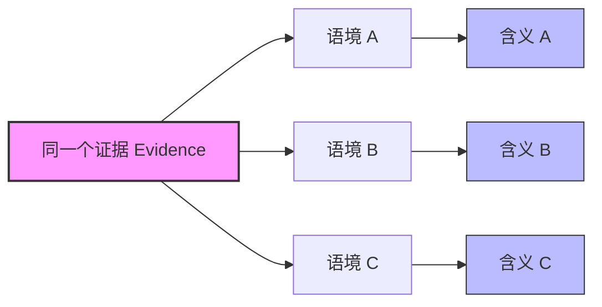

# 第11课：如何让解读站得住脚——解读语境

## 学习目标

- 理解 **interpretive context（解读语境）** 的概念及其如何赋予解读以 grounding
- 掌握"意义是语境化的"这一核心原则
- 学会为你的解读明确论证语境选择
- 识别常见的逻辑谬误，避免它们在论证中削弱可信度

## Core Idea 核心理念

你在前几课（[[0009-interpretation|第9课：解读]] 和 [[0010-figurative-logic|第10课：比喻逻辑]]）已经学会了从观察到含义的飞跃。但想法不会在真空中运作。作者在《Writing Analytically》里反复强调一条核心原理：**Meaning is contextual** —— 意义永远是语境的产物。

这里有两个关键原则：

1. **Everything means（万物皆可解读）**——生活中一切事物都在召唤我们去解读，即使我们并未意识到这一点。
2. **Meaning is contextual（意义是语境化的）**——意义的生成永远发生在某种社会、文化或其他参照系之中。

> [!TIP] 核心洞见
> 一个解读之所以能被称为"plausible（可信的）"，不是因为它是"对的"，而是因为读者能说：**"是的，我能理解为什么你可能会这么想，而且这种想法是合理的。"**
>
> 解读结论既不是事实，也不是真理——它是一种 **theory（理论）**。它的成败不取决于能否被证明对错，而取决于能否被证明是 **demonstrably plausible（可论证地可信）**。

## 什么是 Interpretive Context？

**Interpretive context（解读语境）** 是你用来观看和理解证据的框架。它可以是：

- **理论的**（theoretical）：如精神分析、女性主义、后殖民理论
- **学科的**（disciplinary）：如生物学的进化框架、经济学的供需框架
- **历史的**（historical）：如二战后的日本、2000年的美国总统大选
- **作者的**（authorial）：如某位摄影师的整个作品序列
- **文本内在的**（textual）：如《New Yorker》杂志的封面传统本身

> [!ABSTRACT] 定义
> **Interpretive context（解读语境）** 是你选择（或默认）用来理解某一对象的参照系。它像一副眼镜——不同的镜片让你看到不同的东西。

## 语境如何塑造意义？

同一个观察，放在不同语境中会产生截然不同的含义。作者用这个经典案例来说明：

一个角色在故事开头望向窗外：
- 在 **精神分析语境** 中，它可能象征无意识的渴望
- 在 **现实主义语境** 中，它只是角色在等公交车

关键不是哪个"对"——而是你的语境选择是否 **合理（appropriate）**、是否 **一贯（consistent）**。

另一个例子是 Whistler 的油画《Arrangement in Grey and Black: The Artist's Mother》（俗称"Whistler的母亲"）：

- 如果你注意到它的**官方标题**（强调色彩与构图的安排），你的语境是 **审美的（aesthetic）**——你会关注黑白灰的分布，并得出"这幅画是关于绘画本身"的解读
- 如果你关注画中人物**侧身而坐、面容忧郁**，你的语境是 **传记的（biographical）**——你会得出"她在哀悼亲人"的解读

两种解读在各自语境中都可以是 **plausible（可信的）**。这不是一个"谁对谁错"的问题。

## 意图作为解读语境之一

一个常见的误解是：**解读 = 猜测作者意图**。但作者的"原意"只是众多可能的语境之一，并非唯一标准。

作者批评了这种 **intentional fallacy（意图谬误）**——认为作品的意义完全由创作者的意图决定。事实上：

- 文本可能揭示了作者自己并未意识到的模式
- 不同时代的读者会在同一个文本中发现不同的含义
- 作者对自己作品的解释并不自动享有"特权"——它只是一个数据点

> "The meaning of a text is not identical with what its author 'intended' it to mean. Authorial intention is one possible interpretive context, but it is not automatically the best or only one."
> — *Writing Analytically*, Ch.3

在学术写作中，你的任务是论证你所选的语境为什么能产生**最有洞察力**的解读，而不只是重复作者说"我想表达什么"。

## 含义 vs. 隐藏意义

一个关键区分：**implications（含义）** 与 **hidden meanings（隐藏意义）** 有本质不同。

| | Implications（含义） | Hidden Meanings（隐藏意义） |
|------|---------------------|---------------------------|
| **态度** | 证据引导你得出某个结论 | 你"知道"背后有秘密信息 |
| **论证方式** | "证据指向……" / "这暗示着……" | "真正的含义是……" / "其实作者想说的是……" |
| **可验证性** | 公开可见——读者可以检查你的证据链 | 秘传的——只有"看懂了"的人才知道 |
| **风险** | 可能被反驳，但对话可以继续 | 一旦被质疑，论证就会坍塌 |

作者强调：**interpretation is not code-breaking（解读不是破译密码）**。你不应该假装文本中藏着一个需要你"破解"的秘密信息。相反，你应该展示**证据如何在你选择的语境中产生某种合理的含义**。

> [!WARNING]
> 如果你发现自己说"隐藏的真相是……"或"真正的含义是……"，停下来。问自己：**我有具体的、可见的证据支持这个说法吗？** 如果没有，你很可能在玩"幸运饼干"的游戏。

## 如何让解读站得住脚？

作者提供了一个五步流程（Figure 3.1: How to Interpret）：

| 步骤 | 操作 | 说明 |
|:----:|------|------|
| 1 | 整理数据（做 [[0009-interpretation#THE METHOD 系统观察法\|THE METHOD]]） | 用系统观察法找出模式 |
| 2 | 从观察到含义（追问"So What?"） | 把隐含的意思说清楚 |
| 3 | **选择适当的解读语境** | 选定一个参照系 |
| 4 | **确定合理解读的范围** | 列出在这个语境下可能的各种解读 |
| 5 | 评估哪个解读**解释力最强** | 看哪一种能说明最多的细节 |

### 论证语境本身 —— 被忽视的一步

一个重要的技巧是：**不要只论证你的解读本身——还要论证你选择的解读语境是合适的。**

> "An important part of getting an interpretation accepted as plausible is to argue for the appropriateness of the interpretive context you use, not just the interpretation it takes you to."

也就是说，你需要回答一个元问题：**"为什么我的话题在这个语境中最值得被理解？"**

> [!WARNING] 两种极端
> 作者警告不要落入这两个陷阱：
>
> **Fortune Cookie School（幸运饼干派）**——认为每样东西都有唯一"正确答案"，解读就是把隐藏的信息"破解"出来。
>
> **Anything Goes School（怎么都行派）**——认为所有解读都一样好，意义完全是个人的选择。
>
> 正确的位置在中间：**有些解读确实比其他的更好**——更好的解读有更多的证据支持和更合理的推理。

## 跨学科的可信度标准

同一句话"这看起来是可信的"在不同学科中意味着不同的事情：

| 学科 | "Plausible"意味着什么？ | 关键步骤 |
|------|------------------------|----------|
| **文学批评** | 解读能否说明文本中**最多**的细节，并且**一致地**应用语境 | 论证语境选择，展示模式 |
| **心理学 / 社会科学** | 结果是否被**重复**验证（replication）；是否与其他研究者的发现一致 | 控制变量，统计显著性，同行审查 |
| **数据分析 / 自然科学** | 数据是否确认或否定**预设的假设**（hypothesis）；结果是否被**独立验证** | 选择统计模型，讨论备择解释 |
| **历史学** | 解读是否**有史料支持**；是否考虑了**当时的历史语境**而非简单套用现代标准 | 档案研究，语境重建 |

> "An interpretive conclusion is not a fact, but a theory. Interpretive conclusions stand or fall not so much on whether they can be proved right or wrong, but on whether they are demonstrably plausible."
> — *Writing Analytically*, Ch.3

### 心理学视角的补充

作者还引用了心理学教授 Laura Edelman 的观点：

> "The patterns of data can tell us things that we have no other access to without empirical research. It is critically important for people to be aware of the limitations and problems, but then to go on and collect the data."

也就是说，即使是最严格的经验研究，也需要意识到其语境（采样方式、测量手段）如何限制了结果的解读范围。

## 常见逻辑谬误速查表

作者在章节末尾提供了 **A Brief Glossary of Common Logical Fallacies（常见逻辑谬误简明词汇表）**。这些谬误的核心共性是 **oversimplification（过度简化）**——用一种廉价的方式"赢"得争论，却实际上关闭了进一步探讨的可能。

| # | 谬误 | 拉丁名 / 英文 | 定义 | 例子 |
|:-:|------|---------------|------|------|
| 1 | **人身攻击** | Ad Hominem | 攻击人的品格而非论证本身 | "他太有钱了，所以他的话不可信" |
| 2 | **跟风论证** | Bandwagon (Ad Populum) | 以"大家都这么做"为由 | "大家都这么穿，所以这么穿是对的" |
| 3 | **循环论证** | Begging the Question | 用另一种说法复述论点来"证明"论点 | "这本书应该被禁，因为它用了脏话"——但"用了脏话就该被禁"正是你要证明的 |
| 4 | **一词多义** | Equivocation | 同一个词在不同场合用不同含义 | "只有男人有理性的能力。女人不是男人。所以女人没有理性能力。" |
| 5 | **虚假类比** | False Analogy | 比较两个本质不同的事物 | "登月就像放风筝" |
| 6 | **虚假因果** | False Cause | 错误地归因因果关系 | 见下表细分 |
| 7 | **草率概括** | Hasty Generalization | 基于一两个例子得出一般结论 | "我讨厌茄子，所以所有紫色的食物都很难吃" |
| 8 | **推不出** | Non Sequitur | 结论跳跃，缺乏逻辑连接 | "对进城上班但不居住的人征税，所有企业都会搬走" |
| 9 | **过度简化** | Oversimplification | 未加限定条件的全局断言 | "所有酗酒者都是酒鬼" |
| 10 | **下毒井** | Poisoning the Well | 用情绪化语言预先否定对方 | "任何理性的人都不会接受那种左派观点" |
| 11 | **红鲱鱼** | Red Herring | 引入不相干话题转移注意力 | 讨论电脑质量时，引入"是不是美国制造"的话题 |
| 12 | **滑坡谬误** | Slippery Slope | 假设一步退让会导致必然的灾难性连锁反应 | "批准医用大麻，很快就会毒品泛滥" |
| 13 | **稻草人** | Straw Man | 歪曲对方观点使其更容易被反驳 | "医疗改革会导致'死亡小组'来决定谁可以活" |
| 14 | **空洞话** | Weasel Word | 被过度使用而失去意义的口头禅 | "自然"、"真实"、"爱"、"自由" |

### 虚假因果的三种变体

| 类型 | 定义 | 示例 |
|------|------|------|
| **单一原因/复杂效果** | 把复杂现象归因于单一原因 | "艾森豪威尔导致了越战"——忽视冷战背景、殖民历史等 |
| **Post Hoc, Ergo Propter Hoc**（在此之后，因此由此之故） | 认为因为A在B之前，所以A导致了B | "我走过梯子下面之后被车撞了，所以走梯子下面导致被撞" |
| **将相关误认为因果** | 认为有相关性就一定存在因果关系 | "很多25岁以下选民投了X，X输了，所以X输是因为没吸引老年选民" |

## Worked Example：如何让解读更可信

让我们从一个"不太可信"的解读开始，逐步精炼它。

### 初始版本（不太可信）

> "这幅照片中的人站在栅栏上，看起来很迷茫。这大概反映了人类的普遍困境。"

**问题分析**：
- 语境不明确：什么是"普遍困境"？没有具体的框架
- 证据不足：只描述了"迷茫"，没有详细的观察
- 没有论证为什么这个语境合适

### 改进后版本（更可信）

作者在书中提供了一个真实的学生分析案例，关于 Eikoh Hosoe 的摄影作品"Kamaitachi #8"（1956）：

> "这个系列的标题'Kamaitachi'——一种传说中的镰鼬——暗示了摄影师在东京乡下的战时疏散经历。多年之后他回到故地，却发现自己像一个陌生人。照片中一个男子半蹲半爬在一个粗木栅栏上，眺望地平线，背景是翻滚的乌云。
>
> 这个形象恰恰捕捉了一种 **in-between-ness（悬而未决的状态）**：男子悬在天与地之间，悬在人为构筑物之上，处于一种等待未来的炼狱状态。在这个语境下——**post-World War II Japan（二战后的日本）**——这个姿态可以解读为日本这个曾经强大的国家在被摧毁之后的战后不确定性。"

**为什么这个版本更好？**
1. 明确选择了 **historical context（历史语境）**——战后日本
2. 用 [[0009-interpretation#THE METHOD 系统观察法|THE METHOD]] 的观察语言详细描述了细节
3. 从细节模式（悬而未决、等待）过渡到更大含义
4. 语境的选择不是强加的——照片本身的内容（战争疏散的经历）暗示了这个语境
5. 最终解读没有宣称"唯一答案"，而是说明在这个语境下这是 **most plausible（最可信）** 的读法

> [!QUESTION] 应用练习
> 选一张你熟悉的杂志封面或照片。尝试做以下三步：
>
> 1. 用 THE METHOD 列出重复/对比/异常的模式
> 2. 提出两个不同的 **interpretive contexts** 来解释同一个模式
> 3. 论证为什么其中一个语境比另一个更能解释更多的细节
>
> 提示：语境不是被强加的——它应该被证据本身暗示。

参考答案框架

以《New Yorker》2000年10月9日的封面《The Competition》为例：

**观察**：三个金发女郎几乎一模一样（大眼、张嘴、圆胸、穿连体泳衣），而第四位深发女郎截然不同（闭眼、闭嘴、尖角面孔、穿比基尼），胸前横幅写着 YORK。另外三位的横幅写着 gia、rnia、rida（分别是 Georgia、California、Florida 的残缺部分）。

**语境A（总统竞选）**：当时正值Gore/Bush竞选的最后一个月。新泽西州 vs. 其他大州——深发代表NY，金发代表其他州——可能反映了纽约在全国政治版图中的独特性。

**语境B（《New Yorker》的自我定位）**：该杂志以讽刺纽约人的优越感著称。那么深发的"纽约"代表就是那个更复杂、更不天真、更"纽约"的存在——在说："我们也许更冷、更锐利，但我们知道自己比她们酷。"

**哪个更好？** 语境B可能更让人信服，因为"《New Yorker》封面"本身就是最直接的证据暗示——封面上的标题就是杂志的名字，而且该杂志的其他封面也一贯在玩类似的"纽约 vs. 全国"的梗。

## 核心概念回顾

| 概念 | 含义 | 为什么重要 |
|------|------|-----------|
| **Interpretive Context（解读语境）** | 理解证据时所处的参照系 | 相同的细节在不同语境中指向不同含义 |
| **Plausibility（可信度）** | 解读让人觉得"合理"而非"正确" | 解读不是对错问题，而是是否可论证的问题 |
| **论证语境适切性** | 不仅要论证解读本身，还要论证为什么选这个语境 | 这是让解读从主观意见变为公共论述的关键 |
| **Fortune Cookie vs. Anything Goes** | 两个极端：唯一答案 vs. 怎么都行 | 正确位置在中间——有些解读确实比其他的更好 |
| **Intention ≠ Meaning** | 作者意图只是众多语境之一 | 文本可能揭示作者未意识到的模式 |
| **Implication vs. Hidden Meaning** | 含义有证据支撑，隐藏意义是破译密码 | 好的解读是展示证据链，不是宣称秘密信息 |
| **Plausibility 的学科差异** | 文科靠细节覆盖度，理科靠重复验证 | 跨学科写作需要适应不同的可信度标准 |

## 下一步

继续学习 [[0012-responding-assignments|第12课：分析性地回应传统写作任务]]，了解如何将这些解读工具应用到大学最常见的写作类型中。

或者在 [[../reference/glossary|术语表 Glossary]] 中查看本课涉及的关键术语。