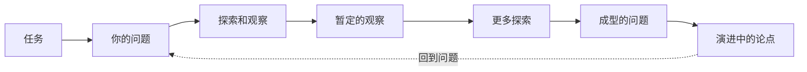

# 第12课：分析性回应写作任务

## 学习目标

- 理解"回应写作任务"本身就是一个分析行为
- 掌握六条规则（Six Rules of Thumb）并能在实际作业中应用
- 学会在任务中找到"不确定性区域"——那个最值得分析的位置
- 区分"完成作业"和"用分析回应作业"

## 任务本身就是一个分析对象

大多数学生拿到写作任务时的心态是："老师要我做什么？我怎么做才能得分？"

这种心态不坏——但你还可以多走一步：**把任务本身当作一个需要分析的文本**。

> [!ABSTRACT] 核心认识
> 每一个写作任务都隐含着一套假设：它认为什么问题是重要的？它希望你在哪个方向上思考？它预设了什么样的答案？你的任务不是"执行指令"，而是**先分析指令**——然后再决定如何回应。

教材 *Writing Analytically* 提供了一个核心理念：**你的作业不是"回答问题"，而是"回应一个分析性挑战"**。这意味着你在开始写之前，需要先搞清楚——这个任务到底想让你做什么思考。

## 六条实用原则（Six Rules of Thumb）

### 原则一：缩小范围（Reduce Scope）

**问题**：写作任务通常太大。"分析美国梦的变迁"——这个题目可以写一本书。

**对策**：主动缩小范围。一个可以在一篇文章里完成的分析，通常是一个**可操作的小问题**。

| 原始任务（太大） | 缩小后的版本（可操作） |
|-----------------|----------------------|
| "分析美国梦" | "对比 1920 年代和 2008 年经济危机后，文学作品中'成功'形象的变化" |
| "讨论社交媒体对青少年的影响" | "分析 TikTok 的推荐算法如何塑造了青少年对'注意力时长'的认知" |
| "评论文中的论证" | "分析这篇论文在第三段使用的类比——这个类比成立吗？它假设了什么？" |

缩小范围时有用的追问：
- "这个任务中最具体的例子是什么？"
- "我能不能只分析其中**一个段落**、**一个案例**或**一个对比**？"
- "我的论点能不能从**一个细节**出发，而不是覆盖整个话题？"

### 原则二：研究措辞，寻找未言明的问题（Study the Wording for Unstated Questions）

任务的措辞不只是告诉你"做什么"——它的措辞本身就透露了教师认为什么重要。

**实操方法**：圈出任务中的**行为动词**和**限定词**。

| 动词 | 它真正在要求什么？ |
|------|------------------|
| "Describe"（描述） | 不只是罗列事实——它通常要求你**选择性地呈现**最相关的细节 |
| "Analyze"（分析） | 找组成部分 + 追问关系 + 说明含义 |
| "Compare"（比较） | 不只是列异同——它要求你找到**比较的意义**（所以呢？） |
| "Evaluate"（评价） | 建立评价标准，然后用标准做判断 |
| "Discuss"（讨论） | 最模糊的词 — 你需要自己决定**从哪个角度切入** |

> [!TIP] 关键技巧
> 如果一个任务里出现了 **"How"** 或 **"Why"**，你就找到了分析的核心入口。"How" 要求你描述一个过程或机制。"Why" 要求你寻找原因或动机。这两个词比 "What" 更具分析潜力。

### 原则三：质疑第一反应（Suspect First Responses）

你拿到任务后的第一反应——"哦，这个我懂"或"这个太简单了"——**很可能是你的分析在偷懒**。

第一反应通常来自：
- 你已经形成的刻板判断（**Judgment Reflex**，回顾 [[0001-analysis-intro|第01课]]）
- 你上一次写过类似题目的记忆（不是这次的题目）
- 你对这个话题的最表层理解

> [!WARNING] 操作提醒
> 不是说你不能信任第一反应——而是**不要停在第一反应**。写下你的第一反应，然后追问："如果反过来想呢？"、"这个反应是基于什么假设？"、"还有别的可能吗？"

### 原则四：从问题开始，而不是答案（Begin with Questions, Not Answers）

学生常犯的最大错误：还没想清楚，就急着得出一个"论点"。

分析性写作的正确次序是：

你的任务是**提出一个好问题**，而不是立刻给出一个好答案。一个好问题的特征：
- 它让你**好奇**
- 它不是"是/否"问题
- 它指向一块**不确定的区域**（你不知道答案，但你有线索）

### 原则五：期待自己会感兴趣（Expect to Become Interested）

这条原则听起来简单，但有深刻的实践智慧。

**它的含义**：你在写分析之前，不需要已经对话题感兴趣。你只需要**相信"随着我深入，我可能会产生兴趣"**。这个期待改变了你的行为——它让你更愿意投入观察、更容忍暂时的无聊感。

> [!TIP]
> 如果你在写作初期感到"这个话题很无聊"，这不代表这个话题真的无聊，而是说明你还没有找到**你的入口**。回到原则一（缩小范围）和原则四（找问题），找一个能激发你好奇的切面。

### 原则六：不停地写（Write All the Time）

不要等到"想清楚了再写"。"想清楚"和"写清楚"是同一个过程。

- 拿到任务 → **写**你的第一反应
- 缩小范围时 → **写**出几个可能的方向
- 观察材料时 → **写**下你看到的细节
- 卡住时 → **写**出"我在卡什么"

**写作不是思考的结果——写作就是思考。**

> [!NOTE]
> 这与 [[0007-paraphrase-focus|第07课]] 的 Focused Freewriting 精神一致：用写作来发现你自己的想法。你不需要等到知道要说什么才开始写——你写出来才知道自己要说什么。

## 如何找到任务中的不确定性区域

六条原则背后有一个共同指向：**找到任务中的不确定性区域（area of uncertainty）**。

不确定性区域是：
- 你**不知道**答案，但**有线索**可以探索的地方
- 材料中让你感到**奇怪、矛盾或模糊**的点
- 任务措辞中**最开放、最具争议**的维度

| 确定性区域（到此为止即可） | 不确定性区域（分析从这里开始） |
|--------------------------|-----------------------------|
| 已知事实的重复 | 事实之间的关系 |
| 作者的显性论点 | 作者的隐含假设 |
| 常见的共识 | 共识中的例外 |
| 你的第一反应 | 你的第一反应的来源 |

> [!QUESTION] 自我检查
> 假设你收到了一个任务："分析智能手机对社交关系的影响。"
>
> 1. 用"缩小范围"原则把这个任务缩小到一个可操作的问题。
> 2. 找出任务措辞中的一个"未言明的假设"（例如："影响"这个词暗示了因果关系——但这一定对吗？）。
> 3. 写出一个让你好奇的问题。

查看参考思路

**缩小范围**：不分析"智能手机对社交关系的影响"这个浩瀚话题，而是选择："分析在家庭聚餐场景中，智能手机的存在如何改变了对话的结构——谁在说话、谁在看手机、停顿的时长有何变化。"

**未言明的假设**：
- "影响"假设了因果关系——但智能手机和社交变化可能是**互相塑造**的，不一定是单向因果
- "社交关系"被当作一个通用的概念——但不同类型的社交关系（亲子、伴侣、朋友）可能受的影响完全不同

**一个好奇的问题**：
"当我观察一个四人家庭聚餐时，我发现手机的出现不但没有减少对话，反而增加了'关于手机内容'的对话——所以，智能手机是减少了交流，还是**改变了交流的内容**？"

## 本课小结

| 原则 | 一句话 | 反直觉之处 |
|------|--------|-----------|
| **缩小范围** | 越小越有分析力 | 你以为窄了没东西写，实际上窄了才能深入 |
| **研究措辞** | 动词里藏着任务的真要求 | "Discuss" 等模糊词需要你主动定义 |
| **质疑第一反应** | 第一反应往往是认知捷径 | 你最快想到的答案，别人也想到了 |
| **从问题开始** | 好问题比好答案更值钱 | 急着给答案会关闭探索 |
| **期待兴趣** | 兴趣不是前提，是结果 | 你可以"决定"对一件事感兴趣 |
| **不停地写** | 写就是思考 | 等待→死路，写→出路 |

## 下一步

完成本课后，你知道了如何分析性地理解一个作业任务。下一课将更具体——如何把**五种最常见的写作任务类型**变得更有分析性：[[0013-common-assignments|第13课：让常见写作类型更有分析性]]。

需要快速回顾写作任务分析工具？查看 [[../reference/glossary|术语表 Glossary]] 中与 assignments 相关的条目。