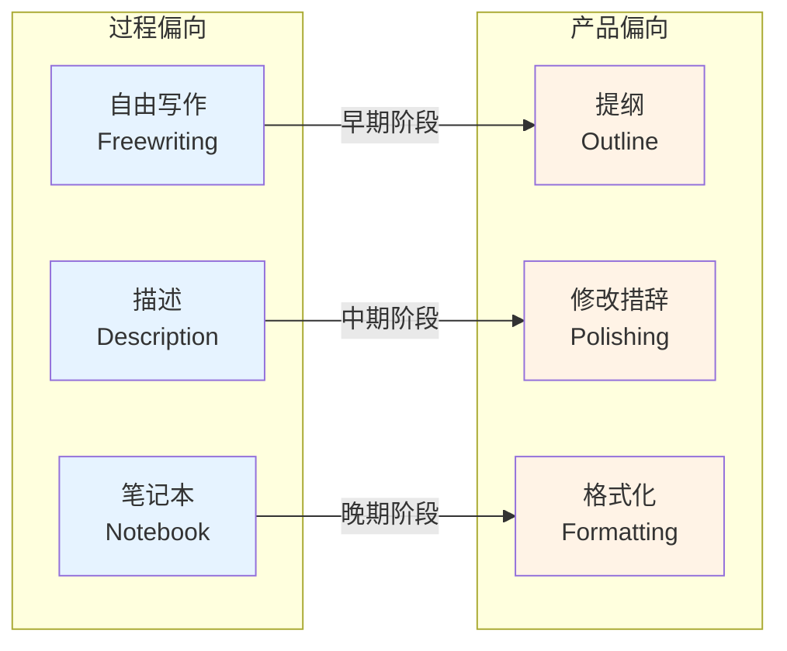

# 第14课：像作家一样思考 —— 写作过程策略工具箱

## 学习目标

- 区分"过程思维"与"产品思维"，理解写作是一个发现过程而非记录过程
- 掌握自由写作的进阶用法：从热身到卡壳诊断再到辩证自由写作
- 学会用 Close Description（细致描述）作为观察练习，并完成 TRY THIS 5.2 / 5.3
- 理解 New Starts（新开始）和 Back Burner（静置）作为替代修改策略的价值
- 建立持续记录 Writer's Notebook（写作者笔记）的习惯
- 掌握 Reading Like a Writer（像作家一样阅读）中的文本标记与列清单方法
- 能运用描述本位的同行评议程序
- 使用自我评估量规和 "Short List of Things That Go Wrong" 诊断自身写作

## 核心：过程 vs. 产品

*Writing Analytically* 第5章的核心区分是：

**Product（产品）思维**认为写作是"先想清楚，然后记录"。写作被看作一个传输过程——你把脑子里已经成型的想法转移到纸上。

**Process（过程）思维**认为写作是"写的过程中才想清楚"。写作被看作一个发现过程——你在动笔之前并不知道你的最终论点是什么。

> [!TIP] 关键洞见
> 好的分析写作几乎总是过程思维的产物。你在写作中发现的比你事先计划的好得多。**不要把分析写作看作"展示你知道什么"——把它看作"发现你还能想到什么"。**

这两个模式不是非此即彼的选择，而是一个光谱：

在写作**早期**，你应该偏向过程思维（自由写、描述、不加评判地记录）。在写作**晚期**，你自然过渡到产品思维（组织、修改、打磨）。**问题出在顺序颠倒——人们过早进入产品模式，卡住了自己的思维。**

## Freewriting 进阶用法

你在 [[0003-notice-and-focus|第03课]] 已经接触了基础的自由写作。第5章提出了更高级的应用策略：

| 应用场景 | 启动句模板 | 目的 |
|---------|-----------|------|
| **写作前——白纸恐惧** | "关于这个题目，我现在知道的是……" | 绕过"我还没准备好"的阻滞 |
| **写作中——卡壳** | "我卡住了，因为……" | 诊断卡壳的真正原因（论点不清？证据不足？） |
| **写完一段——逻辑检查** | "我刚才那段的核心观点是……" | 检查写出来的是不是你想说的 |
| **死胡同——视角切换** | "我还没考虑到的角度是……" | 打破思维定势 |
| **想法冲突——辩证自由写作** | 先写"正方：……"，再写"反方：……"，再写"综合：……" | 将冲突转化为更复杂的理解 |

> [!TIP] 辩证自由写作（Dialectical Freewriting）
> 当你发现自己有两个矛盾的想法时，不要急着二选一。做一次辩证自由写作：先全力写支持 A 的论证，再全力写支持 B 的论证，最后写一段"如果两者都有道理，那更复杂的真相是什么？"——你往往会得到一个比单纯选 A 或 B 都更有趣的论点。

## Close Description 作为观察练习

**Close Description（细致描述）** 看起来是最简单的练习——"描述你看到的东西"——但却是最容易被跳过的步骤。因为它违背了我们的本能：一看到东西就想解释它、评价它、给它贴标签。

### 规则（TRY THIS 5.2）

1. **只写可观察的事实**：颜色、大小、位置、重复、对比、省略、顺序
2. **不写推论**：不能写"这暗示了……"或"这可能意味着……"
3. **不写评价**：不能写"这很美"或"这很无聊"
4. **持续写 5-10 分钟**

> [!WARNING]
> 你会觉得"光描述有什么用？太低级了"。但请相信：**描述迫使你看到你原本会跳过的细节。而分析的质量，完全取决于你基于什么细节在做分析。** 一个基于"我注意到作者在第三段用了一个战争隐喻"的分析，比一个基于"这篇文章很有攻击性"的分析有力一百倍。

### 进阶观察：将同一事物置于不同语境（TRY THIS 5.3）

> [!QUESTION] TRY THIS 5.3 — 换语境描述
> 选一个你熟悉的事物（比如你的手机、一个房间、一张照片）。先在**中性语境**下描述它（只描述物理特征）。然后假设你在 ** 
> (a) 给一个从未见过此类东西的人描述** 
> (b) 作为**物证**在法庭上描述它 
> (c) 作为**拍卖行的估价师**描述它 
>  
> 对比这几种描述——你会发现，不同语境让你看到了同一事物完全不同的侧面。这就是"角度"的训练。

## 两种替代修改模型

大多数初稿的问题不是**写得不好**，而是**结构服务于一个你不再持有的论点**。在这种情况下，逐句修改措辞是浪费时间。

### New Starts（新开始）

不是"推倒重来"，而是**带着第一稿的经验重写**。

| New Starts 不是什么 | New Starts 是什么 |
|-------------------|-----------------|
| 否定第一稿的价值 | 保留第一稿中最好的段落和洞见 |
| 从头到尾全部重写 | 重新组织，重新发现结构 |
| 意味着第一稿失败了 | 意味着你在写作过程中学到了新东西 |

**什么时候做 New Starts**：当你发现你的核心论点在写作过程中已经发生了变化，但文章结构还停留在旧论点时。

### Back Burner（静置）

把写了一半的文章放几天——**不要思考它**。让潜意识工作。

**为什么有效**：
- 你从文本中抽离后，能以更客观的眼光读它
- 潜意识会在后台连接你醒着时没注意到的关联
- 你经常在洗澡、散步、做饭时突然想到更好的方案

> [!TIP]
> 这两个策略对"拖延型写作者"特别有价值。拖延不是懒惰——是潜意识在等待"准备好了"的感觉。**New Starts 告诉你：你可以随时从任何地方开始。Back Burner 告诉你：不写的时候，你也在写作。**

## 保持 Writer's Notebook

**Writer's Notebook（写作者笔记）不是日记**。日记记录的是"今天发生了什么"；写作者笔记记录的是"今天你注意到了什么"。

| 笔记本条目类型 | 示例 |
|--------------|------|
| 听到的一段对话 | 咖啡馆里有人说："我不是说他错了，我是说他的论证方式有问题。"——修辞的日常版本 |
| 让你停顿的句子 | 广告牌上写着"你不是在购买产品，你是在购买一种生活方式。"——好，这句话是怎么做到的？ |
| 一个精确的比喻 | "她说话的方式像在扫雷——每个词都是试探性的。"——把他人的比喻存起来用于你的写作 |
| 你看不懂的东西 | 一条招聘信息要求"具有企业家精神的员工"——企业家精神究竟在这个语境里意味着什么？ |
| 你自己写作中的新发现 | "今天写第三段时发现……" |

> [!TIP]
> 每天 5 分钟即可。可以只是一个句子。关键是**持续**而非篇幅。你收集的不是"好词好句"——而是**让你注意到的东西**。

## Reading Like a Writer

**Reading Like a Writer（像作家一样阅读）** 意味着你不是以读者的身份在读——你以"同行"的身份在读，看作者用了哪些手法、做了哪些选择。

### Text Marking（标记文本）

除了划"重要"的句子之外，尝试这些标记类型：

- **?** — 作者为什么在这里做这个选择？
- **!** — 这个表述出乎意料
- **R** — 这个词/意象重复出现了
- **C** — 对比结构
- **A** — 异常/矛盾
- **&** — 关联（此处与前面的某处有联系）

### Listing（列清单）

读完后不写分析。先**列出**你注意到的东西。这是 [[0003-notice-and-focus|Notice & Focus]] 在阅读中的直接应用。

> 例如，读完一段后列出：
> 1. 前两句都是短句
> 2. 第三句开始出现"但是"
> 3. "自由"一词出现了三次
> 4. 没有出现任何具体的人名或数据
> 5. 最后一句话以问句结束

这些列表中的每一项都可能发展成一个分析点——但首先，你只是列出来。

## Peer Review 程序

### 描述本位的小组评议（Description-Based Group Review）

大多数同行评议失败是因为评议者过早给出建议（"你应该删掉这段"）、作者过早防御（"但我的意思是……"）。教材推荐一个替代流程：

1. **作者不发言** — 作者先安静地听
2. **读者轮流描述** — "我注意到的第一个特征是……然后是……"
3. **只说描述，不提建议** — 描述组不说"应该怎么改"
4. **作者最后回应** — "我听到的和我自己的意图有什么差距？"

> [!WARNING]
> 描述本位的起点是：**作者自己其实知道怎么改——ta 只是需要看到自己的文本在别人眼中是什么样子。** 描述提供的是这个"外部视角"，而不是答案。

### 一对一的写作中心模式

- 作者先说：**"我最不确定的是……我希望你关注的是……"**
- 读者阅读并标记
- 读者描述标记的内容
- 作者提出后续问题

## 自我评估量规

### Self-Evaluation Rubric

| 评估维度 | 好（4-5分） | 中等（2-3分） | 弱（1分） |
|---------|-----------|------------|---------|
| **Observation** | 论点基于具体的文本细节 | 有概括，但缺少具体引用 | 只有概括印象 |
| **Claim** | 有明确的、可争论的中心论点 | 中心论点存在但模糊 | 只是总结而非分析 |
| **Evidence** | 每个推论都有证据支持 | 有些推论跳跃 | 推论无依据 |
| **Structure** | 论证有清晰递进 | 段落有序但逻辑线模糊 | 段落各自为政 |
| **Reflection** | 能指出哪里可改进 | 能指出"写得不好"但不清楚为何 | 无自省 |

### Short List of Things That Go Wrong

教材提供了一个简洁的问题诊断清单。转换为中文实用的 **Do / Don't**：

| Do（该做的） | Don't（不该做的） |
|------------|-----------------|
| 从具体的句子、图像、数据点开始 | 从"在现代社会中……"开始 |
| 接受初稿的混乱——它的任务是探索 | 追求第一遍就写"好" |
| 用口语写初稿："我到底想说什么？" | 边写边回头修改措辞 |
| 保护连续写作时间（≥45 分钟） | 在碎片时间试图完成深度分析 |
| 把写作当作发现过程 | 把写作当作记录已想好的结论 |

## 有用箴言（Useful Mantras）

教材中散布的箴言，也是本课最好的总结：

> **"Writing is a tool of thought, not just a record of it."**
> — 写作是思考的工具，不只是思考的记录。

> **"Better to write a bad first draft than no draft at all."**
> — 一个糟糕的初稿比没有初稿好一万倍。你能修改一篇写出来的东西，你无法修改一片空白。

> **"You don't have to know what you think before you write; you can write to find out."**
> — 你不需要在写之前就知道你想什么；你可以通过写作来发现。

> **"Revision is re-vision — seeing again."**
> — 修改就是"重新看见"——不是修修补补，而是带着新的眼光重新审视。

> **"The back of your mind is always working."**
> — 你大脑的后台一直在工作。静置不是浪费时间的，它是写作过程的重要组成部分。

## 练习

> [!QUESTION] TRY THIS 5.2 — Close Description
> 选一个视觉材料（一幅画、一张照片、一个广告）。写一段**纯粹的描述**——不分析、不评价、不推论。写满 10 分钟。
>
> 完成后，读一遍你写的内容。圈出任何不小心混入的推论或评价。然后问自己：**如果我只用这些描述来写分析，我能写出什么？**

示例：描述 vs. 推论

**推论**（不要在描述阶段写这个）：
"照片中的房间看起来很冷清，暗示主人可能长期独居。"

**描述**（这是可以写的）：
"房间中有三把椅子，一把正对窗户，两把靠墙。正对窗户的那把椅子上有一本翻开的书。另外两把椅子表面干净，没有放置任何物品。没有时钟。窗帘半拉着。地板上有水渍——杯子的印记——在正对窗户的椅子旁边。"

看到了吗？描述版本提供了具体的、可验证的细节。而推论版本跳过了所有这些细节直接给出了一个结论——但结论可能完全错误（也许主人刚搬进来、也许正在打扫房间）。

> [!QUESTION] Trial Self-Evaluation
> 回顾你最近写的一篇短文。用本课的 Self-Evaluation Rubric 给自己打分。然后问自己两个问题：
> 1. 如果让我 New Starts 重写这篇，我会做什么不同的选择？
> 2. 这篇文章是否有某个段落值得放进我的 Writer's Notebook 作为"好的写作样本"或"失败案例"？

自省提示

大多数人对自己的写作要么过于苛刻（只能看到问题），要么过于宽容（看不到问题）。自我量规的价值不在于分数本身——而在于它让你**系统化地**审视自己的写作行为。有数据支撑的自我诊断比模糊的感觉更可靠。

如果你在 Observation 维度得分低，你的下一步不是"写得更好一点"——而是回到文本做一次 Close Description。

## 下一步

[[0015-evidence-claims|第15课：证据与论点]] —— 如何用十个例子深入分析一个对象。

或在 [[../reference/glossary|术语表 Glossary]] 中回顾本课涉及的写作策略术语。