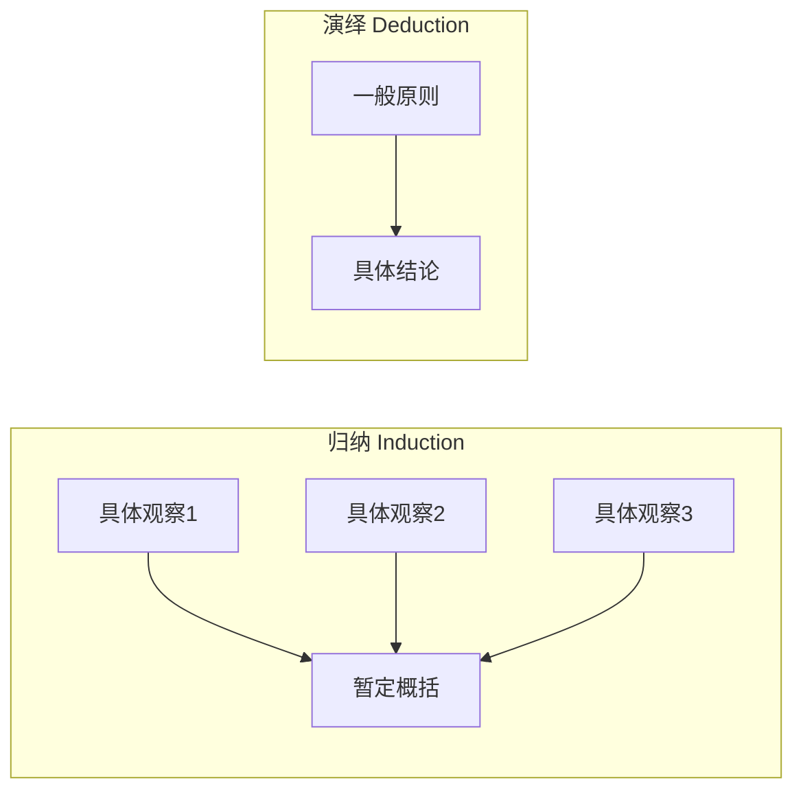
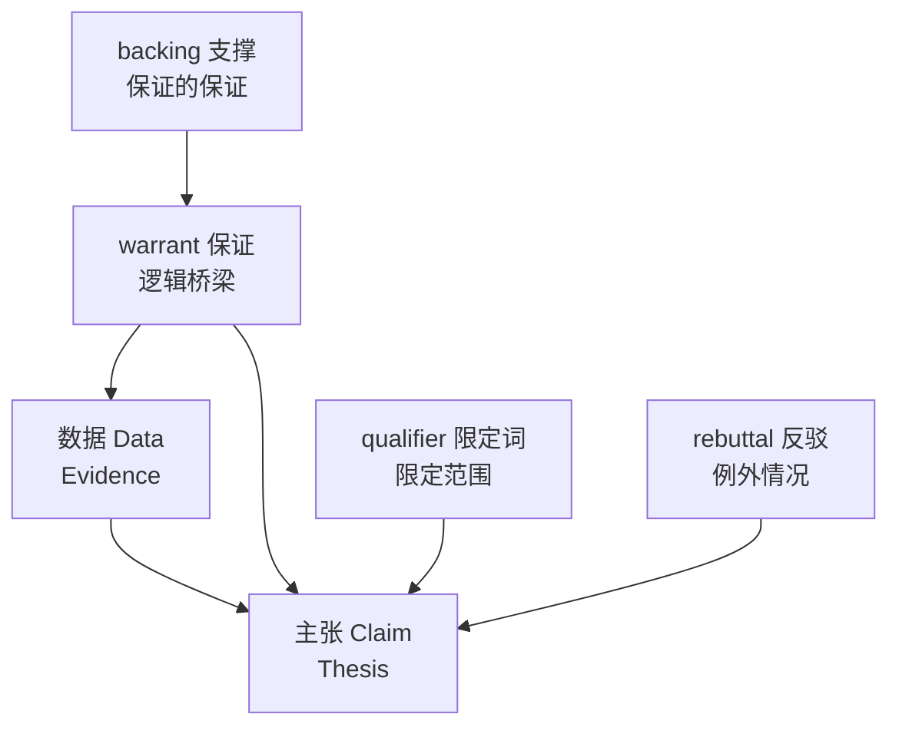

# 第15课：从证据到主张——论证的核心

## 学习目标

- 区分**证据（evidence）**与**主张（claim）**，并识别无实质支撑的主张
- 理解三段论（syllogism）与省略三段论（enthymeme）的基本逻辑形式
- 掌握 **Toulmin 论证模型**的六大要素
- 对比演绎与归纳在连接证据与主张中的不同作用

## 证据 vs. 主张

分析写作中最大的问题之一是："我以为我给了证据，但其实我什么也没给。"

| 学生常写的内容 | 属于 | 问题 |
|---|---|---|
| "这篇文章很有效，因为作者用了很好的语言。" | **主张** | "很好的语言"是什么？ |
| "这篇文章第一段用了三个'我们'，营造了共同体感。" | **证据** | 具体的、可验证的细节 |
| "很明显，这个角色感到愤怒。" | **主张** | "明显"说明不了任何东西 |

> [!ABSTRACT] 关键区分
> **证据（evidence）** 是你可以指向的东西——文本中的具体词句、数据点、可观察的细节。**主张（claim）** 是你对这些证据的解读。没有证据的主张只是"因为我这么说"（Because I say so）。

### "Because I Say So" 综合征

当你说"这部广告很有效"但没有指出具体画面或文案时，你实际上在说：**相信我就好，别问为什么。** 这就是所谓的 **无实质支撑的主张（unsubstantiated claim）**——它看起来像在论证，实际上只是表态。

解药很简单：**让你的细节说话（making details speak）**。在你给出任何主张之前，先问自己："我能指向文本中的哪一个具体位置来支撑这句话？"

## 什么算证据？

人们常说"证据就是事实"，但分析写作中的证据远不止于此：

| 证据类型 | 示例 |
|---|---|
| **文本细节** | 具体词语、句式、标点、段落结构 |
| **数据与统计** | 数字、百分比、趋势 |
| **上下文信息** | 历史背景、作者生平、出版语境 |
| **模式与重复** | 反复出现的主题、意象、用词 |
| **缺失与沉默** | 故意没说什么、省略了什么 |
| **对比与并置** | 两件事被放在一起时产生的意义 |

> [!TIP] 实用原则
> 最好的证据往往不是"最有力的"，而是**最具体的**。具体的细节让你的读者可以"看到"你所看到的东西，然后自己判断你的解读是否合理。

## 论证的逻辑形式

### 三段论与省略三段论

**三段论（syllogism）** 是经典的逻辑形式：

```
大前提（Major premise）：所有人类都会死。
小前提（Minor premise）：苏格拉底是人类。
结论（Conclusion）：因此，苏格拉底会死。
```

但现实中很少有人使用完整的三段论。我们更常用的是 **省略三段论（enthymeme）**——省略了一个前提的论证形式：

```
"苏格拉底会死，因为他是一个人。"
```

省略的是"所有人都会死"这个大前提——因为它在上下文中被视为理所当然。

> [!NOTE] 为什么省略三段论对分析写作重要？
> 因为当你分析一个论证时，最有趣的工作往往是**还原被省略的前提**。例如，有人说"这把枪不应该被合法销售，因为它是一种攻击性武器"——被省略的大前提是"所有攻击性武器都不应该被合法销售"。正是这个隐藏的前提，才是真正的争论焦点。

### 演绎 vs. 归纳

**演绎（deduction）**：从一般原则推导出具体结论。三段论是典型的演绎形式。

**归纳（induction）**：从具体观察中概括出一般原则。你观察10个案例，发现它们都有相同特征，然后得出结论"所有这类案例都有这个特征"。



> [!WARNING]
> 初学者常常只做归纳——收集一堆例子然后概括。但好的分析写作需要在**归纳和演绎之间循环**：从例子概括出原则（归纳），再用原则去检验新的例子（演绎），然后修正原则。

## Toulmin 论证模型

哲学家 Stephen Toulmin 提出了一套比三段论更灵活的论证分析框架，包含六个要素：



### 六大要素详解

| 要素 | 含义 | 示例 |
|------|------|------|
| **主张（Claim）** | 你要论证的结论 | "这篇文章的结尾其实削弱了它的说服力。" |
| **数据（Data）** | 你用来支撑主张的证据 | "结尾用了一个反问句，而前文一直是陈述句。" |
| **保证（Warrant）** | 连接数据与主张的逻辑桥梁 | "语气不一致会降低读者的信任感。" |
| **支撑（Backing）** | 保证背后的额外理由或权威依据 | "研究表明，读者对语气一致的文本信任度高出37%。" |
| **限定词（Qualifier）** | 对主张范围的限定（通常、可能、在某些情况下） | "在某些读者群体中，这种效果尤其明显。" |
| **反驳（Rebuttal）** | 对可能的反对意见的回应 | "当然，如果作者的意图就是制造突兀感，那这可能是故意的。" |

> [!TIP] 分析写作中最常见的不足
> 学生论文最常缺的是 **warrant（保证）**——他们给出了数据，也提出了主张，但没有解释**为什么这个数据支撑了这个主张**。写 warrant 就是把你的推理过程说清楚。

### 为什么限定词（qualifier）很重要

初学者倾向于做出绝对化的主张（"这证明了……"），而有经验的写作者会使用限定词（"这在一定程度上表明……"）。**限定词不是软弱**——它表明你意识到了论证的复杂性和边界条件，这恰恰增强了你的 credibility（可信度）。

## Rogerian 论证

传统的论证模型（三段论、Toulmin）本质上是**对抗式的**——你以"我是对的"为前提。但 **Rogerian 论证**（源自心理学家 Carl Rogers）采取不同的策略：

1. **理解对方立场**：先准确复述对方的观点
2. **找到共同基础**：指出双方都认同的部分
3. **提出新方案**：在共同基础上引入新视角

> [!NOTE] 何时使用 Rogerian 论证
> 在争议性话题或面对持强烈反对意见的读者时，Rogerian 论证比直接反驳更有效。它不追求"击败对手"，而是追求 **寻找共同点（finding common ground）**。

## 实践练习

> [!QUESTION] 识别缺失元素
> 看以下论证片段，指出它缺少 Toulmin 模型中的哪些元素：
>
> "这个电影票房惨败，因为它是一部烂片。"
>
> 1. 主张是什么？数据是什么？
> 2. warrant（保证）在哪里？它是否被省略了？
> 3. 你认为观众会接受这个 warrant 吗？为什么？
>
> 尝试重写这个论证，加入尽可能多的 Toulmin 要素。

<details>
<summary>参考答案思路</summary>

- **主张**："这个电影票房惨败"
- **数据**："它是一部烂片"——等等，这本身就是一个主张，不是数据！真正的数据应该是具体事实，比如烂番茄评分、口碑评价等
- **Warrant**：被省略的保证是"烂片总是票房惨败"——但这个保证本身就不成立（很多烂片票房极高）
- **缺少的要素**：warrant 薄弱、缺少 backing、没有 qualifier、没有 rebuttal

**一次重写尝试**：
"这个电影票房惨败（**主张**）。它在烂番茄上只有15%的新鲜度，首周末观众评分是C-（**数据**）。通常，观众评分与票房之间高度相关（**warrant**），尤其是对主流商业片而言，因为负面口碑会迅速抑制后续票房（**backing**）。当然，也有一些烂片凭借营销获得了高票房（**rebuttal**），所以这里的关键因素是口碑传递速度——而本片的社交媒体讨论量在首周后急剧下降（**附加数据**）。"

</details>

## 核心概念回顾

| 概念 | 关键词 | 为什么重要 |
|------|--------|-----------|
| 证据 vs. 主张 | specific details | 没有细节的主张只是表态 |
| 三段论 | major premise, minor premise, conclusion | 理解逻辑的基本骨架 |
| 省略三段论 | hidden premise | 还原省略的前提是分析的关键 |
| Toulmin 模型 | Claim, Data, Warrant, Qualifier, Rebuttal, Backing | 比三段论更灵活的论证分析工具 |
| Rogerian 论证 | common ground | 处理争议性话题的有效策略 |
| 演绎 vs. 归纳 | general to specific, specific to general | 两者需要循环使用 |

## 下一步

继续学习 [[0016-ten-on-one|第16课：10 on 1 —— 深入分析一个例子的艺术]]，学习如何用"Pan, Track, Zoom"的镜头思维来组织中篇论文的证据结构。