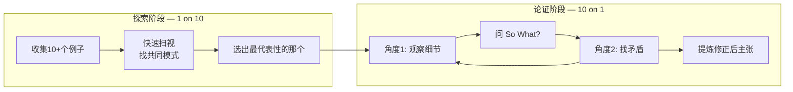
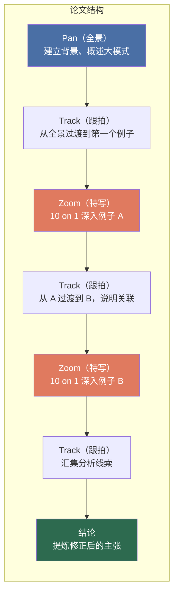

# 第16课：10 on 1 —— 深入分析一个例子的艺术

## 学习目标

- 区分 **1 on 10**（探索阶段）与 **10 on 1**（论证阶段）两种互补策略
- 运用 **Pan, Track, Zoom** 的电影镜头思维组织中篇论文结构
- 理解五段式作文的 **Procrustean（普罗克鲁斯特斯式）** 局限及其改造方法
- 学会在长篇论文中用 **星座化（constellating）** 连接多个深度分析

## 两种策略：1 on 10 与 10 on 1

分析写作者面临一个永恒的矛盾：你要**广度**还是**深度**？



| 策略 | 动作 | 目的 | 使用时机 |
|------|------|------|---------|
| **1 on 10** | 快速扫视10个或更多例子 | **发现模式**，找出值得深入的点 | 探索期 —— 你还不知道要说什么 |
| **10 on 1** | 从10个不同角度深入分析1个代表性例子 | **挖掘深层含义**，支撑并修正主张 | 论证期 —— 你已经有方向了 |

> [!ABSTRACT] 核心思想
> **1 on 10 是发现（discovery），10 on 1 是论证（argument）。** 前者回答"这里有什么有趣的模式？"，后者回答"这个例子如何帮助我们理解更大的问题？" 两者不可偏废，且必须按顺序使用：先扫视，再深挖。

### 1 on 10：寻找模式

初学者最常见的错误是**过早陷入一个例子**。你找到一个有趣的片段就开始深入分析，却没有先确认这个片段是否具有代表性。这就像在拼图中只拿起一块就断言整幅画的样貌。

> [!TIP] 操作步骤
> 1. 收集10-15个相关例子（引用、数据点、观察结果）
> 2. 用一句话为每个例子做摘要
> 3. 圈出反复出现的主题或模式
> 4. 问自己：哪个例子最能体现这个模式？
> 5. 把这个例子留下来做 10 on 1

### 10 on 1：深入分析

选定代表性例子后，你的任务是**反复冲击它**，每次都从不同角度切入：

```
观察细节 → 问 So What? → 得出暂定结论
    → 找矛盾细节 → 修正暂定结论
    → 换一个角度观察 → 再问 So What? ...
```

每一次循环都不是简单的重复，而是**递进** —— 你带着前一轮的结论去审视新角度，看看新细节是否支持、复杂化或推翻之前的判断。这正是 [[0015-evidence-claims|第15课]] 中讨论的"证据与主张的往复运动"的具体操作。

## Pan, Track, Zoom：从电影借来的论文结构

电影摄影的三种运镜方式，为组织论文提供了一个极其直观的框架：



| 镜头 | 写作动作 | 功能 |
|:----:|----------|------|
| **Pan（全景）** | 开头段落：概述观察到的模式或趋势 | 建立上下文，让读者知道"我们在看什么" |
| **Track（跟拍）** | 过渡段落：按逻辑顺序追踪一系列相关点 | 展现连贯性，连接不同段落和例子 |
| **Zoom（特写）** | 核心段落：10 on 1 深入一个例子 | 揭示表面看不见的深层含义 |

## 五段式作文的问题与改造

### 问题：Procrustean 的僵化

五段式作文（引言-三段论证-结论）是美国高中最常教的作文格式。它的核心问题是 **Procrustean（普罗克鲁斯特斯式）** —— 这个典故来自希腊神话：强盗普罗克鲁斯特斯把路人绑在床上，个子太长的砍脚，个子太短的拉长，总之要"适配"他的床。五段式作文对思考做的正是同一件事：无论你的想法有多复杂，都必须塞进"三个论点各一段"的模具里。

| 问题 | 表现 |
|------|------|
| **过于僵化** | 每个论点恰好一段，不允许思考的曲折和复杂性 |
| **鼓励面面俱到** | 三个论点各一段，每个都浅尝辄止 —— 本质上是 **1 on 10** 的错误用法 |
| **结论只是重述** | 结论没有新信息，只是把引言换一种说法再说一遍 |
| **不能应对复杂性** | 如果一个问题有4个重要角度怎么办？如果只需要2段深入分析怎么办？ |

### 如何改造

> [!NOTE] 保留框架，替换思维
> 五段式的**骨架**是可用的 —— 引言、正文、结论的基本结构没有问题。问题出在内部逻辑：你不再写三个"论点各一段"，而是写 **Pan → Track/Zoom → Track/Zoom → Conclusion**。

**改造后的结构对照：**

| 传统五段式 | 改造后 (Pan-Track-Zoom) |
|-----------|------------------------|
| 引言：引出话题 | **Pan**：建立大背景，提出试探性主张 |
| 论点一 | **Zoom**：10 on 1 深入分析例子 A |
| 论点二 | **Track + Zoom**：从 A 过渡到 B，深入分析 B |
| 论点三 | **Zoom**：比较 A 和 B 的差异，修正初始主张 |
| 结论：重述 | **结论**：**提炼** —— 经过分析，主张发生了什么变化？ |

## 模板：用 10 on 1 组织论文

完整的写作模板请参见 [[../reference/ten-on-one-template|10 on 1 写作模板]]。这里列出最核心的段落逻辑：

1. **引言（Pan）**：指出你在证据中发现的模式，提出试探性理论
2. **第1-3段（Zoom）**：选一个代表性例子，从多个角度反复分析
3. **过渡段（Track）**：说明当前分析如何引向下一个例子
4. **后续段落（Zoom）**：分析第二个例子，建立与前一个的关联
5. **结论**：不是重述，而是**提炼** —— 你的主张在分析过程中发生了怎样的演变？

## 星座化：长篇论文中的证据组织

在长篇论文中，你会有多个深度分析。这时需要 **constellating（星座化）** —— 把多个例子像星座中的星星一样连接，让它们共同照亮一个更大的主题。

> [!WARNING] 常见错误
> 初学者写长论文时，常常"先写完一个例子，然后忘了它，再写下一个例子"。结果是每个段落独立，文章没有积累感。星座化的核心：**每一个新分析都建立在前一个分析的结论之上。**

**关键技巧：**
- 每个例子都经过 10 on 1 的深入分析
- 例子之间有明确的**过渡逻辑**（不是"另一个例子是……"而是"这个例子揭示了前一个例子没展示的另一个侧面"）
- 每个新例子都**修正或复杂化**之前的主张

## 具体示例：Good-Bye Lenin! 中的"10 on 1"

假设我们分析电影 *Good-Bye Lenin!*（《再见列宁！》），主题是"个人叙事 vs 官方历史"。使用 10 on 1 策略：

1. **Pan（全景）**：电影中，儿子 Alex 为心脏病卧床的母亲制造了一个"东德依然存在"的虚假世界。这个设置揭示了一个普遍问题：个人对亲人的保护欲如何与宏大的历史叙事冲突。

2. **Zoom 角度 1 —— 空间**：母亲的病房被改造成"1989年前的东德"。这个空间的细节（旧墙纸、旧家具、禁止电视新闻）构成了一个精心维护的谎言气泡。

3. **Zoom 角度 2 —— 物**：Alex 满城寻找母亲当年吃的泡菜罐头 —— 资本主义货架上已找不到的东德品牌。这个**物**的追寻，揭示了情感记忆与物质现实的错位。

4. **Zoom 角度 3 —— 媒体**：Alex 亲自录制假新闻，说西德接纳了难民所以经济崩溃。这里"媒体"作为一种叙事工具被彻底解构：谁控制叙事，谁就控制现实。

5. **结论提炼**：通过对"空间-物-媒体"三个角度的 10 on 1，我们看到：*Good-Bye Lenin!* 不是在哀叹东德消亡，而是在质问 **"爱一个人是否意味着帮她维持幻觉"** —— 这个问题远远超出了柏林墙倒塌的历史语境。

> [!TIP] 注意到没有？
> 上面的分析不是随意列举三个点，而是**从同一个例子（电影）出发，每次换一个透镜**。三个角度共同指向了一个更深的结论，这不是"三个论点"，而是一个"多层次的理解"。

## 实践练习

> [!QUESTION] 改造你的一篇旧作文
> 找一篇你以前写的五段式论文。
> 1. 在你原来的三个论点中，哪一个最有分析潜力？
> 2. 如果只能深入分析这一个点（10 on 1），你会怎么写？
> 3. 原来的引言中，"Pan"做了什么？原来结论有"提炼"吗，还是只是重述？
> 4. 试试把五段式改写成 **Pan → Zoom → Zoom → 结论** 的四段结构。

<details>
<summary>参考答案思路</summary>

假设你写过一篇"手机对社交的影响"的五段式作文，三个论点是"减少了面对面交流"、"制造了焦虑"、"改变了友谊定义"。

**改造方案：**
- **Pan**：指出一个矛盾 —— 手机既让社交更频繁，也让社交更肤浅
- **Zoom 1**：深入分析"聚餐时大家看手机"的场景 —— 从身体语言、对话中断、注意力分配三个角度 10 on 1
- **Zoom 2**：分析"深夜发消息后收到即时回应"的场景 —— 对比第一个场景，揭示复杂性
- **结论**：不是"手机有好有坏"，而是 **"手机重新定义了'在场'的含义"** —— 这是经过两个深度分析后**提炼**出的新洞察

关键变化：从三个浅论点变成了两个深分析，第二个分析建立在第一个的基础上。

</details>

## 核心概念回顾

| 概念 | 描述 | 应用场景 |
|------|------|---------|
| 1 on 10 | 快速扫视多个例子找模式 | 探索期、选题阶段 |
| 10 on 1 | 一个例子反复深入分析 | 论证期、正文段落 |
| Pan | 建立大背景 | 引言 |
| Track | 渐进式过渡 | 段间连接 |
| Zoom | 深度特写一个例子 | 核心段落 |
| 星座化 | 多个分析结果构成大图景 | 长篇论文 |
| Procrustean | 硬塞进固定格式的思维暴力 | 需要避免的陷阱 |

## 下一步

继续学习 [[0017-evolving-thesis|第17课：寻找和演进论题]]，学习如何在探索性草稿中找到并逐步磨练你的核心主张。