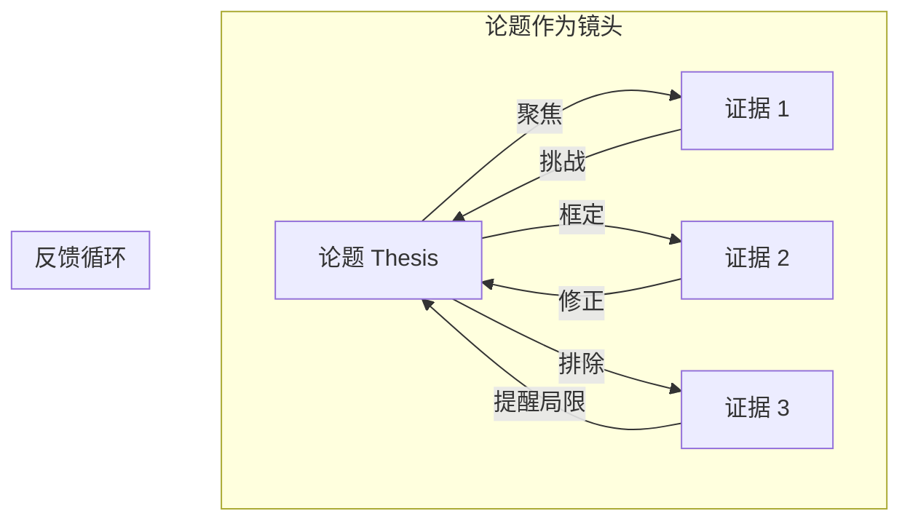
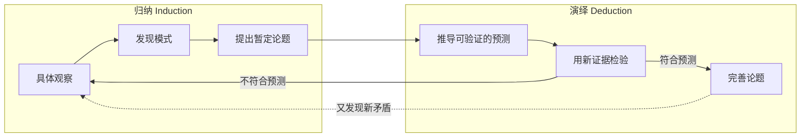
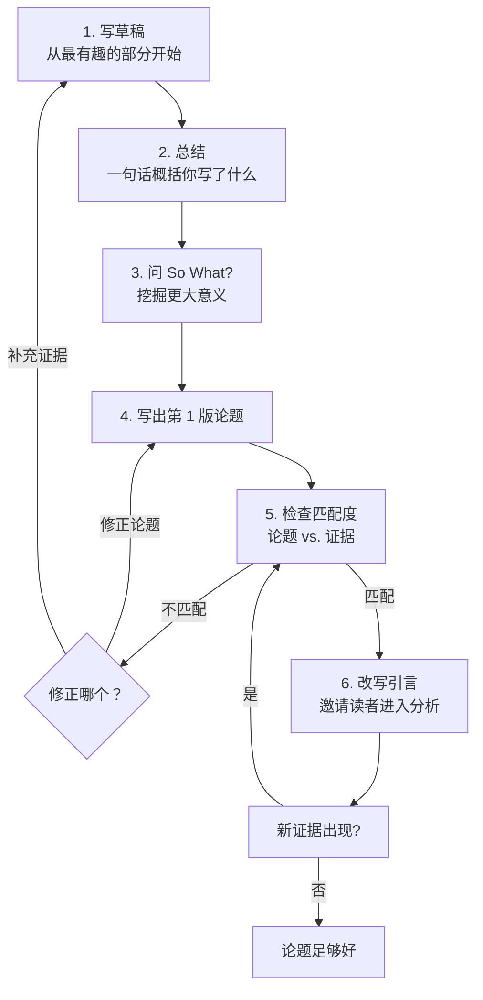

# 第17课：寻找和演进论题

## 学习目标

- 理解好论题的本质是一个**演進中的主张（evolving claim）**，而非静态陈述
- 识别"论题先行"对思维的关闭效应，学会延迟判断
- 掌握论题与证据之间的**互惠关系（reciprocal relationship）**
- 在探索性草稿中运用六步法逐步找到并完善论题
- 学会判断何时停止修订论题
- 运用"Put X in Tension with Y"策略形成有张力的论题

## 论题是什么，做什么

好论题不是一句静态的"中心思想"——它是一个**活的、可演进的主张**。

| 论题**不是** | 论题**是** |
|-------------|-----------|
| 写作前就定好的结论 | 在写作过程中逐步浮现的核心洞察 |
| 只需要被"证明"的命题 | 需要被反复检验和修正的假设 |
| 一句话概括文章 | 引导读者进入分析深度的入口 |
| 确定的终点 | 暂时的落脚点，随时准备继续移动 |

一本好书不会让你在前十页就把所有结论看完；一个好的论题也不会在文章开头就把所有分析结果"剧透"干净。

> [!ABSTRACT] 核心原则
> 一个好论题 **既是起点也是终点**（both a starting point and a destination）。它从你要探索的问题开始，随着分析的深入而不断变化，最终在你找到最有说服力的表述时停止，但它仍然对新的反例保持开放。

## 论题先行的问题：提前关闭

教学中常强调"先写一个论题句"（thesis statement），但在分析写作中，**过早固定论题是最大的敌人之一**。

**问题所在**：当你还没有充分探索证据就定下论题时，你会：

1. **只找支持性证据** —— 选择性注意（confirmation bias），忽略矛盾信息
2. **过早闭合（premature closure）** —— 思维提前停止，不再追问"还有别的可能吗"
3. **写作变成"填空"** —— 不再是思考过程，而是为既定结论找理由

这就是为什么你会听到"我开头写的论题和结尾完全不一样"——这其实是好迹象，说明你在真的思考。

> [!WARNING]
> 想象你拍了一张照片，然后说"这张照片里的世界就是全部现实"——这就是过早固定论题的感觉。你看到的**只是镜头框住的那一部分**，而不是全景。

## 论题作为相机镜头

书中用了一个非常贴切的比喻：**论题就像照相机的镜头（thesis as camera lens）**。

镜头之喻揭示了论题与证据的**互惠关系（reciprocal relationship）**：

| 方向 | 作用 | 示例 |
|------|------|------|
| **论题 → 证据** | 论题让你知道该看什么、什么重要 | "如果我的论题是'这篇演讲的语气有内在矛盾'，我会专门找语气变化的段落" |
| **证据 → 论题** | 证据会修正、丰富甚至推翻你的论题 | "我发现在语气矛盾的地方其实有统一的修辞策略——论题需要调整" |

> [!NOTE] 关键词
> 这种来回运动正是分析写作的核心节奏。你**既不能没有论题地盲目收集证据**（那样只是堆砌材料），也**不能在证据面前固执己见**（那样只是自我验证）。

## 归纳与演绎的循环

论题的演进离不开两种推理方式的交替使用 —— 这在 [[0015-evidence-claims|第15课：证据与主张]] 中已有涉及。

**归纳（induction）**：从具体证据中概括出模式，提出暂定论题。

**演绎（deduction）**：从暂定论题出发，推导它会在哪些地方表现为真，然后去检验。

真正的分析写作者在这两者之间来回切换，每一次循环都让论题变得更加精确和有深度。这也是 [[0016-ten-on-one|第16课：10 on 1]] 中反复强调的核心动作——你深入分析一个例子（归纳），提出主张，然后用这个主张去检验下一个例子（演绎），再修正主张。

## 六步法：在探索性草稿中找到论题

书中提供了在**探索性草稿（exploratory draft）** 中寻找论题的具体步骤：

> [!TIP] 六步流程
> 1. **写草稿，跳过开头** —— 不要从引言开始，直接从你最感兴趣的分析段落入手
> 2. **写完草稿后，用一句话总结你实际写了什么** —— 不是你想写什么，而是你已经写了什么
> 3. **问"那又怎样？"（So What?）** —— 你的分析揭示了一个什么更大的意义？
> 4. **把你总结的那句话变成论题** —— 这是第1版论题
> 5. **检查论题是否与草稿中的证据匹配** —— 如果不匹配，是论题错了还是证据不够？
> 6. **改写引言，让论题引导读者，但不提前暴露所有结论** —— 引言应该"邀请"而非"告知"

### 关键技巧：跳过引言

很多人在写草稿时卡在引言上，因为他们试图在开头就写出最终版的论题。**不要这样做。** 直接从你最兴奋的分析段落入手——那个你发现了有趣模式的段落。写完之后再回头问自己：我刚刚到底写了一个什么主张？

> [!WARNING] 常见误区
> 六步法不等于"不写论题"。事实上，你在第4步**必须**写出一个明确的论题句。区别在于：你是在分析**之后**写的，而不是之前。这个顺序决定了论题是分析的产物，而非分析的枷锁。

## 何时停止修订

论题永远不会"完美"——但你需要知道什么时候停下。

| 标准 | 问自己 | 可以停吗？ |
|------|--------|-----------|
| **足够具体** | 论题是否聚焦到一个可以在给定篇幅内充分论证的范围？ | 是 |
| **包含张力** | 论题是否揭示了某种冲突、矛盾或复杂性？ | 是 |
| **有反例意识** | 你是否认真考虑过可能推翻论题的证据？ | 是 |
| **还能更好吗？** | 如果给你更多时间，你能想到更精确的表述吗？ | 永远可以——但现在是交付的时候了 |

停止修订的关键不是"完美"，而是 **"足够好"（good enough）** ——你的论题已经能引导读者进入一个有价值的分析，同时你也意识到了它的局限。

## 引言、结论与论题

### 引言

引言不应该"剧透"你所有的发现，而应该：

- 建立**好奇心** —— 为什么这个问题值得分析？
- 提出**暂定方向** —— 不是最终结论，而是探索路径
- 暗示**复杂性** —— 让读者期待有深度，而非简单的"是或不是"

### 结论

结论不是重述论题，而是论题的**最终形态**——它应该比引言中的版本更丰富、更精确。一个好的结论会让读者觉得：

> 原来这个分析走到这里是有道理的——虽然一开始我没想到。

> [!QUESTION] 自测
> 如果你把引言中的论题复制到结论里（只是换了一种说法），你的论文可能出了什么问题？

参考答案

这说明你的论文**没有让论题演进**。引言中的论题和结论中的论题应该是**不同**的——结论中的论题是经过全部分析检验和修正之后的更精确版本。如果它们相同，说明你的正文没有真正做分析工作，只是在重复一个早已确定的结论。

## "Put X in Tension with Y"：论题措辞策略

书中推荐了一个非常实用的论题构造方法：

**核心句式**：

> 将 **X** 与 **Y** 置于张力之中，我们可以看到……

**示例对比**：

| 无张力（弱） | 有张力（强） |
|-------------|-------------|
| "这个广告使用传统家庭形象来推销产品。" | "将**'传统家庭'形象**与**'个人解放'信息**置于张力之中，这个广告同时唤起了两种矛盾的渴望。" |
| "小说的结尾是模棱两可的。" | "将**确定的叙事结构**与**不确定的道德结论**置于张力之中，小说用形式上的确定性掩盖了内容上的不确定性。" |

> [!NOTE] 为什么有效
> "X与Y的张力"句式迫使你**找到两个具体概念的冲突点**，而不是泛泛地说"有利有弊"。张力（tension）意味着两者之间不是简单的"好vs坏"，而是一种需要被分析的复杂关系。

更多弱论题类型及详细修复方法，见 [[0018-weak-thesis|第18课：五种弱论题及修复方法]]。

## 实践练习

> [!QUESTION] 改写论题练习
> 以下是一个学生论文的初稿论题：
>
> > "这篇广告使用了情感诉求来说服消费者购买产品。"
>
> 1. 这个论题有什么问题？请用本课的标准分析。
> 2. 如果你在探索性草稿中写完后发现这就是你的"总结句"，你会问什么 So What 问题？
> 3. 尝试用"Put X in Tension with Y"策略改写成更强的论题。
>
> **提示**：想象你在分析一个具体的保险广告——画面是温馨的家庭聚餐场景。

参考答案思路

1. **问题分析**：
   - 过于宽泛 —— "情感诉求"可以指任何情绪，"说服消费者"是常识而非新发现
   - 没有张力 —— 这是一个陈述，不是一个需要分析的主张
   - So What? 缺失 —— 读者会问"所以呢？广告不都是这样吗？"

2. **So What 追问**：
   - "这家保险广告通过家庭温馨画面触发情感，但这**为什么比直接陈述保险条款更有效？**"
   - 可能的回答方向：情感诉求绕过了消费者的理性防御机制，让产品的抽象价值（安全感）变得可感知

3. **强论题改写示例**：
   > 将**保险（理性产品）** 与**情感体验（非理性需求）** 置于张力之中：该保险广告与其说在推销保障条款，不如说在**销售"被牵挂"这种情感体验**——保险只是获得这种体验的入场券。

## 核心概念回顾

| 概念 | 定义 | 一句话记住 |
|------|------|-----------|
| **演进论题（evolving thesis）** | 论题在分析过程中不断变化 | 论题是活的 |
| **提前闭合（premature closure）** | 过早固定论题导致思维停滞 | 别太快下结论 |
| **互惠关系（reciprocal relationship）** | 论题与证据互相修正 | 镜头与画面互相塑造 |
| **归纳-演绎循环** | 在具体与抽象之间来回运动 | 先发现，再检验 |
| **探索性草稿（exploratory draft）** | 不预设结论的写作练习 | 写出来才知道想什么 |
| **So What?** | 追问意义和重要性 | 所以呢？ |
| **Good Enough 原则** | 完美不是停止标准 | 够好就行 |

## 下一步

继续学习 [[0018-weak-thesis|第18课：五种弱论题及修复方法]]，学习如何识别和修复常见的弱论题，并更深入地练习"Put X in Tension with Y"策略。