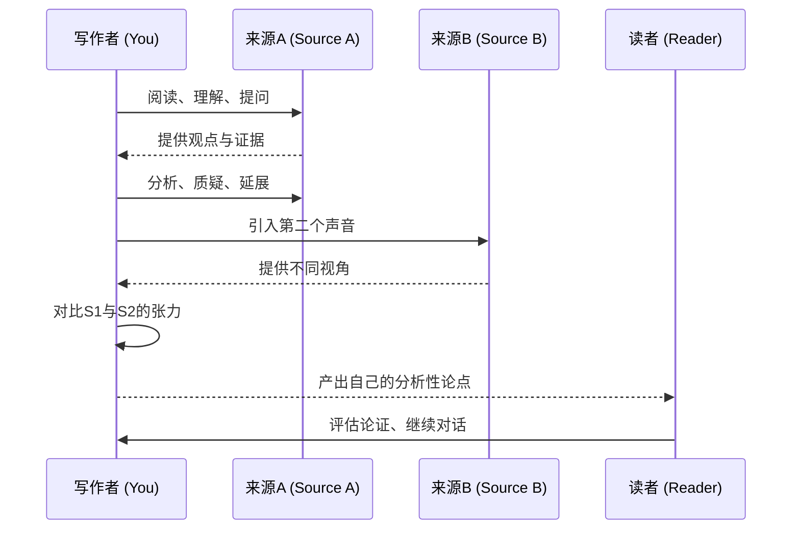

# 第19课：与来源对话——研究论文写作

在开始本课之前，建议回顾 [[0018-weak-thesis|第18课：五种弱论题及修复方法]]——有了强论题之后，下一步就是用来源来支撑它；而本课正是关于如何用好来源。

## 学习目标

- 将来源重新理解为"对话伙伴"而非"权威引证对象"
- 识别并克服来源焦虑（source anxiety）
- 掌握将来源作为"出发点"的四种方式：同意、反驳、复杂化、用作透镜
- 运用六项来源分析策略（six strategies for analyzing sources）
- 理解"They Say / I Say"框架如何定位自己的学术声音

## 对话类比（The Conversation Analogy）

许多学生写研究论文时有一个默认假设：找到权威专家，引用他们的结论来支撑自己的主张。来源是"证据提供者"，而你是"证据收集者"。

*Writing Analytically* 提出了一个截然不同的框架：

> [!ABSTRACT] 核心类比
> **来源是你的对话伙伴（conversation partners），而不是需要被供奉的权威（authorities to cite or attack）。**

这里的"对话"不是比喻修辞——它描述的是学术写作的真实本质。每一篇严肃的学术文章都是在回应之前的研究、预测可能的反驳、并向未来的研究发出邀请。你引用一个来源，不是为了"你看，权威说了算"，而是为了**邀请它进入你的思考空间**，与你和你的读者展开对话。

注意图中的关键动作：写作者不是信息的被动接收者，而是**对话的调度者**——你决定让谁发言、在什么时候发言、谁回应谁。这个调度权就是你的分析性贡献所在。

## 来源焦虑（Source Anxiety）

**来源焦虑**是写作者面对专家文献时的一种普遍不适感：专家知道得比我多、术语比我专业、数据比我全面——那我的论文还有什么价值？

### 典型表现

| 表现 | 深层原因 | 后果 |
|------|---------|------|
| 过度引用——每句话都加注 | 害怕自己说错 | 自己的声音被完全淹没 |
| 不敢对来源说"不" | 误以为质疑=不尊重 | 论文变成单一视角的复述 |
| 论文沦为文献综述 | 不知道该在何处加入自己的分析 | 没有可争议的论点 |
| 拖延阅读、逃避写作 | 被信息量压垮 | 研究效率低下、焦虑加剧 |

### 解药

> 你和专家之间的关系不是"谁更懂"的等级关系，而是"谁有不同视角"的平等关系。你的分析价值不来自信息量——你不可能比专家拥有更多信息——而来自你提出的**问题**和你建立的**连接**。

具体做法：
- **接受"足够好"**：你不需要读完该领域的所有文献再动笔，而是在读的过程中就开始写作和思考
- **区分"理解"与"同意"**：你可以完全理解一个论证并发现它的漏洞——这本身就是学术贡献
- **记住你的优势**：作为局外人（outsider），你往往能看到领域内专家因为"习惯"而忽略的假设

## 四种出发点（Points of Departure）

一旦把来源视为对话伙伴，你就需要决定如何与之对话。书中隐含了四种基本的回应姿态：

| 姿态 | 含义 | 典型句式 |
|------|------|---------|
| **同意**（Agree） | 来源的论证是正确的，你可以补充更多证据 | "Smith 的结论在X场景下尤为显著，因为……" |
| **反驳**（Disagree） | 来源的论证有缺陷，你需要指出问题 | "然而，Smith 忽视了关键变量Y，这导致……" |
| **复杂化**（Complicate） | 来源的论证不是错，而是**不够充分** | "Smith 的分析虽然有效，但当考虑到Z因素时，情况变得更加复杂……" |
| **用作透镜**（Apply as Lens） | 将一个理论框架应用到新的对象上 | "将 Foucault 的'规训'概念应用于社交媒体平台，我们会发现……" |

> [!TIP] 初学者最容易被忽视的是"复杂化"
> 反驳需要充分的证据支持，同意需要补充新信息——这两者对于初学者来说门槛都不低。但**复杂化**（complicate）是最友好的切入点：你不需要推翻专家，也不需要补充新数据，你只需要指出"情况比这更微妙"。

## 六项来源分析策略（Six Strategies for Analyzing Sources）

### 策略一：让你的来源开口说话（Make Your Sources Speak with Purpose）

引用不是"把一段话贴进来然后走开"。引用是一种**赋予话语权**的行为——你选择让来源在什么时候说什么话。因此，每次引用都必须附带分析。

> 错误模式：引用原文 → 下一段写另一个话题
>
> 正确模式：引用原文 → 立即分析 → "这段话的关键词是……它暴露了一个假设……"

### 策略二：仔细关注语言（Attend Carefully to the Language of Your Sources）

一个来源所使用的具体措辞往往暴露了其最深层的假设。分析者要像侦探一样捕捉这些语言信号。

> **示例**：
> 某政策文件称："我们需要帮助失业者**重返工作岗位**。"——"重返"（return）一词预设了"工作"是正常状态、"失业"是偏离正常。这个措辞本身就隐含了一种判断：失业者的目标是回归原有秩序，而不是重新定义工作方式。你的分析可以揭示这种预设，而不需要去"反驳"它。

### 策略三：进行持续分析（Supply Ongoing Analysis）

> [!WARNING] 常见错误
> **不要在论文结尾才做分析。** 很多学生的论文结构是：介绍来源A → 介绍来源B → 介绍来源C ... → 结尾处才开始"分析"。到那个时候，读者已经忘记A说了什么了。

正确的结构是分析穿插其中——每次引入一个来源，立即进行分析，然后再引入下一个来源与之对话。

### 策略四：用来源提问，而非只找答案（Use Sources to Ask Questions, Not Just Provide Answers）

这是最关键的认知转变：

| | 新手心态 | 分析者心态 |
|--|---------|-----------|
| 预设 | "这个来源支持我的论点" | "这个来源让我想到了什么新问题？" |
| 行动 | 只摘取支持性语句 | 寻找反常、矛盾、细微差别 |
| 风险 | 确认偏差（confirmation bias） | 发现更复杂的画面 |
| 产出 | 论证单薄、可预测 | 论证有层次、有深度 |

### 策略五：让来源之间互相对话（Put Sources into Conversation with One Another）

不要让每个来源各自待在论文的孤岛中。你的任务是**制造相遇**——把从未被放在一起讨论的来源放在一起，看看会发生什么。

> **示例**：
> "Smith（2021）认为社交媒体增强了社会联系，而 Johnson（2022）则发现社交媒体使用与孤独感呈正相关。表面上看这两者矛盾，但仔细看会发现：Smith 关注的是**已有社交圈**的维系，Johnson 关注的是**陌生人之间**的联系建立——同一个平台对不同社交需求产生了截然不同的效果。这说明，关于社交媒体影响的讨论不能笼统地问'好还是不好'，而需要区分'联系类型'这个变量。"

### 策略六：在对话中找到自己的角色（Find Your Own Role in the Conversation）

最终你需要回答一个问题：**在这群对话者中，我的角色是什么？** 可能的角色包括：

| 角色 | 任务 |
|------|------|
| **综合者**（Synthesizer） | 发现两个学派之间的共同基础 |
| **修正者**（Reviser） | 指出某个被广泛接受的假设是有问题的 |
| **延伸者**（Extender） | 将一个理论应用于一个新领域 |
| **挑战者**（Challenger） | 质疑某项研究的方法论或结论 |
| **连接者**（Connector） | 将两个从未被放在一起讨论的领域对接起来 |

> [!NOTE]
> 你不需要在所有方面都强于你的来源。一个学期论文的有意义贡献可能是："把我读到的东西A和B连接了起来，而之前没有人注意到它们之间的联系。" 这就已经足够了。

## "They Say / I Say" 框架

Gerald Graff 和 Cathy Birkenstein 在 *They Say / I Say: The Moves That Matter in Academic Writing* 中提出的框架与本章精神高度一致：

> **所有好的学术写作都在回应他人所说的话。** 你的论点（I Say）之所以有价值，不是因为它本身多么精彩，而是因为它对已有讨论（They Say）构成了回应。

| 步骤 | 含义 | 示例 |
|------|------|------|
| **They Say** | 呈现你要回应的已有观点 | "关于X，主流研究认为……" |
| **I Say** | 你的回应——同意/反驳/复杂化/延展 | "然而，这一视角忽略了……" |
| **So What?** | 所以你的回应带来了什么新东西？ | "这意味着我们需要重新定义……" |

这个框架之所以强大，是因为它强制你**不要把论文写成独白**。你的声音永远是对他人声音的回应。

## 实践练习

> [!QUESTION] 对话式写作
> 选取一个你感兴趣的话题，找出三篇观点不同或侧重点不同的文章。然后写一段 200-300 字的文字，让这三篇文章"对话"——不是逐一总结，而是让它们互相回应。最后，用一句话说明你在这场对话中的"角色"。

示例思路

**话题**：远程办公的长期影响

**来源A**：远程办公提高生产力（Bloom et al., 2021）
**来源B**：远程办公导致创新能力下降（Choudhury, 2022）
**来源C**：远程办公加剧性别不平等（Goldin, 2023）

**对话段落**：
Bloom 等人发现远程办公使个人生产力提升了13%，这似乎有力地支持了全面远程化的趋势。但 Choudhury 提醒我们，个体生产力不等于团队创新能力——面对面的偶然交流（serendipitous encounters）对创意产生有不可替代的作用。有趣的是，Goldin 的研究将这场辩论推向了另一维度：她指出远程办公对男性和女性的影响不同——女性在家办公时更可能同时承担照护责任，从而实际上加剧而非缓解了职场性别不平等。这三项研究合在一起说明：关于远程办公的讨论不能笼统地问"好不好"，而需要追问"对谁、在什么条件下、以什么作为衡量标准"。

**我的角色**：综合者（Synthesizer）——将生产力、创新、公平三个维度整合为一个分析框架，指出它们并非矛盾而是揭示了同一现象的不同层面。

## 关键术语回顾

| 术语 | 含义 |
|------|------|
| 来源焦虑（Source Anxiety） | 面对专家文献时的不安感——觉得自己不够格发言 |
| 对话伙伴（Conversation Partner） | 将来源视为平等对话者，而非需要供奉的权威 |
| 出发点（Point of Departure） | 对来源的基本回应姿态：同意、反驳、复杂化、用作透镜 |
| 持续分析（Ongoing Analysis） | 在引入每个来源后立即进行分析，而非攒到结尾 |
| They Say / I Say | 所有学术写作的本质：回应他人已有论述 |

## 下一步

继续学习 [[0020-finding-sources|第20课：寻找、评估和引用来源]]，掌握如何高效地找到高质量来源并正确引用。