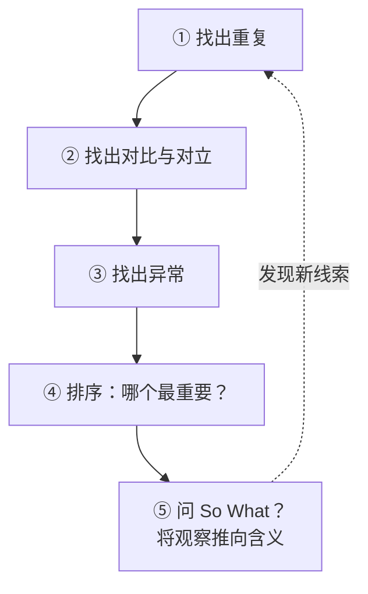

# THE METHOD 速查卡片

THE METHOD 是本书最核心的分析工具——一套引导你系统观察的步骤。

## 五步流程

## 每一步的具体操作

| 步骤 | 要做什么 | 要问的问题 |
|:----:|----------|------------|
| ① 重复 | 找出反复出现的词语、形象、主题、动作 | "什么东西反复出现？" |
| ② 对比/对立 | 找出成对出现的对立概念 | "什么东西总是一起出现？它们在和什么对立？" |
| ③ 异常 | 找出不符合模式的东西 | "什么东西不符合我的预期？什么被跳过了？" |
| ④ 排序 | 从上述选项中选出最重要的 | "哪个发现最能揭示问题？" |
| ⑤ So What？ | 解释你的发现为什么有意义 | "这说明什么？为什么重要？" |

## 应用场景

- **阅读文本**：标记重复出现的词语和隐喻，注意它们在何处发生变化
- **分析图像**：注意颜色、构图、空间的重复和对比
- **分析数据**：寻找趋势中的异常值和重复模式
- **分析自己**的写作：哪些词、结构和论点在重复出现

> [!TIP] 从"奇怪"入手
> 如果你不确定从哪里开始，先问自己："什么让我觉得奇怪/有趣/引人注目？"
> 这个往往是最有分析潜力的入口。

## 与其他工具的关系

- [[../lessons/0003-notice-and-focus|Notice & Focus]] 为 THE METHOD 提供原始材料
- [[../lessons/0004-so-what|So What？]] 是 THE METHOD 第五步的核心引擎
- [[../lessons/0005-the-method|完整课程：THE METHOD]] 有完整的示例和练习

## Troubleshooting

| 问题 | 可能的原因 | 解决方法 |
|------|-----------|----------|
| 什么都发现不了 | 读得太快/看太快 | 放慢速度，逐句标记 |
| 发现太多不知道选哪个 | 没有排序 | 用"最奇怪"或"最有意思"为标准排序 |
| So What 答不上来 | 观察还不够具体 | 回到第①步，找更具体的重复 |
| 结论太平淡 | 没有检查异常 | 再仔细找找有什么东西不符合你的结论 |