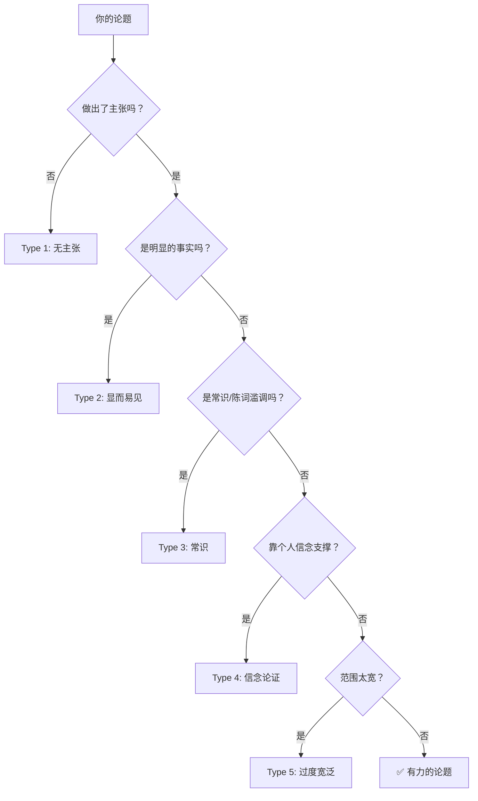

# 五种弱论题识别指南

## 快速诊断

检查你的论题陈述：

## 五种类型详解

### Type 1：无主张（Makes No Claim）
**模式**：只陈述了一个话题，或一个明显的事实，没有提出任何有争议的立场。

> ❌ "本文将讨论莎士比亚在《哈姆雷特》中使用的隐喻。"
> ✅ "莎士比亚在《哈姆雷特》中使用的疾病隐喻揭示了：剧中人物用身体语言来掩饰而非表达真实的心理状态。"

### Type 2：显而易见（Obviously True / Statement of Fact）
**模式**：论题只是一个没人会反对的事实陈述。

> ❌ "社交媒体在年轻人的生活中扮演了重要角色。"
> ✅ "社交媒体的'点赞'机制并非连接了年轻人，而是用社交量化替代了真实的社交互动。"

### Type 3：常识/陈词滥调（Restates Conventional Wisdom）
**模式**：论题只是社会公认的常识，没有人会质疑。

> ❌ "压力会影响学生的学习表现。"
> ✅ "大学的荣誉制度非但没有减少作弊，反而通过同伴监督机制制造了一种新的焦虑——学生真正害怕的不是违规，而是被同学评价。"

### Type 4：信念论证（Bases Claim on Personal Conviction）
**模式**：论题建立在个人的道德或情感信念上，而不是可检验的证据上。

> ❌ "堕胎在道德上是错误的。"（这是信念，不是分析）
> ✅ "双方关于堕胎的辩论都使用了'生命'一词，但对这个词的定义完全不同——这一分歧揭示了一种更深层的关于'生命何时开始'的本体论争议。"

### Type 5：过度宽泛（Overly Broad Claim）
**模式**：论题试图涵盖太多内容，无法在论文篇幅内充分论证。

> ❌ "美国教育体系存在很多问题。"
> ✅ "美国公立学校的标准化考试制度产生了一个悖论：考试本意是衡量学习，但它实际上在改变——且在许多情况下缩小——课堂上的教学内容。"

## 修复 Checklist

| 弱论题类型 | 修复策略 | 关键问题 |
|-----------|---------|----------|
| 无主张 | 加入可争辩的立场 | "我想让读者相信什么？" |
| 显而易见 | 加入争议点 | "有人会不同意吗？" |
| 常识 | 加入转折 | "大家都这么说，但有没有另一种可能？" |
| 信念 | 把"应该/不应该"转为"是什么/为什么" | "我不谈论对错，我在描述一种模式" |
| 过度宽泛 | 缩小范围 | "我能在5页内证明这一点吗？" |

## 有力论题的共同特征

1. **可被证据挑战**（不是自明的真理）
2. **足够具体**（不是泛泛而谈）
3. **揭示性的**（让读者看到一个新角度）
4. **有演进空间**（论题可以在论证过程中发展变化）

参见 [[../lessons/0017-evolving-thesis|第17课：寻找和演进论题]]。