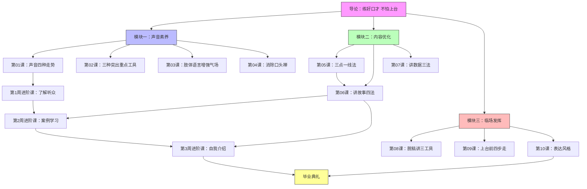

# 课程地图

## 学习路径

### 第1周：声音素养入门
练习重点：声音起伏变化、打开口腔

### 第2周：综合声音表达 + 肢体语言
练习重点：三种工具综合运用、站姿手势

### 第3周：内容结构 + 故事力
练习重点：三点一线逻辑、讲故事四法

### 第4周：数据表达 + 脱稿准备
练习重点：数据可感性、手卡制作

### 第5周：上台实战 + 风格形成
练习重点：上台前准备清单、表达风格塑造

## 前置关系

- 第05课（三点一线法）是第06课（讲故事）的逻辑基础
- 第08课（脱稿讲）需要第05课（理大纲）的技能
- 第09课（上台前准备）综合运用前8课所有技能
- 第10课（表达风格）是全部课程的升华

## 进阶课与主课的配合

| 进阶课 | 配合主课 | 主题 |
|---|---|---|
| 第1周 | 第01-02讲 | 了解听众，建立对象感 |
| 第2周 | 第03-04讲 | 案例拆解，手势四大空间 |
| 第3周 | 第05-06讲 | 自我介绍的故事化表达 |