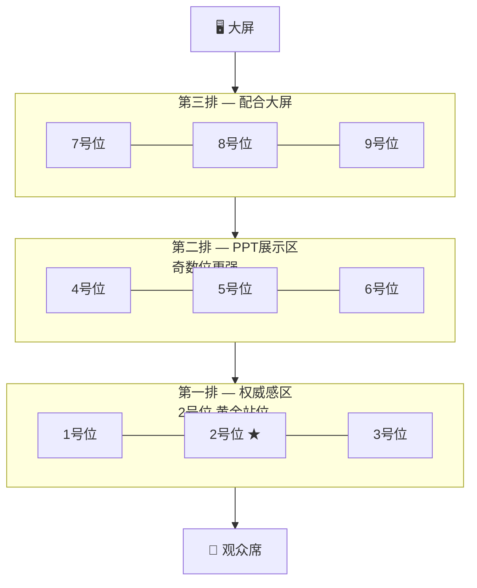

# 第03课：怎么用肢体语言增强气场

> **核心观点**：身体是演讲稿的一部分，**55%** 的信息由肢体语言传递。当你开口之前，身体已经在说话。

---

## 一、演讲台九宫格

舞台是一个 3×3 的九宫格，不同位置传递不同的信息。学会走位，就能用空间控制全场。



### 各区域功能

| 区域 | 位置 | 作用 |
|------|------|------|
| **第一排** | 1-3号 | **权威感** —— 拉近与观众距离，表达真诚和力量 |
| **第二排** | 4-6号 | **PPT展示** —— 兼顾观众与屏幕，奇数位（5号）更有存在感 |
| **第三排** | 7-9号 | **配合大屏** —— 引导观众看屏幕，自己退到侧后方 |

### 关键要点

- **2号位是黄金站位**：在舞台中央偏前，拉近距离又不给观众压迫感。
- **奇数位 > 偶数位**：奇数位（1/3/5/7/9）天然更有存在感和权威感。
- **上场路线**：从舞台侧面上场（5号或8号位入场），**先走到7号位，停顿2秒**，扫视全场建立连接，再从容走到2号位开讲。

---

## 二、站姿训练

站姿是肢体语言的根基。一个沉稳的站姿，让你一开口就有气场。

### 站姿自查口诀（从上到下）

> **头顶牵线紧如簧** → **眉心鲸鱼喷泉水** → **下颌微收嘴角扬** → **双肩扇面左右开** → **牵线肚脐往后退** → **牵球拉尾向下坠** → **膝盖有空间** → **脚心三点贴地面**

| 顺序 | 部位 | 口诀 | 动作要领 |
|------|------|------|----------|
| 1 | 脚 | 脚心三点贴地面 | 前脚掌、外侧、脚跟三点受力，踩实地面 |
| 2 | 膝盖 | 膝盖有空间 | 膝盖微微弯曲不锁死，保持弹性 |
| 3 | 骨盆 | 牵球拉尾向下坠 | 想象尾骨挂着一个铅球，向下沉坠 |
| 4 | 腹部 | 牵线肚脐往后退 | 肚脐微微后收，核心微收紧 |
| 5 | 双肩 | 双肩扇面左右开 | 双肩向后展开，锁骨打开 |
| 6 | 下颌 | 下颌微收嘴角扬 | 下巴微收不仰头，嘴角自然上扬 |
| 7 | 眉心 | 眉心鲸鱼喷泉水 | 眉心舒展，想象鲸鱼喷泉般有向上的力量 |
| 8 | 头顶 | 头顶牵线紧如簧 | 想象头顶有一根线向上牵引，身体如弹簧般挺拔 |

> **训练建议**：靠墙练习，让后脑勺、肩胛骨、臀部、脚跟贴在墙上，感受"头顶牵线"的挺拔感。

---

## 三、手势运用

### 基本原则

- **出手大方**：手势幅度要大，不要缩在胸前。
- **四指并拢**：手掌展开、四指并拢，比单指指人更显大气。

### 掌心方向决定话语力量

| 手势 | 含义 | 适用场景 | 例句 |
|------|------|----------|------|
| 掌心向上 ☝️ | 友好、邀请、欢迎 | 请观众提问、邀请上台、表达感谢 | "欢迎大家来到今天的分享……" |
| 掌心向下 ✋ | 权威、掌控、命令 | 强调观点、表达决心、发出指令 | "这件事，**必须**做到！" |
| 掌心相对 🤲 | 对时间/态度的确认 | 描述具体细节、比较两种事物 | "一方面是……另一方面是……" |

---

## 四、走位技巧

### 五二六横向走位

说话的同时横向移动，用于**区分不同主题**：

- 说到 **时间1 / 空间1 / 人物1** → 站在5号位
- 说到 **时间2 / 空间2 / 人物2** → 走到2号位
- 说到 **时间3 / 空间3 / 人物3** → 走到6号位

> **效果**：观众通过你的走位就能感知内容的切换，无需语言提示。

### 大三角走位

当观众注意力分散时，走一个**大三角路线**重新聚焦：

```
  起点（7号位）
      ↙      ↘
  中场（2号位）→ 另一侧（3号位）
```

- 在行走过程中开口说话，**话随人动**
- 走到新位置时恰好是一个新观点的开头
- 注意：走位不宜过频，每段内容换一次位置即可

---

## 本课小结

肢体语言的核心是**自信、大方、有控制**：

1. **九宫格站位**：2号位是黄金站位，上场先到7停顿2秒再走到2
2. **站姿口诀**：从脚到头八个要点，靠墙练习找感觉
3. **手势三态**：掌心向上（友好）、向下（权威）、相对（确认）
4. **走位控场**：五二六区分内容，大三角唤醒注意力

---

## 实践作业

### 必做：3分钟录音 + 自查

1. 找一段 200-300 字的讲稿（可用前两课作业）
2. **站在镜子前**，用九宫格站位（2号位）练习
3. 录音并回听，检查站姿口诀是否做到位
4. 设计 2-3 个手势，分别使用掌心向上 / 向下 / 相对

### 选做：录像 + 对照自查

用手机录制一段 3 分钟演讲：
- 回放时**关掉声音**，只看肢体语言
- 对照九宫格表，看你主要站在哪个区域
- 检查手势幅度是否够大，手指是否并拢

---

**下一课**：[[0004-xiao-chu-kou-tou-chan|第04课：怎么消除口头禅，让讲话更权威]]

**参考文档**：[[reference/glossary|术语表]] · [[reference/object-sense|对象感清单]]