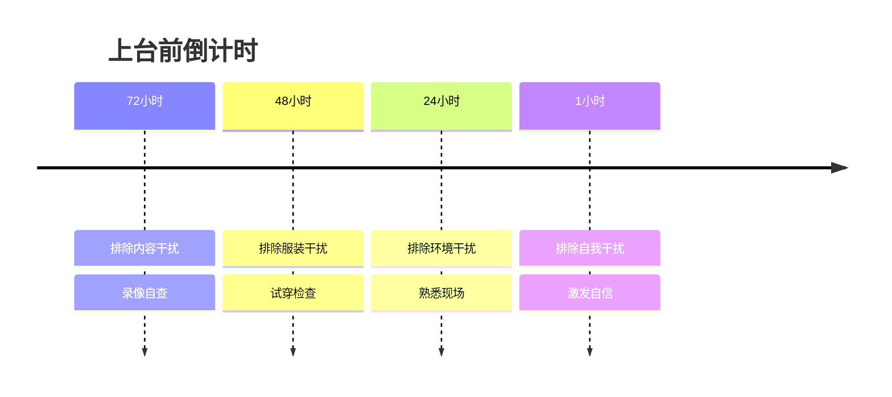

# 第09课：上台前怎么激发最佳状态

> 上台前的紧张不是敌人，是未被转化的能量。四步走法则帮你把焦虑变成兴奋。

---

## 四步走法则：倒计时行动清单



---

## 72小时 — 排除内容干扰：1:1录像自查

**核心方法**：把自己当成观众，用手机录一遍完整演讲。

### 录像规则

- **卡住不暂停、不重来**：模拟真实上台场景，卡壳时硬着头皮往下说
- **录完整场再调整稿子**：根据实际卡住的位置，修改表达方式

### 回看诊断

| 对比维度 | 真实自我（录像中的你） | 理想自我（脑海中的你） |
|---------|---------------------|---------------------|
| 语速 | ____ | ____ |
| 肢体 | ____ | ____ |
| 眼神 | ____ | ____ |
| 停顿 | ____ | ____ |

> 认知失调是进步的开始——承认"真实的我和理想的我之间有差距"，才能有针对性地改进。

---

## 48小时 — 排除服装干扰

**原则**：让服装服务于表达，而不是分散注意力。

### 男生搭配建议

| 项目 | 推荐 | 避免 |
|-----|------|------|
| 款式 | 休闲西装 / 衬衫 + 休闲裤 | 过于紧身或过于宽松 |
| 颜色 | 深蓝、深灰、浅蓝衬衫 | 全黑（像推销）、花哨图案 |
| 鞋 | 乐福鞋 / 商务休闲鞋 | 白运动鞋（除非主题契合） |

### 女生搭配建议

| 项目 | 推荐 | 避免 |
|-----|------|------|
| 款式 | 连衣裙 / 西装套裙 / 衬衫+半身裙 | 低领、超短裙、过多装饰 |
| 颜色 | 纯色系，亮色点缀（丝巾/胸针） | 荧光色、全身图案 |
| 鞋 | 中低跟（3-5cm），能站稳 | 全新鞋（没磨合过）、细高跟 |

### 穿上身检查清单

- [ ] 扣子是否牢固
- [ ] 吊牌是否摘掉
- [ ] 有无明显污渍/褶皱
- [ ] 宠物毛/头皮屑
- [ ] 坐下时是否舒适、不走光
- [ ] 抬手臂做手势时是否受限

---

## 24小时 — 排除环境干扰

### 拍两张照片

| 视角 | 目的 |
|------|------|
| 观众席 → 舞台 | 了解观众看你的样子（灯光、背景、站位） |
| 舞台 → 观众席 | 感受观众视角（距离、座位分布、视线障碍） |

### 三种话筒使用技巧

| 类型 | 握法 | 要点 |
|------|------|------|
| **手持麦** | 握在话筒中部偏下 | 与嘴呈**45度角**，距离**一拳**（约10-15cm）；太近喷麦，太远声音虚 |
| **立麦** | 双手自然放在身体两侧 | **不要扶着话筒架**——扶着会显得不自信、紧张；如果需要调整高度，调好后就放手 |
| **头戴麦** | 无需手持 | 解放双手，适合需要丰富肢体语言或演示操作的场景；注意别碰到线 |

> 提前到现场试音，找到最舒服的音量和距离感。

---

## 1小时 — 排除自我干扰：找到人生最自信时刻

### 四个问题（倒追自信）

1. **最佳状态时刻**：回忆你人生中最自信的那个瞬间（面试通过、比赛获胜、完成挑战……）
2. **姿势**：那个时刻你的身体是什么样的？（挺胸、抬头、肩膀打开？）
3. **心情**：当时是什么情绪？（兴奋、笃定、平静？）
4. **精神状态**：你当时的精神状态是怎样的？（专注、放松、亢奋？）

> 找到一个具体画面，然后**把那种身体感觉带到上台前**。

### 设计专属仪式感动作

> 用一个固定的身体动作来触发自信状态。

**案例：邓亚萍的仪式感**
邓亚萍在每场比赛前会**按三下球台**——这个动作告诉她的大脑："要开始了，我准备好了。"

**你的专属仪式感可以是**：
- 深呼吸 + 握拳三下
- 整理袖口 + 微笑
- 喝一小口水 + 闭眼3秒

> 固定仪式 → 触发自信 → 进入状态

---

## 给开头设计一个意外（30秒内）

> 观众在前30秒决定要不要听你说话。用一个意外打破预期。

### 经典案例

| 演讲者 | 意外设计 | 效果 |
|--------|---------|------|
| **刘擎**（综艺开场） | "我其实不太会说话……"（自嘲后马上展现深厚底蕴） | 降低预期 → 超出预期 |
| **比尔·盖茨** | 放出一罐蚊子，说"疟疾通过蚊子传播" | 全场震惊，注意力瞬间集中 |
| **通用技巧** | 反常识数据 / 惊人事实 / 自嘲 / 道具 | 打破观众惯性思维 |

### 设计你的意外

```
问题：观众此刻对你要讲的话题有什么预设？
意外：如何打破这个预设？（30秒内完成）
```

---

> 上台前做好这四步，紧张不再是阻力，而是你最好的燃料。

**相关课程**：[[0010-biao-da-feng-ge|第10课：怎么形成自己的表达风格]] | [[0011-an-li-xue-xi|第11课（进阶）：典型口才案例学习]]

---

*静心准备，自信登场。*