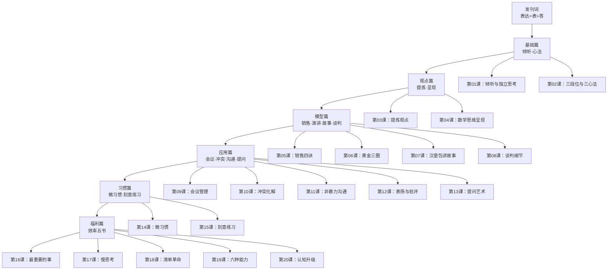

# 精准表达课 - 课程地图

## 依赖关系

| 模块 | 先修课程 | 核心产出 |
|---|---|---|
| 基础篇（01-02） | 发刊词 | 倾听套路 + 表达心法 |
| 观点篇（03-04） | 基础篇 | 观点提炼 + 数学呈现 |
| 模型篇（05-08） | 观点篇 | 四个角色表达模型 |
| 应用篇（09-13） | 模型篇 | 高频场景解决方案 |
| 习惯篇（14-15） | 全部 | 持续练习方法论 |
| 福利篇（16-20） | 无直接依赖 | 认知拓宽 |

## 快速选课

遇到以下场景，直接跳转对应课程：

- **开会没人听** → 第09课
- **冲突要爆发** → 第10课
- **想提意见怕尴尬** → 第11课
- **不知道怎么夸/批评人** → 第12课
- **被问住说不出话** → 第13课
- **学了用不出来** → 第14-15课