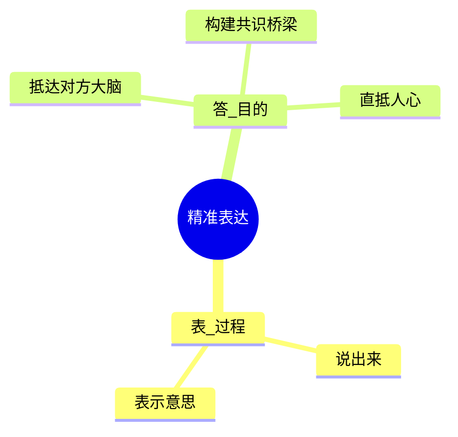

# 第00课：善用精准表达，精进人生效率

## Learning Objectives

- 理解"表达=表（过程）+答（目的）"的核心定义，打破"会说话=会表达"的误区
- 识别职场表达五大困境，找到自身在表达上的痛点定位
- 了解刻意练习与天真练习的本质区别，认识"模型/套路"的关键价值
- 明确精准表达课程的全局框架与适用人群

## Core Idea

**表达不是"表"出来就完事了，"达"到对方心里才是目的。**

表达拆开是两个字：

- **表** -- 过程，把自己的意思说出来
- **答** -- 目的，让对方接收到、构建共识

说再滔滔不绝，如果没有抵达对方的大脑、没有在说者和听者之间构建出共识的桥梁，都叫白说。

### 职场表达五大困境

| 角色 | 困境 | 核心痛点 |
|------|------|----------|
| 职场新人 | 领导常说"说重点" | 精心准备却不被认可 |
| 团队主管 | 90后下属难管理 | 表扬批评的尺度拿捏不准 |
| 创业者 | 会议低效、废话连篇 | 隐形成本吞噬公司效率 |
| HR工作者 | 沟通跨度大、难度大 | 留人裁人怨气都得接 |
| 跨部门同事 | 误会争执不断 | 一两句没表达清楚引发连锁反应 |

### 刻意练习 vs 天真练习

> [!TIP] Key Insight
> 天真练习和刻意练习之间，差的只是一个关键要素 -- **模型**（套路）。高手都在反复研究套路，新手却总想寻找捷径。

- **天真练习**：反复做某件事，期望凭借反复来提高水平
- **刻意练习**：基于正确的、有效的套路，有目的地练习

### 作者的三阶段成长路径

1. **模仿阶段** -- 塞满移动硬盘的大量优秀表达视频，上下班路上反复听
2. **采访阶段** -- 以顾问师身份约访各行业商业精英，积累了四五十本采访手记
3. **原创阶段** -- 独立接受商业培训，将前两段积累化为不同场合因人而异的表达

### 课程框架

课程包含四大板块：

1. **两种心法** -- 应对百年一遇的新场景，至少有法可依
2. **多元思维** -- 精准表达必备的思维和习惯
3. **表达模型** -- 高概括、适用性广的几种表达模型
4. **高频应用** -- 对应工作和生活中应用频率最高的场景和角色

### 适合人群

> [!NOTE]
> 课程特别适合以下五类人：
> 1. **职场新人** -- 急于提升表达水平但苦于没有合适方法
> 2. **职场白领** -- 因表达不精准造成沟通不畅、影响进度和关系
> 3. **新进主管** -- 不满团队执行结果，希望提升内部效率、减少隐形成本
> 4. **创业者/企业主** -- 需要公众表达：论坛发言、产品发布、文化宣导
> 5. **家人** -- 希望在亲密关系或家庭关系中因表达得当而创造良好互动

## Worked Example

**反面案例**：会议中每人五分钟成熟观点，有人讲了十分钟还没进入主题。不解释详细担心大家没听懂，解释详细听众注意力早已漂走。

**精准表达的理想状态**：观点明确、逻辑清晰、主次分明、张弛有度，一下子戳到痛点、说出诉求。

## Practice

> [!QUESTION] Self-check
> 回顾你最近一次工作中的表达场景（会议发言、邮件沟通、汇报等），你觉得自己的表达属于"表"出来了，还是真正"达"到了对方心里？如果重来一次，你会怎么调整？

Reveal answer

可以从以下几个角度自我诊断：

- 对方是否给出了你预期的反馈/行动？
- 对方是否有追问或澄清的需求，说明你表达不够清晰？
- 你的表达是否让对方感受到了"与我相关"？

每一次遗憾都是一次进步的开始 -- 这是后续课程会深入探讨的心法。

## Next Step

继续学习 [[0001-qing-ting-yu-du-li-si-kao|第01课：学会倾听与独立思考]]